```{r, echo=F, eval=T}
library(knitr)
opts_chunk$set(tidy.opts=list(width.cutoff=60),tidy=TRUE)
```

```{r  out.width = "90%", echo=F, fig.align = "center", fig.cap="RNAseq workflows"}
#library(knitr)
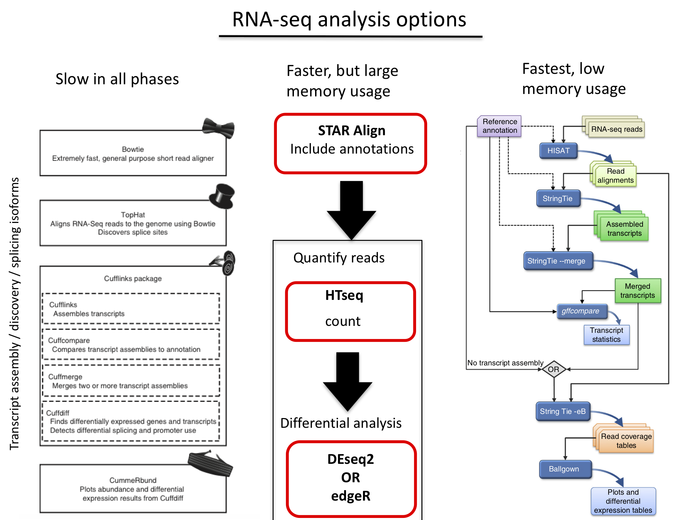 
```


## Cleaning up data

RNA-SeQC is a first-step option for quality control: [http://archive.broadinstitute.org/cancer/cga/rna-seqc](http://archive.broadinstitute.org/cancer/cga/rna-seqc)
\
RNA-SeQC is not available on the Xanadu server, but you can prefilter for quality and remove adapters just as in ChIP-seq:

* fastqc or mutliQC: [https://multiqc.info/docs/](https://multiqc.info/docs/)
* quality filter / trimming
* adapter removal

**NOTE:** Illumina adapters have barcodes these days, so when removing adapter from multiple files, just use the constant regions before the variable region (bolded below) to filter against.  Example:\


GATCGGAAGAGCACACGTCTGAACTCCAGTCAC**ATCACG**ATCTCGTATGCCGTCTTCTGCTTG\


Here, the bolded sequence is the variable region, so just use the region before it (GATCGGAAGAGCACACGTCTGAACTCCAGTCAC) for filtering.


# Building genome with `HISAT2`

Things  you need:

* Indexed genome file(s): `/home/FCAM/meds5420/genomes/hg38_hisat2`
* File with transcript and exon annotations (GFF or GTF files). :\
    `/home/FCAM/meds5420/annotations/gencode.v39.annotation.gtf`
* installation of `hisat2`, `stringTie`, and `GFFcompare`: see below

## GTFs:
GTF (General Transfer Format) format is a table of individual exons with retention of transcript ID.\
Explanation of GTF and GFF files can be found [here](http://useast.ensembl.org/info/website/upload/gff.html).

GENCODE GTFs This can be retrieved from [GENCODE](https://www.gencodegenes.org/human/) (Figure 2):


```{r  out.width = "100%", echo=F, fig.align = "center", fig.cap="GENCODE GTF website"}
#library(knitr)
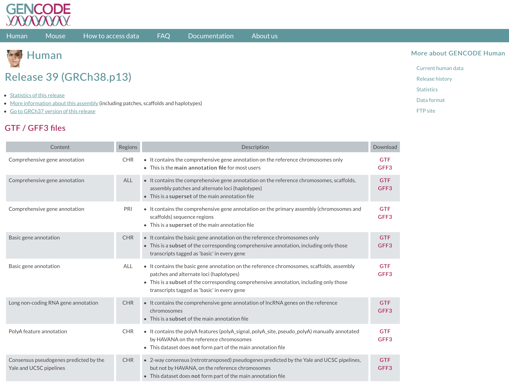 
```


```{r, engine='bash', eval=T, echo=T}
head -5 gencode.v39.annotation.gtf
```


**Obtaining .GTF (Gene Transfer Format) files from UCSC (Figure 3):**

```{r  out.width = "100%", echo=F, fig.align = "center", fig.cap="UCSC GTF Table Browser"}
#library(knitr)
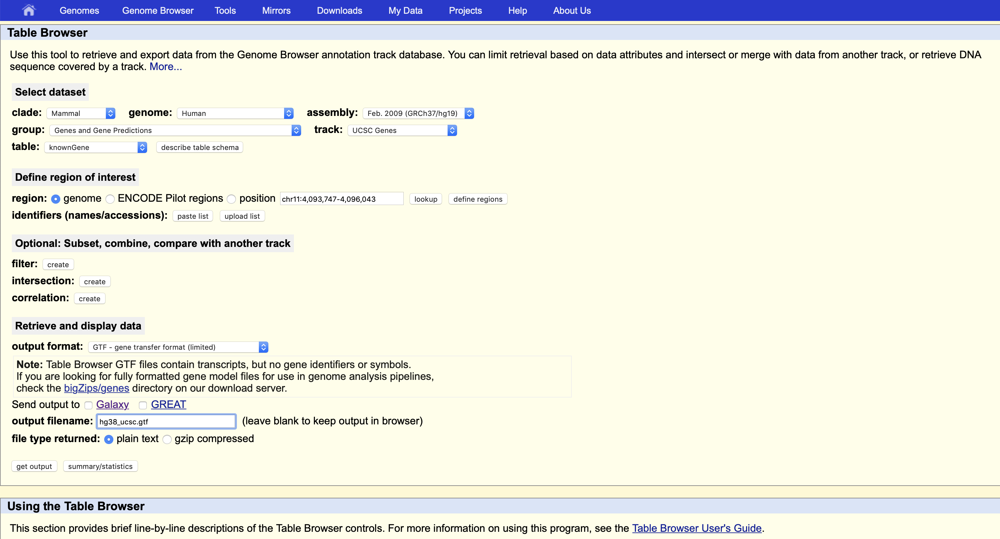 
```


## Using HISAT2 and related software on server:
Use `module` to load necessary software:
```{r, engine='bash', eval=F, echo=T}
module load hisat2
module load stringtie
module load gffcompare
```

# Building your annotated genome for mapping with HISAT2.
HISAT2 will map to your genome, but will also use gene annotations to map to known exons and splice junctions specifically.\

First, we need to use the GTF file to create a list of exons and splice sites to use when we map.\
There are python scripts that come with the `hisat2` software for this purpose.
```{r, engine='bash', eval=F, echo=T}

extract_splice_sites.py gencode.v39.annotation.gtf > hg38_hisat_splicesites.txt

extract_exons.py gencode.v39.annotation.gtf > hg38_hisat_exons.txt
```

Here's what the files look like:
```{r, engine='bash', eval=T, echo=T}
head -5 ./hisat2/hg38_hisat_splicesites.txt
```

```{r, engine='bash', eval=T, echo=T}
head -5 ./hisat2/hg38_hisat_exons.txt
```

These files are then used in building your annotated genome for mapping RNA-seq data.  Here's how to build it:
```{r, engine='bash', eval=F, echo=T}
hisat2-build -p 8 --ss hg38_hisat_splicesites.txt --exon hg38_hisat_exons.txt hg38.fa hg38_hisat2
```


Should output the following to the screen (actually to stderr):
```{r, engine='bash', eval=F, echo=T}
Settings:
  Output files: "hg38_hisat2.*.ht2"
  Line rate: 7 (line is 128 bytes)
  Lines per side: 1 (side is 128 bytes)
  Offset rate: 4 (one in 16)
  FTable chars: 10
  Strings: unpacked
  Local offset rate: 3 (one in 8)
  Local fTable chars: 6
  Local sequence length: 57344
  Local sequence overlap between two consecutive indexes: 1024
  Endianness: little
  Actual local endianness: little
  Sanity checking: disabled
  Assertions: disabled
  Random seed: 0
  Sizeofs: void*:8, int:4, long:8, size_t:8
Input files DNA, FASTA:
  ../hg38.fa
Reading reference sizes
  Time reading reference sizes: 00:00:19
Calculating joined length
Writing header
Reserving space for joined string
Joining reference sequences
etc,
etc,
etc,
Total time for call to driver() for forward index: 02:47:58
```

**NOTE:** THIS IS THE MAJOR BOTTLENECK WITH HISAT2.

* You can plan on this step taking ~2 hours and requiring ~160GB RAM for a large-ish genome such as human.  You cannot do this with your average laptop, but you can run scripts that require high memory on the server with a special option.\

* Alternatively you may be able to download a pre-built genome for your organism from the HISAT2 website: [https://ccb.jhu.edu/software/hisat2/index.shtml](https://ccb.jhu.edu/software/hisat2/index.shtml).\
  * In this case you lose flexibility due to being are locked in to the annotation set used in the build.\

* You can instead use annotations during the mapping, or (preferred) create a custom annotation using your initial alignment (after post processing below) and then **re-align** your data using the custom annotation set for good coverage.\

* Also, if you build your genome without annotations it requires much less memory and can probably be built on a desktop or even laptop.\

To build your own genome of the server you can create a qsub script and make sure that the following lines are added to the header: \

* `#SBATCH -c=32` \
* `#SBATCH -p himem` \
* `#SBATCH --qos=himem` \
* `#SBATCH --mem=256G` \

This would use half of the RAM and cores one one high memory node (i.e. each has 64 cores with 512G RAM). \


* This information is available on the [BBC cluster site:](https://bioinformatics.uconn.edu/resources-and-events/tutorials-2/xanadu/) \


# Alignment with HISAT2

[HISAT2 manual:](http://ccb.jhu.edu/software/hisat2/manual.shtml#the-hisat2-build-indexer)

```{r, engine='bash', eval=F, echo=T}
hisat2 -p 4 --dta --rna-strandness F -x $ht2_gen -U INFILE.fastq -S OUTFILE.sam 

# ht2_gen=/home/FCAM/meds5420/genomes/hg38_hisat2/hg38_hisat2
```

Output is standard `.sam` output plus optional columns that provide greater detail.  See manual for details.\

**Options are VERY important for RNA mapping - Some useful options:**\
* `--dta`: downstream transcript assembly - \
* `--rna-strandness`: specify when data is stranded or not.  Default is not stranded. `F` means read represents transcript, `R` means transcript is reverse complement. This is only used in stringtie and other software from the tuxedo suite. Invoking `R` or `F` here does not change the hexadecimal SAM flag. Instead, every read alignment will have an XS attribute tag with a `-` or `+` associated with the read alignment. This attribute tag is only (from what I can tell) used for downstream applications in the tuxedo suite.  \
- `--tmo`: transcript mapping only: only map to known transcripts. \
- `--phred33` or `--phred64`: specify Illumina quality score conversion. \
- `--summary-file` [fileName.txt]: Print alignment summary to this file. \
- `--time`: print time for alignment to the screen  (sent to stnderr) \
- `--no-softclip` prevents aligner from clipping ends that do not match \
- `--known-splicesite_infile`: can add splice sites here if not in your assembly (need to extract splice sites with the python script). \

## Note on `--rna-strandness` 

The option `--rna-strandness` is dependent upon the molecular biology that was used in library construction. Even when the molecular biology is known (sometimes it is not if you send out to a company), I recommend performing a coherence check like this by running `hisat` with the `--rna-strandness F` or `--rna-strandness R` option. If your data is stranded, you can also determine whether the `R` or `F` is the correct option for `--rna-strandness`. What do you expect to see if you chose the incorrect orientation? I will continue to stress this point because "pipelines" that ignore the molecular biology and these types of coherence checks can get researchers into trouble. In 2020 I had a student take my class and they realized that they were treating their unstranded libraries as stranded libraries in the analysis. This should not effect the conclusions, but using the wrong strand will. Treating unstranded libraries as stranded libraries is equivalent of sequencing to half the read depth—why? \

## Intermediate file conversions

Next we have to convert the alignments to a `.bam` file and sort them.

```{r, engine='bash', eval=F, echo=T}
samtools view -bS INFILE.sam > OUTFILE.bam

samtools sort -@ 4 INFILE.bam -o OUTFILE_sorted.bam

# no extension needed for output file name
# -@ option designates # of cores for multi-threading 
# Important to remove intermediate files, especially when working on the server.

rm INFILE.sam
rm INFILE.bam
```

**NOTE:** the latest versions of `samtools` can convert to `.bam` and sort in one step.

```{r, engine='bash', eval=F, echo=T}
samtools sort -@ 4 -o OUTFILE_sorted.bam INFILE.sam
```

If you are interested in the number of reads with splice junctions in them you can extract them from a .bam or .sam as below:
```{r, engine='bash', eval=F, echo=T}
samtools view INFILE.sam | awk '($6 ~ /N/)' > OUTFILE_spliced_reads.sam
```
<!-- samtools view C1_RNAseq_rep1_F_chr15.sam | awk '($6 ~ /N/)' > C1_RNAseq_rep1_F_chr15_spliced_reads.sam
-->

This command uses the CIGAR (Compact Idiosyncratic Gapped Alignment Report) string to find gaps in reads with no match, which is designated by the N. \
`M`: Alignment match (can be a sequence match or mismatch)\
`I`: Insertion to the reference \
`D`: Deletion from the reference \
`N`: Skipped region from the reference \
`S`: Soft clip on the read (clipped sequence present in sequence) \
`H`: Hard clip on the read (clipped sequence NOT present in sequence) \
`P`: Padding (silent deletion from the padded reference sequence)


```{r, engine='bash', eval=T, echo=T}
head -3 C1_RNAseq_rep1_F_chr15.sam
```


```{r, engine='bash', eval=T, echo=T}
head -2 C1_RNAseq_rep1_F_chr15_spliced_reads.sam
```


# StringTie for assembling transcripts

In the author's words:\
StringTie is a fast and highly efficient assembler of RNA-Seq alignments into potential transcripts. It uses a novel network flow algorithm as well as an optional de novo assembly step to assemble and quantitate full-length transcripts representing multiple splice variants for each gene locus. Its input can include not only alignments of short reads that can also be used by other transcript assemblers, but also alignments of longer sequences that have been assembled from those reads. In order to identify differentially expressed genes between experiments, StringTie's output can be processed by specialized downstream software.

[StringTie Manual](https://ccb.jhu.edu/software/stringtie/index.shtml?t=manual)

Assemble transcripts with StringTie:

```{r, engine='bash', eval=F, echo=T}
stringtie -p 4 -G gencode.v39.annotation.gtf -o OUTFILE.gtf -l TREATMENT_CELLS INFILE_sorted.bam
```
**variables**

- `-G`: known annotation GTF\
- `-o`: output GTF\
- `-l`: prefix for transcript IDs\
- last entry is the input `.bam` file\
- `--rf`: Assumes a stranded library fr-firststrand \
- `--fr`: Assumes a stranded library fr-secondstrand\  
- **I empirically found that `--rf` and `--fr` are ignored if HISAT2 was invoked with the `--rna-strandness` argument as `R` or `F`**. \

\

## StringTie for merging transcripts

At this point, if you want to do differential gene expression analysis, you will need to merge all of the transcripts from all sequencing samples and conditions.


```{r  out.width = "140%", echo=F, fig.align = "center", fig.cap="Merging transcripts"}
#library(knitr)
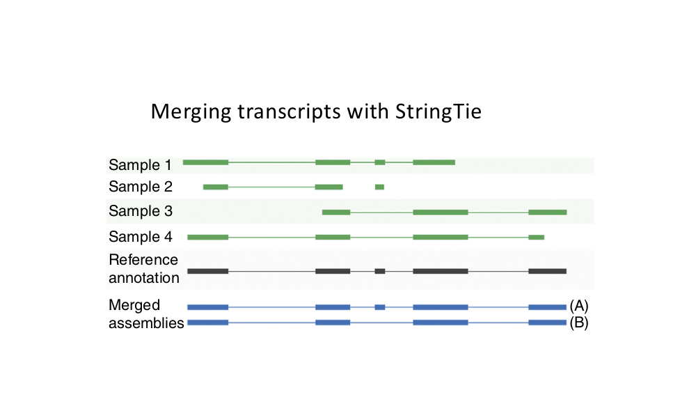 
```


```{r, engine='bash', eval=F, echo=T}
stringtie --merge -p 8 -G gencode.v39.annotation.gtf -o stringtie_merged.gtf mergelist.txt
```

`mergelist.txt` is a simple text file with the names of each file to merge on a separate line.


## gffcompare to compare to annotations:

[gffcompare manual](http://ccb.jhu.edu/software/stringtie/gff.shtml#gffcompare)

```{r, engine='bash', eval=F, echo=T}
gffcompare -R -r gencode.v39.annotation.gtf -o stingtie_merged stringtie_merged.gtf
```

The `-R` option forces the program to only consider transcripts for which there is data, so that the number of 'missed' exons or transcripts is not influenced simply by which genes are expressed.

Output files:

* stringtie\_merged.combined.gtf \
* stringtie\_merged.loci \
* stringtie\_merged.stats \
* stringtie\_merged.tracking \
* stringtie\_merged.gtf.refmap\
* stringtie\_merged.gtf.tmap\

```{r, engine='bash', eval=T, echo=T}
less stingtie_merged.stats
```

```{r, engine='bash', eval=T, echo=T}
head stringtie_merged.gtf.refmap
```


<!--Codes are as shown:

```{r  out.width = "100%", echo=F, fig.align = "center", fig.cap="StringTie codes"}
#library(knitr)
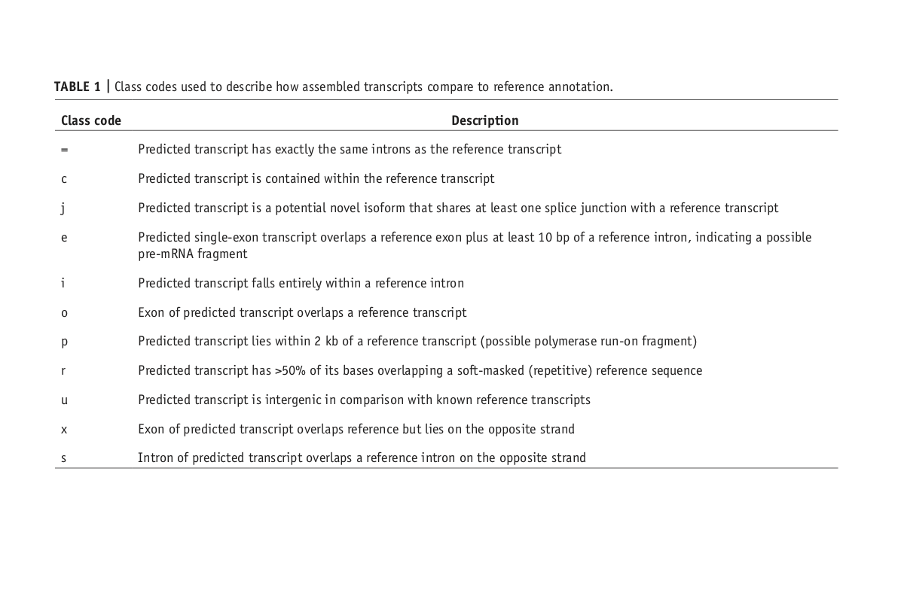 
```
-->


## Calculate transcript abundances with stringtie for use with ballgown or other DE analysis software.

```{r, engine='bash', eval=F, echo=T}
stringtie -e -B -p 8 -G stringtie_merged.gtf 
          -o OUTFILE_est.gtf 
          -A OUTFILE_abun.tab INFILE_sorted.bam
```
**Options:**

* `-e`: Only quantify transcripts that agree with reference annotations.\
* `-B`: Converts data to a table (`.ctab`) that is compatible with Ballgown DE analysis\
* `-o`: Path and name of new .GTF file with coverage data.  Accessory files will be written to same path and path will be created if it doesn't exist.\
* `-A`: Create an abundance table that reports transcript level quantification.\
* `--rf`: Assumes a stranded library fr-firststrand \
* `--fr`: Assumes a stranded library fr-secondstrand\  
* **I empirically found that `--rf` and `--fr` are ignored if `HISAT2` was invoked with the `--rna-strandness` argument as `R` or `F`**. \


There are several outputs, the `-A`-specified abundance table contains the data for each transcript (coverage, FPKM, and TPM values).  You can use `grep` and your favorite gene's name to look at its transcript abundance. \

Another way to test for `R` vs. `F` is to calculate abundance using the reference annotations and then look at accumulated `Coverage` (7th column). The FPKM and TPM are normalized for read depth and since fewer reads align to the wrong orientation, the cumulative values are similar. However, coverage is per-base coverage of the gene and not normailzed by read depth, so this value is directly comparable between `R` and `F` input files. \

```{r, engine='bash', eval=F, echo=T}
stringtie -e -B -p 8 -G gencode.v39.annotation.gtf -o R_est_anno.gtf -A R_abun_anno.tab C1_RNAseq_rep1_R_sorted.bam
stringtie -e -B -p 8 -G gencode.v39.annotation.gtf -o F_est_anno.gtf -A F_abun_anno.tab C1_RNAseq_rep1_F_sorted.bam

# and awk code to skip the header and sum over a column
awk 'NR > 1' R_abun_anno.tab | awk '{sum+=$7;} END{print sum;}'
awk 'NR > 1' F_abun_anno.tab | awk '{sum+=$7;} END{print sum;}'
```


# In class exercise 1:

I have aligned RNA-seq data from two clones of the same progenitor cell line to the hg38 genome with HISAT2. These are two clones, clone 1 and clone 7, that were expanded upon single cell dilution. The genome file indicies I used for alignment is here: `/home/FCAM/meds5420/genomes/hg38_hisat2`.  I used the exact `hisat2` command:\

```{r, engine='bash', eval=F, echo=T}
ht2_gen=/home/FCAM/meds5420/genomes/hg38_hisat2/hg38_hisat2

for i in C*rep*fastq.gz
do
	name=$(echo $i | cut -d "." -f 1)
	echo $name
	hisat2 -p4 --dta --rna-strandness R -x $ht2_gen -U $i -S ${name}_R.sam
	hisat2 -p4 --dta --rna-strandness F -x $ht2_gen -U $i -S ${name}_F.sam
done	
```

The `.sam` files can be found here:

**Folder location:**
`/home/FCAM/meds5420/data/RNA_seq`
\
**Files:** \
- `C1_RNAseq_rep*_R.sam`\
- `C7_RNAseq_rep*_R.sam`\
- `C1_RNAseq_rep*_F.sam`\
- `C7_RNAseq_rep*_F.sam`\

<!-- 
C7
prefetch SRR5882545 && vdb-validate SRR5882545 && fastq-dump --split-3 --gzip SRR5882545
prefetch SRR5882546 && vdb-validate SRR5882546 && fastq-dump --split-3 --gzip SRR5882546
prefetch SRR5882547 && vdb-validate SRR5882547 && fastq-dump --split-3 --gzip SRR5882547
prefetch SRR5882548 && vdb-validate SRR5882548 && fastq-dump --split-3 --gzip SRR5882548

mv SRR5882545_1.fastq.gz C7_RNAseq_rep1.fastq.gz
mv SRR5882546_1.fastq.gz C7_RNAseq_rep2.fastq.gz
mv SRR5882547_1.fastq.gz C7_RNAseq_rep3.fastq.gz
mv SRR5882548_1.fastq.gz C7_RNAseq_rep4.fastq.gz
C1
prefetch SRR5882541	 && vdb-validate SRR5882541	 && fastq-dump --split-3 --gzip SRR5882541 & 	
prefetch SRR5882542	 && vdb-validate SRR5882542 && fastq-dump --split-3 --gzip SRR5882542 & 
prefetch SRR5882543 && vdb-validate SRR5882543 && fastq-dump --split-3 --gzip SRR5882543 & 
prefetch SRR5882544 && vdb-validate SRR5882544 && fastq-dump --split-3 --gzip SRR5882544 &

mv SRR5882541_1.fastq.gz C1_RNAseq_rep1.fastq.gz
mv SRR5882542_1.fastq.gz C1_RNAseq_rep2.fastq.gz
mv SRR5882543_1.fastq.gz C1_RNAseq_rep3.fastq.gz
mv SRR5882544_1.fastq.gz C1_RNAseq_rep4.fastq.gz

mv SRR5882545_2.fastq.gz C7_RNAseq_rep1_PE2.fastq.gz
mv SRR5882546_2.fastq.gz C7_RNAseq_rep2_PE2.fastq.gz
mv SRR5882547_2.fastq.gz C7_RNAseq_rep3_PE2.fastq.gz
mv SRR5882548_2.fastq.gz C7_RNAseq_rep4_PE2.fastq.gz

mv SRR5882541_2.fastq.gz C1_RNAseq_rep1_PE2.fastq.gz
mv SRR5882542_2.fastq.gz C1_RNAseq_rep2_PE2.fastq.gz
mv SRR5882543_2.fastq.gz C1_RNAseq_rep3_PE2.fastq.gz
mv SRR5882544_2.fastq.gz C1_RNAseq_rep4_PE2.fastq.gz
-->
<!--

prefetch SRR5093037 && vdb-validate SRR5093037 && fastq-dump --split-3 --gzip SRR5093037 &
prefetch SRR5093036 && vdb-validate SRR5093036 && fastq-dump --split-3 --gzip SRR5093036 &
prefetch SRR5093038 && vdb-validate SRR5093038 && fastq-dump --split-3 --gzip SRR5093038 &

prefetch SRR5093189 && vdb-validate SRR5093189 && fastq-dump --split-3 --gzip SRR5093189 &
prefetch SRR5093190 && vdb-validate SRR5093190 && fastq-dump --split-3 --gzip SRR5093190 &
prefetch SRR5093191 && vdb-validate SRR5093191 && fastq-dump --split-3 --gzip SRR5093191 &
prefetch SRR5093192 && vdb-validate SRR5093192 && fastq-dump --split-3 --gzip SRR5093192 &

mv SRR5093037_1.fastq.gz no_treatment_rep1.fastq.gz
mv SRR5093036_1.fastq.gz no_treatment_rep2.fastq.gz
mv SRR5093038_1.fastq.gz no_treatment_rep3.fastq.gz

mv SRR5093189_1.fastq.gz mystery_treatment_rep1.fastq.gz
mv SRR5093190_1.fastq.gz mystery_treatment_rep2.fastq.gz
mv SRR5093191_1.fastq.gz mystery_treatment_rep3.fastq.gz
mv SRR5093192_1.fastq.gz mystery_treatment_rep4.fastq.gz


3hr = SRR5093027 SRR5093028 SRR5093029 SRR5093026
1hr = SRR5093049

2hr = SRR5093189 SRR5093190 SRR5093191 SRR5093192

ht2_gen=/home/FCAM/meds5420/genomes/hg38_hisat2/hg38_hisat2

for i in C7_RNAseq_rep1_*.sam
do
	name=$(echo $i | cut -d "." -f 1)
	echo $name
	grep -w chr15 
	samtools sort -@ 4 -o ${name}_F_sorted.bam ${name}_F.sam
	bedtools genomecov -bg -split -strand + -ibam ${name}_F_sorted.bam -trackline -trackopts 'name=F_RNAseq_plus description="F_RNAseq_plus" visibility=full autoScale=on alwaysZero=on color=255,0,0 windowingFunction=maximum' > ${name}_F_plus.bedGraph
	bedtools genomecov -bg -split -strand - -ibam ${name}_F_sorted.bam -trackline -trackopts 'name=F_RNAseq_minus description="F_RNAseq_minus" visibility=full autoScale=on alwaysZero=on color=0,0,255 windowingFunction=maximum' > ${name}_F_minus.bedGraph
	gzip ${name}_F_minus.bedGraph
	gzip ${name}_F_plus.bedGraph
done	

for i in u*rep2*fastq.gz
do
	name=$(echo $i | cut -d "." -f 1)
	echo $name
	hisat2 -p4 --dta --rna-strandness R -x $ht2_gen -U $name.fastq.gz -S ${name}_R.sam
	#hisat2 -p4 --dta -x $ht2_gen -U $name.fastq.gz -S ${name}not.sam
	samtools sort -@ 4 -o ${name}_R_sorted.bam ${name}_R.sam
	bedtools genomecov -bg -split -strand + -ibam ${name}_R_sorted.bam -trackline -trackopts 'name=R_RNAseq_plus description="R_RNAseq_plus" visibility=full autoScale=on alwaysZero=on color=255,0,0 windowingFunction=maximum' > ${name}_R_plus.bedGraph
	bedtools genomecov -bg -split -strand - -ibam ${name}_R_sorted.bam -trackline -trackopts 'name=R_RNAseq_minus description="R_RNAseq_minus" visibility=full autoScale=on alwaysZero=on color=0,0,255 windowingFunction=maximum' > ${name}_R_minus.bedGraph
	gzip ${name}_R_minus.bedGraph
	gzip ${name}_R_plus.bedGraph
done	
-->

The annotation `.gtf` file can be found here: \ `/home/FCAM/meds5420/annotations/gencode.v39.annotation.gtf` \
Extract your specific chromosome from the annotation file to speed things up.

* Access the aligned data and with **each** R and F strandedness file (using a loop) and with **"your"** specific chromosome perform: \
1) transcript assembly with `stringtie`. In your loop you will want to generate a file with a list of individual annotation file names that you will use in the next step. \
2) merge transcripts from each assembly, but keep `R` and `F` assemblies separate so you can compare them.
3) comparison the R and F merged assemblies to annotations with a focus on the `.stats` file. Interpret the stats file with a focus on Precision and novel features. Provide a written explanation of your interpretation with respect to the `--rna-standedness` input.\
4) stringtie quantification of transcripts that match the annotation (i.e. not your merged transcripts gtf) using the `C1_RNAseq_rep1_F` and `C1_RNAseq_rep1_R` sorted BAM files from your chromosome. \
5) Is the `R` or `F` option, or `unstranded` correct for these libraries? Perform tests to determine this and provide written explanations. What would you expect if the libraries were `unstranded`? \

  - To speed things up try logging into an interactive session with 2 or 4 cores: `srun --pty -p mcbstudent --qos=mcbstudent --mem=6G -c 4 bash`  \
  - Only use data from your chromosome, i.e. retrieve your chromosome data from the `.sam` file to your `$HOME` directory tree and pull out only GTF annotations on your chromosome.\
* Take the time to look at the output and manual (`-h`) at each step to become familiar with the operations and output.\

This exercise will take some time, so we will have the first 20 minutes of next class to finish this and ask questions.

# Counting reads in transcripts with HTseq

**HTseq** is a python-based set of tools for analyzing sequencing data.  
\
Link to the manual: [https://htseq.readthedocs.io/en/release_0.10.0/](https://htseq.readthedocs.io/en/release_0.10.0/)\
It is particularly useful because it can take input .GTF files and map reads to exons and return the results by whole transcript or gene.

HTseq only requires a sorted `.sam` or `.bam` file, so the output from `hisat2` alignment can be used directly after sorting. With later versions of HTSeq you will need to make a bam index file with samtools using `samtools index`

Here is an example of it's usage:
```{r, engine='bash', eval=F, echo=T}
module load htseq/0.13.5

samtools index HISAT_ALIGNED_SORTED.bam
htseq-count -m union -r pos -f bam -i gene_id -a 10 --stranded=no HISAT_ALIGNED_SORTED.bam $GTF > FILE.counts
  
 # $GTF file is a variable for the annotation file of choice
```

**Options:**

* `-m union`: union is one of three options for htseq count for binning of reads to features (genes/exons).  It is the recommended option that is most stringent since it will only count a read if it aligns to only 1 gene.
* `-r pos` : meaning that the BAM/SAM file is sorted by genomic coordinate/position
* `-f`: specify input file type
* `-i gene_id` : tells htseq-count to use the gene ID in output file
* `-a 10` : tells htseq-count to skip reads with alignment score less than 10.
* `–stranded=no/yes/reverse` : the RNA-seq reads strand specificity. 

## Important update on HTseq-count
HTseq (older than version 0.8.0) only maps to unique portions of transcripts and genes.  Therefore, read count will often be underrepresented if genes or transcript isoforms overlap or share common exons.  The newer version of HTseq-count (0.8.0 and newer) have a new option called `--nonunique` that if set to `all` will allow reads to map to multiple isoforms or overlapping genes.  So in the examples shown in the HTseq figure, ambiguous reads get mapped to both transcripts or genes. Xanadu has newer versions of HTseq that allow the use of the `nonunique` option.


```{r  out.width = "100%", echo=F, fig.align = "center", fig.cap="HTseq counting options"}
#library(knitr)
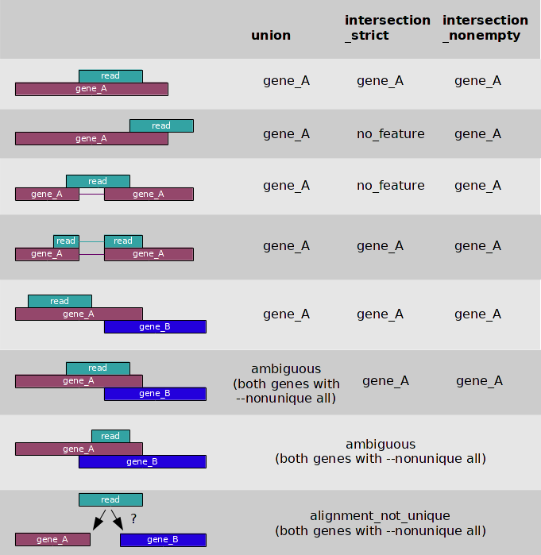 
```


## Strandedness with HTSeq

We use `htseq-count` to bin reads into genomic features (i.e. genes). The options above include `-r` which tells the program the bam file is sorted by position, `-f` which tells the program the input is a BAM file, and `--stranded` tells the program the strand information of the file. Notice the .gtf file is included. The output of this command is a .txt file that contains the gene counts for that sample. We will get one .txt file per sample. We already confirmed that the data is stranded, but even if I know everything about the experiment, is not intuitive for me to know whether to specify `yes` or `reverse` for the `--stranded` argument. To make matters more confusing `HTSeq` is not in the tuxedo suite, so the XS attribute tag that contains the `-` or `+` associated with the read alignment is ignored. The SAM flag is used, so we must again specify the stranded option when counting with `HTSeq`.\

To ensure that I use the correct option, I always run both options and observe the results—this is only necessary for one file if you have a whole bunch of files that were generated with the same molecular biology. Whatever option has more reads in the vast majority of the genes is correct. I appreciate that this is not elegant, but these empirical checks are often necessary to ensure the data is properly processed. The biggest mistakes that I have observed in genomics could have been avoided if the bioinformatician looked at the output of analyses and confirmed that the result is expected or, at minimum, reasonable. \

# In class exercise 2:

**1)** Count reads in genes and empirically determine the correct `stranded` parameter option for your `C1_RNAseq_rep1.fastq.gz` data aligned to your chromosome. Recall that `C7_RNAseq_rep1_F.sam` and `C7_RNAseq_rep1_R.sam` are found here: `/home/FCAM/meds5420/data/RNA_seq`. Confirm that `HTSeq` ignores the `--rna-strandedness` option from `hisat2` by counting with both SAM files.\

You should have already extracted only reads from your chromosome using `grep` and these input SAM files. Likewise, you should have subset your gtf annotation to only contain your chromosome using `grep`.  \
 
**Note:** The output counts file has a footer (see the `tail`) that we want to ignore in the counting. The `grep -v __ ` command prints all the lines without `__` to stdout, and you can use `awk` (you should have a column-summing one-liner `awk` command already saved in the `awk_one_liners.sh` file that I know you are all keeping) to count the second column. \


# Use Genome Coverage from bedtools to create a bedGraph:

```{r, engine='bash', eval=F, echo=T}
bedtools genomecov -bg -split -ibam HISAT_out.sorted.bam > HISAT_out.bedgraph
```

**NOTES**: `-split` is an important option.  If you do not specify it here, you will get signal across exons that looks like background.\

Also, if you have **strand specific** data, make sure you have to run this twice and specify a different strand each time. \


```{r, engine='bash', eval=F, echo=T}
bedtools genomecov -bg -split -strand + -ibam INFILE > OUTFILE_plus.bedgraph

bedtools genomecov -bg -split -strand - -ibam INFILE > OUTFILE_minus.bedgraph
```


## Note on visualizing stranded data with `genomeCoverageBed`

Again, we have to be careful about strandedness! `genomeCoverageBed` defines "strand" by their orientation and they will treat BAM files generated with the `--rna-strandness` `R` and `F` options identically because bedtools is not part of the tuxedo suite. Therefore in the testing stage for generating a workflow, you will have to try combinations of `-strand` arguments and `plus` vs. `minus` outputs to ensure proper visualization as I show in the code chunk below. Since you already confirmed the `R` option with HISAT2 and the `rev` option with `HTseq`, I will tell you that the specified strand and output is inconsistent (i.e. `-` paired with `plus` and `+` paired with `minus`) with this library prep method. 

```{r, engine='bash', eval=F, echo=T}
#test1
bedtools genomecov -bga -split -strand + -ibam INFILE > OUTFILE_plus.bedgraph
bedtools genomecov -bga -split -strand - -ibam INFILE > OUTFILE_minus.bedgraph

#test2
bedtools genomecov -bga -split -strand + -ibam INFILE > OUTFILE_minus.bedgraph
bedtools genomecov -bga -split -strand - -ibam INFILE > OUTFILE_plus.bedgraph
```


We can add track lines as option to include in the files:
```{r, engine='bash', eval=F, echo=T}
bedtools genomecov -bg -split -strand + -ibam INFILE -trackline 
  -trackopts 'name=RNAseq_plus description="RNAseq_plus"  
  visibility=full autoScale=on alwaysZero=on 
  color=255,0,0 windowingFunction=maximum' 
  > OUTFILE_plus_track.bedgraph
```

OR \

You can add track lines as previously shown with awk or with a modified AddTrackLines script we wrote in class for ChIP-seq.

```{r, engine='bash', eval=F, echo=T}
awk 'BEGIN {  print "browser position chr11:5,289,521-5,291,937"
              print "track type=bedGraph name=RNAseq_plus 
              description="RNAseq_plus"  visibility=full 
              autoScale=on alwaysZero=on 
              color=255,0,0 windowingFunction=maximum" }
           {  print $0}' RNAseq.bedgraph > RNAseq_header.bedgraph
```

You can now upload the file into the UCSC genome browser:

[https://genome.ucsc.edu/s/Mike%20Guertin/hg38_rna_seq_class_C1](https://genome.ucsc.edu/s/Mike%20Guertin/hg38_rna_seq_class_C1)

```{r  out.width = "100%", echo=F, fig.align = "center", fig.cap="RNA-seq UCSC"}
#library(knitr)
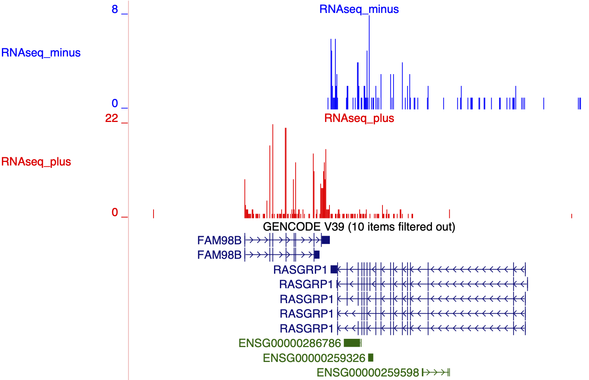 
```


# In class exercise 3:

**1.** Use HISAT2 to align `C1_RNAseq_rep1.fastq.gz` (`/home/FCAM/meds5420/data/RNA_seq/C1_RNAseq_rep1.fastq.gz`) to your user ID chromosome (`/home/FCAM/meds5420/genomes/chroms/chr#.fa`) using the appropriate options. Recall that you will have to build your chromosome index files by first extracting splice sites and exons. Speed up the process by using you GTF annotation file that is unique to your chromosome. \
**2.** Visualize the data in the browser and send me a UCSC session link.\
 - Your chromosome can be found here: `/home/FCAM/meds5420/genomes/chroms` \
extract your chromosome gene annotations from here: `/home/FCAM/meds5420/annotations/gencode.v39.annotation.gtf`

# Processing paired end RNA-seq and visualizing splicing 

The following code chunks and commentary are for your reference. You have the knowledge base to implement the code and understand the processing if the need arises. Most RNA-seq libraries are paired end, so I provided the code and explanations to visualize PE data. UConn and JAX have very strong RNA biology and splicing labs, so I also included code to parse files to visualize splice junction reads on a browser.

# Visualizing stranded PE data:

Original merged C1 and C7 PE FASTQ files: `/home/FCAM/meds5420/data/RNA_seq/paired_end`

## Mapping paired end and stranded data with HISAT2

If you submit samples for RNA-seq at UConn's CGI, then you will most likely get stranded data back.  It will often be paired-end data as well.  Here's how to map and visualize the data.

```{r, engine='bash', eval=F, echo=T}
module load hisat2
dir=/home/FCAM/meds5420/data/RNA_seq/paired_end/
ht2_gen=/home/FCAM/meds5420/genomes/hg38_hisat2/hg38_hisat2
hisat2 -p4 --dta --rna-strandness RF -x $ht2_gen -1 ${dir}C_RNAseq_all_PE1.fastq.gz -2 ${dir}C_RNAseq_all_PE2.fastq.gz -S C_RNAseq_all.sam 

```

* the `--rna-strandness` refers to whether the sequence read represents the RNA equivalent or is complementary to it.  If the read represents the same strand as the RNA, then use the `F` as the input, if it is the complement of the RNA, use `R`.\

* For the Paired-end kit used in the CGI, the first read (mate pair 1) is the complement to the RNA, and the second read (mate pair 2) is the same strand as the RNA.  Therefore, you should enter `RF` for this option.\

Next, we can convert this `.sam` file to a sorted `.bam` , however, for making bed files of paired end data, the reads should be sorted by name (`-n`), so mate-pairs as next to each other. The example below will just process `chr15` to speed things up. Remember, when employing new code or building a pipeline it is always a good idea to start processing only a fraction of the data (i.e. `head -n 400000 X > Y` or `grep -w chr15 X > Y`) until all seems to be working well. This will save you time just waiting for things to run. It is a bit convoluted to extract all chr15 entries from a `sam` or `bam` file. You may want to use `grep` for you favorite chromosome in the `sam` file, then convert to a `bam` and you are good to go, right? Actually, this excludes the header and causes problems. The following routine will allow you to extract your chromosome from an aligned `sam` file. It is convoluted, but `this is the way`.

```{r, engine='bash', eval=F, echo=T}
# convert sam to bam
samtools view -b C_RNAseq_all.sam -o C_RNAseq_all.bam

# sort bam
samtools sort C_RNAseq_all.bam -o C_RNAseq_all_sorted.bam

# index the bam (makes a *.bai file)
samtools index C_RNAseq_all_sorted.bam

# finally we can extract chr15
samtools view -b C_RNAseq_all_sorted.bam chr15 -o C_RNAseq_chr15.bam

# sort for good measure
samtools sort C_RNAseq_chr15.bam -o C_RNAseq_chr15_sorted.bam
```

The necessary files to extract your chromosome info are within the `/home/FCAM/meds5420/data/RNA_seq/processed_bam/` directory on Xanadu. \

Now we can convert to `bed12` format for display in the browser. However, this will display all reads, not only the spliced reads. `bed12` format specifications can be found here:\
[https://genome.ucsc.edu/FAQ/FAQformat.html#format1](https://genome.ucsc.edu/FAQ/FAQformat.html#format1)

```{r, engine='bash', eval=F, echo=T}
bedtools bamtobed -bed12 -split -i C_RNAseq_chr15_sorted.bam > C_RNAseq_chr15_pe.bed12.bed
```


Review `bedtools` commands and options here:

* bam to bed: [http://bedtools.readthedocs.io/en/latest/content/tools/bamtobed.html](http://bedtools.readthedocs.io/en/latest/content/tools/bamtobed.html)
* genome coverage: [http://bedtools.readthedocs.io/en/latest/content/tools/genomecov.html](http://bedtools.readthedocs.io/en/latest/content/tools/genomecov.html)
\

Deeper exon coverage is somewhat apparent and we can observed some gapped reads that are indicative of spliced reads:


```{r  out.width = "75%", echo=F, fig.align = "center", fig.cap="RNAseq browser bed"}
library(knitr)
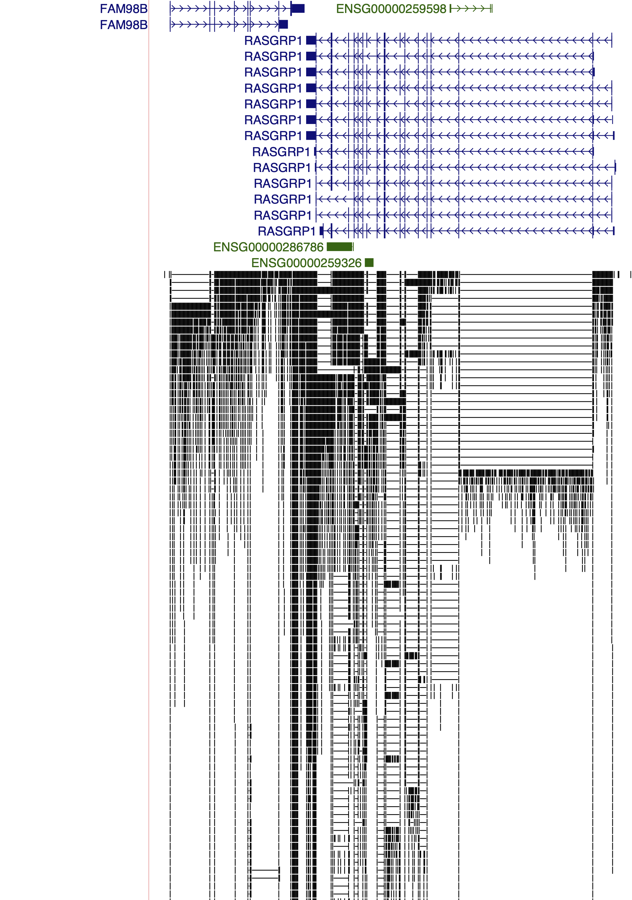 
```

This is also a bit cluttered, so we may just want to observe the spliced reads.


# Displaying splice junctions

To display the splice reads only, we can start with a `bam` file that is sorted by position (not name).


**Note:** You can display splice junctions for any RNA-seq data - stranded or not, paired-end or not.

## Move header to a new file

Invoking the `-H` option in `samtools` will print the header to a new file, which is important for downstream processing.

```{r, engine='bash', eval=F, echo=T}
samtools view -H C_RNAseq_chr15_sorted.bam > C_RNAseq_chr15_spliced.sam
```

## Extract splice junction reads

See Section 3.2 `Intermediate file conversions` for the explanation of the `awk` code taking out relevant CIGAR codes. We append to the header file:

```{r, engine='bash', eval=F, echo=T}
samtools view C_RNAseq_chr15_sorted.bam | awk '($6 ~/N/)' >> C_RNAseq_chr15_spliced.sam
```

## Convert back to `bam`
```{r, engine='bash', eval=F, echo=T}
samtools view -b C_RNAseq_chr15_spliced.sam > C_RNAseq_chr15_spliced.bam
```

## Convert to `bed12`

Use `bedtools` to convert to `bed12`
```{r, engine='bash', eval=F, echo=T}
bamToBed -bed12 -i C_RNAseq_chr15_spliced.bam > C_RNAseq_chr15_spliced_bed12.bed
```
**Example of `bed12` format:**

```{r, engine='bash', eval=T, echo=T}
head C_RNAseq_chr15_spliced_bed12.bed
```

**IMPORTANT:** If using paired-end data, you will need to flip the strand on this file and then add tracklines and upload. In the `name` column (column 4), mate pair one reads end with `"/1"` and mate pair 2 reads end in `"/2"`.  We can use this to `"flip"` mate pair 1 reads to the opposite strand. Below is an `awk` script that does this.

```{r, engine='bash', eval=F, echo=T}
#flip
awk '{OFS="\t"; if($4 ~"/2") print $0; else if($4 ~"/1" && $6 == "+") print($1, $2, $3,$4,$5,"-", $7,$8,$9,$10,$11,$12); else if($4 ~"/1" && $6 == "-") print($1, $2, $3,$4,$5,"+", $7,$8,$9,$10,$11,$12)}' C_RNAseq_chr15_spliced_bed12.bed > C_RNAseq_chr15_spliced_bed12_R1Flip.bed

#add trackline	
awk 'BEGIN { print "browser position chr15:38,408,924-38,589,493"; print "track type=bed name=\"C_RNAseq_chr15_pe\" description=\"C_RNAseq_chr15_pe\"  visibility=squish autoScale=on colorByStrand=\"255,0,0 0,0,255\""} { print $0}' C_RNAseq_chr15_spliced_bed12_R1Flip.bed > C_RNAseq_chr15_spliced_header.bed
```

[https://genome.ucsc.edu/s/Mike%20Guertin/hg38_RNA_splicing_class](https://genome.ucsc.edu/s/Mike%20Guertin/hg38_RNA_splicing_class)


```{r  out.width = "75%", echo=F, fig.align = "center", fig.cap="RNAseq splice junctions"}
library(knitr)
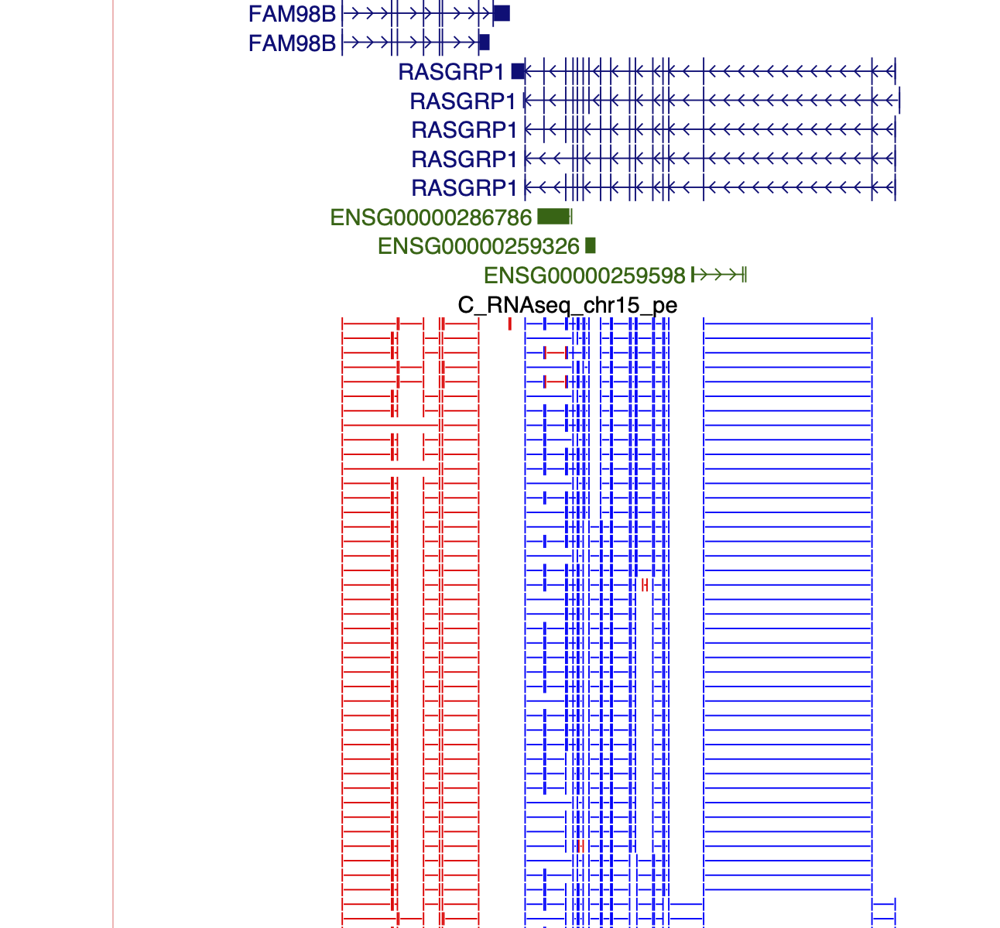 
```

# Making `bedGraphs` files of `C_RNAseq_chr15_pe.bed12.bed` data above (all split spliced reads and non-split reads).

We can then make `bedGraph` files as before using the `-split` and `-strand` options.  However, the input `.bed` files need to be sorted by position, unmapped reads discarded (`.` in columns 1 or 3) and undergo some more processing first.

First, sort the bed file by position.
```{r, engine='bash', eval=F, echo=T}
sort -k1,1 -k2,2n C_RNAseq_chr15_pe.bed12.bed | grep -v -w "\." > C_RNAseq_chr15_pe.bed12_sorted.bed
```

**IMPORTANT:** `bedtools` can properly convert stranded data to a `bedGraph` viewable in the browser.  However, it does not consider the strandedness of the pairs, so one of the mates in a pair will always map to the wrong strand creating data on both strands where it should only be one one.  To get around this, we must manually `flip` the read that is the reverse complement of the RNA to the other strand.  In this case, we must flip read 1.    First, let's look at a `bed12` file and see how we can parse it ourselves.

```{r, engine='bash', eval=T, echo=T}
head C_RNAseq_chr15_pe.bed12_sorted.bed | tail -5
```

In the `name` column (column 4), mate pair one reads end with `"/1"` and mate pair 2 reads end in `"/2"`.  We can use this to `"flip"` mate pair 1 reads to the opposite strand. Below is an awk script that can do this.

```{r, engine='bash', eval=F, echo=T}
awk '{OFS="\t"; if($4 ~"/2") print $0; else if($4 ~"/1" && $6 == "+") print($1, $2, $3,$4,$5,"-", $7,$8,$9,$10,$11,$12); else if($4 ~"/1" && $6 == "-") print($1, $2, $3,$4,$5,"+", $7,$8,$9,$10,$11,$12)}' C_RNAseq_chr15_pe.bed12_sorted.bed > C_RNAseq_chr15_bed12_R1Flip.bed
```

Now create the `bedGraphs`, add track lines, `zip` the files, transfer them to our computer, and upload to UCSC:
```{r, engine='bash', eval=F, echo=T}

hgSizes=/home/FCAM/meds5420/genomes/hg38.chrom.sizes
bedtools genomecov -bg -split -strand + -i C_RNAseq_chr15_bed12_R1Flip.bed -g $hgSizes > C_RNAseq_chr15_pe_R1flip_plus.bedGraph

bedtools genomecov -bg -split -strand - -i C_RNAseq_chr15_bed12_R1Flip.bed -g $hgSizes > C_RNAseq_chr15_pe_R1flip_minus.bedGraph

awk 'BEGIN { print "browser position chr15:38,449,131-38,569,510"; print "track type=bedGraph name=\"C_RNAseq_chr15_plus\" description=\"C_RNAseq_chr15_plus\"  visibility=squish autoScale=on color=\"255,0,0\""} { print $0}' C_RNAseq_chr15_pe_R1flip_plus.bedGraph > C_RNAseq_chr15_pe_plus.bedGraph

awk 'BEGIN { print "browser position chr15:38,449,131-38,569,510"; print "track type=bedGraph name=\"C_RNAseq_chr15_minus\" description=\"C_RNAseq_chr15_minus\"  visibility=squish autoScale=on color=\"0,0,255\""} { print $0}' C_RNAseq_chr15_pe_R1flip_minus.bedGraph > C_RNAseq_chr15_pe_minus.bedGraph

gzip C_RNAseq_chr15_pe_plus.bedGraph
gzip C_RNAseq_chr15_pe_minus.bedGraph

#sftp to your local machine
```

[https://genome.ucsc.edu/s/Mike%20Guertin/hg38_PE_class](https://genome.ucsc.edu/s/Mike%20Guertin/hg38_PE_class)

```{r  out.width = "75%", echo=F, fig.align = "center", fig.cap="RNAseq Paired End browser"}
library(knitr)
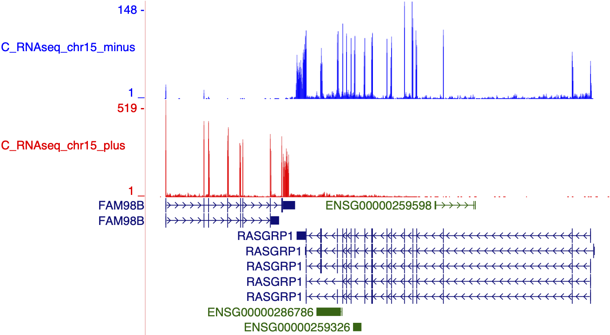 
```

# Exercise 4: Extract and visualize splice junctions from paired end RNA-seq data.

**1.** Extract the reads from your chromosome, then extract the spliced reads from your chromosome, convert to a `BED12` format, add a trackline (see "bed12 format specifications" link above) that includes a different color for each forward and reverse aligned set of splice junction (see `colorByStrand`), and upload to the browser. \
**2.** *Optional:* make `bedGraphs` of your chromosome and try to understand what the complicated set of commands are doing by inspecting the input and output files. 

# For your reference: Molecular biology of library preparations

The molecular biology of library preps diverge depending upon whether the experimenter wishes to preserve the RNA strand information in the sequencing data. Unstranded libraries were common over a decade ago, but I see no reason why contemporary research would employ strand-ambiguous RNA-seq. Therefore, I will briefly discuss the workflow for the library preparation that I prefer and how clever molecular biologists developed methods to retain the strand specificity of the RNA throughout the library prep. \
**1)** Isolate RNA.\
**2)** Negative selection of rRNA.\
**3)** Fragment the RNA with heat. \
**4)** Anneal random hexamer DNA primers to the RNA. \
**5)** Perform reverse transcription of the RNA using a reverse transcriptase that is engineered to operate at high temperatures. RT at higher temperatures relieves secondary structure of the RNA and leads to less biased libraries. Including actinomycin D at this step prevents second strand synthesis during the RT by inhibiting DNA-dependent DNA synthesis. \
**6)** Perform second strand synthesis using the dUTP nucleotide as opposed to dTTP. dUTP incorporation is important for conferring strand specificity. \
**7)** The next step is to blunt the ends of the DNA and generate a 5' A overhang. T4 Polymerase harbors 3' to 5' exonuclease activity and 5' to 3' polymerase activity, which will blunt both overhangs.  T4 Polymerase also phosphorylates 5' DNA ends. \
**8)** Taq polymerase is used to add an A to the 3' end of the dsDNA.  The high throughput sequencing adapter is usually a forked Y adapter that contains a T overhang on the 5' end. This pairs with the A overhang, traditionally referred to as TA cloning. Alternatively, a hairpin adapter is used that incorporates a dUTP that effectively generates a Y adapter when the dUTP is digested. \
**9)** Ligate the sequencing adapters with DNA ligase.\
**10)** Digest dUTPs incorporated during the second strand synthesis with uracil-DNA glycosylase (UGDase). This confers sequence specificity because now you have a single strand DNA molecule with a distinct adapter on each end. The ssDNA represents the template strand. \
**11)** The last step is to PCR amplify with a variety of multiplexed adapters that permit pooling of samples.\

The dsDNA molecules can be sequenced using a specific primer for each end of the molecule. Refer to step 10  to determine which sequencing primer would result in the coding strand and which would be the reverse complement thereof.   

```{r  out.width = "100%", echo=F, fig.align = "center", fig.cap="RNA-seq molecular biology"}
#library(knitr)
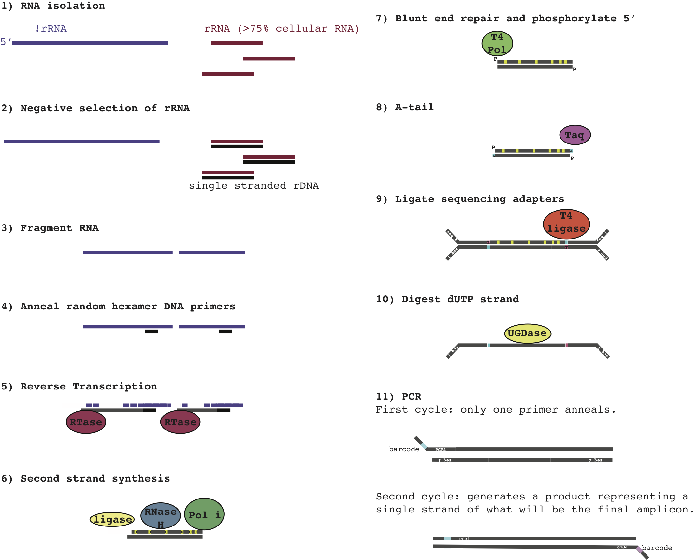 
```

**NEXT TIME**: Differential gene expression analysis.

------------------
# Answers to in class exercise 1:

```{r, engine='bash', eval=F, echo=T}

anno=/home/FCAM/meds5420/annotations/gencode.v39.annotation.gtf

grep -w "chr15" $anno > gencode.v39.annotation.chr15.gtf
annochr15=gencode.v39.annotation.chr15.gtf
chr=chr15

#for i in /home/FCAM/meds5420/data/RNA_seq/C*_RNAseq_rep*_*.sam
touch mergelist.txt
for i in /home/FCAM/meds5420/data/RNA_seq/C*_RNAseq_rep*[FR].sam
do
	name=$(echo $i | rev | cut -d "/" -f 1 | rev | cut -d "." -f 1)
	echo $name
	grep -w $chr $i > ${name}_chr15.sam
	samtools sort -@ 4 -o ${name}_chr15_sorted.bam ${name}_chr15.sam
	stringtie -p 4 -G $annochr15 -o $name.gtf -l ${name} ${name}_chr15_sorted.bam
	echo $name.gtf >> mergelist.txt
done

grep "F.gtf" mergelist.txt > mergelist_F.txt
grep "R.gtf" mergelist.txt > mergelist_R.txt

fr="F R"
for x in $fr
do
	#2 merge transcripts
	stringtie --merge -p 4 -G $annochr15 -o stringtie_merged_${x}.gtf mergelist_${x}.txt
	#3 compare
	gffcompare -R -r $annochr15 -o stringtie_merged_${x}_all stringtie_merged_${x}.gtf
done	

The `R` oriented files have higher precision and fewer novel features. Novel features are false positives (FP), because we consider the reference gene annotations as true positives (TP). precision is calculated as Precision = TP / (TP+FP). All the novel features (FP counts) in `F` are actually found because the orientation of the strand is not correct. This further confirms that `R` strandedness is correct.


#4 abundance

name=C1_RNAseq_rep1_
for x in $fr
do
	stringtie -e -B -p 8 -G $annochr15 -o stringtie_est_${x}.gtf  -A ${name}${x}.tab ${name}${x}_chr15_sorted.bam
#5 tests	
	echo ${name}${x} HSP90 counts
	grep -i hsp90 ${name}${x}.tab
	echo cumulative Coverage  
	awk 'NR>1 {sum+=$7} END{print "sum=",sum}' ${name}${x}.tab 
	echo Cumulative FPKM
	awk 'NR>1 {sum+=$8} END{print "sum=",sum}' ${name}${x}.tab 
	echo Cumulative TPM
	awk 'NR>1 {sum+=$9} END{print "sum=",sum}' ${name}${x}.tab 
done

I did a few tests to see if R or F is correct:
1) I did not know what highly expressed genes were on chr15, so I googled the official gene names (i.e. Actin ==ACTN) and looked at expression of all the candidates: Actin, Tubulin, gapdh, and hsp90. A few variants of hsp90 are present on chr15 and there is coverage and normalized counts in the R orientation. 
2) I looked at the total Coverage, FPKM, and TPM for R and F. the FPKM and TPM are normalized for read depth and since fewer reads align to the wrong orientation, the cumulative values are similar. However, coverage is per-base coverage of the gene and not normailzed by read depth, so this value is directly comparable between R and F input files. The coverage is ~10 fold higher in the R orientation, further confirming R is correct. Coverage would be comparable in R and F if the libraries were unstranded, then we would need to remap with the --rna-standedness flag not specified.

```

# Answers to class exercise 2:

```{r, engine='bash', eval=F, echo=T}

annochr15=gencode.v39.annotation.chr15.gtf

for i in C1_RNAseq_rep1_[FR]_chr15_sorted.bam
do
	name=$(echo $i | rev | cut -d "/" -f 1 | rev | cut -d "." -f 1)
	echo $name
	htseq-count -r pos -f bam --stranded=yes ${i} $annochr15 > $name.gene.counts.yes.txt
	htseq-count -r pos -f bam --stranded=reverse ${i} $annochr15 > $name.gene.counts.reverse.txt
	tail $name.gene.counts.yes.txt
	tail $name.gene.counts.reverse.txt
	echo $name
	echo yes
	grep -v __ $name.gene.counts.yes.txt | awk '{sum+=$2} END{print "sum=",sum}'
	echo reverse
	grep -v __ $name.gene.counts.reverse.txt | awk '{sum+=$2} END{print "sum=",sum}'
done
# many more counts in reverse indicate that reverse is counting reads coming from coherent annotation/read strands

# I know that they are all generated using the same molecular bio protocols
# If I was unsure, I would write a loop to go through all of them
```
<!-- 

bedtools genomecov -bg -split -strand + -ibam C1_RNAseq_rep1_F_chr15_sorted.bam -trackline -trackopts 'name=RNAseq_minus description="RNAseq_minus" visibility=full autoScale=on alwaysZero=on color=0,0,255 windowingFunction=maximum' > C1_RNAseq_rep1_minus.bedGraph

bedtools genomecov -bg -split -strand - -ibam C1_RNAseq_rep1_F_chr15_sorted.bam -trackline -trackopts 'name=RNAseq_plus description="RNAseq_plus" visibility=full autoScale=on alwaysZero=on  color=255,0,0 windowingFunction=maximum' > C1_RNAseq_rep1_plus.bedGraph
  
gzip C1_RNAseq_rep1_minus.bedGraph
gzip C1_RNAseq_rep1_plus.bedGraph
```
-->

# Answers to in class exercise 3:

```{r, engine='bash', eval=F, echo=T}

grep -w "chr15" gencode.v39.annotation.gtf > gencode.v39.chr15.annotation.gtf

extract_splice_sites.py gencode.v39.chr15.annotation.gtf > hg38_hisat_chr15_splicesites.txt

extract_exons.py gencode.v39.chr15.annotation.gtf > hg38_hisat_chr15_exons.txt

cp /home/FCAM/meds5420/genomes/chroms/chr15.fa ./ 

hisat2-build -p 8 --ss hg38_hisat_chr15_splicesites.txt --exon hg38_hisat_chr15_exons.txt chr15.fa chr15_hisat2

name=C1_RNAseq_rep1
cp /home/FCAM/meds5420/data/RNA_seq/$name.fastq.gz ./

hisat2 -p4 --dta --rna-strandness R -x chr15_hisat2 -U $name.fastq.gz -S $name.sam 

samtools sort -@ 4 -o $name_sorted.bam $name.sam 

bedtools genomecov -bg -split -strand - -ibam $name_sorted.bam -trackline -trackopts 'name=C1_RNAseq_rep1_plus description="C1_RNAseq_rep1_plus" visibility=full autoScale=on alwaysZero=on color=255,0,0 windowingFunction=maximum' > C1_RNAseq_rep1_plus.bedGraph

bedtools genomecov -bg -split -strand + -ibam C1_RNAseq_rep1_sorted.bam -trackline -trackopts 'name=C1_RNAseq_rep1_minus description="C1_RNAseq_rep1_minus" visibility=full autoScale=on alwaysZero=on color=0,0,255 windowingFunction=maximum' > C1_RNAseq_rep1_minus.bedGraph

gzip *bedGraph

#sftp the bedGraphs to your computer and upload to UCSC.

# my session:

# https://genome.ucsc.edu/s/Mike%20Guertin/hg38_rna_seq_class_C1

#interpret the data

#The library is stranded because each strand separated track aligns to gene annotations 
#specifically, as opposed to both strand separated tracks having comparable coverage at #each gene annotation. Since the library is firststrand stranded (dUTP), the incoherent (- specification and plus labeling) is correct.
```


<!-- bedtools genomecov -bga -split -strand + -ibam TNF_RNAseq_rep1not_sorted.bam -trackline -trackopts 'name=TNF_RNAseq_rep1not_sorted_plus description="TNF_RNAseq_rep1not_sorted_plus" visibility=full autoScale=on alwaysZero=on color=255,0,0 windowingFunction=maximum' > TNF_RNAseq_rep1not_plus.bedGraph

bedtools genomecov -bga -split -strand - -ibam TNF_RNAseq_rep1not_sorted.bam -trackline -trackopts 'name=TNF_RNAseq_rep1not_minus description="TNF_RNAseq_rep1not_minus" visibility=full autoScale=on alwaysZero=on color=0,0,255 windowingFunction=maximum' > TNF_RNAseq_rep1not_minus.bedGraph

bedtools genomecov -bga -split -strand + -ibam TNF_RNAseq_rep1_chr15_sorted.bam -trackline -trackopts 'name=TNF_RNAseq_rep1_sorted_plus description="TNF_RNAseq_rep1_sorted_plus" visibility=full autoScale=on alwaysZero=on color=255,0,0 windowingFunction=maximum' > TNF_RNAseq_rep1_plus.bedGraph

bedtools genomecov -bga -split -strand - -ibam TNF_RNAseq_rep1_chr15_sorted.bam -trackline -trackopts 'name=TNF_RNAseq_rep1_minus description="TNF_RNAseq_rep1_minus" visibility=full autoScale=on alwaysZero=on color=0,0,255 windowingFunction=maximum' > TNF_RNAseq_rep1_minus.bedGraph
-->


