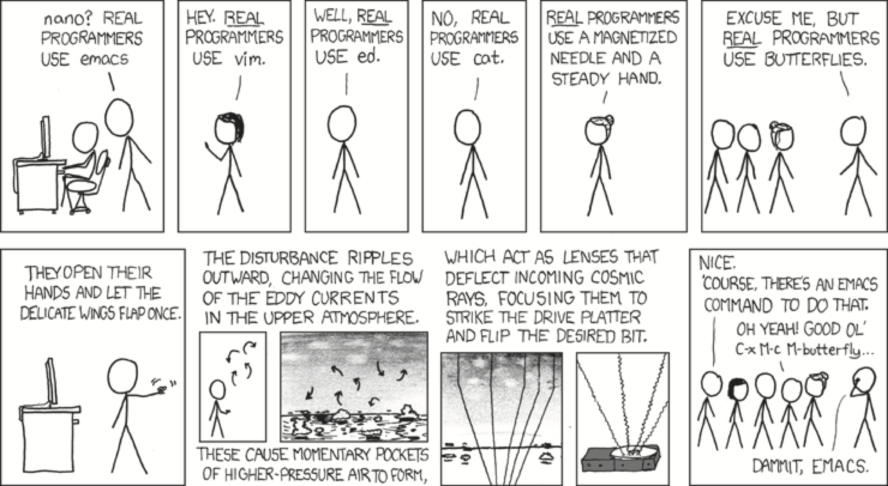

# Readings 

Practical Computing for Biologists: Chapters 2, 5, 6, 16, Appendices 2, 3.\ 

Unix "Basics" and "Finding Things" from UConn CBC: http://bioinformatics.uconn.edu/unix-basics/ \

Software Carpentry Shell Novice lesson: Episodes 5-7:
https://swcarpentry.github.io/shell-novice/

Review basic commands and server access from [UConn_Unix_basics](http://bioinformatics.uconn.edu/unix-basics)

# Last Time:

## Command line navigation:
\
1. Complete path:
```{r engine='bash', eval=F, echo=TRUE}
head /home/username/MEDS5420/lec02_files/the_raven.txt
head /Users/username/MEDS5420/lec02_files/the_raven.txt

```
```{r engine='bash', eval=F, echo=TRUE}
head ~/MEDS5420/lec02_files/the_raven.txt
```
**OR** \
\
2. By using the **relative path** starting from where you are:\

```{r engine='bash', eval=F, echo=TRUE}
head ./username/MEDS5420/lec02_files/the_raven.txt
```
```{r engine='bash', eval=F, echo=TRUE}
head username/MEDS5420/lec02_files/the_raven.txt
```
## Command line utlities so far:

**1.** `pwd` - print working directory\
**2.** `ls` - list directory contents\
**3.** `mkdir` - create a directory\
**4.** `unzip` - decompression\
**5.** `mv` - move file\
**6.** `cp` - copy file\
**7.** `cat` - print contents of file\
**8.** `touch` - create empty file\
**9.** `rm` - remove file\
**10.** `wc` - count lines/words/characters/ in file\
**11.** `>` - redirects output to new file\
**12.** `>>` - redirects output to append to existing file\
**13.** `*` - wildcard that specifies any input\


# Finding things

## Searching inside files using `grep`

We can search for patterns inside of files and print them using the `grep` command.
Let's head over to the writing directory and try using `grep`:
\
Have a look at `haiku.txt`:

```{r engine='bash', eval=T}
# first we must navigate to the correct folder:
cd ~/MEDS5420/data-shell/writing/leisure/

cat haiku.txt
```

When was `haiku.txt` last modified? 
```{r engine='bash', eval=T}
ls -l haiku.txt
```

```{r engine='bash', echo=T, eval=T}
grep bug haiku.txt
```


In the above command, the first argument "bug" is the pattern we are searching for.  The default action for `grep` is to return the entire line in which the pattern was found.


Let's instead search for the word day:

```{r engine='bash'}
grep day haiku.txt
```


In this case that `grep` shows us results with larger words containing "day".
We might instead only want to see exact words not part of larger words.
To impose word boundaries, we use the `-w` flag:

```{r engine='bash', error=T}
grep -w day haiku.txt
```


There are no results because "day" is only part of larger words in `haiku.txt`

Sometimes we want to search for more than a single word.
To search for a phrase, we need to use double quotes so that `grep` treats the pattern as a single argument.

```{r engine='bash'}
grep -w "is not" haiku.txt
```


Other very useful `grep` flags are `-n`, `-i` and `-v`:

```{r engine='bash'}
grep -n "it" haiku.txt
```


```{r engine='bash'}
grep -n -w -i "the" haiku.txt
```

As you might have guessed:

- `-n` prints the line number of the matching line.
- `-i` ignores capitalization (also called "case"; the "i" comes from case-**i**nsensitive)

You can learn more about `grep` flags using `grep --help`

The real power of `grep` is using a special class of wildcards known as "regular expressions" (the "re" in `grep`).
Let's use regular expressions to find lines where the second letter is "o":

```{r engine='bash'}
grep '^.o' haiku.txt
```

Explanation of the pattern:

- The caret (`^`) tells `grep` to only look from the start of a line rather than anywhere in the line.
- The dot (`.`) tells `grep` to match any single character (letter, number, or symbol) - basically a single character **wild card**.
- The "o" means to specifically only match the letter "o" (it will not match an upper case "O").

Some other useful expression in grep:

- `$` specifies the matching at end of a line. \
- `*` in grep, the asterisk is a repetition operator. This is commonly coupled to `.` as `.*` to act as a wild card of unspecified length 


Learning the full power of regular expressions takes time,
but for now just know that they exist.  If you want to make use of them, check out these **cheat sheets** and other online resources.  

- [https://developer.mozilla.org/en-US/docs/Web/JavaScript/Guide/Regular_Expressions/Cheatsheet](https://developer.mozilla.org/en-US/docs/Web/JavaScript/Guide/Regular_Expressions/Cheatsheet)

- [https://cheatography.com/davechild/cheat-sheets/regular-expressions/](https://cheatography.com/davechild/cheat-sheets/regular-expressions/)

## Exercise 1: 'regex' with grep

1) Use the criteria below to print the appropriate lines from `haiku.txt`:

- lines that begin with the letter s
- lines that end in the letter d
- lines that begin with the letter "t" and end with the letter "g" 
- lines with words that begin with the letter n


## Exercise 2: Command practice and 'grepping' patterns
Look in the `song_lyrics` folder inside the data-shell folder and you should see a single file: `TS_example.txt`
The TS_example.txt file contains lyrics to a song by a well-known contemporary artist. Using the command line utilities you have learned, try the following:

**1.** Print the number of lines in the file. \

**2.** Print the lines **and line number** that have the word 'shake' in them to a new file called `shake-lines.txt`. \
**3.** Print the number of lines that have the word 'shake' in them. \
**4.** Devise a way to print the **number of times** 'shake' appears in the song.  Be sure to include all instances or forms of the word. \

**\*hint:** use the manuals for different functions to see what your options could be.


# Searching for file or directories using `find`

```{r engine='bash', eval=F}
find .
```

`find` shows us files and directories.
The power of find is in specifying "tests" or "filters".

```{r engine='bash', eval=F}
find . -type f
```

```{r engine='bash', eval=F}
find . -type d
```

The above filters search for files and directories, respectively.

**Search depth:**\
One can specify how far down the file hierarchy to go by controlling `depth` (first you should navigate one directory closer to root than the `data-shell` directory):

```{r engine='bash', eval=F, echo=T, error=T}
find ./data-shell -maxdepth 2 -mindepth 2 -type f
```
The above command searches for all files two directory levels within the data-shell folder.  \
**Quick try:** Try other combinations of levels and types and verify by counting number of items in output.

Let's try matching by name:
```{r engine='bash', eval=F, echo=T, error=T}
find ./data-shell -name "*.txt"
```

**Quick try:** Combine `find` and `grep` to find the number of text files within 2 and 3 levels inside of the data-shell folder.


# Setting and viewing variables
variables are strings that can be assigned values.  To create a variable use the following format:
```{r engine='bash', eval=T, echo=T}
var=variable # when setting variable do not use spaces
```
To see what the variable is you can print it to the screen with **echo**:
```{r engine='bash', eval=T, echo=T}
echo $var  # the '$' designates that this is a variable
```
*Try using echo without the dollar sign.\

Whole sentences or lists can be designated as variables:
```{r engine='bash', eval=F, echo=T}
fileList=*.txt
echo $fileList
```

If your variable is going to be combined with another string, make sure you surround the variable with a curly bracket.  For instance:
```{r engine='bash', eval=T, echo=T}
School=MEDS
echo listing: $School
echo this class is $School_5420 # something's wrong
echo this class is ${School}_5420  # properly inserts variable

```

## Setting variables using single vs. double quotes vs. back ticks
In short, double quotes allows variables within strings to be interpreted, whereas single quotes makes them literal.\
Try out this example:
```{r engine='bash', eval=T, echo=TRUE}
instructor="Michael Guertin"
echo "My instructor for MEDS5420 is $instructor"
```
or
 
```{r engine='bash', eval=T, echo=TRUE}
instructor="Michael Guertin"
echo 'My instructor for MEDS5420 is $instructor'
```

## Executing commands 'in place' within variables
**Uses for backticks** - the key usually just under the escape key.\
Backticks allow one to insert the result of a command in place within a command line.\
One nice use for this is to set variables as outputs of commands.\
Here's an example with the command `date` that prints the date and time to the screen:\
Compare the two following examples:
```{r engine='bash', eval=T, echo=TRUE}
info=date
echo The date and time is: $info
```
vs.
```{r engine='bash', eval=T, echo=TRUE}
info=`date`
echo The date and time is: $info
```

Backticks can cause problems when using other quotations, so there is another way to run a command in place:

```{r engine='bash', eval=T, echo=TRUE}
echo The date and time is: $(date)
```


# Text editors: 
Certain text editors are designed for scripting and can recognize code.  Importantly, they do not embed the document or fonts with hidden characteristics that can cause problems when running programs on you computer.  There are three features that you should look for in an editor:\

**1.** language specific highlighting \

**2.** line number display \

**3.** version control \

**MAC USERS:** Download BBedit here: [http://www.barebones.com/products/bbedit/download.html?ref=tw_alert](http://www.barebones.com/products/bbedit/download.html?ref=tw_alert): http://www.barebones.com/products/bbedit/download.html?ref=tw_alert and then install it:

Open your text editor **BBEdit** on Mac.

**PC USERS:**
download Visual Studio: [https://visualstudio.microsoft.com/downloads/](https://visualstudio.microsoft.com/downloads/) \
or \
download notepad++ here: [https://notepad-plus-plus.org/](https://notepad-plus-plus.org/) \


**Note:** You can also use **emacs** or other command line editors such as `nano` or `vim`. These command line editors are the functional equivalent of opening a file in BBEdit, Visual Studio, or NotePad. The interface is a bit clunky and requires keyboard prompts to save, write, and exit. We will be using `emacs` or `nano` when we work on the server next time.\

```{r  out.width = "120%", echo=F, fig.align = "center", fig.cap="XKCD: Real programmers"}
#library(knitr)
 
```


A quick primer for `emacs` is:

```{r engine='bash', eval=F, echo=TRUE}
#generate the file
touch filename.sh

# open the emacs command line editor
emacs filename.sh

#you are now in EMACS
write some code

ctrl-X ctrl-W to save as another name

make edits

ctrl-X ctrl-S to save

ctrl-X ctrl-C to exit

#you are back in the Terminal
```

A quick primer for `nano` is:

```{r engine='bash', eval=F, echo=TRUE}
touch filename_nano.sh

nano filename_nano.sh

#you are now in NANO
write some code

ctrl-O, then <Enter/Return> to save

ctrl-O, then backspace to write as a new file name, then <Enter/Return> to save 

make edits

ctrl-O, then <Enter/Return> to save

ctrl-X  to exit

```

\pagebreak

# Answers to in class exercises


## Exercise 1: Grep with 'regex'
1) Use the criteria below to print the appropriate lines from `haiku.txt`:

- lines that begin with the letter s:\
  `grep -i '^s' haiku.txt`
- lines that end in the letter d:\
  `grep -i 'd$' haiku.txt`
- lines that begin with the letter "t" and end with the letter "g" :\
  `grep -i '^t.*g$' haiku.txt`
- lines with words that begin with the letter n. The second answer requires a Google search, to specify the first and last letters of words use `\<` (start of word) and `\>` (end of word). \
`grep -w -i "n.*"` or `grep -i '\<n' haiku.txt` 


## Exercise 2: 'grepping' patterns
 
The TS\_example.txt file contains lyrics to a song by a well-known contemporary artist. Using the command line utilities you just learned, try the following: \
**1.** Print the number of lines in the file: `wc -l TS_example.txt` \
**2.** Print the lines **and line number** that have the word 'shake' in them to a new file called `shake-lines.txt`: `grep -n -i shake  TS_example.txt > shake-lines.txt` -this answer will print all instances of *shake* regardless of upper and lowercase letters due to the `-i` option.\
**3.** Print the number of lines that have the word 'shake' in them: `grep -c shake TS_example.txt` -this answer is not sensitive to upper and lowercase \
**4.** Devise a way to print the **number of times** 'shake' appears in the song: `grep -o -i shake TS_example.txt | wc -w` \
-here the `-o` will only print the *shake* part of the line to a new line in the output and we can pipe to `wc` and count the number of words \


