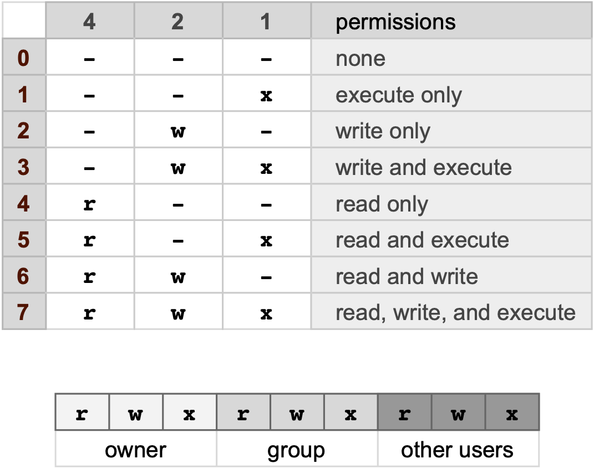

**Readings:** Practical Computing for Biologists: Chapter 6.\

Review basic commands and server access from [UConn_Unix_basics](http://bioinformatics.uconn.edu/unix-basics)


# Scripting in the shell.
Scripts are a logially ordered set of commands used to process files.  They can be simple routines or complex programs.  There are three main things one needs when writing scripts in general: \
**1.** The commands themselves \

**2.** Information about what language should be used to interpret the commands \

**3.** Permission to execute commands in script file. \


The first line is the [Shebang](http://en.wikipedia.org/wiki/Shebang_%28Unix%29) line:
```{r engine='bash', eval=F, echo=TRUE}
#! /bin/sh

or sometimes

#! /usr/bin/sh
```

to find out where your shell is type:
```{r engine='bash', eval=F, echo=TRUE}
which sh
```

Let's try a simple script:
```{r engine='bash', eval=F, echo=TRUE}
ls -la
echo "Above are the directory listings for the following folder"
pwd
```

Create a new folder in your MEDS5420 folder called *'scripts'*
\
Save your script as `ls.sh`
\
Go to the directory where ls.sh is and try to execute it:
```{r engine='bash', eval=F, echo=TRUE}
./ls.sh
```
In order to run this script we need to give the proper permissions.  To see permissions for files, type:
```{r engine='bash', eval=F, echo=TRUE}
ls -la
```
The columns are:

**1.** permissions \
**2.** owner \
**3.** group \
**4.** size \
**5.** last modifiation \
**6.** name \ 
 

In permissions: 'd'=directory, '-' = file, 'r' = read, 'w' = write, 'x' = execute.
\
Three sets of permissions are shown: User (owner), Group, Other users.

To give permission to execute type:
```{r engine='bash', eval=F, echo=TRUE}
chmod +x ls.sh
```
Now use `ls -la` to view permissions and then try to execute.

Other ways to designate permissions:

```{r  out.width = "100%", echo=F, fig.align = "center", fig.cap="Permissions"}
#library(knitr)
 
```


----------------------------------------------------------------------------------------------
To give permission for everone to read, write, and execute a script use:
```{r engine='bash', eval=F, echo=TRUE}
chmod 777 ls.sh
```

### Scripting with a loop
```{r engine='bash', eval=T, echo=TRUE}
list="1 2 4 6"
for x in $list
do
   echo Hello people of MEDS_5420
done
```
The numbers mean nothing here.  They are just placeholders such that every time an item is encountered the loop repeats itself.  For instance:

```{r engine='bash', eval=T, echo=TRUE}
list="a b c"
for x in $list
do
   echo Hello people of MEDS_5420
done
```


## Exercise 1: 
Create a shell script, called `grad_folders.sh` that does the following:\
**1.** Create a variable that lists the following items: notebook, raw_data, figures, manuscripts.\
**2.** Create a folder for each item that is named the same as each item.\
**3.** Print to the screen what is happening (i.e. that you are creating a folder).\
**4.** Copy the haiku.txt file into each folder.

\pagebreak 


# What we've learned so far:

**1.** How to navigate your computer from your terminal and create or find files and folders (`cd, ls, mv, rm, mkdir, touch, find`) \
**2.** How to view the content of files (head, tail, less), and search for specific lines or items (grep) \
**3.** How to combine multiple files together (cat) and redirect terminal output into new or existing files (> or > > ). \
**4.** How to string several commands together with pipes ('|') \
**5.** The importance of quoting syntax. \
**6.** The beginnings of shell scripting. \


# More commands 

**1.** Learn a few more useful terminal commands: **sort, cut, uniq** \

# Creating path and filename shortcuts with variables

Download `color-table.txt` from the Lecture 4 folder in GitHub and move this file to your MEDS5420 folder.  \

It is not immediately apparent how to download the file from GitHub, but you do have access to the **Raw** file by clicking **Raw**. We can use a command in the Terminal to directly retrive this raw file without having to click **Save As** in the browser. \

If you have a Mac, then `curl` is the default method to retrieve files from URLs:

```{r engine='bash', eval=F, echo=T}
curl -O https://raw.githubusercontent.com/guertinlab/meds5420/main/Lecture_4/color-table.txt
#the manual will tell you what the -O (the letter, not a zero) option does 
```

Linux OS have `wget`:

```{r engine='bash', eval=F, echo=T}
wget https://raw.githubusercontent.com/guertinlab/meds5420/main/Lecture_4/color-table.txt
```

Let's tuck the color-table.txt file away into some new directories:

```{r engine='bash', eval=F, echo=T}
#start from the MEDS5420 folder:
mkdir ./in_class
mkdir ./in_class/colors
mv color-table.txt ./in_class/colors
```


```{r engine='bash', eval=T, echo=T}
table="./in_class/colors/color-table.txt"
head $table
```


# String splitting and manipulation

The **cut** command is useful for splitting strings based on user-defined delimiters.  For instance, if I want to extract only the time from the **date** command you can try this:

```{r engine='bash', eval=T, echo=TRUE}
# selects the 4th item after the line is split by spaces (" ")
echo "the date and time is:"
echo $(date)

echo "the time is:"
echo $(date) | cut -d " " -f 4  

```

`-d`: is the delimiter set by user.  Default is tab: `\t`\
`-f`: the fields to select for after splitting.  Can list each (1,2,3) or list a range (1-3)\
\

reversing a string:
```{r engine='bash', eval=T, echo=TRUE}
# returns backwards string

echo `date` | rev

```

Can be done on any part of a pipe

```{r engine='bash', eval=T, echo=TRUE}
echo $(date)

echo "the reverse time is:"
echo $(date) | cut -d " " -f 4 |rev

```


**Extracting columns from tables:** Cut can also be used to extract columns from tables.\


Let's just get the first column of `color-table.txt`:
```{r engine='bash', eval=T, echo=T}
table="./in_class/colors/color-table.txt"
cat $table | cut -f 1
```

**Sorting columns:** Simple sorting of columns

```{r engine='bash', eval=T, echo=T}
sort -k 2 color-table.txt | head -n 5

# k followed by a number represents the column to sort by.
```

Notice how numbers are handled.  They are handled as a string of numbers and each position in evaluated separately.  If you want a true numeric sort, try this:
```{r engine='bash', eval=T, echo=T}
#numerical sort on column 2

sort -k 2n color-table.txt | head -n 5
```
The option `-k 2` sorts on column 2, but if column 2 is identical, the row will continue to be sorted until a distinct character can differentiate. The following will only sort on column 2 and retain the original relative order of row that have identical column 2 values. The `-s` refers to a stable sort and `-k 2,2` says only use column 2 to sort.  

```{r engine='bash', eval=T, echo=T}
#numerical sort on column 2
sort -s -k 2,2n color-table.txt | head -n 5
```


Numerical sorts are ascending, to return a descending sort, try the following:

```{r engine='bash', eval=T, echo=T}
#numerical sort on column 2

sort -k 2nr color-table.txt | head -n 5

```

Finding unique items in list.  You can use `uniq` to determine how many times an item appears in a list.  

```{r engine='bash', eval=T, echo=T}
# -c prints the number of each item
cat color-table.txt | cut -f 3 | uniq -c | head 
```
One pitfall is that it only operates on adjacent items, so lists must be sorted first:
```{r engine='bash', eval=T, echo=T}
# sorting first gives true number of unique items

cat color-table.txt | cut -f 3 |sort | uniq -c | head  

```

## In class exercise 2: Extract the last item from a string of unknown length.
Consider this filename at the end of the path: `/tempdata3/MEDS5420/data/raw/chip_repA.txt` \
\
Devise a way to split the string and report the filename `chip_repA.txt` without referencing the exact position. This come in handy if you want to get the last item in the path without knowing how long the path is.
\pagebreak

# Answers to in class questions:

## In class exercise 1: 

```{r engine='bash', eval=F}
#! /bin/sh
folders="notebook raw_data figures manuscripts"

for x in $folders
do
   echo "creating the following directory": $x
   mkdir $x
   cp ~/path/to/haiku.txt $x
done
  
```


## In class exercise 2: 

Retrieve the last item in a string of unknown length

```{r engine='bash', eval=F, echo=T}
file="/tempdata3/MEDS5420/data/raw/chip_repA.txt"
echo $file | rev | cut -d "/" -f 1 | rev
```


