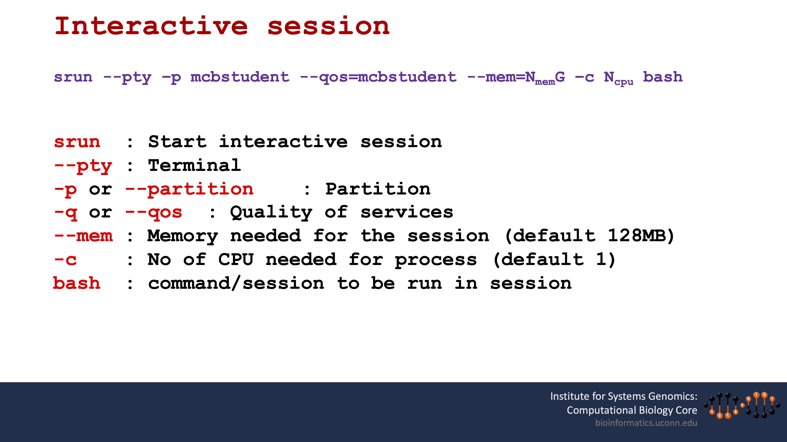

<!-- 

# HBD Chuck!

```{r  out.width = "100%", echo=F, fig.align = "center", fig.cap="Happy Brithday Darwin for all who celebrate"}
#library(knitr)
 
```
-->

# Login commands

## `ssh`
```{r engine='bash', eval=F, echo=TRUE}
ssh meds5420usr17@xanadu-submit-ext.cam.uchc.edu
```

## `sftp`
```{r engine='bash', eval=F, echo=TRUE}
sftp meds5420usr17@transfer.cam.uchc.edu
```

# Running interactive sessions and batch scripts on Xanadu

Xanadu uses the SLURM (Simple Linux Utility for Resource Management) language to manage workloads.\
Documentation:\
[https://slurm.schedmd.com/](https://slurm.schedmd.com/)

## Interactive session

### Important: All actions that require CPU or memory should be run from an interactive session to avoid jamming the head node.

The head node is like a lobby where everyone enters a space, but actions should not be taken here.  You should request a 'room' or interactive session in which to conduct your business.\

To see if you are on the head node you can use the `hostname` command.

```{r  out.width = "100%", echo=F, fig.align = "bottom", fig.cap="Interactive session options"}
#library(knitr)
 
```


```{r engine='bash', eval=F, echo=TRUE}
#simplest way to start a session

srun --pty -p mcbstudent --qos=mcbstudent  bash

# See Figure 1 for definitions and usage.
```

To confirm that you are indeed in an interactive session, try the `hostname` command and it should return `Xanadu-<n>`


## Batch scripts
Sbatch (Slurm Batch) scripts need to start with a header that contains important information for running and reporting the output of your script.
```{r engine='bash', eval=F, echo=TRUE}
#! /bin/sh

#SBATCH --job-name=hello.sh     # name for job
#SBATCH -N 1                    # number of nodes (always 1)
#SBATCH -n 1                    # number of jobs / tasks (always 1)
#SBATCH -c 1                    # number of cores (1-4)
#SBATCH -p mcbstudent           # SLURM partition (always mcbstudent)
#SBATCH --qos=mcbstudent        # SLURM Quality of service (always mcbstudent)
#SBATCH --mem=1G                # RAM (memory) requested 
#SBATCH --mail-type=ALL 
#SBATCH --mail-user=FIRST.LAST@uchc.edu
#SBATCH -o scriptname.sh_%j.out
#SBATCH -e scriptname.sh_%j.err

hostname # have this at beginning of every script for  troubleshooting

<your script>
```

Remember one of the first scripts we wrote:
```{r engine='bash', eval=F, echo=TRUE}
#! /bin/sh
list="1 0 3 6"

for x in $list
  do
#modified so it is not immediately completed!  
    sleep 30s
    echo Hello people of MEDS5420
    echo $x
  done

echo $list
```

We can add this script to our batch script and rename it hello_batch.sh. \
To run the script we use:

```{r engine='bash', eval=F, echo=TRUE}
sbatch hello_batch.sh
```


To check the status there are several options:

```{r engine='bash', eval=F, echo=TRUE}
squeue #check the status of the entire queue

squeue -u <usrID> # check the status of all jobs by a user

squeue -j <jobID>  # Check status of specific job
```

We can check what would be printed to the screen interactively and the standard error by looking at the `.err` and `.out` files:

```{r engine='bash', eval=F, echo=TRUE}
head *err
head *out
```

If something is wrong and you want to kill a job:
```{r engine='bash', eval=F, echo=TRUE}
scancel <jobID>
```

You can also check the status of the server to see how busy it is with **`sinfo`**
```{r engine='bash', eval=F, echo=TRUE}
sinfo --format="%10P  %6t %15O %15C %15F %10m %10e %15n %30E %10u" 
```

To check just our `mcbstudent` partition:
```{r engine='bash', eval=F, echo=TRUE}
sinfo -p mcbstudent --format="%10P  %6t %15O %15C %15F %10m %10e %15n %30E %10u" 
```
The numbers in the columns represent the status of the CPUs per node:\

**A** - allocated or in use\
**I** - Idle or available\
**O** - Other\
**T** - Total\


## In class exercise 1:  running and altering batch scripts


**1.** Copy the `sbatch-template.sh` script from the `/home/FCAM/meds5420/scripts` directory to your home directory. \
**2** Add the `hello_batch.sh` script to your batch script, and adjust the other user input (email, jobID, etc) appropriately. \
**3.** Save and run the script. Where did the output go?                

**4.** create a `sbatch-output` folder in your home directory and alter the sbatch script such that the output and errors go to this folder. \
**5.** intentionally create an error in your script (e.g. add double quotes but don't close them), and run the script again. Now check the error file to see an example of error outputs. \
**6.** Use the sbatch script to run another script from your scripts folder by calling it directly.  i.e. instead of having the 'hello' script commands in the sbatch file, create another script (hello.sh) and run that with the batch script. \


# Installing programs for genomic analyses:  Learning how to set up your computer/local server for genomic analysis.

Programs or software packages come in a variety of forms that require varying levels of effort and know-how to properly install and run.  Most GUI applications you are used to pretty much install themselves with a few clicks after downloading.  This type of installation is rare for most command line driven programs. However, with a few  concepts in mind, one should be able to install most bioinformatic software to your Linux or Mac OS with command line.  Some considerations are:

**1.** Choosing which version or release to use (Choose 'stable' releases, do not choose 'beta').\
**2.** Choosing installation method (auto vs. custom).\
**3.** Choosing to install program from pre-compiled binaries or by compiling source code directly to your machine.\
**4.** Where to put the program.\
**5.** How to make sure you can run the program (adding to your 'search path').\


## How to download public data:
You can search for and download data using the Gene Expression Omnibus [http://www.ncbi.nlm.nih.gov/geo/](http://www.ncbi.nlm.nih.gov/geo/)
\
However, if you're working on a server it is more convenient to just download it directly.

There is handy software for accessing publicly available data called the **sra-toolkit**. 
We can download and install this software in various ways. Here are some related links:\
Website: [http://www.ncbi.nlm.nih.gov/sra](http://www.ncbi.nlm.nih.gov/sra)\
Documentation: [http://www.ncbi.nlm.nih.gov/books/NBK158900/](http://www.ncbi.nlm.nih.gov/books/NBK158900/)
\
Downloads: [https://github.com/ncbi/sra-tools/wiki/Downloads](https://github.com/ncbi/sra-tools/wiki/Downloads)\
\
**About SRA toolkit:**
All federally funded sequencing data must be stored in the *S*equence *R*ead *A*rchive. All data stored in this repository is in a compact format for efficient storage, but is not ammenable to analysis with standard pipelines. The sra-toolkit is software package with several tools that converts the data from '.sra' to various other formats that used in analyses (.sam or .fastq).  If configured properly, the software can also access the database and download archived data directly to your computer.

## Introduction to package managers

**Easy installation on Linux (Ubuntu) with apt-get**  
see [apt-get documentation](https://help.ubuntu.com/lts/serverguide/apt-get.html)

**apt-get** works directly with the repository: *A*dvanced *P*ackaging *T*ool and is a command line tool that allows you to manage (install, update, upgrade, uninstall) a wide variety of software packages.  It comes with all Ubuntu distributions, but no longer appears to work with Mac OS (see custom installs). Fink is a popular software manager that can be used on Mac (not covered here). The advantages is that `apt-get` can easily and securely install/unistall programs. The disadvantage is that your program must be found in the repository.

## Installation of command line tools on MAC
**Mac users:** apt-get no longer comes with standard Mac OS's. Use *brew* instead.

see brew install instructions at [http://brew.sh/](http://brew.sh/)

**NOTE:** On Macs, you will likely need to download **developer tools** and **Xcode** in order to allow you to customize your software through command line. The method for downloading and installing **Xcode** is always changing, but I believe the current preferred method is to go through the App Store. JAX students often do not have administrative privileges on their lab computers. Please have IT install CommandLineTools and brew. 

```{r engine='bash', eval=F, echo=TRUE}
#use this command to determine if commad line tools are installed
xcode-select -p

# if not installed: 
xcode-select --install
# click the Install button to install the required command line tools
```

After command line tools are installed you should be able to install homebrew with the following command:
```{r engine='bash', eval=F, echo=TRUE}
/bin/bash -c "$(curl -fsSL https://raw.githubusercontent.com/Homebrew/install/HEAD/install.sh)"
```

## Using package managers
First, how do we know if the desired program is in the repository on Linux:
```{r engine='bash', eval=F, echo=TRUE}
apt-cache search <search_term>
```

With **brew** try listing:
```{r engine='bash', eval=T, echo=TRUE, error=T}
#USAGE: brew search <search_term>

brew search sratoolkit
```

Lets install it with apt-get or brew:
```{r engine='bash', eval=F, echo=TRUE}
apt-get install sra-toolkit # Linux

OR

brew install sratoolkit # Mac
```

You may have been denied permssion to safeguard against willy-nilly or potentially harmful software installs.  To request (or demand!) permission use `sudo`.  Sudo stands for 'super user do' and when placed in front of a command can force it to run providing you have the password and administrative permssion.

Try it now and enter your password when prompted:
```{r engine='bash', eval=F, echo=TRUE}
sudo apt-get install sra-toolkit # Linux

OR

sudo brew install sratoolkit # Mac
```

One of the programs within the software package can convert the archived data in the **.fastq** format that is used in the first part of processing data.  It's usage is as follows:
```{r engine='bash', eval=F, echo=TRUE}
#converts a file from .sra to .fastq
fastq-dump <path/to/file.sra> 
```
Just typing `fastq-dump` will print out basic usage instructions, and **this confirms that the install worked**.
\

If you want to remove an installed package you can **purge** or **uninstall** it with:

```{r engine='bash', eval=F, echo=TRUE}
# removes software AND configurations files
apt-get purge <filename> # Linux

OR

brew uninstall <filename> # Mac
```

# Question: What if the program is not in the repositories?

## Custom installs: Installing binaries vs. installing from source code.

**Binaries** are precompiled software that are readable by the computer provided it was compiled specifically for your computer and OS.  These are generally easier to use since they can be used almost immediately after downloading. You can see the binaries available for sratoolkit here: [https://github.com/ncbi/sra-tools/wiki/01.-Downloading-SRA-Toolkit](https://github.com/ncbi/sra-tools/wiki/01.-Downloading-SRA-Toolkit).\
\
**Source code** is human-readable code that must be compiled in order to be read by the computer.  This requires a compiler (usually not a problem with Linux or a Mac).  Installing from source provides more flexibility since they can be installed on any computer that can compile the code, however, sometimes the process goes wrong or you might be lacking a dependent program which causes headaches. Another disadvantage of installing from source, is that unless the authors provided an uninstall script, they can be laborious to completely remove from your machine.

## 32 vs. 64 bit
Precompiled binaries are often made available for 32 bit or 64 bit operating systems.  To find out what you have, type:
```{r engine='bash', eval=T, echo=T}
uname -a
```

Or pipe the output to cut to get important part on page.
```{r engine='bash', eval=T, echo=T}
uname -a | cut -d ";" -f 2  
```

Next, you can download the software from a website, or if you have the url, you can also use **wget**.  

first, install the `wget` function

```{r engine='bash', eval=F, echo=TRUE}
brew install wget
```
 
```{r engine='bash', eval=F, echo=TRUE}

## FORMAT: wget -output-document <name_of_file> <weblink>
wget --output-document sratoolkit.tar.gz https://ftp-trace.ncbi.nlm.nih.gov/sra/sdk/3.0.0/sratoolkit.3.0.0-ubuntu64.tar.gz
```

Not all Macs will have **wget**.  In this case, you can use **curl**, as shown below. We will use `wget` in class, so please install `wget` with brew.

```{r engine='bash', eval=F, echo=TRUE}
## FORMAT: curl -O <name_of_file> <weblink>

#make sure you use -output or -O so that the file 
#is saved and not printed to screen

wget https://ftp-trace.ncbi.nlm.nih.gov/sra/sdk/3.0.0/sratoolkit.3.0.0-mac64.tar.gz
```

How do you know if the download is complete?  Recall that you can check the file integrity by using **checksum**.
Checksum is a string of characters that reflect the number of bytes in a file.  If the author-provided checksum matches yours after download, they are **likely identical** If they do not match, they are **definitely different** and the download should be repeated.

To get the checksum of your file after download use:
```{r engine='bash', eval=F, echo=TRUE}
md5  <filename> # mac or Linux
md5sum <filename> # Linux only
```
The checksum values for the sra-toolkitv3.0.0 downloads are found here: [https://ftp-trace.ncbi.nlm.nih.gov/sra/sdk/3.0.0/md5sum.txt](https://ftp-trace.ncbi.nlm.nih.gov/sra/sdk/3.0.0/md5sum.txt) \

b1c028945a6e54626cbaf25781151dae **hisat2-2.2.1-64-ngs.3.0.0-linux.zip**\
259d8037eab50a7b3d8afdc932a190d3 **hisat2-2.2.1-64-ngs.3.0.0-mac.zip**\
f1e2382ac45087fdc825b84484d4eb4f **setup-apt.sh**\
2bb6291edd8024603ed7aa03fda49e6a **setup-yum.sh**\
2b1de9f0801fbd26724a50be5ea7a9ce **sratoolkit.3.0.0-centos_linux64-cloud-dbg.tar.gz**\
f54fde94c3948ccc246ed40f660f05c7 **sratoolkit.3.0.0-centos_linux64-cloud.tar.gz**\
7f5bda044814a5f2ada727f34dd09529 **sratoolkit.3.0.0-centos_linux64.tar.gz**\
a9a85e032d76c751eee378b080ea65b0 **sratoolkit.3.0.0-mac64.tar.gz**\
7d58f946796e3c587dd473216ebadf8e **sratoolkit.3.0.0-ubuntu64.tar.gz**\
11bda0fd523408b3dde3e82b58ded49f **sratoolkit.3.0.0-win64.zip**\
a7bc4f4691c79596a8598960e676f56f **sratoolkit.3.0.0.version.txt**\

\
Example checksums
```{r engine='bash', eval=F, echo=TRUE}
md5 sratoolkit.tar.gz
```
To report only the checksum value to the screen, use the '-q' option:
```{r engine='bash', eval=F, echo=TRUE}
md5 -q sratoolkit.tar.gz
```
It is now safe to unpack the software:
```{r engine='bash', eval=FALSE, echo=TRUE}
tar -xvzf sratoolkit.tar.gz

#OR
gunzip sratoolkit.tar.gz
tar -xvf sratoolkit.tar

```
Now try to run the run the command without arguments as you did in the past:
```{r engine='bash', eval=F, echo=TRUE}
fastq-dump 
```


# Summary:
Today we learned:

- Install/uninstall programs using apt-get and brew. \
- The difference between binaries and source code. \


\pagebreak

# Answer to in class exercise

Since this answer is a dynamic process of logging into Xanadu, making a bunch of files with command line text editors, you can just watch me stumble through the process and learn from my mistakes by watching the video from 2023 starting at 1:08:50: http://guertinlab.cam.uchc.edu/meds5420_2023/230208_Lec7_recording.mp4  \
or watch this from 2024 starting at 0:48:00: http://guertinlab.cam.uchc.edu/meds5420_2024/Lecture_7_2024.mp4 


