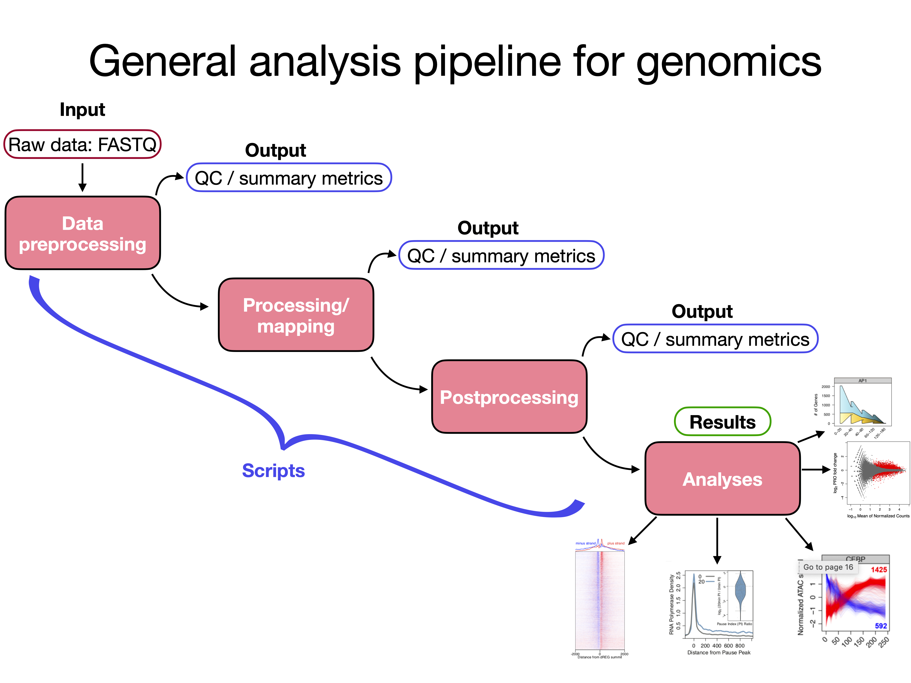
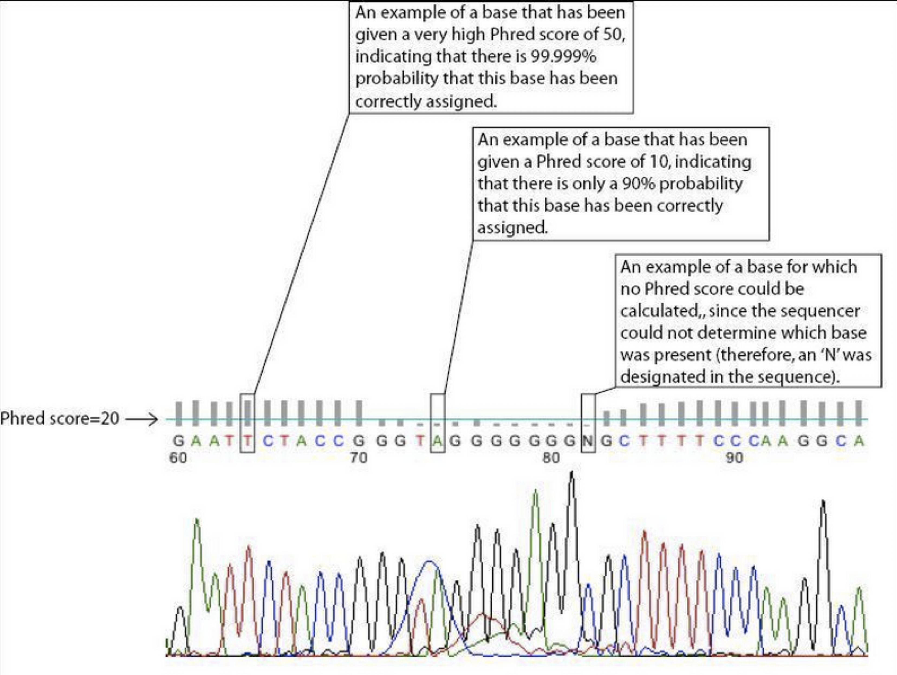
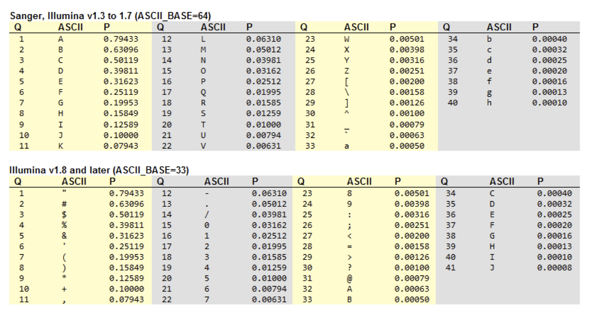

# Last time:
* Running interactive sessions
* submitting job with `sbatch`
* introduction to `apt-get` and `brew` package managers
* Used `apt-get` or `brew` to install the `sratoolkit` on your local macine. 


# Today: Download, QC and Preprocessing of Illumina data:
* downloading `bowtie2` binaries
* adding directories to the `$PATH`
* Using `fastqc` to check the quality of library or sequencing run.
* Using command line tools to pre-process .fastq data.

```{r  out.width = "100%", echo=F, fig.align = "center", fig.cap="pipeline flow chart"}
#library(knitr)
 
```

# Login commands

## `ssh`
```{r engine='bash', eval=F, echo=TRUE}
ssh meds5420usrX@xanadu-submit-ext.cam.uchc.edu
```

## `sftp`
```{r engine='bash', eval=F, echo=TRUE}
sftp meds5420usrX@transfer.cam.uchc.edu
```

## interactive session

```{r engine='bash', eval=F, echo=TRUE}
srun --pty -p mcbstudent --qos=mcbstudent --mem=2G bash
```

# Downloading precompiled software

Recall that you can use the command `uname -a` to get information about the achitecture of your computer.

We will download binary files for the popular alignment software `bowtie2`, using a  Google search and a few clicks you should arrive here: \

https://bowtie-bio.sourceforge.net/bowtie2/manual.shtml#obtaining-bowtie-2 \

click the Download link and arrive here: \

https://sourceforge.net/projects/bowtie-bio/files/bowtie2/

Download bowtie binaries compatible with your architecture, in my case it is `macos arm64`. They go to my Downloads folder, so I can navigate there and `unzip` the file.


```{r engine='bash', eval=F, echo=TRUE}
unzip /Users/guertinlab/Downloads/bowtie2-2.5.1-macos-arm64.zip
cd /Users/guertinlab/Downloads/bowtie2-2.5.1-macos-arm64
```

These are executable files, so we can invoke the software by just typing the full directory structure (or relative path) to the `bowtie` executable binary. I typically invoke the `-h` flag option when testing software, because it is usually the usage documentation or **h**elp.

/Users/guertinlab/Downloads/bowtie2-2.5.1-macos-arm64.zip


```{r engine='bash', eval=F, echo=TRUE}
/Users/guertinlab/Downloads/bowtie2-2.5.1-macos-arm64/bowtie2 -h 
```

MacOS does not like opening software from outside the AppStore, so you have to attempt to run `bowtie` and manually navigate to *Security and Privacy* to allow the developer.

```{r  out.width = "100%", echo=F, fig.align = "center", fig.cap="tell your computer to trust the software"}
#library(knitr)
knitr::include_graphics("./allow_bowtie.png") 
```


You do not want to specify the full directory structure to `bowtie2` every time you run the software, so you can tell your computer where to look for *any* installed software. The computer needs to be told the `$PATH` where programs or commands should be found.\
\

--------------------------------------------------------------------------

# Introduction to search path: `$PATH`

## Where do we put the software after download?

In order to run a command from the terminal, the computer must know where the program is.  You can do this manually, by specifying the full path to the program every time you use it.  This is laboroious.  To make life easier, each user has a **'search path'** that tells the computer where to look for commands that are typed into the terminal.  To view your path type:
```{r engine='bash', eval=FALSE, echo=TRUE}
echo $PATH
```
The search path is a list of paths that are separated by a colon.  When you type a command the computer will look in each directory specified in the variable **$PATH**. If found, there is attempt to run the program. If not, you will get the error: `command not found`.  To get your program to run, you can do any of three things:

**1.** Use the full path to the program when running it. \
**2.** Move the program into one of the PATHs so that it is automatically recognized by bash. \
**3.**  Change the `$PATH` variable so that it includes the path to the program. \


First let's put the software in an appropriate place:\
Many of the built in functions for your computer and some installed ones are in the `/bin/` or `/usr/bin/` directories.
For example try:
```{r engine='bash', eval=TRUE, echo=TRUE}
which python3
```
and

```{r engine='bash', eval=TRUE, echo=TRUE}
which grep
```
**which** tells you where the program is, and these are indeed targets of the `$PATH` variable.

However, it isn't a good habit to add custom installs to these directories because:\
- Mistakes in altering directories with built-in functions can lead to corruption of core functions. \
- it can be difficult to remove or alter your custom software in these directories. \


There is another directory in the PATH that is convenient for custom installs by the user: **/usr/local/bin/**. It should be empty on new linux machines. One could move their `bowtie2` folder contents to `/usr/local/bin/` with `mv`. We could unload all the programs to the `/usr/local/bin/` folder, but since other software will likely go here, things could get crowded. I like to keep them separate, by leaving programs from software packages in their respective folders and then just change my PATH variable to point directly to those folders.

## Changing your path

Temporary path changes:
```{r engine='bash', eval=T, echo=TRUE}
export PATH=$PATH:/Users/guertinlab/Downloads/bowtie2-2.5.1-macos-arm64

echo $PATH
```
The above command will add the directory where the `bowtie2` binaries are to your `$PATH`.  However, this is a temporary change that is only used for the current session.  Thus, the altered path will be ignored when starting a new session.  To make it permanent, you need to change the path in your **bash profile**
\
Your PATH variable is set inside your **bash profile**.  This is a file called `.bashrc` (Linux) or `.bash_profile` (Linux or Mac).  This file is located in your home directory, but is hidden from normal viewing. On Xanadu, I empirically determined that `.bashrc` is not used at login, so modify `.bash_profile` for software installed on the server.

\
To see your bash profile, move to your home directory and type `ls -a`.  You can use `nano` to alter your path in the following way (you may need `sudo`):

```{r engine='bash', eval=FALSE, echo=TRUE}
nano .bashrc #.bash_profile on Linux
nano .bash_profile #.bash_profile on a Mac
```

Type this line at the end:

```{r engine='bash', eval=F, echo=TRUE}
export PATH="$PATH:/Users/guertinlab/Downloads/bowtie2-2.5.1-macos-arm64" 
```

This line overwrites the old PATH after appending the new path to the current PATH. \
Save the file and exit `nano`.\
Try to see what the new PATH looks like.  **NOTE:** For the changes to take effect, you first need to start a new termial session.
```{r engine='bash', eval=FALSE, echo=TRUE}
echo $PATH 
```
The new PATH destination should be reflected and typing `bowtie2` from any directory should allow the computer to find it and print the usage to the screen.
\
Congrats, you have completed a custom install of software binaries and used a package manger to install software!


# What if binaries are not available for your OS?
## Installing from source

Installing from source is becoming less and less common as package managers are gaining in popularity. I tried to find a good example for you to install from source. I found that the most common tools `sra-tools`, `bowtie2`, `meme`, `macs3`, and `bedtools` all have different, sometimes complicated, and sometimes poorly documented installation instructions. The only general advice I have is to carefully read the README and INSTALL files.    \

Fortunately, most packages are available through package managers, preloaded in modules on the server, or available as binaries that are compatible for your system.\

This link provides an explanation on what is happening during an install from source:\
[https://robots.thoughtbot.com/the-magic-behind-configure-make-make-install](https://robots.thoughtbot.com/the-magic-behind-configure-make-make-install)
 

# Server operations: Using `module` to temporarily load functions:

We're going to use the `sratoolkit`, `fastqc`, and `fastx-tools` amongst other things today and next time.  These programs are on the server, however, we need to load them into our session for use. On our own machine we made sure the programs were in our **`$PATH`**.  On the server we can use the **`module`** to load and have access to specific functions during your session without altering your **`$PATH`**.  This provides flexibility and specificity in running software versions.
\
First, view which modules are available:
```{r engine='bash', eval=F, echo=TRUE}
ssh <user_name>@xanadu-submit-ext.cam.uchc.edu 

module avail  
```

We can check specifically for sratoolkit:

```{r engine='bash', eval=F, echo=TRUE}
module avail sratoolkit
```
Once you find the one you're looking for:

```{r engine='bash', eval=F, echo=TRUE}
module load <software>  
```

This is **convenient** because you can add module functions to your shell scripts to be sure that you are using the correct software versions.  \

**AND** \
You don't have to waste time adding lots of programs to your `$PATH`\
\
It is **flexible** because it allows you to even switch between version of software on the fly.  For instance: \

```{r engine='bash', eval=F, echo=TRUE}
# load software
module load <software_v.2>   

# do something
some commands, etc.
#unload software and load another version
module unload <software_v.2>
module load <software_v.1>

# do something else
more commands, etc.
```
## Server operations: Running jobs in the background 

* One problem with working on the server is that if you start a command and it takes a while, you're stuck.  
* To get around this you can run the operation in the background using the **'&'** symbol.
* This runs the program in the **background**, allowing you to continue using your command prompt while the program is executed. \
* To start a command in the background just add **`&`** to the end of the command. 
* You should get a process ID number: a unique identifier that allows you to track that operation.\

To see what processes are running you can use several commands:  

* **top**: continuous monitoring of activity
* **ps** or 'process': shows the activity under your user and only shows that activity at that instance (snapshot).
* **qstat**: when you're on the server.
* **squeue**: (covered previously) can show jobs by, user, ID, or node.\


## Killing jobs
To stop runaway processes or ones that are taking too long in the background, you cannot use the normal **Control-c**.  You can, however, **scancel** the process using the process ID number.
```{r engine='bash', eval=F, echo=TRUE}
# when on the Xanadu server
scancel <process_ID>
```
You can also run jobs in the background on your own machine.  In this case, you can use **`kill`** to cancel jobs.

```{r engine='bash', eval=F, echo=TRUE}
kill <process_ID>
```

You can review other ways to view activities on the server and kill processes here: [http://bioinformatics.uconn.edu/unix-basics/](http://bioinformatics.uconn.edu/unix-basics/)

# Downloading data from sra archive

## Downloading options with sratoolkit:

`prefetch`: Downloads `.sra` file. 

* Works quickly \
* Data must be converted to fastq locally with `fastq-dump` \
* Can easily check for complete download `vdb-validate` \
* .sra files contain pre- and post-mapping information and QC. \

`fastq-dump`: Downloads `.fastq` files.

* Combines .sra download and simultaneous conversion to .fastq \
* Checksum not automated  \
* Can check data integrity by comparing # seqs with output from `vdb-dump --info` \

`fasterq-dump`: Downloads `.fastq` files and automatically splits paired end reads

* https://github.com/ncbi/sra-tools/wiki/HowTo:-fasterq-dump \ 
* like `fastq-dump` but enables ***multithreading*** \
* available in sratoolkit v2.8+ \

### `prefetch`
This program directly downloads `.sra` files to you machine.
```{r engine='bash', eval=F, echo=TRUE}
prefetch <options> <SRR-number> &  
```
`prefetch` will typically add a folder called **`ncbi`** to your home directory, in which a copy of the sra file will be placed in the following location:
```{r engine='bash', eval=F, echo=TRUE}
~/ncbi/public/sra/
```
You should first validate that the download is complete with `vdb-validate`:
```{r engine='bash', eval=F, echo=TRUE}
vdb-validate <SRR-number>
```
`sratoolkit` maintains a database of checksums for each data set. This will essentially run a checksum on the file (in the `~/ncbi/public/sra/` directory tree) to confirm that the download was complete./

You can then use `fastq-dump` to convert the .sra file to fastq.
```{r engine='bash', eval=F, echo=TRUE}
fastq-dump <options> <SRR-number> &  
```

### `fastq-dump`
This program directly downloads .sra files to you machine and converts to fastq on the fly.
```{r engine='bash', eval=F, echo=TRUE}
fastq-dump <options> <SRR-number> &  
```
The data should be in whichever directory you specify (default is current directory).

### `fasterq-dump`
This program directly downloads .sra files to you machine and converts to fastq on the fly.
```{r engine='bash', eval=F, echo=TRUE}
fasterq-dump <options> <SRR-number> &  
```
The data should be in whichever directory you specify (default is current directory).

## Let's try downloading some data.\

There are two data sets that we will practice with today.\
Their accession #'s are:\
SRR039637\
and\
SRR1552484

Create a **/data/** folder within your home directory on the server.\

\
Start an interactive session and load modules:
```{r engine='bash', eval=F, echo=TRUE}
#start an interactive session
srun --pty -p mcbstudent --qos=mcbstudent --mem=2G bash

#load module:
module load sratoolkit

#change to /data directory
cd ~/data

```
Now let's use `prefetch` and `fastq-dump` to download data.

## TRICK with `prefetch`: string together prefetch with validation and `.fastq` conversion
```{r engine='bash', eval=F, echo=TRUE}
prefetch SRR039637 && vdb-validate SRR039637 && fastq-dump --gzip SRR039637
```
`fasterq-dump` is quicker and it will automatically split paired-end files, but doesn't include the option to compress:

```{r engine='bash', eval=F, echo=TRUE}
prefetch SRR039637 && vdb-validate SRR039637 && fasterq-dump SRR039637
```

## `fastq-dump` only:

```{r engine='bash', eval=F, echo=TRUE}
fastq-dump -F --gzip -X 20000000 SRR039637  
  # -F: downloads the original format of the data
  # --gzip: compresses the data upon downloading
```

then use `vdb-dump` to get information about the file resulting from `fastq-dump` 

```{r engine='bash', eval=F, echo=TRUE}
vdb-dump --info SRR039637  
```

Compare the number of sequences to number of lines in downloaded data. See how many lines there are in each file using **`zcat`** and **`wc`**.\

Recall that `zcat` allows you to access gzipped files without actually uncompressing them completely.  This can save a lot of time with decompressing/compressing large files. \

Can you infer what the `-X` option specifies?

If you cannot retrieve the files, they are also in the **data** folder for our class: `/home/FCAM/meds5420/data/`\


```{r engine='bash', eval=F, echo=TRUE}
#For Linux (server)
zcat SRR039637.fastq.gz | wc -l 
```

```{r engine='bash', eval=F, echo=TRUE}
#On a Mac
gzcat -c SRR039637.fastq.gz | wc -l 
```

You should get **23313288** lines.
 
# Interpreting .fastq (.fq) format and Phred scores
 
## Inspecting data
For today's exercises, we don't need all the data, so let's subset some of it into your home directory for practice.\
Subsetting data is generally useful as it allows you to quickly do the following: \

**1.** Get the general idea of how a dataset is constructed \
**2.** Assess the quality of a dataset \
**3.** Debug processing or analysis scripts \


Using `zcat` again output the first 1000000 lines from `SRR039637.fastq.gz` into a new file called `test1.fq` and place it in your data folder.\
Example:
```{r engine='bash', eval=F, echo=TRUE}

zcat SRR039637.fastq.gz | head -1000000 > ./data/test1.fastq

```

Now go to your data folder and we'll look at the data:

```{r engine='bash', eval=T, echo=T}
head -8 test1.fastq
``` 

`.fastq` files consist of 4 lines for each sequence.  The lines are: \

**1.** A unique identifier for that sequence \
**2.** The sequence itself \
**3.** Often a repeat of the unique identifier, but it can be anything \
**4.** String of phred quality scores \

**What are phred quality scores?:** They give the probability that the base call is correct.  This convention was originally developed to aid interpretation of Sanger sequencing traces.


```{r  out.width = "100%", echo=F, fig.align = "center", fig.cap="Sanger Q-scores from traces"}
#library(knitr)
 
```

The phred quality score (Q) is related to the log of the error probability (E):
```
Q=-10* log10(E)
```

This table shows the probabilities associated with different phred scores.


```{r  out.width = "100%", echo=F, fig.align = "center", fig.cap="Phred interpretation"}
#library(knitr)
knitr::include_graphics("./phred_probs.png") 
```

Illumina phred (Q) scores: \

**1.** In current HTS data, the max quality score is typically 40. \
**2.** These phred scores are represented by ASCII characters that put the scores into a single character per byte (or base). \
**3.** The scores are typcially ASCII +33, in order to avoid odd characters and functions of the first 32 ASCII characters.  \
**4.** Illumina originally made their q-scores ASCII +64 so they would correspond to letters, however they switched due to pressure from the rest of the community (that already used ASCII +33). \

You can check out the ASCII table here: [http://www.asciitable.com/](http://www.asciitable.com/).

```{r  out.width = "100%", echo=F, fig.align = "center", fig.cap="ASCII-Phred conversion"}
#library(knitr)
 
```

# QC and preprocessing
Two useful Quality control and read processing programs to use before mapping to genomes: \
[FastQC](http://www.bioinformatics.babraham.ac.uk/projects/fastqc/).\
and\
[Fastx toolkit](https://github.com/agordon/fastx_toolkit) \


Both programs are on the Xanadu server and can be loaded with `module`.

# `FastQC`: quality control for .fastq files
Performs moderately thorough QC and is extremely easy to use.\
\

**Concerns for QC:**\
**1.** Quality scores (Phred) for each base and average for reads \
**2.** Adapter contamination (no DNA or RNA insert) \
**3.** Duplicate sequences (library complexity) \
**4.** Sequence lengths \


**Type of common preprocessing manipulations (`fastx_tools`):**

**1.** Remove adapter sequences from reads (`fastx_clipper`) \ 

**2.** Trim reads to a defined size (`fastx trimmer`) \
**3.** View duplicate sequences (`fastq_collapser`) \
**4.** Filter out low quality reads (`fastq_quality_filter`) \
**5.** Filter out low quality portions of reads (`fastq_quality_trimmer`) \

**USAGE:**
For FastQC, it is simple:
```{r engine='bash', eval=F, echo=TRUE}
#To Look at the usage instructions:
module load fastqc

fastqc -h

#To run an analysis
fastqc  <data.fastq>
```
**Helpful tip: Opening html files from command line.**

FastQC creates individual files of the evaluation of each criteria. All of the results are viewable within a browser with the supplied HTML file.  You can use the following command format to open fastQCreports. 

```{r engine='bash', eval=F, echo=TRUE}
open -a "/Applications/Google Chrome.app" <FILENAME.html>
```

However, I typically navigate to the directory and open the Finder.
```{r engine='bash', eval=F, echo=TRUE}
cd </path/containing/the/html_file> # I am usually already there
open .

# OR

open /path/containing/the/html_file
```
I often have HTML files on a cluster and I do not view them remotely, so I use sftp to transfer them to my machine and open them locally. This is clunky, but it works. 


## In class exercise 1: FastQC
**Remember to use an interactive session when running these commands!**

**fastQC exercise:**

**1.** Use the `sratoolkit` to download `SRR1552484` to your `data` folder. \
**2.** Write only the first 1000000 lines to a new file: call it `test2.fastq` \
**3.** Go to the [FastQC](http://www.bioinformatics.babraham.ac.uk/projects/fastqc/)  website. View reports from some of types of data (Good, Bad, Contaminated) under Example reports. \
**4.** Run `fastQC` on the `test2.fastq` data as well as the `test1.fastq` data (from `SRR039637` data we already downloaded). \
**5.** View the contents of the resulting .zip file(s).  All of these files can be viewed in the included `.html` file. \
**6.** Open a new terminal window on your computer and use `sftp` or `scp` to copy the html link to your computer and view the report on a local browser. \


**Note:** There is also a multiQC program on the server that you can use to compile all fastqc results from a single experiment together. This makes for easy comparisions between samples and/or replicates\

See [https://multiqc.info/](https://multiqc.info/).

To use it: 
```{r engine='bash', eval=F, echo=TRUE}
module load multiqc  # load multiqc software

multiqc --help  # view usage and option

```


\pagebreak

# Answers to in class exercises 


## In class exercise 1 (answers): FastQC
\
1) Use the sratoolkit to download `SRR1552484` to your data folder.
```{r engine='bash', eval=F, echo=TRUE}
cd data

module load sratoolkit

fastq-dump SRR1552484 -F --gzip
```

2) Just as in class, move only the first 1000000 lines to a new file: call it test2.fastq

```{r engine='bash', eval=F, echo=TRUE}
zcat SRR1552484.fastq.gz | head -1000000 > test2.fastq
```

3-4) Run `fastQC` on the test2.fastq data as well as the test1.fastq data (from `SRR039637` data we already downloaded).

```{r engine='bash', eval=F, echo=TRUE}
module load fastqc 

fastqc test1.fastq

fastqc test2.fastq
```

5) View the contents of the resulting .zip file(s).  All of these files can be viewed in the included .html file. \

6) Open a new terminal window on your computer and use `sftp` (or `scp` if you prefer) to copy the html link to your computer and view the report on the internet.\

From your machine:
```{r engine='bash', eval=F, echo=TRUE}
sftp meds5420usrX@transfer.cam.uchc.edu

get <path/to/html/file.html>
```

