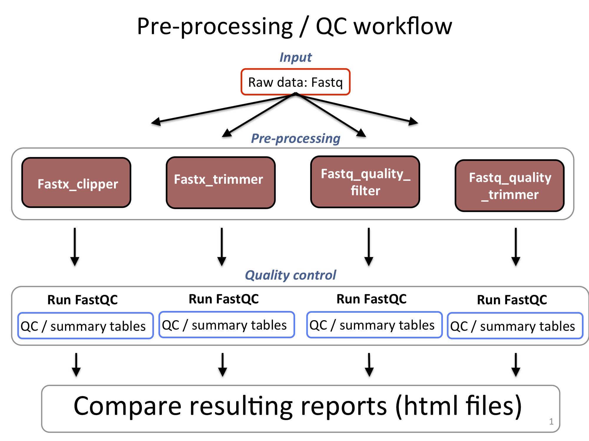

# Fastx toolkit: preprocessing of .fastq files
Allows one to manipulate/filter/convert fastq files as well as perform QC analysis on reads.\
\
**Common fastx tools and functions:**\
\
`fastx_trimmer`:  trim all reads at a defined based\
`fastq_quality_filter`:  remove reads with an overall quality score below threshold (-q) one must specify the percent of bases meeting -q threshold\
`fastq_quality_trimmer`: trim bases from end of reads with q-scores lower than threshold (-t)\
`fastx_clipper`: trim known adapter sequence from the ends of reads\
`fastx_barcode_splitter`: separate reads into new files based on barcodes\
`fastq_to_fasta `: convert .fastq to .fasta format\
`fastx_collapser`: collapse identical sequences into list of unique sequences in descending order of frequency\


**TIP:** when calling `fastx` commands, pay attention to whether **`fastx`** or **`fastq`** is in the name.\

## Fastx tools usage:
```{r engine='bash', eval=F, echo=TRUE}
#example to look at the usage instructions:
module load fastx/0.0.14

fastq_quality_trimmer -h

#Usage
fastx_tool [options] -i <infile> -o <outfile>
```

I recommend running fastx tools with the -v option when getting familiar with it.  -v stands for **verbose**, and tells the program to print some basic information or statistics about what is happening and what the results are.

**Important note on interpreting quality scores with fastx tools**:\
Fastx tools were written to deal with Illumina's original Q-scores (ASCII+64). An option was later added to deal with this.  The option is **-Q 33**. The latest version (2014!) of [fastx\_tools](https://github.com/agordon/fastx_toolkit) has some functions that automatically detects the quality score.  When using an older version tool, or just to be safe when using the newest version, that interprets Q-scores (fastx\_quality\_filter, fastx\_quality\_trimmer) use this option as follows:
```{r engine='bash', eval=F, echo=TRUE}
#Usage when interpreting newer Illumina Q-scores
fastx_tool -Q 33 -i <infile> -o <outfile>
```

## Note on trimming adapters
Fastx-tools provided one of the original adapter clipping programs, and still works reasonably well.  However, there are now newer, more versatile adapter clippers out there.  Here are two that are most commonly used today.  They are also installed on the server, and so can be used there.\
\
**1)** Cutadapt: [https://pypi.python.org/pypi/cutadapt](https://pypi.python.org/pypi/cutadapt)

**2)** Sickle: [https://github.com/najoshi/sickle](https://github.com/najoshi/sickle)


## In class exercise 1: Fastx-tools for pre-processing
These can be done on either of the test files or both. \

**1.** Copy some of the identified **adapter sequences** from the fastqc `html` reports and filter out these sequences from the files and rerun `fastQC`.  Did `fastx_clipper` remove all the adapters? \
**2.** Using your fastQC results for `test1.fastq` as a guide, try the following and compare the results by running fastqc again: \
**2.a** Trim reads to a length where quality seem to be decent. Does this change the per base and per sequence read quality profile?\
**2.b** Use the `fastq_quality_filter` to remove the reads with Q-scores lower than 30. Read the help screen, this is not an average read quality score. \
**2.c** Use quality trimmer to remove low quality data from reads, keep a minimum length of 25 bases.\
**3.** Collapse the reads from the quality trimmed file and the original file. View the beginning of the file. Do the sequences match the duplicate reads from the FastQC report?\

# Review:
We had a first look at data and learned the initial considerations and steps for preprocessing data.\


```{r echo=F, fig.align = "center", fig.cap="QC flow chart"}
#library(knitr)
 
```


Another approach for assessing quality or processing strategies is to determine how the preprocessing steps affect mapping results. First we need to learn how to map to genomes.\
\


# Mapping raw short read data to genomes using `bowtie` or `bowtie2`.

**Considerations for mapping:** 

* Speed \
* accuracy \
* sensitivity \
* indels \
* SNPs \
* flexibilty of input /output \
* customizable options \

**Which to choose?:** 

* For short reads (<50bp): Bowtie \
* For longer reads: Bowtie2 \
* For SNPs and Indels: Bowtie2, BWA, GSNAP \
* For RNA-seq: HISAT2 (covered later) \


Original Bowtie paper: [https://doi.org/10.1186/gb-2009-10-3-r25](https://genomebiology.biomedcentral.com/articles/10.1186/gb-2009-10-3-r25)\

For our purposes today, we can stick with the original Bowtie, but there is a more detailed comparison of the two [here.](http://bowtie-bio.sourceforge.net/bowtie2/manual.shtml#how-is-bowtie-2-different-from-bowtie-1)

## Note: Do read the differences between `bowtie` and `bowtie2`.

The complete manual for Bowtie is here: [http://bowtie-bio.sourceforge.net/manual.shtml](http://bowtie-bio.sourceforge.net/manual.shtml)

The complete manual for Bowtie2 is here: [http://bowtie-bio.sourceforge.net/bowtie2/manual.shtml](http://bowtie-bio.sourceforge.net/bowtie2/manual.shtml)


Here's a protocol paper describing the background and uses for bowtie: [http://www.ncbi.nlm.nih.gov/pmc/articles/PMC3010897/](http://www.ncbi.nlm.nih.gov/pmc/articles/PMC3010897/)

## Building a genome index
First you must create a genome 'index' for the aligner to use:
```{r engine='bash', eval=F, echo=TRUE}
bowtie-build [options] <reference_in> <bt_base>
  
  #OR 
  
bowtie2-build [options] <reference_in> <bt2_base>
#reference in is your genome file- typically a fasta file
#  The last arg. will create 6 index files with the prefix <bt2_base>
```
For instance, If I used 'genome' for the base name, the following indexes would be built:

```{r engine='bash', eval=F, echo=TRUE}
genome.1.ebwt  genome.2.ebwt  genome.3.ebwt  genome.4.ebwt genome.rev.1.ebwt  genome.rev.2.ebwt

#or the following for bowtie2

genome.1.bt2  genome.2.bt2  genome.3.bt2  genome.4.bt2 genome.rev.1.bt2  genome.rev.2.bt2

```

It is not practical for us to build indices for large genomes in this class.  Genomes we will be using are pre-built and can be found in the following locations:

* Human (bowtie):\
`/home/FCAM/meds5420/genomes/hg38_bt` \
or
* Human (bowtie2):\
`/home/FCAM/meds5420/genomes/hg38_bt2` \

* Drosophila (bowtie2): \
`/home/FCAM/meds5420/genomes/dm6` 

\ 
Information on other genome builds and databases on the Xanadu server can be found here:

[https://bioinformatics.uconn.edu/databases/](https://bioinformatics.uconn.edu/databases/)

For practice, we can build a small genome from an artificial chromosome.

## In class exercise 2: Build a genome index with `bowtie`.

Use the fasta file of the human rDNA locus:  `/home/FCAM/meds5420/genomes/human_rDNA.fa`. \
**1.**  Make a 'genomes' folder in your class directory and another folder `human_rDNA` inside of it.\
**2.**  Copy over the rDNA fasta file to the new subfolder `human_rDNA` \
**3.** Move to that directory and try building a `bowtie` or `bowtie2` index using the simple base name `hs_rDNA`.\

## Running Bowtie
There are several types of options to consider for running bowtie:\

* Inputs (genome, input format, paired-end, single-end, Qscore-type, trimming, number of reads)\
* Alignment mode (mismatch allowance)\
* Reporting mode (number of matches to report)\
* Output format (usually a SAM file)\
* How to deal with indels (Bowtie2 only)\
* Multithreading\


To start alignments, the usage for each is as follows:
```
bowtie [options]* <ebwt> {-1 <m1> -2 <m2> | --12 <r> | <s>} [<hit>]

bowtie2 [options]* -x <bt2-idx> {-1 <m1> -2 <m2> | -U <r>} -S [<hit>]
```

Here's a typical bowtie example:
```{r engine='bash', eval=F, echo=TRUE}
bowtie -p3 -v2 -m1 -S -x <genome> <infile.fq> <outfile.sam>    
```
The command above will use 3 processors (-p), allow 2 mismatches or less per read (-v), and require read to map uniquely to the genome (-m).

Here is a basic bowtie2 example:
```{r engine='bash', eval=F, echo=TRUE}
bowtie2 -p2 -t -x <genome> -U <infile.fq> -S <outfile.sam> 
```
I like to use the **-t (time)** option because it logs the time taken for mapping.
\
\
**How many processors does my machine have?**

On a linux machine you can use:
```{r engine='bash', eval=F, echo=TRUE}
cat /proc/cpuinfo | grep processor | wc -l
```
OR SIMPLY
```{r engine='bash', eval=F, echo=TRUE}
nproc
```
On a Mac use:
```{r engine='bash', eval=F, echo=TRUE}
sysctl hw.ncpu | awk '{print $2}'
```

## Requesting multiple CPUs on the server in batch script

To use multiple processors on the server, you can adjust the line **(-c = # cores)** in your `sbatch` job script. Each of the the MCB nodes has CPUs but I would recommend using up to 4.  \
Note that your job will not run unless all of your requested CPUs are available on the same node.

```{r engine='bash', eval=F, echo=TRUE}
#!/bin/bash

#SBATCH --job-name=scriptname.sh     # name for job
#SBATCH -N 1                    # number of nodes (always 1)
#SBATCH -n 1                    # number of jobs / tasks (always 1)
#SBATCH -c 1                    # number of cores (1-4)
#SBATCH -p mcbstudent           # SLURM partition (always mcbstudent)
#SBATCH --qos=mcbstudent        # SLURM Quality of service (always mcbstudent)
#SBATCH --mem=2G                # RAM (memory) requested 
#SBATCH --mail-type=ALL 
#SBATCH --mail-user=FIRST.LAST@uchc.edu
#SBATCH -o scriptname.sh_%j.out
#SBATCH -e scriptname.sh_%j.err

hostname # have this at beginning of every script for  troubleshooting

<your script>
```
* Recall that `%j` is a Slurm variable that specify job ID number \

**See Lecture 07 section 2.2** for sbatch script construction, usage, and how to check job status.


You can also log into an interactive session and request multiple cores (aka CPUs) with `srun`:
```{r engine='bash', eval=F, echo=TRUE}
srun --pty -p mcbstudent --qos=mcbstudent --mem=2G -c 2 bash

#requested 2G of RAM and 2 CPUs for bash session
```

## In class exercise 3: Genome alignment with Bowtie in sbatch

Use the the SRR039637.fastq.gz file from last time (`test1.fastq`). 

**Note: ONLY USE ONE OR TWO PROCESSORS** (i.e. don't use the -p option or set to -p 2)\
**1)** Map the data to the human genome with `bowtie`. \
  *Genome location and prefix for bowtie: `/home/FCAM/meds5420/genomes/hg38_bt/hg38` \
  **2)** Use `fastq_quality_trimmer` to trim reads with bases with Q-scores lower than 35 and maintain a minumum length of 25 bases for each read. \
 **3)** Remap the quality trimmed data with `bowtie`. **Did the preprocessing help with mapping?**


\pagebreak

# Answers to in-class exercises


## In class exercise 1 (answers): FastQC
1) Command for fastx-clipper:

```{r engine='bash', eval=F, echo=TRUE}
module load fastx/0.0.14

fastx_clipper -Q 33 -a <sequence> -i test2.fastq -o test2_clipped.fastq

#Then run fastqc:

fastqc test2_clipped.fastq
```

2) 
```{r engine='bash', eval=F, echo=TRUE}
#a)
# -l option is the 'last' base you want to keep
fastx_trimmer -Q 33 -l 25 -i test1.fastq -o test1_trimmed.fastq

#b) TIP: Also explore the -p option
fastq_quality_filter -Q 33 -q 30 -i test1.fastq -o test1_qfilter.fastq

fastq_quality_filter -Q 33 -q 30 -p 99 -i test1.fastq -o test1_qfilterp99.fastq


#c) 
fastq_quality_trimmer -Q 33 -t 30 -l 25 -i test1.fastq -o test1_qtrimmed.fastq
```

3)
```{r engine='bash', eval=F, echo=TRUE}
#It can be a good habit to run with the -v option to learn what is happening 

fastx_collapser -Q 33 -v -i test1.fastq -o test1_collapse.fastq
```


## In class exercise 2: Build a genome index with bowtie.

build a bowtie index from human rDNA sequence
```{r engine='bash', eval=F, echo=TRUE}
mkdir ~/meds5420/genomes/
mkdir ~/meds5420/genomes/hs_rDNA
cd ~/meds5420/genomes/hs_rDNA
cp /home/FCAM/meds5420/genomes/human_rDNA.fa ./

bowtie-build human_rDNA.fa hs_rDNA   
```


## In class exercise 3: Genome alignment with Bowtie  

Use the the SRR039637.fastq.gz file from last time.
    
```{r engine='bash', eval=F, echo=TRUE}
# perform trimming
fastq_quality_trimmer -Q 33 -t 35 -l 25 -i test1.fastq -o test1_qTrim.fastq

# map original and trimmed data with Bowtie
hg_bt="/home/FCAM/meds5420/genomes/hg38_bt/hg38"

bowtie -p1 -m1 -v2 -x $hg_bt test1.fastq -S test1_align.sam

bowtie -p1 -m1 -v2 -x $hg_bt test1_qTrim.fastq -S test1_qTrim_align.sam
```