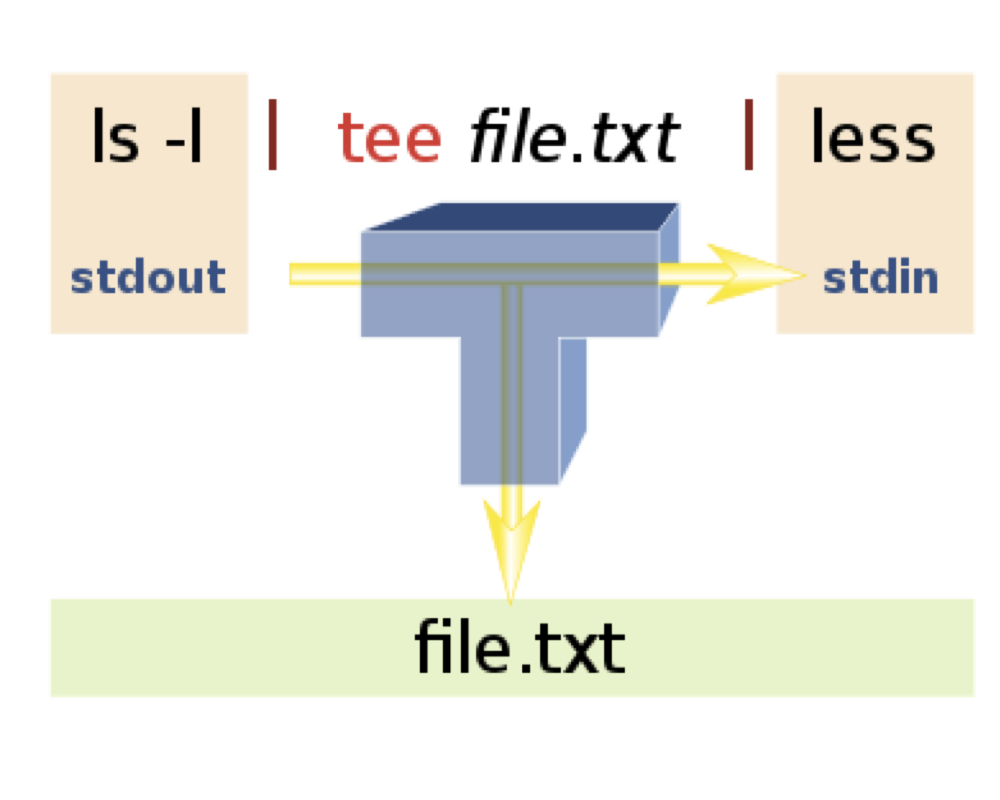
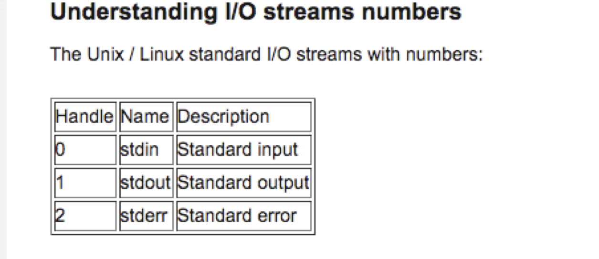

# Last time
* Preprocessed files with `fastx` \
* Built `bowtie` and `bowtie2` indicies for reference genomes \
* aligned `fastq` files \

# Creating log files
**Saving Standard Output and Standard Error as a log file.**\
It can be useful to document what some of the information that bowtie and other programs (e.g verbose output from `fastx` tools).  To do this, you can redirect the output (called `STDOUT`) to a file of your choosing using **tee**.


```{r out.width = "90%", echo=F, fig.align = "center", fig.cap="Tee schematic"}
#library(knitr)
 
```


Example:

```{r engine='bash', eval=T, echo=TRUE}
#create log file and send StdOut to it.
echo "This is a log entry" | tee log_file.txt 

#append future StdOut ot the same file
echo "This is the second log entry" | tee -a log_file.txt
```

Above is the Standard output to the screen.\
\
Let's check the log file:
```{r engine='bash', eval=T, echo=TRUE}
head log_file.txt
```

## In class exercise 1:  logging `bowtie` output:

**1)** Count the number of lines of all the `.fastq` files in you `data` directory and print the results to the log file `log_file_wc.txt`. \
**2)** Try mapping the data from test2.fastq and using `tee` to create a log file. \
**3)** View the resulting log file to confirm it worked. \


--------------------------------------------------------------------

# Important note regarding use of `tee`:

**Problem:** Sometimes not all output from running software is printed to the `tee` target file.\
**Reason:** `bowtie`, `fastqc`, and some other programs send the screen output through `standard error`, however `tee` accepts `standard output`.\
**Solution:**  When using `tee` combine it with another command to redirect `stderr` and `stdout` to the same (`stdout`):\

## Background

* These input/output (I/O) streams are also designated by numbers as shown in **Figure 2** below: 


```{r out.width = "90%", echo=F, fig.align = "center", fig.cap="I/O stream"}
#library(knitr)
 
```

* There is a nice, concise explanation and examples of redirecting I/O streams at [http://www.cyberciti.biz/faq/redirecting-stderr-to-stdout/](http://www.cyberciti.biz/faq/redirecting-stderr-to-stdout/).

* You can redirect both `stderr` and `stdout` to a file using:
```{r engine='bash', eval=F, echo=TRUE}
command >& file.out # sends to file, but does not print to screen
```

To use in combination with tee one can redirect the `stderr` to `stdout` for use with **tee**:

```{r engine='bash', eval=F, echo=TRUE}
touch file.log 

command 2>&1 | tee file.log # sends stderr to stdout, prints to screen and log file.
```

## In class exercise 2:  logging `bowtie` output with `stderr`:

**Rerun your `bowtie` command to allow the `stderr` to be printed to the log file and compare with exercise 1 output.**

## Getting organized and automated

### File organization
We will start to generate a large number of files.  This can cause congestion and confusion if your directories are not well organized.  **It is up to you** to come up with a logical organization of files. Here's some recommendations to start:

* **genomes** broken down by organism and then by build (version). Example: `~/genomes/hg19/` and `~/genomes/hg38/`\

* **data** can be broken down into raw and processed directories further split by data set.  Example: `~/data/raw/SRR1552484/` and `~/data/processed/SRR1552484/`\

* **annotations**: This could eventually contain genelists, with different subdirectories for various genomes and builds. Example: `~/annotations/hg19/hg_19_genes.txt` \

* **scripts**: have multiple subdirectories for different languages (e.g. shell,python, R) \

### Automation of processing

Example:
```{r engine='bash', eval=F, echo=TRUE}
fileList="file1.fq file2.fq"
# designate where raw data is
inPATH=~/data/raw/<data_folder_name>/ 
# designate where processed data goes
outPATH=~/data/processed/<data_folder_name>/
# designate genome to be used for mapping
genome=<path_to_genome_w_basename> 

for file in ${fileList}
    do
# making name prefix to append output suffix to
  	 prefix=`echo ${file} | cut -d "." -f 1` 
#print to screen for script update and name confirmation
       	 echo running script on $prefix
	 fastx_clipper -a <sequence> -i ${inPATH}${file} ${outPATH}${prefix}_clip.fq
	 bowtie2 -t -x ${genome} -U ${outPATH}${prefix}_clip.fq -S ${outPATH}${prefix}.sam 
done 2>&1 | tee ${outPATH}log_${prefix}.txt
#sent stdout and sterr to log file with tee
```

**Note:** You can make the output subdirectories before starting, or you can have the script make them on the fly. To make them on the fly you can borrow the lines from the following script to do this:
```{r engine='bash', eval=F, echo=TRUE}

# If working directory does not exist, create it
# The -p means "create parent directories as needed"
if [ ! -d "$outPATH" ]; then
mkdir -p $outPATH
fi

```

**Note: creating permanent variables in your `.bash_profile`** \
You can create permanant variables for commonly used directories such as `inPATH`, `outPATH`, `annotations`, etc. by defining these variables in your `.bash_profile`.  I don't do this, but some might prefer it.


## In class exercise 3: Automation of data processing and genome alignment

Use the the SRR039637.fastq.gz file from last time (test1.fastq) in addition to the last 1000000 lines (`tail`) of the same input data to create `test1_tail.fastq`.  Use the previous exercise commands as the base for a shell script that processes and maps the data.  Try using a loop and PATH/FILE variables to automate the processing as in the example above. Use `tee` to save the stderr and stdout to a log file.

    

## Sequence filtering: Using `bowtie` to filter out reads or save unaligned data 

There is one useful bowtie option for filtering out unwanted sequences. For instance, say I wanted to remove the reads that map to the rDNA before mapping to the genome.  I could map to the rDNA genome and use the **--un** option to report reads that don't align to a fastq file.  I could then map those unaligned reads to the genome.  Here's an example workflow:
```{r engine='bash', eval=F, echo=TRUE}

#first map to 'genome' of sequences to remove - save the unaligned reads
#indexed rDNA genome
rDNA=/home/FCAM/meds5420/usr17/genomes/human_rDNA

bowtie -p 2 $rDNA <raw_data>.fastq --un rDNA_unalign.fastq -S rDNA_align.sam

#indexed hg38
hg_bt=~/../genomes/hg38_bt/hg38
#Next, map the unaligned (filtered reads) to desired genome
bowtie -p2 -v 2 -m 1 -t $hg_bt rDNA_unalign.fastq -S hg_align.sam
 
```

# Review and mapping of data for ChIP-seq analysis:

## Review of `bowtie` and `bowtie2` and mapping options

In order for the output to be a proper `.sam` file use the `-S` option to explicitly say that you want a `.sam` output. This is required for `bowtie2`, and ensures that the header is included in the `.sam` file which is important for downstream steps (see next lesson).


For the next part of the course we will be working with a ChIP-seq dataset from human cells.  The factor that was IP'ed was ATF1 (SRR5331338). The `fastq` file for the experiment and control (Input SRR5331584) is here:\
`/home/FCAM/meds5420/data/ATF1/fastq/`
\

It may take a while to map the data, but please map the data before February 27th.  Here's the commands I used.

```{r engine='bash', eval=F, echo=TRUE}
#request 2 CPUs and 4G of RAM
srun --pty -p mcbstudent --qos=mcbstudent --mem=4G -c 2 bash

#Set a variable where my genome is 
hgGen=/home/FCAM/meds5420/genomes/hg38_bt2/hg38
#set variable to where raw data
atfRaw=/home/FCAM/meds5420/data/ATF1/fastq/
#set variable to where i want output fq to go
atfFq=/home/FCAM/meds5420/data/ATF1/fastq/
#set variable to where i want output sam to go
atfSam=/home/FCAM/meds5420/usr17/proceed_chip/

mkdir data
cd data 
mkdir ATF1
cd ATF1
mkdir fastq
mkdir sam

#move 10million reads to a new file, omit the first million
zcat ${atfRaw}SRR5331338_ATF1_ChIP.fastq.gz | head -44000000 |tail -40000000 > ${atfFq}ATF1_chip_10m_230220.fastq

#load bowtie2 module and run 
module load bowtie2

bowtie2 -p2 -t -x $hgGen -U ${atfFq}ATF1_chip_10m_230220.fastq -S ${atfSam}ATF1_10m_align_230220.sam 2>&1 | tee ${atfSam}ATF1_chip_10m_230220_alignment_log.txt

##LOOK at manual for options description.

OR

module load bowtie
hg_bt="/home/FCAM/meds5420/genomes/hg38_bt/hg38"

bowtie -p4 -v2 -m1 $hg_bt ${atfFq}ATF1_chip_10m_230220.fastq  -S ${atfSam}ATF1_10m_bt1_align_230220.sam 2>&1 | tee ${atfSam}ATF1_chip_10m_230220_alignment_bt1_log.txt
# Order is: options, genome, reads-to-map, outfilename (can be designated with -S)
```


**Notes (take note and let me know if you have questions!):**

* The beginning of this command skips the first million reads because they are often the most prone to errors due to technical artifacts of sequencing.\
* setting long paths to variables can help declutter command lines.
* The names of all the output files are messy and inconsistent (`ATF1_chip_10m_220223` and `ATF1_10m_align_220223`). I should have set a variable such as 'prefix' and appended `.sam` and `_alignment_log.txt` to the output. This would ensure that the basename of all the files is the same and I can repurpose this script to process any file in a consistent manner. 
* I made all the directories manually, but I should have checked for the presence of the directory using an if statement and only made the directory if needed. What does the `-p` option of `mkdir` specify?


\pagebreak

# Answers to in-class exercises

## In class exercise 1:  logging bowtie output:
**1)** Count the number of lines of all the `.fastq` files in you `data` directory and print the results to the log file `log_file_wc.txt`. \
**2)** Try mapping the data from test2.fastq and using `tee` to create a log file. \
**3)** View the resulting log file to confirm it worked. \

```{r engine='bash', eval=F, echo=TRUE}
wc -l *fastq | tee -a log_file_wc.txt
cat log_file_wc.txt
#redirect standard error to standard out and pipe to Tee
hg_bt="/home/FCAM/meds5420/genomes/hg38_bt/hg38"

bowtie -p1 -m1 -v2 -x $hg_bt test2.fastq -S test2_align.sam | tee -a test2_log.txt
cat test2_log.txt

```


## In class exercise 2:  logging `bowtie` output with `stderr`:

**Rerun your `bowtie` command to allow the `stderr` to be printed to the log file and compare with exercise 1 output.**


```{r engine='bash', eval=F, echo=TRUE}
#it did not work because bowtie prints to stderr

bowtie -p1 -m1 -v2 -x $hg_bt test2.fastq -S test2_align.sam 2>&1 | tee -a test2_log2.txt

head test2_log2.txt
```


## In class exercise 3: Automation of data processing and genome alignment

```{r engine='bash', eval=F, echo=TRUE}

zcat SRR039637.fastq.gz | tail -1000000 > test1_tail.fastq
```


```{r engine='bash', eval=F, echo=TRUE}
fileList="test1.fastq test1_tail.fastq"
# designate where raw data is
inPATH=~/data/in_class/fastq/
# designate where processed data goes
outPATH=~/data/in_class/aligned/
# designate genome to be used for mapping
genome="/home/FCAM/meds5420/genomes/hg38_bt/hg38"
#experiment name
exp_name=test_alignment
####END USER INPUT#####

if [ ! -d "$outPATH" ]; then
mkdir -p $outPATH
fi

for file in ${fileList}
do
# making name prefix to append output suffix to
	prefix=`echo ${file} | cut -d "." -f 1` 

#print to screen for script update and name confirmation
	echo running script on $prefix

# perform trimming
	fastq_quality_trimmer -Q 33 -t 35 -l 25 -i ${inPATH}${file} -o  ${outPATH}${prefix}_trim.fastq

# Map original and trimmed data
	bowtie -t -v2 -m1 -x ${genome} ${inPATH}${prefix}.fastq -S ${outPATH}${prefix}.sam 
	bowtie -t -v2 -m1 -x ${genome} ${outPATH}${prefix}_trim.fastq -S ${outPATH}${prefix}_trim.sam 
done 2>&1 | tee ${outPATH}log_${test_alignment}.txt

#sent stdout and sterr to log file with tee
```


