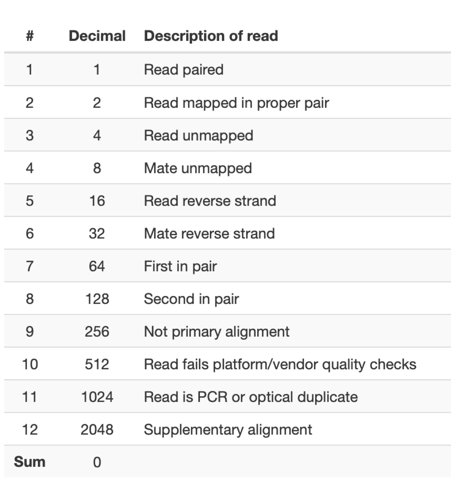
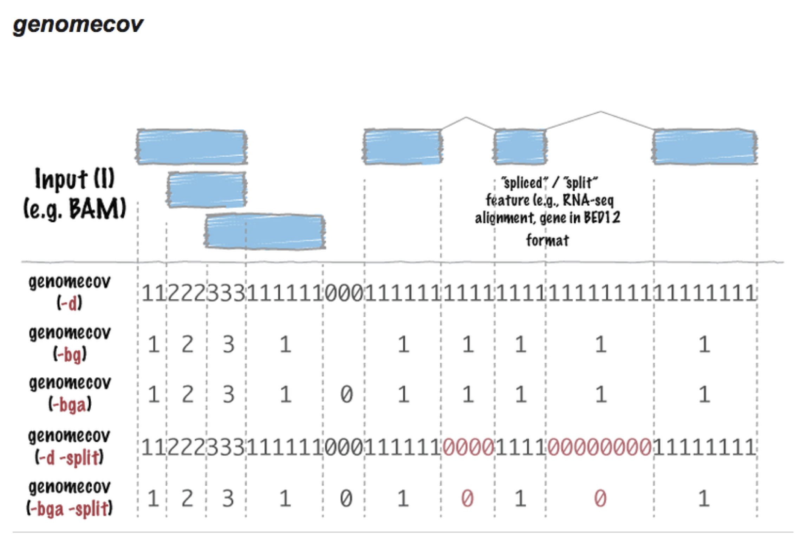
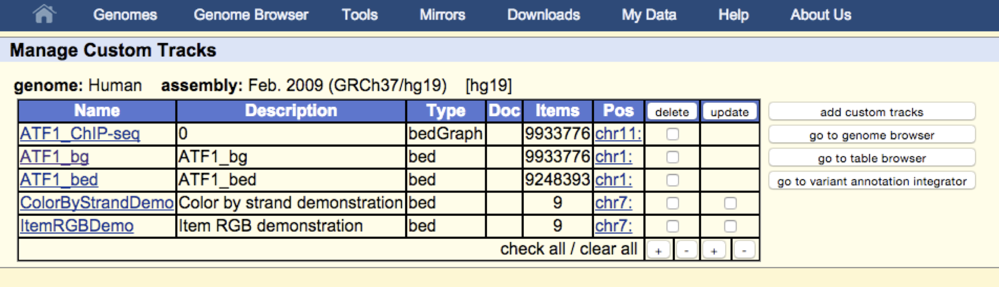

# Review and mapping of data for ChIP-seq analysis:

## Review of `bowtie` and `bowtie2` and mapping options

In order for the output to be a proper `.sam` file use the `-S` option to explicitly say that you want a `.sam` output. This is required for `bowtie2`, and ensures that the header is included in the `.sam` file which is important for downstream steps (today's lesson).

For the next part of the course we will be working with a ChIP-seq dataset from human cells.  The factor that was IP'ed was ATF1 (SRR5331338). The `fastq` file for the experiment and control (Input SRR5331584) is here:\
`/home/FCAM/meds5420/data/ATF1/fastq/`
\

It may take a while for us all to map the data, so I did it already.  Here's the commands I used.

```{r engine='bash', eval=F, echo=TRUE}
#request 2 CPUs and 4G of RAM
srun --pty -p mcbstudent --qos=mcbstudent --mem=4G -c 2 bash

#Set a variable where my genome is 
hgGen=/home/FCAM/meds5420/genomes/hg38_bt2/hg38
#set variable to where raw data
atfRaw=/home/FCAM/meds5420/data/ATF1/fastq/
#set variable to where i want output fq to go
atfFq=/home/FCAM/meds5420/data/ATF1/fastq/
#set variable to where i want output sam to go
atfSam=/home/FCAM/meds5420/data/ATF1/sam/

mkdir data
cd data 
mkdir ATF1
cd ATF1
mkdir fastq
mkdir sam

#move 10million reads to a new file, omit the first million
zcat ${atfRaw}SRR5331338_ATF1_ChIP.fastq.gz | head -44000000 |tail -40000000 > ${atfFq}ATF1_chip_10m_240219.fastq

#load bowtie module and run Bowtie
module load bowtie2

bowtie2 -p2 -t -x $hgGen -U ${atfFq}ATF1_chip_10m_240219.fastq -S ${atfSam}ATF1_chip_10m_240219.sam 2>&1 | tee ${atfSam}ATF1_chip_10m_240219_alignment_log.txt

##LOOK at manual for options description.

OR

module load bowtie
hg_bt="/home/FCAM/meds5420/genomes/hg38_bt/hg38"

bowtie -p4 -v2 -m1 -x $hg_bt ${atfFq}ATF1_chip_10m_240219.fastq  -S ${atfSam}ATF1_10m_bt1_align_240219.sam 2>&1 | tee ${atfSam}ATF1_chip_10m_240219_alignment_bt1_log.txt
# Order is options, genome, reads-to-map, outfilename (can be designated with -S)
```


**Notes (take note and let me know if you have questions!):**

* The beginning of this command skips the first million reads because they are often the most prone to errors due to technical artifacts of sequencing.\
* setting long paths to variables can help declutter command lines.
* The names of all the output files are messy and inconsistent (`ATF1_chip_10m_240219` and `ATF1_chip_10m_240219_alignment`). I should set a variable such as 'prefix' and appended `.sam`' and `_alignment_log.txt` to the output. This would ensure that the basename of all the files is the same and I can repurpose this script to process any file in a consistent manner. 
* I made all the directories manually, but I should have checked for the presence of the directory using an if statement and only made the directory if needed. What does the `-p` option of `mkdir` specify?

# Overview through today:

```{r  out.width = "100%", echo=F, fig.align = "center", fig.cap="post processing flow"}
#library(knitr)
knitr::include_graphics("./Post_processing.png") 
```

# Today: Post-processing and viewing data in UCSC genome browser.
Today we will conduct basic steps in processing data after genome alignment.  We will convert the data into a format that is compatible for viewing in the UCSC genome browser and for downstream analyses.

# The Sequence Alignment/Map Format (.sam) 
The most common output format from `bowtie` and other aligners is the SAM format.  SAM format allows for storing a wealth of information about the sequence alignment in a single line of text.  The format is a mix of human-readable and computer-readable information.
More information can be found in the publication:\ [http://www.ncbi.nlm.nih.gov/pmc/articles/PMC2723002/pdf/btp352.pdf](http://www.ncbi.nlm.nih.gov/pmc/articles/PMC2723002/pdf/btp352.pdf), and in the manual:\
[http://samtools.github.io/hts-specs/SAMv1.pdf](http://samtools.github.io/hts-specs/SAMv1.pdf).
\

**Notes:**  

* Unless specified during your alignment, SAM files will contain all the reads from your alignment, regardless of whether or not they aligned properly to the genome.\
* SAM files start with several header lines beginning with the `@` symbol.  There is an option in bowtie to omit these lines from the output if so desired.\
* The actual SAM format has eleven columns, and their contents are listed below in this excerpt from the manual.


```{r  out.width = "100%", echo=F, fig.align = "center", fig.cap=".sam format"}
#library(knitr)
knitr::include_graphics("./SAM_spec.png") 
```


------------------------------
There is a lot of information here, but for most analytical purposes, we can use four pieces of information contained in 4 columns.  These columns are:

* FLAG (col 2) - Specifies whether or not the read aligned, and specifies the strand. \
* RNAME (col 3) - Reference genome chromosome where the read aligned. \
* POS (col 4) - Location in RNAME where the read aligned. \
* mapQ (col 5) - Quality of match to the genome (repetitive seqs have low scores). \

**Interpreting the FLAG:**\
There are also several types of information in the FLAG.  For simplicity, we only need to worry about three FLAGs: \

* 4 - read did not align to the reference. \
* 16 - read aligned to the reverse strand of the reference. \
* 0 - aligned to the reference and mapped to the forward strand .

```{r  out.width = "100%", echo=F, fig.align = "center", fig.cap=".sam FLAGs"}
#library(knitr)
 
```


If you do get a flag that you don't understand, you can get the interpretation of it at this  website:\
[https://broadinstitute.github.io/picard/explain-flags.html](https://broadinstitute.github.io/picard/explain-flags.html).\
\
In addition to the above information the **CIGAR string** (6th column) can also be useful.  This line gives information about the nature of the alignment.  (i.e. which bases matched the reference and where in the read there are any mismatches, insertions or deletions). The link below shows a decent example of how the CIGAR string relates to the alignment.\
\
SAM / CIGAR string example: [http://genome.sph.umich.edu/wiki/SAM](http://genome.sph.umich.edu/wiki/SAM)

# Manipulating SAM/BAM files: `samtools` and `bedtools`

## Creating `.bam` files with `samtools`.
[SamTools](http://www.htslib.org/doc/samtools-1.2.html) is a set of utilities for manipulating SAM files.  Compared to other sets of Utilities (e.g. `bedtools`), Samtools is somewhat limited.  However, it is important that you know that it exists, and we will use it for at least one task - converting to **binary sam format (BAM)**.

The `.bam` format is simply a binary version of your .sam file.  This allows the file to be read faster by your computer, but it is not human readable.  Try viewing the head of a `.bam` file and you can see that the file structure is lost to human eyes. Several downstream utilities can use `.bam` files as input, making this a useful step in post-processing.\
The command is the `samtools view`, with the following usage:

```{r engine='bash', eval=F, echo=TRUE}
module load samtools

samtools view -S -b infile.sam > outfile.bam 
# -S auto-detects input format, -b specifies bam output.
```
**Note about `samtool`s usage**:
All results are reported to standard output (i.e. to the screen). This means you have to use the `>` when specifying the output file.  This is useful because it also means that we can use pipes ('|'), to string together multiple samtools commands

## `bedtools` utilities for manipulating files and performing genomic operations.
[Bedtools](http://bedtools.readthedocs.org/en/latest/content/overview.html), is a powerful 'swiss-army knife' (self-proclaimed) set of utilities that allows simple and complex operations to be done with minimal effort by the user.  Here are some useful operations that can be performed with `bedtools`:

* `bamtobed` - convert .bam file to .bed file \
* `bamtofastq` - convert .bam back to .fastq \
* `bedtobam` - convert .bed back to .bam \
* `closest` - find the closest region in one file to locations in another file \
* `genomecov` - compute bases covered by reads in genome \
* `getfastq` - extract sequence regions out of a fasta sequence file \
* `intersect` - get overlapping interval from various files \
* `merge` - merge overlapping intervals of two files \
* `random` - select random lines from a file \

Today we will use `bedtools` to convert our `.bam` file to a `.bed` file and another type of file (`.bedGraph`) for viewing in the genome browser.

**bamtobed usage:**
```{r engine='bash', eval=F, echo=TRUE}
module load bedtools

bedtools bamtobed -i infile.bam > outfile.bed # see note 
```

**Note about Bedtools usage**:
As with `samtools`, all results are reported to standard output (i.e. to the screen). This means you have to use the `>` when specifying the output file.  

## Introduction to BED format (.bed).
Bed format (*B*rowser *E*xtensible *D*ata), is a file format developed for displaying genomic data on genome browsers. You can displaying both data and annotations with bedfiles. See the UCSC genome browser for a detailed description of the [.bed format](http://genome.ucsc.edu/FAQ/FAQformat.html#format1).  There is some critical data needed for displaying data in the browser, while other types of info are optional. Here are the column specifications for each feature:


**1.** chrom - chromosome \
**2.** start - where item starts in the chromosome\
**3.** end - where item ends on the chromosome\
**4.** name (optional) - name (e.g. gene name) of item\
**5.** score (optional) - number from 1-1000 that specifies shading of the item (higher number = darker)\
**6.** strand (optional) - the strand the feature aligns to\
**7.** thickStart\
**8.** thickStart\
**9.** itemRGB\
**10.** blockCount\
**11.** blockSizes\
**12.** blockStarts\

Specific information about bed files accepted as input to bedtools can be found here:\ [http://bedtools.readthedocs.org/en/latest/content/general-usage.html](http://bedtools.readthedocs.org/en/latest/content/general-usage.html).

Here's an example of a simple bedfile:

```{r engine='bash', eval=T, echo=TRUE}
head -5 ATF1_ChIP_10mil.bed
```

Before moving forward, you must sort the bedfile for both viewing in the genome browser and for any future operations with Bedtools.  Bedtools has a sort function called **sortBed** with the following usage:

```{r engine='bash', eval=F, echo=TRUE}
sortBed -i infile.bed > infile_sorted.bed
```
From an earlier lesson, you can also use the **sort** shell command as follows:

```{r engine='bash', eval=F, echo=TRUE}
sort -k1,1 -k2,2n infile.bed > infile_sorted.bed
```
Now look at the sorted file:
```{r engine='bash', eval=T, echo=TRUE}
head ATF1_ChIP_10mil_sorted.bed
```
## Creating `bedGraphs` for viewing in the browser

BED files as we made them have a unique line or entry for every read in your data. This provides a detailed view of the data.  However, when working with large datasets, in can be an inefficient and cumbersome way to display data in the browser. `bedGraphs` are another way of displaying data in the browser. Instead of showing a line per read in the file (as in a .bed file), bases with data are shown with with the number of reads covering that base shown in a separate column.  When possible, `.bedGraph` files are often more efficient than using `.bed` files for two reasons.  

* First, the files sizes are smaller making them easier to upload. \
* Second, the data takes up less space in the browser making it easier to view, especially when multiple data sets are being shown at once.\

```{r  out.width = "100%", echo=F, fig.align = "center", fig.cap="Bed vs Bedgraph"}
#library(knitr)
knitr::include_graphics("./bed_v_bg.png") 
```

The bedtool utility `genomecov` can be used to create a `.bedGraph` from a sorted `.bed` file. `bedtools` developers provide a handy diagram about how different options handle the data:


```{r  out.width = "100%", echo=F, fig.align = "center", fig.cap="bedtools: genomecov"}
#library(knitr)
 
```

For a basic `bedGraph` use the following format:

```{r engine='bash', eval=F, echo=TRUE}
bedtools genomecov -bg -i infile.sorted.bed -g hg38.chrom.sizes > test.bedGraph 
# bg specifies bedgraph
#-g option is required and points to a chromosome Info file.
```
The `hg38.chrom.sizes` file is a file that specifies the chromsomes represented in the data and their lengths.\
It is located here: `/home/FCAM/meds5420/genomes/hg38.chrom.sizes`

See what the new file looks like:
```{r engine='bash', eval=T, echo=TRUE}
head ATF1_ChIP_10mil.bedGraph
```
More info on bedgraph format specifications can be found [here](http://genome.ucsc.edu/goldenPath/help/bedgraph.html).

# In class exercise 1: Processing ChIP-seq data
Mapping and post-processing of ChIP-seq data for viewing in the genome browser as a .bed and .bedGraph file. \
- The data is from a ChIP-seq experiment for the transcription factor, ATF1, in human cells. \
- The file names are: `SRR5331338_ATF1_ChIP.fastq.gz` and `SRR5331584_Control_Input.fastq.gz` and the files are in the `/home/FCAM/meds5420/data/ATF1/fastq` folder on the server. \
- Recall there is an indexed hg38 genome for bowtie2:\
`/home/FCAM/meds5420/genomes/hg38_bt2`
- there is a chromosome size file here : `/home/FCAM/meds5420/genomes/hg38.chrom.sizes`
\
 
**Map 10 million reads from each file to the genome with `bowtie2` or `bowtie` (this should be completed already):** \
**1.** use 4G of RAM and 4CPUs (you may have to log in again and request more memory and cores: `srun --pty -p mcbstudent --qos=mcbstudent --mem=4G -c 2 bash`) \
**2.** Before aligning the data, ignore the first 1,000,000 reads, use reads 1,000,001 - 11,000,000. \
**3.** specify `.sam` output in the alignment \
1-3 was completed already and the respective files are here: `/home/FCAM/meds5420/data/ATF1/sam/250226_*` \
**4.** Convert the output file to a `.bam` file (`samtools`) \
**5.** Convert the previous output file to a `.bed` file (`bedtools`) \
**6.** Sort the `bed` file \
**7.** Convert the file to a `bedGraph` file (`bedtools`) - look at the manual online.  \
**8.** Create a variation `bedGraph`: \ 
A `bedGraph` file that computes coverage for only the 5' end of the read.\


# Adding browser and tracklines to browser files
Track lines allow you to specify what data is being displayed and how to display it.  Browser lines also allow you to specific where in the genome viewing will begin.  There is more information from the browser on track Lines here:\
[http://genome.ucsc.edu/goldenpath/help/customTrack.html#TRACK](http://genome.ucsc.edu/goldenpath/help/customTrack.html#TRACK) \
There is an option in the `genomecov` program that allows you to do this, but these can be added easily with **awk** as well.

## For the commands below, you must specify the following (track name, description, infile, outfile (or use infile with new suffix as below).

Adding tracklines to `.bedGraph` files:
```{r engine='bash', eval=F, echo=TRUE}
#UCSC tracklines for bedgraph
awk 'BEGIN {  print "browser position chr11:5,289,521-5,291,937";
              print "track type=bedGraph name=\"NAME_bedgraph\" description=\"NAME_bedgraph\"  visibility=full autoScale=on alwaysZero=on color=0,125,0 windowingFunction=maximum"} 
           {  print $0}' INFILE.bedgraph > INFILE_header.bedgraph
```

Here's another one for a `.bed` file that colors by strand:
```{r engine='bash', eval=F, echo=TRUE}
#UCSC tracklines for bed file
awk 'BEGIN {  print "browser position chr11:5,289,521-5,291,937";
              print "track type=bed name=\"NAME_bed\" description=\"NAME_bed\"  visibility=squish autoScale=on colorByStrand=\"255,0,0 0,0,255\""} 
           {  print $0}' INFILE.bed > INFILE_header.bed

```
These awk commands are on the server in the following location:\ `/home/FCAM/meds5420/scripts/addTrackLine_awk.txt`\
I would stash these commands in your `awk_one_liner` file if you have one. \

Let's turn this into a shell script.  However, there is one tip in `awk` that we need to revisit to make this possible: \

## Escaping quotes in `awk`
Consider the following situation where you want to introduce a variable within a line of printed text.  The text must be wrapped in quotes, therfore you try this:

```{r engine='bash', eval=T, echo=TRUE}
#create variable
var=ChIP-seq

#pass variable to awk in quoted text
echo $var | awk -v var="$var" '{print "This is my track with var data"}'
```

One can **escape** these quotes to print the variable by adding a second set of quotes. Recall that the variable has to be outside of a double quote or it will be interpreted literally and not as a variable.
```{r engine='bash', eval=T, echo=TRUE}
#create variable
var=ChIP-seq

#pass variable to awk AND quote it inside quoted text
echo $var | awk -v var="$var" '{print "This is my track with " var " data"}'
```

What if we want to add real quotes to a printed line in `awk`?  Add a backslash `\` inside of quotes to prevent `awk` from interpreting it.  Stated differently: when we want `awk` to print a `"` string, we must precede the quote with a `\` character. The `\"` is printed as a `"`.

```{r engine='bash', eval=T, echo=TRUE}
#create variable
var=ChIP-seq

#pass variable to awk with quotes and then use backslash for literal print of a quote.
echo $var | awk -v var="$var" '{print "This is my track with \""var"\" data"}'
```

Let's take everything we learned and convert this to a script with variables and name the file `addTrackLines.sh`:


```{r engine='bash', eval=F, echo=TRUE}
#!/bin/bash

# argument 1 is the descriptive name of the experiment
# argument 2 is the input bedGraph file without a header
# usage: add a header file to a headerless bedGraph file
# some of these header variables are hard coded, but can be passed as variables

name="$1"
outname=$(echo "$2" | cut -d "." -f 1) #use the base name in outfile

awk -v var="$name" 'BEGIN {  print "browser position chr11:5,289,521-5,291,937"; print "track type=bedGraph name=\"" var "\" description=\"" var "_bedGraph\" visibility=full autoScale=on alwaysZero=on color=0,125,0 windowingFunction=maximum"}  { print $0}' "$2" > ${outname}_header.bedGraph

```

The above script is complicated because of the excessive use of double quotes. However, one should only have to write a script like this once and only make minor modifications over time.


# Uploading to the browser
You can upload these data (`.bed` and `.bedGraph` files) as custom tracks on the browser.  Just go to 'custom tracks' -> 'add custom tracks' and follow instructions.  \

**Uploading Tips:**

- Do not reuse track names - they overwrite each other. \
- It is fastest to upload `.gzip`ped files. \
- multiple files with tracklines can be concatenated into one file, compressed, and uploaded as a single file. \


```{r  out.width = "100%", echo=F, fig.align = "center", fig.cap="UCSC genome browser"}
#library(knitr)
knitr::include_graphics("./UCSC.png") 
```


```{r  out.width = "100%", echo=F, fig.align = "center", fig.cap="custom tracks view"}
#library(knitr)
 
```

# In class exercise 2: Upload data to browser

Starting with the `.bed` file and `.bedGraph` file you just created, do the following.
 \
- Add appropriate track lines to the head of the `.bed` and `.bedGraph` files. \
- `gzip` the files \
- Transfer from the server to your laptop \
- Upload the data onto the UCSC genome browser \


\pagebreak

# Answers to in-class exercises

## In class exercise 1: processing ChIP-seq data
Mapping and post-processing of ChIP-seq data for viewing in the genome browser as a .bed and .bedgraph file.
The data is from a ChIP-seq experiment for the transcription factor, ATF1, in human cells.  The file names are: `ATF1_chip_10m.fastq.gz` and `ATF1_input_10m.fastq.gz` and the files are in the `/home/FCAM/meds5420/data/ATF1/fastq/` folder on the server.


* Map the data to the genome with Bowtie: \ 
	- use up to 4 CPUs
	- allow two mismatches (only if using the original Bowtie)
	- only report unique sequences (only if using the original Bowtie)
	- specify .sam output
* Convert the file to a .bam file (samtools)
* Convert the file to a .bed file (bedtools)
* Sort the bedfile
* Convert the file to a bedgraph file (bedtools) - look at the manual online: 
      try creating various bedGraphs: \
      1. One that computes the coverage for entire read.\
      2. One that computes coverage for only the 5' end of the read.\
      3. One that computes coverage at every base, but omits bases with zero coverage.\

```{r engine='bash', eval=F, echo=TRUE}
#Map the data (answers to Bowtie 1)
bowtie -p4 -m1 -v2 -S -x /home/FCAM/meds5420/genomes/hg38_bt/hg38_bt
/home/FCAM/meds5420/data/ATF1/fastq/ATF1_chip_10m.fastq ATF1_chip_10m.sam

bowtie -p4 -m1 -v2 -S -x /home/FCAM/meds5420/genomes/hg38_bt/hg38_bt
/home/FCAM/meds5420/data/ATF1/fastq/ATF1_input_10m.fastq ATF1_input_10m.sam

# what I asked bowtie2
hgGen=/home/FCAM/meds5420/genomes/hg38_bt2/hg38
bowtie2 -p4 -t -x $hgGen -U /home/FCAM/meds5420/data/ATF1/fastq/ATF1_chip_10m.fastq -S ATF1_chip_10m.sam 
bowtie2 -p4 -t -x $hgGen -U /home/FCAM/meds5420/data/ATF1/fastq/ATF1_input_10m.fastq -S ATF1_input_10m.sam 


#convert to .bam
samtools view -Sb ATF1_chip_10m.sam > ATF1_chip_10m.bam
samtools view -Sb ATF1_input_10m.sam > ATF1_input_10m.bam

#convert to .bed
bedtools bamtobed ATF1_chip_10m.bam > ATF1_chip_10m.bed
bedtools bamtobed ATF1_input_10m.bam > ATF1_input_10m.bed


#sort the bed
sort -k1,1 -k2,2n ATF1_chip_10m.bed > ATF1_chip_10m_sorted.bed
sort -k1,1 -k2,2n ATF1_input_10m.bed > ATF1_input_10m_sorted.bed


# bedgraph: hg38.chrom.sizes file is at /home/FCAM/meds5420/genomes/
bedtools genomecov -bg -i ATF1_chip_10m_sorted.bed -g /home/FCAM/meds5420/genomes/hg38.chrom.sizes > ATF1_ChIP.bedGraph 

#report 5' end of read only
bedtools genomecov -bg -5 -i ATF1_chip_10m_sorted.bed -g hg38.chrom.sizes > ATF1_ChIP_5prime.bedGraph 


```

## In class exercise 2: upload to browser 
1) Use the `addTrackLines.sh` script we wrote in class to add the track lines.\
2) Use `scp` os `sftp` to copy the files to your computer.\

I will demonstrate in class.
