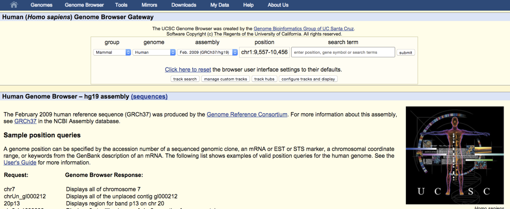
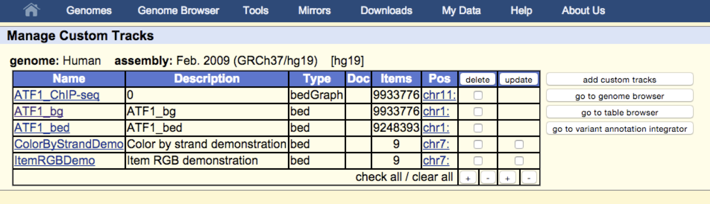

# Uploading to the browser
You can upload these data (`.bed` and `.bedGraph` files) as custom tracks on the browser.  Just go to 'custom tracks' -> 'add custom tracks' and follow instructions.  \

**Uploading Tips:**

- Do not reuse track names - they overwrite each other. \
- It is fastest to upload `.gzip`ped files. \
- multiple files with tracklines can be concatenated into one file, compressed, and uploaded as a single file. \


```{r  out.width = "100%", echo=F, fig.align = "center", fig.cap="UCSC genome browser"}
#library(knitr)
 
```


```{r  out.width = "100%", echo=F, fig.align = "center", fig.cap="custom tracks view"}
#library(knitr)
 
```

# In class exercise 1: Upload data to browser-follow along

Starting  with the `.bed` file and `.bedGraph` file you just created, do the following.
 \
- Add appropriate track lines to the head of the `.bed` and `.bedGraph` files. \
- `gzip` the files \
- Transfer from the server to your laptop \
- Upload the data onto the UCSC genome browser \


# Using the UCSC genome browser

Switch to PDF slides.

# In class exercise 2: Using the UCSC genome browser.

**1.** Find and download the chromosome information file `dm6.chrom.sizes` for the the drosophila genome version *dm6*. \
**2.** Use the Table Browser from UCSC to find and download the information for the Genecode genes release 39 (V39) (human genome: hg38). How many items are in the file?\
**3.** Take the lines 50-500 from your `.bed` file and lift them to the old version of the human genome (hg19). Are all entries found? Does this change the coordinates?\
**4.** Create an image for a screen shot figure from your ATF1 ChIP-seq data.  Find a peak and zoom in on a region ~ 5KB +/- your peak.  Configure your image as follows: \
**A.** Remove the vertical blue lines from view.\
**B.** Make the text at least size 14 font.\
**C.** Reduce the image width to 540 pixels.\
**D.** Change the track height for the bedgraph to 60 pixels.\
**E.** Arrange tracks such that the bedGraph data is below the .bed data. \
**F.** Hide some unrelated tracks: SNPs, conservation, repeat masker, etc.\
**G.** Attach the **track hub** from the Roadmap Epigenetics data.\
**H.** View and download the PDF image \
**5.** Share the link with your collaborator (pretend it is me) by saving your session and emailing me a link.  Include the .PDF you created in the email.\

**For answers and hints, see UCSC browser slides**


\pagebreak

# Answers to exercises:

## In class exercise 1: upload to browser 
1) Use the `addTrackLines.sh` script we wrote in class to add the track lines.\
2) Use `scp` os `sftp` to copy the files to your computer.\

I will demonstrate in class.

## In class exercise 2: 
**For answers and hints, see UCSC browser slides**
I will demonstrate in class


