# Review of analysis pipeline

```{r  out.width = "90%", echo=F, fig.align = "center", fig.cap="ChIP-seq analysis workflow"}
#library(knitr)
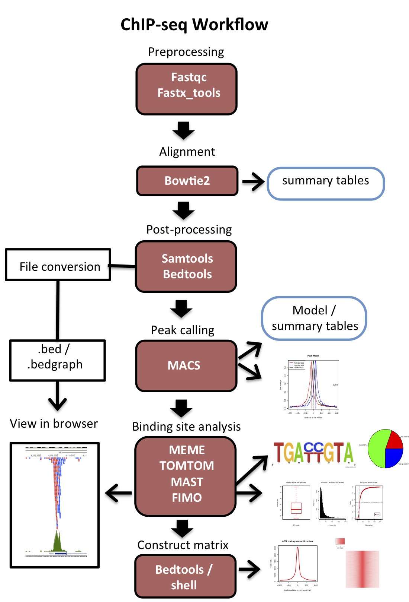 
```

# TODAY: de novo Motif searching with MEME

An important piece of information that can be gained from genomic binding data is the discovery of the underlying DNA motif that is bound by the transcription factor.  There are many tools out there that will allow you to discover motifs.  The **MEME** analysis suite is a popular and powerful set of tools that can allow you to perform several useful analyses on DNA sequences of interest, such as: \

* Identify (de novo) enriched motifs with a set of sequences.\
* Search for motifs of interest within a set of sequences.\
* Scan large databases (genomes) for instances of specified motifs.\
* Compare _de novo_ motifs to databases of known motifs.\


## MEME: Multiple Em for Motif Elucidation
MEME Website: [http://meme-suite.org/](http://meme-suite.org/) 
\

Several steps must be performed prior to MEME analysis.  Here is a summary list:\

**1.** Create `bed` file with peak locations to analyze.\
- Short windows around summits.\
- Only most intense peaks needed.\
**2.** retrieve DNA sequences from regions to analyze \
**3.** Create a background base frequency model (part of the MEME suite)\


MEME requires DNA sequences (in fasta format) of your regions of interest.  Long sequences can decrease accuracy and take a long time to search through, so it is best to choose narrow regions. When finding motifs within ChIP-seq peaks we can **use our peak summits to center our analysis** since most TFs will be found in the immediate vicinity of their peak summits. We can use `bedtools slop` to create small windows around our summits:

```{r  out.width = "90%", echo=F, fig.align = "center", fig.cap="bedSlop"}
#library(knitr)
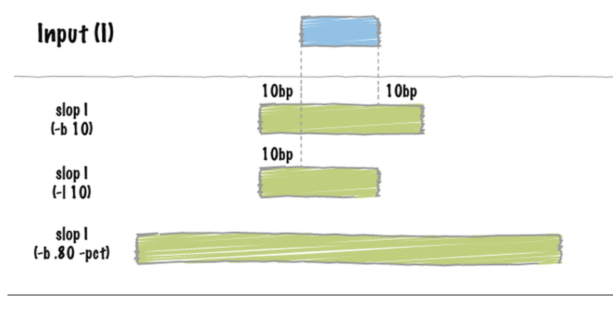 
```

Let's get 100bp window centered on peak summits (`/home/FCAM/meds5420/data/ATF1/ATF1_peaks/ATF1_summits.bed`) as follows (technically this is a 101 base window):
```{r engine='bash', eval=F, echo=TRUE}
bedtools slop -i SUMMITS.BED -g <chrom_sizes> -b 50 > SUMMITS_100bp.bed
#-g is chromosome sizes file 
#-b The number of basebairs to add to both sides
#-l The number of base pairs to subtract from the start coordinate
#-r The number of base pairs to add from the end coordinate
```

Another way to reduce time for running MEME and to increase accuracy is to run it on a subset of the most intense peaks. The peak intensity is in column 5 of the peak summits file. The summits .bed file can be sorted and parsed as follows:

```{r engine='bash', eval=F, echo=TRUE}
sort -n -r -k5 SUMMITS_100bp.bed | head -200 > SUMMITS_100bp_top200.bed 
# Performs numeric sort on column 5, reports it in 
# reverse (-r) order (descending) and outputs the first 200 to output file.
```

Next, we can use `bedtools getfasta` to get the sequence within the desired intervals and return them in fasta format. 

```{r engine='bash', eval=F, echo=TRUE}
fastaFromBed -fi GENOME.fa -bed SUMMITS_100bp.bed -fo SUMMITS_100bp.fa
#-name: Will use the 'name' column from bed file to name sequence
#-fi: Input fasta sequences to retrieve interval sequences from
#-bed: Input bed file
#-fo: Output fasta file
```

Fasta formatted genome sequences and the genome sizes file for this class can be found at:

`/home/FCAM/meds5420/genomes/` \
If you get the error: `could not open index file /home/FCAM/meds5420/genomes/hg38.fa.fai for writing!`, then just copy the file to your directory and operate directly on the local file.\


# Loading `meme`

On Xanadu you should load meme version 5.4.1 every time. I worked with the HPC staff to ensure that `meme/5.4.1` can be run with the `-p` option, which allows for parallelization. 


```{r engine='bash', eval=F, echo=TRUE}
module load meme/5.4.1
```

## Running `meme`
Now we can run MEME on the `.fasta` formatted sequences.

I recommend running the classic function for more sensitive and wider motifs, but it takes longer. I employ `-markov_order 3` in the command, which incorporates a background model on the fly using the file that specifies all k-mer frequencies up to the specified value. I typically just calculate it from the input file as opposed to random regions or the entire genome. 

```{r engine='bash', eval=F, echo=TRUE}
name=NAME_of EXPERIMENT
meme -oc ${name}.meme_output -objfun classic -evt 0.01 -searchsize 0 -minw 5 -maxw 18 -revcomp -dna -markov_order 3 -maxsize 100000000 SUMMITS_100bp.fa
```

There are a number of options to consider here:\

* `-oc`: Folder to create where files will be written.  Allows overwriting of previously made folders (use -o to disable this)\
* `-dna`: Tell MEME to interpret symbols as nucleic acids (as opposed to amino acids)\
* `-nmotifs`: number of motifs to search for\
* `-evt`: stop searching for motifs when a motif cannot be found with a samller e-value (if `nmotifs` and `evt` are invoked, then `evt` will supercede the `nmotifs` option) \ 
* `-minw`: minumum motif width in bases\
* `-maxw`: maximum motif width in bases\
* `-revcomp`: look for motif on both strands of DNA (do not assume strandedness)\
* `-objfun`: `classic` is a sensitive algorithm to detect motifs, but it can be slow\

* There are more options available.  See manual or [http://meme-suite.org/doc/meme.html?man_type=web](http://meme-suite.org/doc/meme.html?man_type=web).\

The following files are placed in the designated output folder:\

* `.xml` file of output (machine readable)\
* `.txt` file of output (human readable)\
* `.html` file of output browser viewable file of output\
* `.eps` file of sequence logo for motif(s).  Both forward and reverse complement\

The output file contains:\

* The found motifs \
* A list of the sequences with the motifs with associated significance of the motifs\
* A **P**osition **S**pecific **W**eight **M**atrix (PSWM) of the motif that can be used to generate the sequence logo as well as search for the motif in other sequences.\


## Finding occurences of motifs with MAST: Motif Alignment and Search Tool \

Given a motif position weight matrix, one can search other for sequences for the occurance of that motif.  For instance, finding a motif under a ChIP-seq peak with MEME does not mean that the motif is present at every binding site.  We can use MAST to determine the number of sequences or found binding sites that have a specific motif.  
\
For usage go here: [http://meme-suite.org/tools/mast](http://meme-suite.org/tools/mast) \
Click on manual bar on left and view command line version for `MAST`.

The basic usage is simple:
```{r engine='bash', eval=F, echo=TRUE}
mast MEME_output.txt SUMMITS_100bp.fa -oc mast_OUT_FOLDER
# The first file is the meme output with motifs that you want to search for
# The second file is the fasta formatted ChIP-seq regions we want to search for motifs within
# The third is the output folder as in MEME
```

The MAST output format is similar to `meme` and is placed in the designated output folder:\

* `.xml` file of output (machine readable)\
* `.txt` file of output (human readable)\
* `.html` file of output browser viewable file of output\

The output file contains the names of the sequences that have significant occurences of the motif.\

Using the `-hit_list` option in mast creates a list of matches in a more easily processible format.  However, this is sent to `stdout` and so must be redirected to a file.

```{r engine='bash', eval=F, echo=TRUE}
#sending hits list to file by redirect
mast MEME_output.txt -hit_list SUMMITS_100bp.fa > mast_hits.txt
```


## Scanning whole genomes for presence of motifs with FIMO: Find Individual Motif Occurrences
MAST is useful for determining if a sequence (or lists of them) have a specific motif.  FIMO, is good for finding **ALL** significant occurrences of a motif within a sequence (i.e. a whole chromosome or genome).  


You can then run FIMO to scan sequences for all occurrences of a motif. I usually set `--max-stored-scores` quite high and `--max-strand` provides the best match to identically overlapping sequences (only difference being the strand):

```{r engine='bash', eval=F, echo=TRUE}
fimo --max-strand --max-stored-scores 10000000 --oc fimo_OUT_FOLDER MEME_output.txt hg38.fa
```

This is a basic run, but there are several options one can implement:\ [http://meme-suite.org/doc/fimo.html?man_type=web](http://meme-suite.org/doc/fimo.html?man_type=web)

FIMO returns `.html`, `.gff3`, and `.tsv` (tab-separated values) files. I usually invoke the option `--text` and redirect (`>`) the `stdout` to a file name to create a text file output that contains a list of the motifs, their locations, and significance. \


Here is a run that I recently:

```{r engine='bash', eval=F, echo=TRUE}
fimo --max-strand --text --max-stored-scores 10000000 --oc fimo_atf1_out meme.txt hg38.fa > fimo_output.txt
```

After going through this workflow, there are a number of things one can do with these locations and bedtools.  \

* Determine the number of peaks with motifs - intersect peak file with `mast` output using `bedtools`.\
* List of motifs not within peaks - intersect peak file with `fimo` output using `bedtools`, choose non-overlapping.

```{r  out.width = "90%", echo=F, fig.align = "center", fig.cap="MAST vs FIMO"}
#library(knitr)
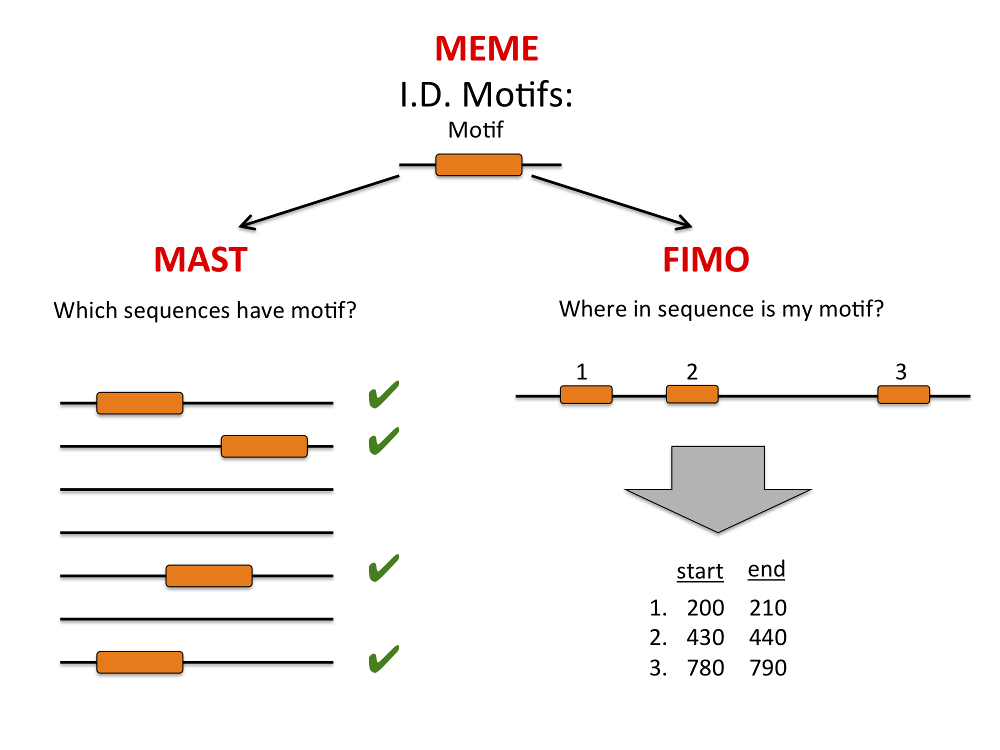 
```

## In class exercise 1:

Starting with the ChIP-seq summits file, try the following:  

* Use `bedtools` to prepare a fasta input file for meme that contains the sequences under peak summits. Use the ChIP-seq summits for the whole genome since your chromosome may not have enough peaks for the following analysis.  It can be found here:  `/home/FCAM/meds5420/data/ATF1/ATF1_peaks/ATF1_summits.bed` \
    - Use 101bp window centered on summit. \
    - Use only the top 500 peaks.\
    - Fasta formatted `hg38.fa` and chromosomes (needed later) can be found here: \
    `/home/FCAM/meds5420/genomes/`  and\
    `/home/FCAM/meds5420/genomes/chroms`
* Search for underlying motifs in the top 500 most intense peaks with MEME:\
	- Use MAST to map the identified motifs back to your peak sequences (use all peaks from your `narrowPeaks` file for this): \
	- Use FIMO to scan **your** chromosome for these motifs.\
	- Create `.tar` files from the output and `scp` or `sftp` the folders to your machine.  		
	- View the output `.html` files in the browser.  \
	- Use `bedtools` to assign motifs (from FIMO) as inside or outside of peaks.  Tip: Convert FIMO output to a `bed` file first.\
* Report the following:\
  - number of peaks on your chromosome \
  - number of peaks (summit -/+ 50bp) on your chromosome with motifs using MAST thresholds/motif calling\
  - number of FIMO motifs on your chromosome\
  - number of FIMO motifs in peaks for your chromosome\
* **If time permits:** Try running MEME with different conditions to see how the results change.\
    - change `-n`, `-maxw`, add `-zoops` or `-anr` options


## Exercise 1
```{r engine='bash', eval=F, echo=TRUE}
module load meme/5.4.1
module load bedtools

#Let's set a variable to the chromInfo file so we don't have to type it every time:
genome=/home/FCAM/meds5420/genomes/hg38.chrom.sizes 
peaks=/home/FCAM/meds5420/data/ATF1/ATF1_peaks/ATF1_summits.bed

mkdir in_class_lec14
cd in_class_lec14

#starting from your own ATF1/peaks directory make a window around the summits
slopBed -i $peaks -g $genome -b 50 > ATF1_summit_101bp.bed
# get the top 200 peaks
sort -k5nr ATF1_summit_101bp.bed | head -n 200 > ATF1_summit_101bp_top200.bed

#you will have to cp the hg38.fa file because an intermediate file is made
cp /home/FCAM/meds5420/genomes/hg38.fa ./

fastaFromBed -fi hg38.fa -bed ATF1_summit_101bp_top200.bed -fo ATF1_summit_101bp_top200.fasta

meme ATF1_summit_101bp_top200.fasta -oc meme_ATF1 -nmotifs 2 -objfun classic -searchsize 0 -minw 5 -maxw 10 -revcomp -dna -markov_order 3 -maxsize 10000000

#Now we must get the fasta sequence for all peaks in order to use MAST on them
fastaFromBed -fi hg38.fa -bed ATF1_summit_101bp.bed -fo ATF1_summit_101bp.fasta

# Now run MAST on them to ID peaks with the MEME motifs.  
# Check the manual for the options.

mast -hit_list meme_ATF1/meme.txt ATF1_summit_101bp.fasta > mast_ATF1_hits.txt

# To then run FIMO we should create a background file,

# Using our chromosome, which you can get from UCSC, or use hg38.fa
wget https://hgdownload.soe.ucsc.edu/goldenPath/hg38/bigZips/hg38.chromFa.tar.gz 
tar -xzf hg38.chromFa.tar.gz
cp /home/FCAM/meds5420/genomes/chroms/chr17.fa ./
# recall I put them here /home/FCAM/meds5420/genomes/chroms

fasta-get-markov -m 3 chr17.fa > chr17_bkgrnd.txt

#Next run FIMO with the background file, MEME output and your chr.fasta to search
fimo --text --max-strand --max-stored-scores 10000000 --bgfile chr17_bkgrnd.txt ./meme_ATF1/meme.txt chr17.fa > fimo_ATF1_chr17.txt

#Convert FIMO output to bed

awk '{OFS="\t";} NR>1 {print $3, $4, $5, $7, $8, $6}' fimo_ATF1_chr17.txt > fimo_ATF1_chr17.bed

#Intersect FIMO output with peaks
intersectBed -wo -a fimo_ATF1_chr17.bed -b ATF1_summit_101bp.bed -g $genome > ATF1_chr17_motifs_in_peaks.txt

# to get all the fimo output files, note the tsv files is nearly identical to the txt file above
fimo --max-strand --max-stored-scores 10000000 -oc fimo_ATF1 --bgfile chr17_bkgrnd.txt ./meme_ATF1/meme.txt chr17.fa 

# run meme with bfile on random intervals
randomBed -n 1000 -l 101 -g $genome > hg38_random_intervals.bed

fastaFromBed -fi hg38.fa -bed hg38_random_intervals.bed -fo hg38_random_intervals.fasta

fasta-get-markov -m 3 hg38_random_intervals.fasta > hg38_random_intervals_markov.txt
 
meme ATF1_summit_101bp_top200.fasta -oc meme_ATF1_bfile -nmotifs 2 -objfun classic -evt 0.01 -searchsize 0 -minw 5 -maxw 10 -revcomp -dna -bfile hg38_random_intervals_markov.txt -maxsize 10000000


Reporting:

#How many peaks are there on chr17?
grep -w chr17 ATF1_summit_101bp.bed > ATF1_chr17_peaks.bed
wc -l ATF1_chr17_peaks.bed

#What is the number of peaks (summit -/+ 50bp) on your chromosome with MAST called motifs:

grep "chr17:" mast_ATF1_hits.txt | cut -f1 -d " " | sort | uniq | wc -l 

#how many FIMO motifs on chr17:
cat fimo_ATF1/fimo.tsv | grep "#" -v | grep "motif_id" -v | wc -l 

#how many FIMO motifs in peaks?
wc -l ATF1_chr17_motifs_in_peaks.txt  

#How many unique peaks in FIMO overlap?
cat ATF1_chr17_motifs_in_peaks.txt | cut -f 10 | sort | uniq | wc -l 

# MAST and FIMO call motif instances a bit differently

```


## Overview of MACS workflow

```{r  out.width = "100%", echo=F, fig.align = "center", fig.cap="MACS workflow"}
#library(knitr)
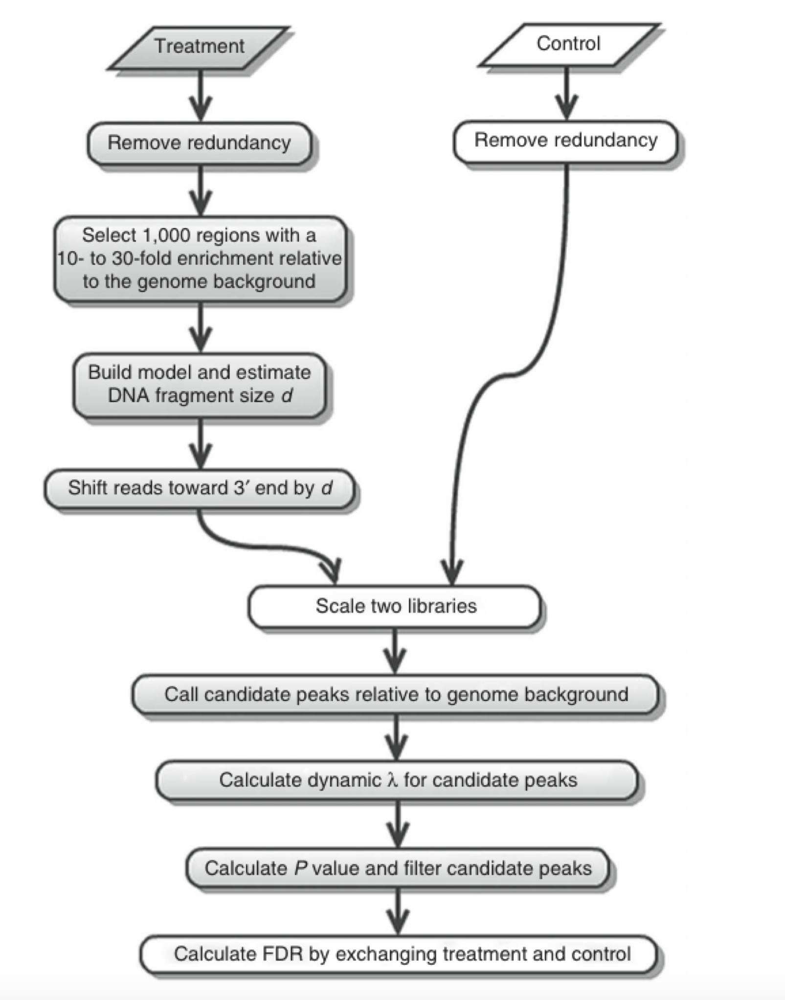 

```

## Narrow vs. Broad Peaks


```{r  out.width = "100%", echo=F, fig.align = "center", fig.cap="Read Structure in peaks"}
#library(knitr)
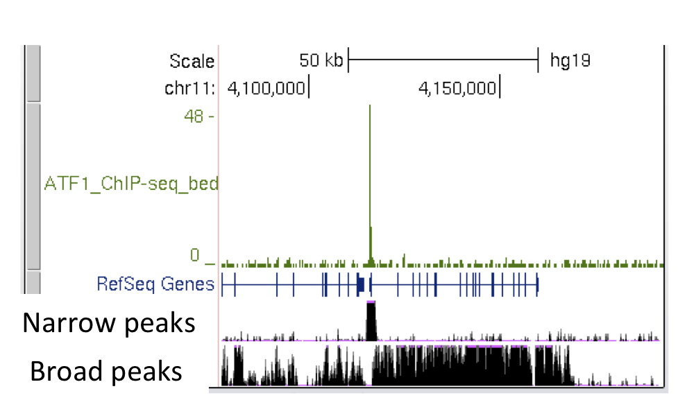 
```

We will focus on narrow peaks today.  Because of the nature of the assay, sequence reads from enriched regions will cluster into an expected structure. Since crosslinking of a factor occurs in a small region, all the signal of narrow peaks should span this region. These molecules are sequence randomly from either end in single end sequencing data (or both ends in pair end sequencing). Reads that align to the forward strand (red) are upstream of the peak, aligning to the reverse strand are downstream. The red and blue peaks are shifted by the average fragment size. \

```{r  out.width = "100%", echo=F, fig.align = "center", fig.cap="Read Structure in peaks"}
#library(knitr)
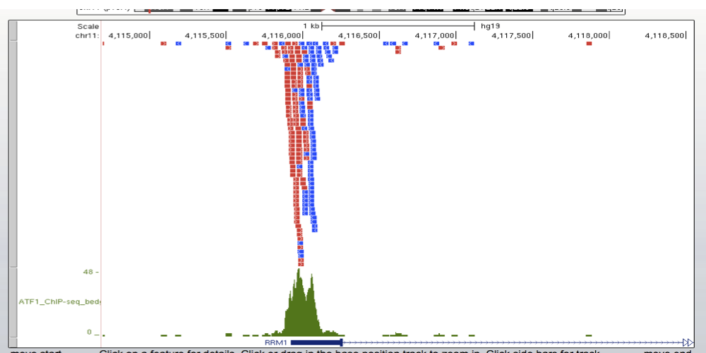 
```

## Resolution / Fragment size estimation:

MACS can identify this pattern and build a model of the fragment length with the following workflow:\
 * Scan the genome for regions enriched for aligned reads (10-30X) \
* Select 1000 random enriched regions \
* Separate reads into positive and negative strand \
* Identify peak summits (bimodal pattern around site) \
* Fragment length (d) = distance between summits. \
* Peak center = d/2 \


```{r  out.width = "100%", echo=F, fig.align = "center", fig.cap="Fragment size from MACS Model"}
#library(knitr)
knitr::include_graphics("./ATF1_macs_Model.png") 
```

This model is important for the accuracy of the binding site prediction and for searching for known or new binding site motifs under the peak. \

## Estimating enrichment / background

To call peaks, MACS uses both information from local background near enriched sites and data from a control or input sample that should not have peaks.
\

Local background can influence peak enrichment for a number of reasons all involving sample preparation: \

* Sonication bias (see below) \
* ligation bias \
* Gel purification \
* PCR / amplification bias \
* poor antibody specificity \

For example: The number of reads obtained in regions in the experimental and control samples is correlated.  This tells you that there is something inherent that locus that allows it to be isolated / enriched independently of your protein of interest (i.e. one of the biases mentioned above).


```{r  out.width = "100%", echo=F, fig.align = "center", fig.cap="correlation of input vs ChIP"}
#library(knitr)
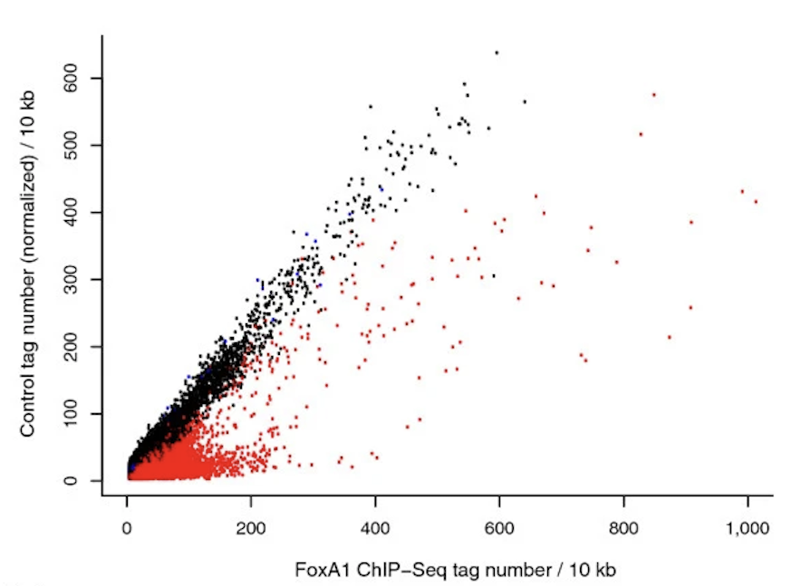 

```


Above, red dots are inside of called peaks, black dots are in control peaks.  \

Also, below is an example showing that Non-immunoprecipitatied DNA has 'structure'. This is from a technique called 'SONO-Seq' by [Auerbach et al. (2009)](http://www.pnas.org/content/106/35/14926.full.pdf+html).


```{r  out.width = "100%", echo=F, fig.align = "center", fig.cap="SONO-seq method (left) and data (right)."}
#library(knitr)
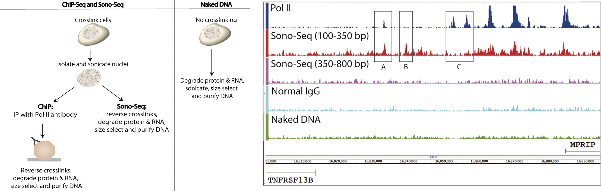 
```

Above, they sequenced sonicated chromatin without doing the IP and found that the shearing of chromatin is not random.  Breaks occurred more often in active promoter regions resulting in enrichment in those regions without IP.\
This is why the control sample is important.\
\

**Solutions:**

* Use the control sample to account for biases whatever their source. Why is input a substantially worse control than mock IP? \
* PCR biases are also removed by removing duplicate sequence reads.  Sometimes up to two of the same read is allowed (the default in MACS is to keep only one read from any location). \
* To ensure antibody specificity: \
    * One can knockdown the factor of interest, ChIP, and select for peaks that were depleted upon knockdown  \
    * One can ChIP with two different antibodies and choose only overlapping peaks \


## Using MACS3:
The basic usage for MACS3 is as follows:
```{r engine='bash', eval=F, echo=TRUE}

macs3 callpeak -t <TREATMENT>.bam -c <Input>.bam -f BAM -g GENOMESIZE -n <name_prefix> --outdir <peaks_folder> 2>&1 | tee -a ATF1_peaks_log.txt

#Don't forget to save terminal output (std error in this case) as a log file.
```

* `-t`: Specifies the experimental sample\
* `-c`: Control sample\
* `-n`: Prefix name for the output files\
* `-g`: genome size.  Can use integer (e.g. 2900000000) or scientific (e.g. 2.9e9). \ There are also a few shortcuts (`hs` = humans = 2.9e9).\

**Note:** if you want to keep duplicate reads you can use the `--keep-dup` option. This option followed by an interger or 'all' will keep that number or all duplicates respectively. I beleive the best practice is to perform paired-end sequencing, remove duplicates from the `bam` file and use `--keep-dup all`. Removing duplicates from a paired-end `bam` file necessitates that the paired-end 1 and paired-end 2 reads are identical between two sequencing read; this is very unlikely to happen independently and it predominantly due to PCR duplications. \

You can type `macs3 --help` and `macs3 callpeak -h` to get a list of other options and their descriptions.  \
You can also generate `bedGraph` files from MACS, but this takes a while and generates `bedGraph` data for every bp (also known as a `wiggle` format).  These files can be quite large when uploading to the genome, so I prefer to make `bedGraph` files of the data myself as we have previously in this class.

I ran the following: \
```{r, eval=F, echo=TRUE}
macs3 callpeak -t ATF_ChIP_10mil.bam -c Input_10mil.bam -f BAM -g hs -n ATF1 -B -q 0.01 --outdir atf_peaks 2>&1 | tee -a ATF1_peaks_log.txt
```
What does `-B` above specify? \

You will get the following output files from MACS3:

* `NAME_PREFIX_model.r`
* `NAME_PREFIX_peaks.narrowPeak`
* `NAME_PREFIX_summits.bed`
* `NAME_PREFIX_peaks.xls`

The model.r is a script written in `R` that will produce a nice .PDF figure of the fragment length model for your data.
You can run this script on the server or on your local machine with:
```{r, eval=F, echo=TRUE}
#first load R
module load R

Rscript NAME_PREFIX_model.r
```

The excel spreadsheets contain information about the datasets (total number of reads) and peak locations (reads in peaks and significance of peaks (FDR) for the experimental (`_peaks.xls`) and input (`_negative_peaks.xls`) samples.\
\
The _peaks.bed_ and _summits.bed_ are bed files that give the locations of enriched regions and their maximum, respectively.\
\
Have a look at the files:
**peaks bed file**
```{r engine='bash', eval=T, echo=TRUE}
head -4 ./ATF1_peaks.narrowPeak
```
In this format the 5th column (or score column) contains the transformed p-value (-10*log10[pVal]) for the signifcance of the peak.

**summits**
```{r engine='bash', eval=T, echo=TRUE}
head -4 ./ATF1_summits.bed
```
In this format the 5th column (or score column) contains the the number of reads that overlap with this peak summit.\
\
The above files are ready to be uploaded to the browser - you just need to add track lines.  The example in the next section below shows track line addition using `awk`.\


**peaks table with most information**
```{r engine='bash', eval=T, echo=TRUE}
head -5 ./ATF1_peaks.xls
```

Unfortunately, The peaks file with the most information in it is meant to be opened in excel. The first 20-25 lines contain information regaring the parameters of the analysis.  Fortunately, these lines begin with a "##" ad so can be easily parsed out with **grep**.  
```{r engine='bash', eval=T, echo=TRUE}

grep -v -w "#" ./ATF1_peaks.xls > ATF1_peaks_noHeader.txt
```
Then you get:
```{r engine='bash', eval=T, echo=TRUE}
head ./ATF1_peaks_noHeader.txt
```
\
There is still a blank line that you can remove with **grep**:
```{r engine='bash', eval=T, echo=TRUE}
grep -v -e '^$'  ./ATF1_peaks_noHeader.txt | head -5
```
This searches for a line where the start and end of a line are immediately next to each other.  It uses `regular expressions` as follows: \

* `-e` tells `grep` that reg-expressions are being used 
* `^` indicates the start of the line. \
* `$` indicates the end.  \

Two ways to remove a 1 line header is to use `tail -n +2`, which takes the second line to the end. 

```{r engine='bash', eval=T, echo=TRUE}
#tail
grep -v -e '^$' ./ATF1_peaks_noHeader.txt | tail -n +2 | head -5

#awk:
grep -v -e '^$' ./ATF1_peaks_noHeader.txt | awk 'NR>1 {print $0}' | head -5

grep -v -e '^$' ./ATF1_peaks_noHeader.txt | awk 'NR>1 {print $0}' > ATF1_peaks_onlyPeaks.txt
```
## Adding tracklines and using score column in bed files:

Note that the score column relates to the intensity of the peak and interpreting the score can be turned on with `useScore=1` in the track options line.

```{r engine='bash', eval=F, echo=TRUE}
#UCSC tracklines for displaying MACS output
awk 'BEGIN {  print "browser position chr1:1,505,048-1,516,424"
              print "track type=bed name=\"ATF1_peaks_bed\" 
              description=\"ATF1_peaks_bed\" visibility=squish 
              autoScale=on useScore=1"}
           {  print $0}' INFILE.bed > INFILE_header.bed
```

You will also have to make a script for adding a header to narrowPeak files, specifying the type as narrowPeak so that UCSC recognizes the format.

I include three `addTrackLine*.sh` scripts: to `/home/FCAM/meds5420/scripts/`


```{r  out.width = "100%", echo=F, fig.align = "center", fig.cap="Bed Score Usage"}
#library(knitr)
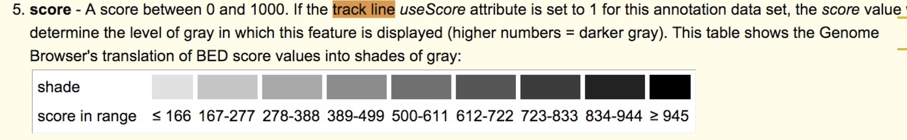 
```

## Exercise 

You will run MACS on the ATF1 ChIP-seq data. Previously, we mapped this data to the genome, converted in into `bed` and `bedGraph` and uploaded to the UCSC genome browser. Now we will call peaks on this data with MACS and upload the tracks to the browser to compare with our raw data. 

* Create a new folder in your home data folder (maybe call it `peaks`).\
* Start an interactive session with srun (4G 4 cores) if you haven't already: `srun --pty -p mcbstudent --qos=mcbstudent --mem=4G -c 4 bash` \

* To run MACS, you will need information regarding the size of your 'genome'.  You can find this info in the `chrom.sizes` file: `/home/FCAM/meds5420/genomes/hg38.chrom.sizes`. We did not explicitly learn how to add column values using the command line, but you should have sufficient basic `awk` knowledge to Google and come up with a solution like this:\
 `awk  '{sum+=$2;} END {print sum;}' hg38.chrom.sizes` \
**1.** Move to your 'peaks' directory and run MACS (use the `-B` option) from there on this data using the experimental and control (Input) samples. Everyone should have their own experimental and input `bam` files from **Lecture 12-in class exercise 1: Processing ChIP-seq data**. However, if you did not do this exercise, you can find preprocessed files to copy here: `/home/FCAM/meds5420/data/ATF1/bam`\
**2.** When finished, generate the model figure by running the R script `NAME_model.r` as follows:

```{r, eval=F, echo=TRUE}
Rscript NAME_PREFIX_model.r
```
**3.** Add tracklines to the `bed`, `narrowPeak`, and `bedGraph` files (see notes above and from last class). If you get stuck, you can use the scripts I generated `/home/FCAM/meds5420/scripts/addTrackLine*`—each of these scripts is specific to a type of input file (i.e. bedGraph, bed, narrowPeak). Look at the file content to determine which is which. Feel free to copy and edit these scripts to change options.\
**4.** How could you quickly find the peak with the highest enrichment so that you could make the browser automatically open to that peak after uploading the data?\
**5.** Create a new folder on your local machine that more or less mirrors your data folder on the browser. Transfer all MACS output to this folder using `sftp`.\
* Upload the `narrowPeak` and `summits` `bed` files to the saved UCSC genome browser Session that you sent me last class.\
* Visually compare your new data to the `.bed` and `.bedGraph` files we generated previously for ATF1.  

Since a few students did not send me a saved session, you can add them to the track here:

[ATF1_raw_data](https://genome.ucsc.edu/s/Mike%20Guertin/hg38_ATF1_ChIP_RRM1)

However, please go back and complete the previous exercises if you have not already.

After uploading the peak and summits file you should see something like this [ATF1_comparisons](https://genome.ucsc.edu/s/Mike%20Guertin/hg38_all_ATF_class) and the figure below (although my narrowPeaks file is hidden, so how do we show this track?):

```{r  out.width = "100%", echo=F, fig.align = "center", fig.cap="ATF1 browser image"}
#library(knitr)
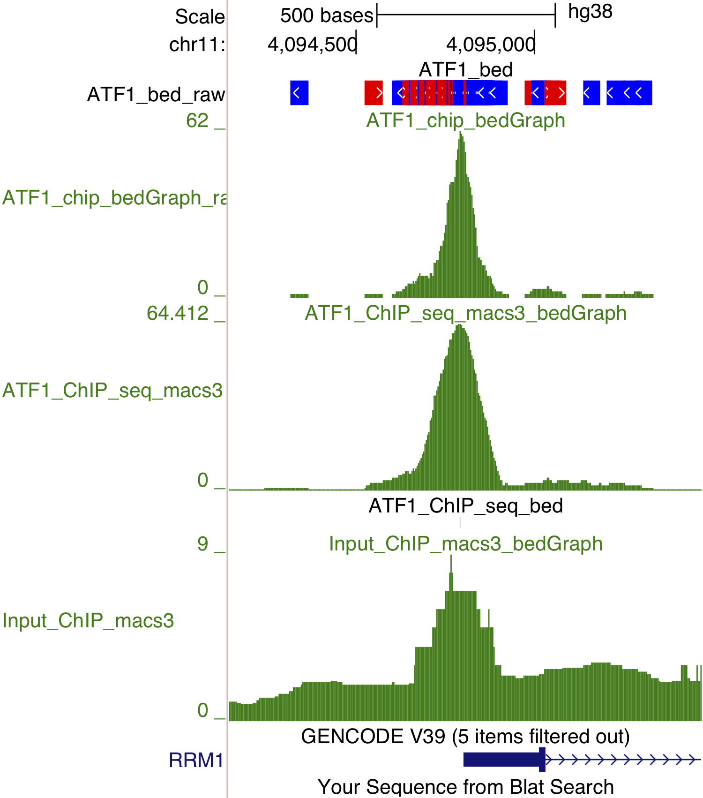 
```

## Thought Question:

How could you determine if you have sequenced enough of the library to capture all the peaks?


\pagebreak

# Answers to exercises:

## In class exercise 1: 

1) run MACS: the number is the size of the genome from the hg38.chrom.sizes file or hs
```{r engine='bash', eval=F, echo=TRUE}
module load macs3

macs3 callpeak -t ATF_ChIP_10mil.bam -c Input_10mil.bam -f BAM -g hs -n ATF1 -B -q 0.01 --outdir atf_peaks 2>&1 | tee -a ATF1_peaks_log.txt
```

2) Move to MACS output directory and run Rscript to make figure of model

```{r engine='bash', eval=F, echo=TRUE}
cd atf_peaks

Rscript ATF1_model.r
```
```{r  out.width = "90%", echo=F, fig.align = "center", fig.cap="Plus and Minus read distribution for 10 million ATF1 reads"}
#library(knitr)
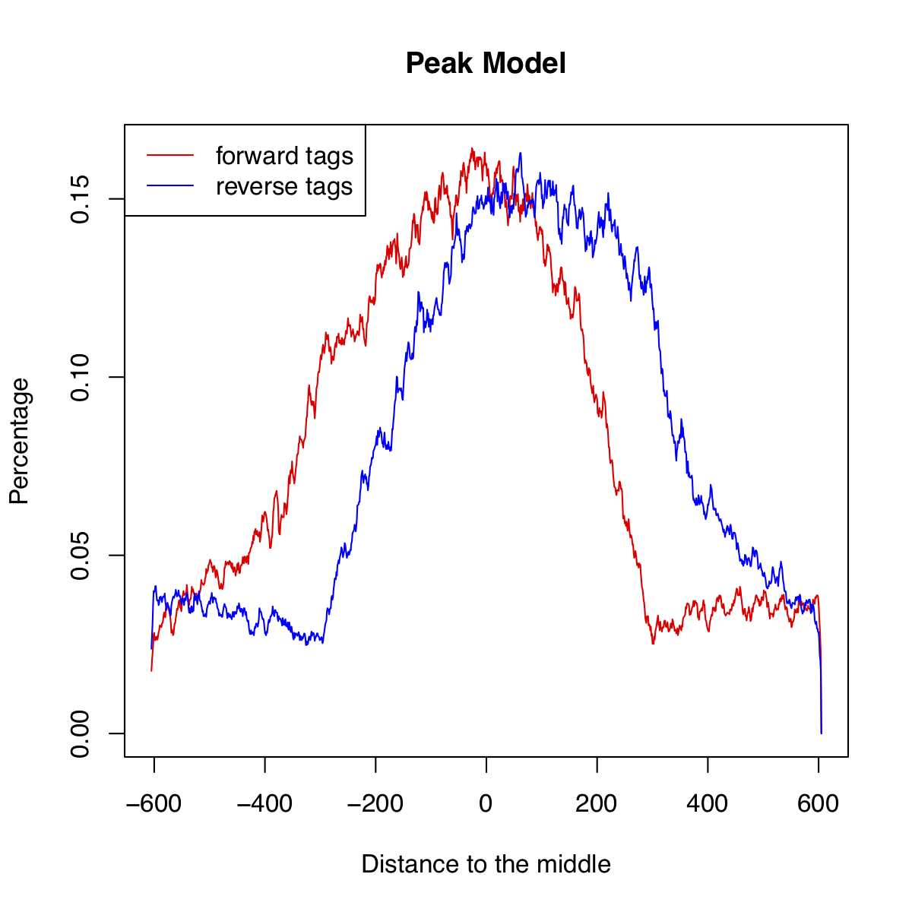 
```

3) add tracklines using the `addTrackline*.sh` scripts we modified from last week.


```{r engine='bash', eval=F, echo=TRUE}
/home/FCAM/meds5420/scripts/addTrackLines.sh Input_macs3 ATF1_control_lambda.bdg
/home/FCAM/meds5420/scripts/addTrackLines.sh ATF1_macs3 ATF1_treat_pileup.bdg 
gzip ATF1_treat_pileup_header.bedGraph
gzip ATF1_control_lambda_header.bedGraph

/home/FCAM/meds5420/scripts/addTrackLine_macs_narrowPeak.sh ATF1_narrow ATF1_peaks.narrowPeak 
/home/FCAM/meds5420/scripts/addTrackLine_macs_bed.sh ATF1_summits ATF1_summits.bed

```

4) Make it open to the largest peak: Use the result from below to set the  browser position in a modified `addTrackLiness.sh` script.

```{r engine='bash', eval=F, echo=TRUE}
sort -k5nr ATF1_peaks_summits.bed | head -1
```
5) copy to your machine and upload to browser (see previous lessons).


\pagebreak

## Thought question:
One can subsample the ChIP-seq data and record the number of peaks called at certain read depths.  Plotting of the number of peaks called vs. read depth, will reveal whether you are at saturation.  This is outlined nicely [in Figure 6A of Kharchenko, et. al., 2008](https://www.nature.com/articles/nbt.1508) \
\

### Implementation

To select random lines from a file you can use the `shuf` command in shell as follows:
```{r engine='bash', eval=F, echo=TRUE}

shuf -n #of_lines <INPUT.file> > <OUTPUT.file>
```
However, it is not as easy as just choosing random lines from a FASTQ or SAM file. Why? Can you think of solutions? \

It is easiest to operate on a `sam` file (without the header), because `fastq` have four lines per read. Then you would have to add back a header.\
\
You can also use `seq` in combination with shuffle in a shell script to get random lines in defined intervals for doing the analysis. 

```{r engine='bash', eval=T, echo=TRUE}

seq 1000 500 3000 
# gives a sequence of numbers from 1000 to 3000 in increments of 500.

```

The next step is to loop through the sequence of numbers and use `shuf` to randomly select lines from the input file. These outputs can be converted to `bam` files and used for peak calling with `macs3` \

\
Alternatively, `samtools view` has an option `-s` to subsample a `BAM` file. You can select a step of 10 or 5 percent and subsample. The pseudocode is provided below: 

```{r engine='bash', eval=F, echo=TRUE}
x=$(seq 0.05 0.05 1)
for i in $x
do
  samtools view -s $i <input>.bam > <output>_${i}.bam
  macs3 callpeaks <output>_${i}.bam ...
done
```


```{r  out.width = "90%", echo=F, fig.align = "center", fig.cap="ChIP-seq saturation"}
#library(knitr)
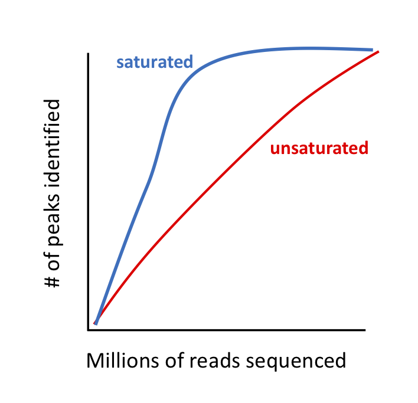 
```


