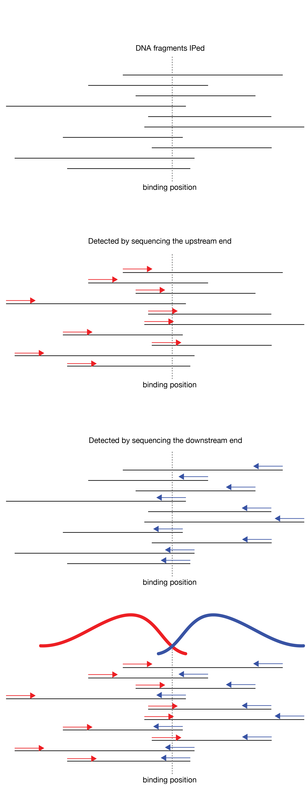

# Review and mapping of data for ChIP-seq data analysis:

## Review of `bowtie` and `bowtie2` and mapping options

In order for the output to be a proper .sam file use the `-S` option to explicitly say that you want a `.sam` output. This is required for `bowtie2`, and ensures that the header is included in the `.sam` file which is important for downstream steps.


We will continue working with a ChIP-seq dataset from human cells.  The factor that was IP'ed was ATF1 (SRR5331338). The `fastq` file for the experiment and control (Input SRR5331584) is here:\
`/home/FCAM/meds5420/data/ATF1/fastq/`
\

You have already selected 10 million reads, aligned to a genome, converted to BED, sorted, converted to `bedGraph`, and visualized these data on the UCSC genome browser.


# ChIP-seq analyses

```{r  out.width = "100%", echo=F, fig.align = "center", fig.cap="ChIP-seq overview"}
#library(knitr)
 
```

Question: How do we find real peaks in the data?

# Calling peaks in ChIP-seq data using MACS


```{r  out.width = "100%", echo=F, fig.align = "center", fig.cap="ChIP-seq fragment distribution"}
#library(knitr)
 
```


## Considerations:

* Resolution / Fragment size estimation.\
* Peak type: narrow vs. broad\
* Background estimation\
* Enrichment calculation\
* Significance testing\
* Removal of artifacts\
* Differential peak calling analysis (e.g. comparing two conditions).\
* Sequencing depth\


# Model based analysis of ChIP-seq (MACS)
MACS [Zhang et al. (2008)](http://www.biomedcentral.com/content/pdf/gb-2008-9-9-r137.pdf) and [Feng et al. (2013)](http://www.nature.com/nprot/journal/v7/n9/full/nprot.2012.101.html) is a widely used peak calling software utility that does well with respect to all of the above considerations, except the final two.  Other algorithms can be used for calling differential enriched peaks of MACS-called peaks.  MACS2 and MACS3 have better options for calling broad peaks.  We can also discuss how to assess sequencing depth from MACS output.\
\
The documentation and manual for MACS3 can be found at: [https://macs3-project.github.io/MACS/](https://macs3-project.github.io/MACS/)\


## Overview of MACS workflow

```{r  out.width = "100%", echo=F, fig.align = "center", fig.cap="MACS workflow"}
#library(knitr)
 

```

## Narrow vs. Broad Peaks


```{r  out.width = "100%", echo=F, fig.align = "center", fig.cap="Read Structure in peaks"}
#library(knitr)
 
```

We will focus on narrow peaks today.  Because of the nature of the assay, sequence reads from enriched regions will cluster into an expected structure. Since crosslinking of a factor occurs in a small region, all the signal of narrow peaks should span this region. These molecules are sequence randomly from either end in single end sequencing data (or both ends in pair end sequencing). Reads that align to the forward strand (red) are upstream of the peak, aligning to the reverse strand are downstream. The red and blue peaks are shifted by the average fragment size. \

```{r  out.width = "100%", echo=F, fig.align = "center", fig.cap="Read Structure in peaks"}
#library(knitr)
 
```

## Resolution / Fragment size estimation:

MACS can identify this pattern and build a model of the fragment length with the following workflow:\
 * Scan the genome for regions enriched for aligned reads (10-30X) \
* Select 1000 random enriched regions \
* Separate reads into positive and negative strand \
* Identify peak summits (bimodal pattern around site) \
* Fragment length (d) = distance between summits. \
* Peak center = d/2 \


```{r  out.width = "100%", echo=F, fig.align = "center", fig.cap="Fragment size from MACS Model"}
#library(knitr)
knitr::include_graphics("./ATF1_macs_Model.png") 
```

This model is important for the accuracy of the binding site prediction and for searching for known or new binding site motifs under the peak. \

## Estimating enrichment / background

To call peaks, MACS uses both information from local background near enriched sites and data from a control or input sample that should not have peaks.
\

Local background can influence peak enrichment for a number of reasons all involving sample preparation: \

* Sonication bias (see below) \
* ligation bias \
* Gel purification \
* PCR / amplification bias \
* poor antibody specificity \

For example: The number of reads obtained in regions in the experimental and control samples is correlated.  This tells you that there is something inherent that locus that allows it to be isolated / enriched independently of your protein of interest (i.e. one of the biases mentioned above).


```{r  out.width = "100%", echo=F, fig.align = "center", fig.cap="correlation of input vs ChIP"}
#library(knitr)
knitr::include_graphics("./MACS_correlation.png") 

```


Above, red dots are inside of called peaks, black dots are in control peaks.  \

Also, below is an example showing that Non-immunoprecipitatied DNA has 'structure'. This is from a technique called 'SONO-Seq' by [Auerbach et al. (2009)](http://www.pnas.org/content/106/35/14926.full.pdf+html).


```{r  out.width = "100%", echo=F, fig.align = "center", fig.cap="SONO-seq method (left) and data (right)."}
#library(knitr)
 
```

Above, they sequenced sonicated chromatin without doing the IP and found that the shearing of chromatin is not random.  Breaks occurred more often in active promoter regions resulting in enrichment in those regions without IP.\
This is why the control sample is important.\
\

**Solutions:**

* Use the control sample to account for biases whatever their source. Why is input a substantially worse control than mock IP? \
* PCR biases are also removed by removing duplicate sequence reads.  Sometimes up to two of the same read is allowed (the default in MACS is to keep only one read from any location). \
* To ensure antibody specificity: \
    * One can knockdown the factor of interest, ChIP, and select for peaks that were depleted upon knockdown  \
    * One can ChIP with two different antibodies and choose only overlapping peaks \


## Using MACS3:
The basic usage for MACS3 is as follows:
```{r engine='bash', eval=F, echo=TRUE}

macs3 callpeak -t <TREATMENT>.bam -c <Input>.bam -f BAM -g GENOMESIZE -n <name_prefix> --outdir <peaks_folder> 2>&1 | tee -a ATF1_peaks_log.txt

#Don't forget to save terminal output (std error in this case) as a log file.
```

* `-t`: Specifies the experimental sample\
* `-c`: Control sample\
* `-n`: Prefix name for the output files\
* `-g`: genome size.  Can use integer (e.g. 2900000000) or scientific (e.g. 2.9e9). \ There are also a few shortcuts (`hs` = humans = 2.9e9).\

**Note:** if you want to keep duplicate reads you can use the `--keep-dup` option. This option followed by an interger or 'all' will keep that number or all duplicates respectively. I beleive the best practice is to perform paired-end sequencing, remove duplicates from the `bam` file and use `--keep-dup all`. Removing duplicates from a paired-end `bam` file necessitates that the paired-end 1 and paired-end 2 reads are identical between two sequencing read; this is very unlikely to happen independently and it predominantly due to PCR duplications. \

You can type `macs3 --help` and `macs3 callpeak -h` to get a list of other options and their descriptions.  \
You can also generate `bedGraph` files from MACS, but this takes a while and generates `bedGraph` data for every bp (also known as a `wiggle` format).  These files can be quite large when uploading to the genome, so I prefer to make `bedGraph` files of the data myself as we have previously in this class.

I ran the following: \
```{r, eval=F, echo=TRUE}
macs3 callpeak -t ATF_ChIP_10mil.bam -c Input_10mil.bam -f BAM -g hs -n ATF1 -B -q 0.01 --outdir atf_peaks 2>&1 | tee -a ATF1_peaks_log.txt
```
What does `-B` above specify? \

You will get the following output files from MACS3:

* `NAME_PREFIX_model.r`
* `NAME_PREFIX_peaks.narrowPeak`
* `NAME_PREFIX_summits.bed`
* `NAME_PREFIX_peaks.xls`

The model.r is a script written in `R` that will produce a nice .PDF figure of the fragment length model for your data.
You can run this script on the server or on your local machine with:
```{r, eval=F, echo=TRUE}
#first load R
module load R

Rscript NAME_PREFIX_model.r
```

The excel spreadsheets contain information about the datasets (total number of reads) and peak locations (reads in peaks and significance of peaks (FDR) for the experimental (`_peaks.xls`) and input (`_negative_peaks.xls`) samples.\
\
The _peaks.bed_ and _summits.bed_ are bed files that give the locations of enriched regions and their maximum, respectively.\
\
Have a look at the files:
**peaks bed file**
```{r engine='bash', eval=T, echo=TRUE}
head -4 ./ATF1_peaks.narrowPeak
```
In this format the 5th column (or score column) contains the transformed p-value (-10*log10[pVal]) for the signifcance of the peak.

**summits**
```{r engine='bash', eval=T, echo=TRUE}
head -4 ./ATF1_summits.bed
```
In this format the 5th column (or score column) contains the the number of reads that overlap with this peak summit.\
\
The above files are ready to be uploaded to the browser - you just need to add track lines.  The example in the next section below shows track line addition using `awk`.\


**peaks table with most information**
```{r engine='bash', eval=T, echo=TRUE}
head -5 ./ATF1_peaks.xls
```

Unfortunately, The peaks file with the most information in it is meant to be opened in excel. The first 20-25 lines contain information regaring the parameters of the analysis.  Fortunately, these lines begin with a "##" ad so can be easily parsed out with **grep**.  
```{r engine='bash', eval=T, echo=TRUE}

grep -v -w "#" ./ATF1_peaks.xls > ATF1_peaks_noHeader.txt
```
Then you get:
```{r engine='bash', eval=T, echo=TRUE}
head ./ATF1_peaks_noHeader.txt
```
\
There is still a blank line that you can remove with **grep**:
```{r engine='bash', eval=T, echo=TRUE}
grep -v -e '^$'  ./ATF1_peaks_noHeader.txt | head -5
```
This searches for a line where the start and end of a line are immediately next to each other.  It uses `regular expressions` as follows: \

* `-e` tells `grep` that reg-expressions are being used 
* `^` indicates the start of the line. \
* `$` indicates the end.  \

Two ways to remove a 1 line header is to use `tail -n +2`, which takes the second line to the end. 

```{r engine='bash', eval=T, echo=TRUE}
#tail
grep -v -e '^$' ./ATF1_peaks_noHeader.txt | tail -n +2 | head -5

#awk:
grep -v -e '^$' ./ATF1_peaks_noHeader.txt | awk 'NR>1 {print $0}' | head -5

grep -v -e '^$' ./ATF1_peaks_noHeader.txt | awk 'NR>1 {print $0}' > ATF1_peaks_onlyPeaks.txt
```
## Adding tracklines and using score column in bed files:

Note that the score column relates to the intensity of the peak and interpreting the score can be turned on with `useScore=1` in the track options line.

```{r engine='bash', eval=F, echo=TRUE}
#UCSC tracklines for displaying MACS output
awk 'BEGIN {  print "browser position chr1:1,505,048-1,516,424"
              print "track type=bed name=\"ATF1_peaks_bed\" 
              description=\"ATF1_peaks_bed\" visibility=squish 
              autoScale=on useScore=1"}
           {  print $0}' INFILE.bed > INFILE_header.bed
```

You will also have to make a script for adding a header to narrowPeak files, specifying the type as narrowPeak so that UCSC recognizes the format.

I include three `addTrackLine*.sh` scripts: to `/home/FCAM/meds5420/scripts/`


```{r  out.width = "100%", echo=F, fig.align = "center", fig.cap="Bed Score Usage"}
#library(knitr)
 
```

## Exercise 

You will run MACS on the ATF1 ChIP-seq data. Previously, we mapped this data to the genome, converted in into `bed` and `bedGraph` and uploaded to the UCSC genome browser. Now we will call peaks on this data with MACS and upload the tracks to the browser to compare with our raw data. 

* Create a new folder in your home data folder (maybe call it `peaks`).\
* Start an interactive session with srun (4G 4 cores) if you haven't already: `srun --pty -p mcbstudent --qos=mcbstudent --mem=4G -c 4 bash` \

* To run MACS, you will need information regarding the size of your 'genome'.  You can find this info in the `chrom.sizes` file: `/home/FCAM/meds5420/genomes/hg38.chrom.sizes`. We did not explicitly learn how to add column values using the command line, but you should have sufficient basic `awk` knowledge to Google and come up with a solution like this:\
 `awk  '{sum+=$2;} END {print sum;}' hg38.chrom.sizes` \
**1.** Move to your 'peaks' directory and run MACS (use the `-B` option) from there on this data using the experimental and control (Input) samples. Everyone should have their own experimental and input `bam` files from **Lecture 12-in class exercise 1: Processing ChIP-seq data**. However, if you did not do this exercise, you can find preprocessed files to copy here: `/home/FCAM/meds5420/data/ATF1/bam`\
**2.** When finished, generate the model figure by running the R script `NAME_model.r` as follows:

```{r, eval=F, echo=TRUE}
Rscript NAME_PREFIX_model.r
```
**3.** Add tracklines to the `bed`, `narrowPeak`, and `bedGraph` files (see notes above and from last class). If you get stuck, you can use the scripts I generated `/home/FCAM/meds5420/scripts/addTrackLine*`—each of these scripts is specific to a type of input file (i.e. bedGraph, bed, narrowPeak). Look at the file content to determine which is which. Feel free to copy and edit these scripts to change options.\
**4.** How could you quickly find the peak with the highest enrichment so that you could make the browser automatically open to that peak after uploading the data?\
**5.** Create a new folder on your local machine that more or less mirrors your data folder on the browser. Transfer all MACS output to this folder using `sftp`.\
* Upload the `narrowPeak` and `summits` `bed` files to the saved UCSC genome browser Session that you sent me last class.\
* Visually compare your new data to the `.bed` and `.bedGraph` files we generated previously for ATF1.  

Since a few students did not send me a saved session, you can add them to the track here:

[ATF1_raw_data](https://genome.ucsc.edu/s/Mike%20Guertin/hg38_ATF1_ChIP_RRM1)

However, please go back and complete the previous exercises if you have not already.

After uploading the peak and summits file you should see something like this [ATF1_comparisons](https://genome.ucsc.edu/s/Mike%20Guertin/hg38_all_ATF_class) and the figure below (although my narrowPeaks file is hidden, so how do we show this track?):

```{r  out.width = "100%", echo=F, fig.align = "center", fig.cap="ATF1 browser image"}
#library(knitr)
 
```

## Thought Question:

How could you determine if you have sequenced enough of the library to capture all the peaks?


\pagebreak

# Answers to exercises:

## In class exercise: 

1) run MACS: the number is the size of the genome from the hg38.chrom.sizes file or hs
```{r engine='bash', eval=F, echo=TRUE}
module load macs3

macs3 callpeak -t ATF_ChIP_10mil.bam -c Input_10mil.bam -f BAM -g hs -n ATF1 -B -q 0.01 --outdir atf_peaks 2>&1 | tee -a ATF1_peaks_log.txt
```

2) Move to MACS output directory and run Rscript to make figure of model

```{r engine='bash', eval=F, echo=TRUE}
cd atf_peaks

Rscript ATF1_model.r
```
```{r  out.width = "90%", echo=F, fig.align = "center", fig.cap="Plus and Minus read distribution for 10 million ATF1 reads"}
#library(knitr)
 
```

3) add tracklines using the `addTrackline*.sh` scripts we modified from last week.


```{r engine='bash', eval=F, echo=TRUE}
/home/FCAM/meds5420/scripts/addTrackLines.sh Input_macs3 ATF1_control_lambda.bdg
/home/FCAM/meds5420/scripts/addTrackLines.sh ATF1_macs3 ATF1_treat_pileup.bdg 
gzip ATF1_treat_pileup_header.bedGraph
gzip ATF1_control_lambda_header.bedGraph

/home/FCAM/meds5420/scripts/addTrackLine_macs_narrowPeak.sh ATF1_narrow ATF1_peaks.narrowPeak 
/home/FCAM/meds5420/scripts/addTrackLine_macs_bed.sh ATF1_summits ATF1_summits.bed

```

4) Make it open to the largest peak: Use the result from below to set the  browser position in a modified `addTrackLiness.sh` script.

```{r engine='bash', eval=F, echo=TRUE}
sort -k5nr ATF1_peaks_summits.bed | head -1
```
5) copy to your machine and upload to browser (see previous lessons).


\pagebreak

## Thought question:
One can subsample the ChIP-seq data and record the number of peaks called at certain read depths.  Plotting of the number of peaks called vs. read depth, will reveal whether you are at saturation.  This is outlined nicely [in Figure 6A of Kharchenko, et. al., 2008](https://www.nature.com/articles/nbt.1508) \
\

### Implementation

To select random lines from a file you can use the `shuf` command in shell as follows:
```{r engine='bash', eval=F, echo=TRUE}

shuf -n #of_lines <INPUT.file> > <OUTPUT.file>
```
However, it is not as easy as just choosing random lines from a FASTQ or SAM file. Why? Can you think of solutions? \

It is easiest to operate on a `sam` file (without the header), because `fastq` have four lines per read. Then you would have to add back a header.\
\
You can also use `seq` in combination with shuffle in a shell script to get random lines in defined intervals for doing the analysis. 

```{r engine='bash', eval=T, echo=TRUE}

seq 1000 500 3000 
# gives a sequence of numbers from 1000 to 3000 in increments of 500.

```

The next step is to loop through the sequence of numbers and use `shuf` to randomly select lines from the input file. These outputs can be converted to `bam` files and used for peak calling with `macs3`


```{r  out.width = "90%", echo=F, fig.align = "center", fig.cap="ChIP-seq saturation"}
#library(knitr)
 
```


