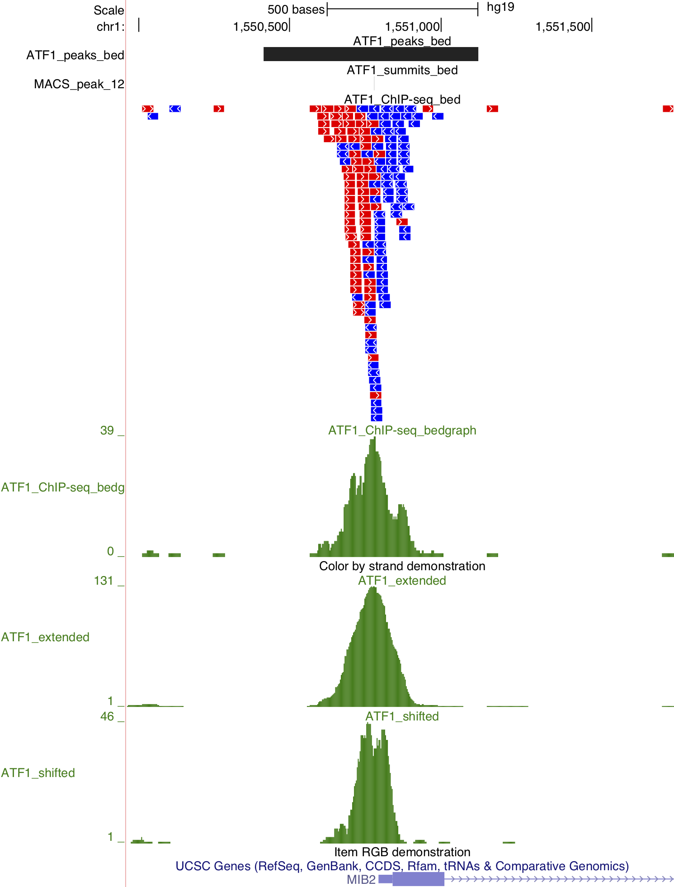
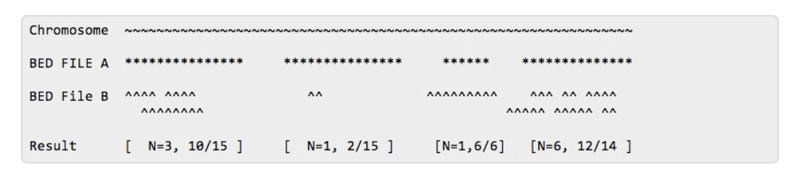
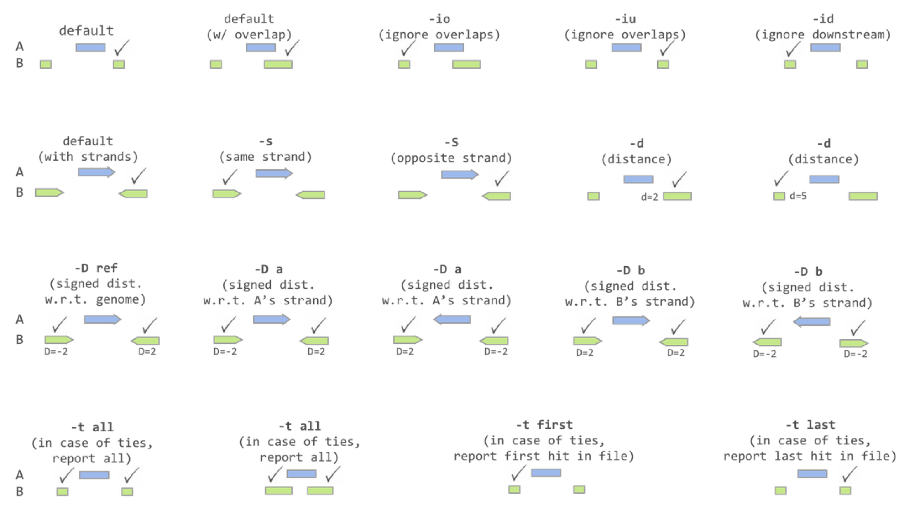
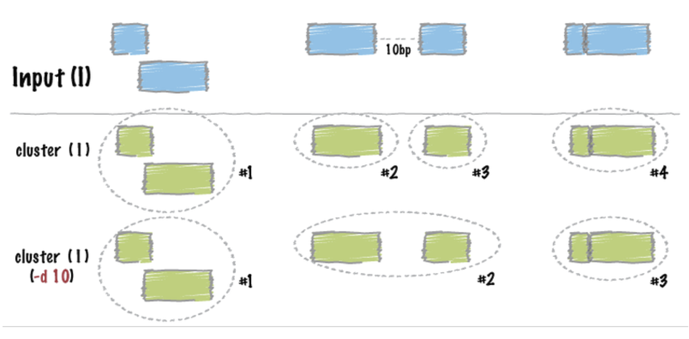
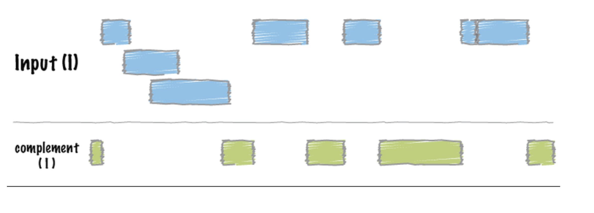
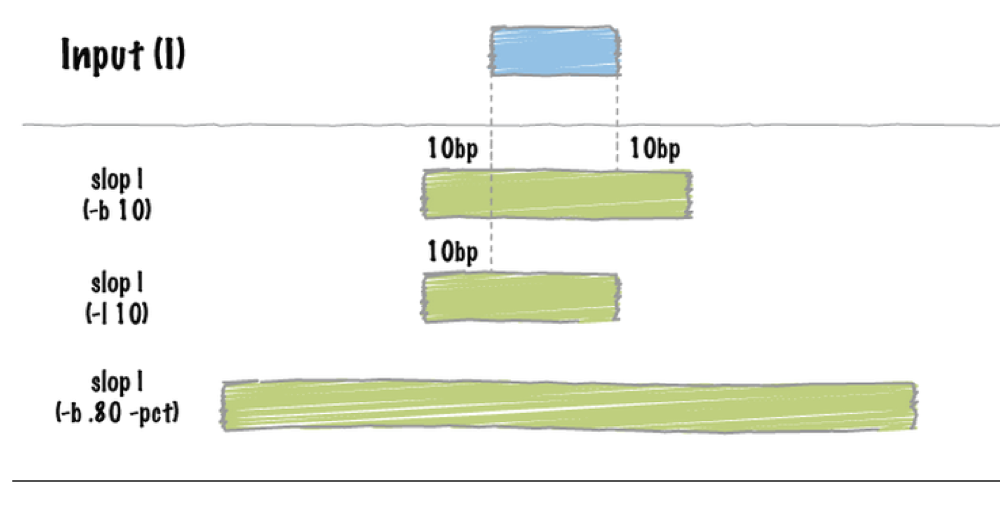
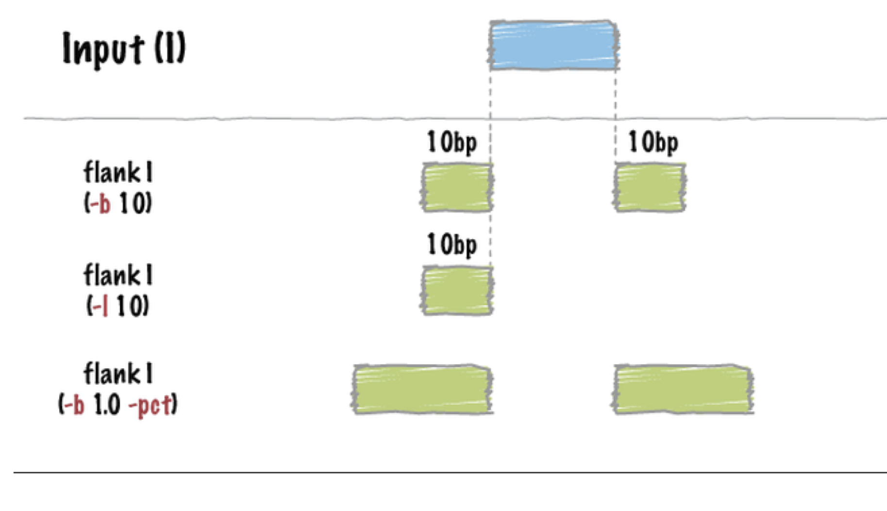
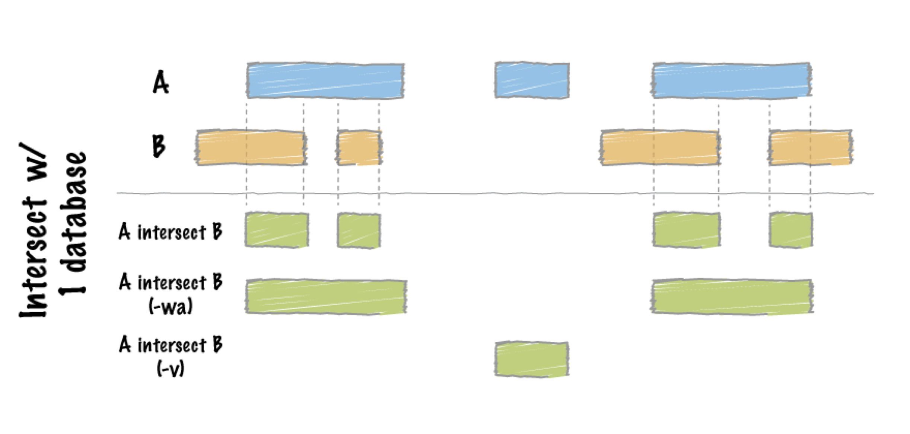

\fontsize{12}{16}
\fontseries{a}
\selectfont

# Previous class:

We ran peak calling and continued visualization of data on the genome browser

```{r engine='bash', eval=F, echo=TRUE}
macs3 callpeak -t ATF_ChIP_10mil.bam -c Input_10mil.bam -f BAM -g hs -n ATF1 -B -q 0.01 --outdir atf_peaks 2>&1 | tee -a ATF1_peaks_log.txt

addTrackLines.sh Input_macs3 ATF1_control_lambda.bdg
addTrackLines.sh ATF1_macs3 ATF1_treat_pileup.bdg 
gzip ATF1_treat_pileup_header.bedGraph
gzip ATF1_control_lambda_header.bedGraph

addTrackLine_macs_narrowPeak.sh ATF1_narrow ATF1_peaks.narrowPeak 
addTrackLine_macs_bed.sh ATF1_summits ATF1_summits.bed
# transfer to your CPU with sftp and load to UCSC
```

# TODAY: Using `bedtools` for ChIP-seq analyses

Today we will learn how to: \

* Reformat bed files and gene lists with `awk`  \
* Get the number of ChIP-seq reads in defined regions of the genome \
* Find closest annotation to our ChIP-seq peaks. \


## Reformatting tables with awk

**Extending reads by estimated fragment length from MACS analysis.**
last time we used MACS to call peaks in our ChIP-seq data and create a model that describes the width of our peaks. Now we want to use the lag between the forward and reverse strands from the model to adjust our reads such that they best represent where our factor binds.\

To do this, we will **extend the reads by this estimation of the fragment size**. Stated differently, the reads will no longer be as long as the aligned sequence, they will all the the same length, which is the average sonication size. \


Awk can also be used for simple manipulations of columns. Let's add a column that adds fragment size (120 in our case) to column 2 of `ATF_ChIP_10mil_sorted.bed` from the post-processing lecture 12:

```{r engine='bash', eval=T, echo=TRUE}
head -4 ./ATF_ChIP_10mil_sorted.bed
```

```{r engine='bash', eval=F, echo=TRUE}
awk '{OFS="\t";} {print $1, $2, $2+120, $4, $5, $6}' ATF_ChIP_10mil_sorted.bed > ATF1_ChIP_10mil_extended.bed
```

```{r engine='bash', eval=T, echo=TRUE}
head -4 ./ATF1_ChIP_10mil_extended.bed
```

### awk syntax notes (a review):
* `\t` Specifies that the fields will be tab-delimited
* `$<col_num>` Specifies the column number to be printed.  $0 prints entire line.
* Pay close attention to formatting:  `awk` commands are surrounded by single quotes and curly brackets: '{}'


We are not finished yet since we have strand specific reads, we need to add to the + strand reads and subtract from the - strand reads.\
We already know how to use awk to select rows based on strand:
```{r engine='bash', eval=F, echo=TRUE}
awk '{if($6=="+") print $0}' ./ATF_ChIP_10mil_sorted.bed > ./ATF_ChIP_10mil_plus.bed 
```
```{r engine='bash', eval=T, echo=TRUE}
head -4 ./ATF_ChIP_10mil_plus.bed 
```

Now let's combine this with the print function:
```{r engine='bash', eval=F, echo=TRUE}
awk '{OFS="\t";} {if($6=="+")
      print $1, $2, $2+120, $4, $5, $6;
      else
      print $1, $3-120, $3, $4, $5, $6;}' ATF_ChIP_10mil_sorted.bed > ATF_ChIP_10mil_extended_strand.bed
```
```{r engine='bash', eval=T, echo=TRUE}
head -4 ./ATF_ChIP_10mil_extended_strand.bed
```

**Problem:** sometimes shifting or extending reads will create negative genome coordinates. We can resolve this by using `awk`:\


```{r engine='bash', eval=F, echo=TRUE}
awk '{if ($2 >0) print $0}' ATF_ChIP_10mil_extended_strand.bed > ATF_10mil_extended_filtered.bed
```

We can then create the `bedGraph` and upload it to the browser. Here, introducing the `hg38.chrom.sizes` file has the same effect of excluding any reads off the chromosome edges in the bed file:

```{r engine='bash', eval=F, echo=TRUE}
bedtools genomecov -bg -i ATF_10mil_extended_filtered.bed -g genomes/hg38.chrom.sizes > ATF_10mil_extended.bedGraph

## Add tracklines
you know how to do this by now!

## Upload to browser
you know how to do this by now!

```

<!-- ````{r  out.width = "90%", echo=F, fig.align = "center", fig.cap="Extended reads example"}
#library(knitr)
 
```
--> 

**Reformatting gene lists:**

We are going to use `bedtools` for comparing our ChIP-seq peaks locations to genes.  However, standard gene lists are not necessarily in `.bed` format ([http://genome.ucsc.edu/FAQ/FAQformat.html#format1](http://genome.ucsc.edu/FAQ/FAQformat.html#format1)), and thus must be converted.  Here is the standard format of a gene list downloaded from the UCSC genome browser.
```{r engine='bash', eval=T, echo=TRUE}
head -5 Homo_sapiens.GRCh38.104.unique.txt
``` 

\
**IMPORTANT NOTE ON GENE LISTS:**
Gene lists are always represented so that the lowest genomic coordinate is first (in the start column) regardless of the strand of the gene.  This means that the gene start and promoter for a plus-stranded gene is in the second column (start) and the gene start and promoter for a gene on the minus strand is in the third column (end).
\
To convert to `.bed` format, we simply need to reorder the columns. Remember, the column specifications for `.bed` (6) format is as follows:

**1.** chr \
**2.** start, **TSS for + strand genes** \
**3.** end, **TSS for - strand genes** \
**4.** name \

**5.** score  \
**6.** strand \

We will review using the `awk` language to reorder and manipulate columns from large tables very easily using the print command. I uploaded an annotation file to `/home/FCAM/meds5420/annotations`. You should also have downloaded a GENCODE annotation file in BED format in Lecture 13.

```{r engine='bash', eval=F, echo=TRUE}
awk '{OFS="\t";} {print $3, $5, $6, $1, 1, $4}' Homo_sapiens.GRCh38.104.unique.txt > hg38_genes.bed

# The '1' in column 5 is a space filler for the score
# since there is no score information for our gene list.
```

# More `awking`
 
We have covered several uses of awk and there are many more.  As a reminder, Peteris Krummis has tabulated many useful `awk` commands in a three part series on-line ([http://www.catonmat.net/blog/awk-one-liners-explained-part-three/](http://www.catonmat.net/blog/awk-one-liners-explained-part-three/)).  Just swap in 'one' and 'two' at the end of the url to see the others.  He also has an inexpensive book for sale with these `awk` tips and tricks included.


As we discussed in the previous class, `awk` can also be used for summing data in columns.\
```{r engine='bash', eval=T, echo=TRUE}
cat table.txt
```
```{r engine='bash', eval=T, echo=TRUE}
awk '{sum+=$2} END {print sum}' table.txt
```

`awk` syntax for selecting something that is `not equal` (!=):
```{r engine='bash', eval=F, echo=TRUE}
#select minus strand genes
awk '{if ($6 != "+") print $0}' hg38_genes.bed > hg38_genes_minus.bed 
```
```{r engine='bash', eval=T, echo=TRUE}
head -4 hg38_genes_minus.bed 
```


## Number of ChIP-seq reads in defined regions of the genome

Bedtools has a `coverageBed` command that can calculate the depth and breadth of coverage of two bed files.  That is, given a sequencing 'reads' `.bed` file and a 'loci' `.bed` file one can calculate the number of reads found in each loci and the number of bases that are covered.

Link to manual here:  
[http://bedtools.readthedocs.io/en/latest/content/bedtools-suite.html](http://bedtools.readthedocs.io/en/latest/content/bedtools-suite.html).

```{r  out.width = "90%", echo=F, fig.align = "center", fig.cap="coverageBed"}
#library(knitr)
 
```

Usage:
```{r engine='bash', eval=F, echo=TRUE}
coverageBed -a LOCI.bed -b READS.bed  > OUTFILE.bed
```
After each entry from A, `coverageBed` will report:\
1) The number of features in B that overlapped (by at least one base pair) the A interval.\
2) The number of bases in A that had non-zero coverage from features in B.\
3) The length of the entry in A.\
4) The fraction of bases in A that had non-zero coverage from features in B.\

Example:
```{r engine='bash', eval=T, echo=TRUE}
head -5 ./coverageStrand_ATF1_peaks_chr5.bed
```

## Understanding functions:

As functions and tools become more complicated with more options and variations, it is critical to look at the input and output files (`head`, `tail`, `wc -l`, etc.). Ask yourself if the output makes sense. If you selected all plus strand genes, does the number of lines reduce by about half? Is there a `+` in column 6 when I randomly look at 10 lines? \

Maybe you are trying to decipher cryptic language describing an option. Employ the option and compare the input and output files to determine if you are interpreting the option correctly. I am constantly doing these types of coherence checks and empirical confirmations when I employ new tools and even tools that I am familiar with.  

## Find closest gene to ChIP-seq peaks:
There is a simple but useful command in `bedtools` to find the closest gene to your ChIP-seq peak.  There are nice options to force the program to consider the strand of your loci, to set distance cutoffs, and to compute the distance between 'matched' loci.

```{r  out.width = "90%", echo=F, fig.align = "center", fig.cap="bedtools closest"}
#library(knitr)
 
```

Usage:
```{r engine='bash', eval=F, echo=TRUE}
closestBed  -a PEAKS.bed -b GENES.bed  > OUTFILE.bed
```

Important options: \

`-D`: \

* `a`: Report distance with respect to A.  When A is on the - strand, “upstream” means B has a higher (start,stop). \
* `b`: Report distance with respect to B. When B is on the - strand, “upstream” means A has a higher (start,stop). \


`-t`: \

* `all`: In the event of a tie, report all \
* `first`: In the event of a tie, report the first hit \
* `last`: In the event of a tie, report the last hit \

Example:
```{r engine='bash', eval=T, echo=TRUE}
head -5 ./chr5_closest_summits_genes_D_b.out
```

# More useful ways to compare or manipulate regions


## Merging regions

```{r  out.width = "90%", echo=F, fig.align = "center", fig.cap="mergeBed"}
#library(knitr)
knitr::include_graphics("./Merge.png") 
```

## Clustering regions

```{r  out.width = "90%", echo=F, fig.align = "center", fig.cap="clusterBed"}
#library(knitr)
 
```


## Complementing regions

```{r  out.width = "90%", echo=F, fig.align = "center", fig.cap="complementBed"}
#library(knitr)
 
```

## Changing boundaries

```{r  out.width = "90%", echo=F, fig.align = "center", fig.cap="slopBed"}
#library(knitr)
 
```

## Getting nearby regions
```{r  out.width = "90%", echo=F, fig.align = "center", fig.cap="flankBed"}
#library(knitr)
 
```

## Intersecting regions

```{r  out.width = "90%", echo=F, fig.align = "center", fig.cap="intersectBed"}
#library(knitr)
 
```


\pagebreak

## In Class Exercise 1:
Today you will begin to analyze the ATF1\_ChIP-seq data for your chromosome by quantifying the number or reads in peaks and finding the closest genes in each peak. Your chromosome is the same as your usr#. I am `usr17`, so my chromosome is `chr17`. You must convert the format of several files.\
\
1) You should have all 10 million ChIP-seq reads in a sorted bed file (if you cannot find this, then you will find one here: `/home/FCAM/meds5420/data/ATF1/bed`). First use `grep` and to make a bed file with only reads from your chromosome. I called mine `ATF1_chr17_sorted.bed`
\
\
2) Use your ATF1 peak file (MACS output from last time), and your reads file to determine the number of reads in the `narrowPeak` file genomic regions. Again, use grep to only pull out peaks from your chromosome in the `narrowPeak` file.  \
\
\

3) Convert the gene list to `.bed` format and select genes from your chromosome:\

* Copy the gene list from `/home/FCAM/meds5420/data/ATF1/annotations/Homo_sapiens.GRCh38.104.unique.txt` \
to an `annotations` folder within your home directory tree. \
* Use `awk` to convert the gene list to `.bed` format. Use column 2 in the name column (bed column 4) and "1" in the score column (bed column 5). \
* Use `grep` to move only genes from your chromosome into a new file \

\
\

4) Use your ATF1 summits file (MACS output from last time), and your gene list .bed file to determine the closest gene to your peaks. First pull only your chromosome from the summits file. Use proper options so that you:\
* only print one gene locus in the event of a tie in distance.  \
* report the distance between each peak and the closest gene relative to the gene. \
\

5) list the `bedtools` command(s) in sequence that you could use to do the following:

*  Merge peaks in the narrowPeak file that are within 1000 bp of each other \
*  Get intergenic regions of the entire genome \
*  Find peaks that are within genes \
*  Find peaks that are outside of genes \
\
\

6) Thought experiment:  You are trying to find the closest ChIP-seq peak to the transcription start site of genes (TSS) of your genes. Can you see a problem with how bedtools commands used above in 5) would report this?


\pagebreak

# Answers to in class Exercise


Note: To make the sorted bedfile of the data, refer back to the post-processing lecture section **Introduction to BED format**:
```{r engine='bash', eval=F, echo=TRUE}
#convert .sam to .bam
samtools view -b ATF_ChIP_10mil.sam > ATF_ChIP_10mil.bam

#convert to bed
bedtools bamtobed -i ATF_ChIP_10mil.bam > ATF_ChIP_10mil.bed

# sort 
sort -k1,1 -k2,2n ATF_ChIP_10mil.bed > ATF_ChIP_10mil_sorted.bed 
```

1) 
```{r engine='bash', eval=F, echo=TRUE}
grep -w "chr17" lec13/ATF_ChIP_10mil_sorted.bed > ATF1_reads_chr17.bed
```

2) Get number of reads in peaks

```{r engine='bash', eval=F, echo=TRUE}
grep -w "chr17" peaks/atf_peaks/ATF1_peaks.narrowPeak > ATF1_peaks_chr17.narrowPeak 
coverageBed -a ATF1_peaks_chr17.narrowPeak -b ATF1_reads_chr17.bed > ATF1_peak_coverage.bed
```

3) Reformat file to .bed and select genes on your chromosome

```{r engine='bash', eval=F, echo=TRUE}
awk '{OFS="\t";} {print $3, $5, $6, $1, 1, $4}' Homo_sapiens.GRCh38.104.unique.txt | grep -w "chr17" > hg38_chr17_genes.bed 

```

4) Call closest peaks with distance in respect to genes: 

```{r engine='bash', eval=F, echo=TRUE}

grep -w "chr17" peaks/atf_peaks/ATF1_summits.bed > ATF_chr15_summits.bed
bedtools closest -t "first" -D b -a ATF_chr17_summits.bed -b hg38_chr17_genes.bed > ATF_gene_proximity.bed

#This gives me an error. I need to sort! 

sortBed -i hg38_chr17_genes.bed > hg38_chr17_genes_sorted.bed 
bedtools closest -t "first" -D b -a ATF_chr17_summits.bed -b hg38_chr17_genes_sorted.bed > ATF_gene_proximity.bed 
```

5) list the bedtools command(s) in sequence that you could use to do the following:
Merge peaks that are within 1000 bp of each other: 
  
* `sortBed -i ATF1_peaks.narrowPeak > ATF1_peaks_sorted.narrowPeak` \
* `mergeBed -d 1000 -i ATF1_peaks_sorted.narrowPeak > ATF1_peaks_merged.narrowPeak` \

`wc -l` to make sure the output makes sense

Get intergenic regions (I had a few sorting Errors that I had to correct on my first pass)
* `sortBed -i hg38_genes.bed > hg38_genes_sorted.bed` or `sort -k 1,1 -k2,2n hg38_genes.bed > hg38_genes_sorted.bed`
* `sort -k 1,1 -k2,2n genomes/hg38.chrom.sizes > genomes/hg38.chrom.sizes.sorted`
* `complementBed -i hg38_genes_sorted.bed -g genomes/hg38.chrom.sizes.sorted > intergenic_hg38.bed`

Find peaks that are within genes. I like to use the summits file because peaks are variable width and the summit is the best guess of where the TF is bound.

* `intersectBed -wo -a peaks/atf_peaks/ATF1_summits.bed -b hg38_genes.bed`

Find peaks that are outside of genes

* `intersect -v -a peaks/atf_peaks/ATF1_summits.bed -b hg38_genes.bed`
OR

* `complementBed -i hg38_genes.bed -g genomes/hg38.chrom.sizes | intersectBed -v -a peaks/atf_peaks/ATF1_summits.bed -b stdin`

Define a promoter region that is +/- 500 base pairs around the TSS

* `flankBed -s -i hg38_genes.bed -g genomes/hg38.chrom.sizes -l 500 -r 0 | flankBed -s -i stdin -g genomes/hg38.chrom.sizes -l 0 -r 500 > outfile.bed`
\
6) Bedtools will report the closest gene regardless of whether the peak is closer to the gene start or end (see below).\


\pagebreak

# Creating custom annotations lists for ChIP-seq analysis:

One caveat with `closestBed`, is that it chooses the closet edge of your targets (genes) to compare your peaks locations to.  This means that it is not always obvious whether or not your peak is closest to the gene start or end.  One way to get around this is to create a new annotation list that just contains TSSs.  This would allow you to use `bedtools closest` to get the closest TSS to your peak.


```{r  out.width = "90%", echo=F, fig.align = "center", fig.cap="peak assignment problem"}
#library(knitr)
knitr::include_graphics("peak_assignment.png") 
```

Using `awk`, we can easily create such a TSS file. The `awk` script below creates a new file and sets both the start and stop to the TSS of the gene, which is the 'start' for genes on the plus strand and the 'end' for genes on the minus strand.

```{r engine='bash', eval=F, echo=TRUE}

awk '{OFS="\t";} 
{ if($6=="+")
print $1, $2, $2+1, $4,$5,$6;
else 
print $1, $3-1, $3, $4,$5,$6}' hg38_genes.bed > hg38_genes_strandedTSS.bed
```
One can then use `bedtools closest` to determine the closest TSS (or promoter) to each peak location.

```{r engine='bash', eval=F, echo=TRUE}
sortBed -i hg38_genes_strandedTSS.bed > hg38_genes_strandedTSS_sorted.bed
closestBed -D a -a peaks/atf_peaks/ATF1_summits.bed -b hg38_genes_strandedTSS_sorted.bed > peaks_promoters.bed
```

This same type of manipulation can be used for creating bedfiles of different regions for comparing to ChIP-seq peak locations.  i.e. You can create promoter, genic and intergenic regions and determine where you ChIP-seq peaks tend to go to.

