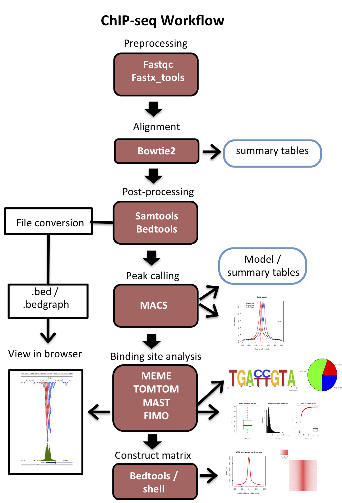

# Review of analysis pipeline

```{r  out.width = "90%", echo=F, fig.align = "center", fig.cap="ChIP-seq analysis workflow"}
#library(knitr)
 
```

# TODAY: de novo Motif searching with MEME

An important piece of information that can be gained from genomic binding data is the discovery of the underlying DNA motif that is bound by the transcription factor.  There are many tools out there that will allow you to discover motifs.  The **MEME** analysis suite is a popular and powerful set of tools that can allow you to perform several useful analyses on DNA sequences of interest, such as: \

* Identify (de novo) enriched motifs with a set of sequences.\
* Search for motifs of interest within a set of sequences.\
* Scan large databases (genomes) for instances of specified motifs.\
* Compare _de novo_ motifs to databases of known motifs.\


## MEME: Multiple Em for Motif Elucidation
MEME Website: [http://meme-suite.org/](http://meme-suite.org/) 
\

Several steps must be performed prior to MEME analysis.  Here is a summary list:\

**1.** Create `bed` file with peak locations to analyze.\
- Short windows around summits.\
- Only most intense peaks needed.\
- Get random windows of the same size in for background estimation.\
**2.** retrieve DNA sequences from regions to analyze \
**3.** Create a background base frequency model (part of the MEME suite)\


MEME requires DNA sequences (in fasta format) of your regions of interest.  Long sequences can decrease accuracy and take a long time to search through, so it is best to choose narrow regions. When finding motifs within ChIP-seq peaks we can **use our peak summits to center our analysis** since most TFs will be found in the immediate vicinity of their peak summits. We can use `bedtools slop` to create small windows around our summits:

```{r  out.width = "90%", echo=F, fig.align = "center", fig.cap="bedSlop"}
#library(knitr)
 
```

Let's get 100bp window centered on peak summits (`/home/FCAM/meds5420/data/ATF1/ATF1_peaks/ATF1_summits.bed`) as follows (technically this is a 101 base window):
```{r engine='bash', eval=F, echo=TRUE}
bedtools slop -i SUMMITS.BED -g <chrom_sizes> -b 50 > SUMMITS_100bp.bed
#-g is chromosome sizes file 
#-b The number of basebairs to add to both sides
#-l The number of base pairs to subtract from the start coordinate
#-r The number of base pairs to add from the end coordinate
```

Another way to reduce time for running MEME and to increase accuracy is to run it on a subset of the most intense peaks. The peak intensity is in column 5 of the peak summits file. The summits .bed file can be sorted and parsed as follows:

```{r engine='bash', eval=F, echo=TRUE}
sort -n -r -k5 SUMMITS_100bp.bed | head -200 > SUMMITS_100bp_top200.bed 
# Performs numeric sort on column 5, reports it in 
# reverse (-r) order (descending) and outputs the first 200 to output file.
```

Next, we can use `bedtools getfasta` to get the sequence within the desired intervals and return them in fasta format. 

```{r engine='bash', eval=F, echo=TRUE}
fastaFromBed -fi GENOME.fa -bed SUMMITS_100bp.bed -fo SUMMITS_100bp.fa
#-name: Will use the 'name' column from bed file to name sequence
#-fi: Input fasta sequences to retrieve interval sequences from
#-bed: Input bed file
#-fo: Output fasta file
```

Fasta formatted genome sequences and the genome sizes file for this class can be found at:

`/home/FCAM/meds5420/genomes/` \
If you get the error: `could not open index file /home/FCAM/meds5420/genomes/hg38.fa.fai for writing!`, then just copy the file to your directory and operate directly on the local file.\

**(Optional):** Create a file with background sequences for comparison to our enriched sequences.\
We can generate the interval with `bedtools random` as below. 

```{r engine='bash', eval=F, echo=TRUE}
bedtools random -g hg38.chrom.sizes -n 1000 -l 101 > hg38_random_intervals.bed
```
Then get the fasta sequences for the random regions:

```{r engine='bash', eval=F, echo=TRUE}
fastaFromBed -fi hg38.fa -bed hg38_random_intervals.bed -fo hg38_random_intervals.fa
```

# Loading `meme`

On Xanadu you should load meme version 5.4.1 every time. I worked with the HPC staff to ensure that `meme/5.4.1` can be run with the `-p` option, which allows for parallelization. 


```{r engine='bash', eval=F, echo=TRUE}
module load meme/5.4.1
```

## Generate a background model
Use `meme` to create a background file. You can create a Markov model of any order from an input FASTA file of sequences using  `fasta-get-markov`. 

```{r engine='bash', eval=F, echo=TRUE}
fasta-get-markov -m 3 hg38_random_intervals.fa > hg38_random_intervals_bkgrnd.txt
```
This is optional because the end results are a simple probability of bases occuring based on frequency in your sequences.  Have a look at `hg38_random_intervals_bkgrnd.txt` to see.  `meme` will automatically create a background on the fly by creating a 'shuffled' version of your sequences.

## Running `meme`
Now we can run MEME on the `.fasta` formatted sequences.

I recommend running the classic function for more sensitive and wider motifs, but it takes longer. I employ `-markov_order 3` in the command, which incorporates a background model on the fly using the file that specifies all k-mer frequencies up to the specified value. I typically just calculate it from the input file as opposed to random regions or the entire genome. 

```{r engine='bash', eval=F, echo=TRUE}
name=NAME_of EXPERIMENT
meme -oc ${name}.meme_output -objfun classic -evt 0.01 -searchsize 0 -minw 5 -maxw 18 -revcomp -dna -markov_order 3 -maxsize 100000000 SUMMITS_100bp.fa
```

There are a number of options to consider here:\

* `-oc`: Folder to create where files will be written.  Allows overwriting of previously made folders (use -o to disable this)\
* `-dna`: Tell MEME to interpret symbols as nucleic acids (as opposed to amino acids)\
* `-nmotifs`: number of motifs to search for\
* `-evt`: stop searching for motifs when a motif cannot be found with a samller e-value (if `nmotifs` and `evt` are invoked, then `evt` will supercede the `nmotifs` option) \ 
* `-minw`: minumum motif width in bases\
* `-maxw`: maximum motif width in bases\
* `-revcomp`: look for motif on both strands of DNA (do not assume strandedness)\
* `-objfun`: this is a sensitive algorithm to detect motifs, but it can be slow\

* There are more options available.  See manual or [http://meme-suite.org/doc/meme.html?man_type=web](http://meme-suite.org/doc/meme.html?man_type=web).\

The following files are placed in the designated output folder:\

* `.xml` file of output (machine readable)\
* `.txt` file of output (human readable)\
* `.html` file of output browser viewable file of output\
* `.eps` file of sequence logo for motif(s).  Both forward and reverse complement\

The output file contains:\

* The found motifs \
* A list of the sequences with the motifs with associated significance of the motifs\
* A **P**osition **S**pecific **W**eight **M**atrix (PSWM) of the motif that can be used to generate the sequence logo as well as search for the motif in other sequences.\


## Finding occurences of motifs with MAST: Motif Alignment and Search Tool \

Given a motif position weight matrix, one can search other for sequences for the occurance of that motif.  For instance, finding a motif under a ChIP-seq peak with MEME does not mean that the motif is present at every binding site.  We can use MAST to determine the number of sequences or found binding sites that have a specific motif.  
\
For usage go here: [http://meme-suite.org/tools/mast](http://meme-suite.org/tools/mast) \
Click on manual bar on left and view command line version for `MAST`.

The basic usage is simple:
```{r engine='bash', eval=F, echo=TRUE}
mast MEME_output.txt SUMMITS_100bp.fa -oc mast_OUT_FOLDER
# The first file is the meme output with motifs that you want to search for
# The second file is the fasta formatted ChIP-seq regions we want to search for motifs within
# The third is the output folder as in MEME
```

The MAST output format is similar to `meme` and is placed in the designated output folder:\

* `.xml` file of output (machine readable)\
* `.txt` file of output (human readable)\
* `.html` file of output browser viewable file of output\

The output file contains the names of the sequences that have significant occurences of the motif.\

Using the `-hit_list` option in mast creates a list of matches in a more easily processible format.  However, this is sent to `stdout` and so must be redirected to a file.

```{r engine='bash', eval=F, echo=TRUE}
#sending hits list to file by redirect
mast MEME_output.txt -hit_list SUMMITS_100bp.fa > mast_hits.txt
```


## Scanning whole genomes for presence of motifs with FIMO: Find Individual Motif Occurrences
MAST is useful for determining if a sequence (or lists of them) have a specific motif.  FIMO, is good for finding **ALL** significant occurrences of a motif within a sequence (i.e. a whole chromosome or genome).  

FIMO can use a background sequence to account for biases in sequences. You can create this file as follows.
```{r engine='bash', eval=F, echo=TRUE}
fasta-get-markov -m 3 hg38.fa > hg38_bkgrnd.txt
```

You can then run FIMO to scan sequences for all occurrences of a motif. I usually set `--max-stored-scores` quite high and `--max-strand` provides the best match to identically overlapping sequences (only difference being the strand):

```{r engine='bash', eval=F, echo=TRUE}
fimo --max-strand --max-stored-scores 10000000 --oc fimo_OUT_FOLDER --bgfile hg38_bkgrnd.txt MEME_output.txt hg38.fa
```

This is a basic run, but there are several options one can implement:\ [http://meme-suite.org/doc/fimo.html?man_type=web](http://meme-suite.org/doc/fimo.html?man_type=web)

FIMO returns `.html`, `.gff3`, and `.tsv` (tab-separated values) files. I usually invoke the option `--text` and redirect (`>`) the `stdout` to a file name to create a text file output that contains a list of the motifs, their locations, and significance. \


Here is a run that I recently did on my local machine (it does not require `singularity exec ...`)

```{r engine='bash', eval=F, echo=TRUE}
fimo --max-strand --text --max-stored-scores 10000000 --oc fimo_atf1_out meme.txt hg38.fa > fimo_output.txt
```

After going through this workflow, there are a number of things one can do with these locations and bedtools.  \

* Determine the number of peaks with motifs - intersect peak file with `mast` output using `bedtools`.\
* List of motifs not within peaks - intersect peak file with `fimo` output using `bedtools`, choose non-overlapping.

```{r  out.width = "90%", echo=F, fig.align = "center", fig.cap="MAST vs FIMO"}
#library(knitr)
 
```

## In class exercise:

Starting with the ChIP-seq summits file, try the following:  

* Use `bedtools` to prepare a fasta input file for meme that contains the sequences under peak summits. Use the ChIP-seq summits for the whole genome since your chromosome may not have enough peaks for the following analysis.  It can be found here:  `/home/FCAM/meds5420/data/ATF1/ATF1_peaks/ATF1_summits.bed` \
    - Use 101bp window centered on summit. \
    - Use only the top 500 peaks.\
    - Fasta formatted `hg38.fa` and chromosomes (needed later) can be found here: \
    `/home/FCAM/meds5420/genomes/`  and\
    `/home/FCAM/meds5420/genomes/chroms`
* Search for underlying motifs on with MEME:\
	- Use MAST to map the identified motifs back to your peak sequences (use all peaks from your `narrowPeaks` file for this): \
	- Use FIMO to scan **your** chromosome for these motifs.\
	- Create `.tar` files from the output and `scp` or `sftp` the folders to your machine.  		
	- View the output `.html` files in the browser.  \
	- Use `bedtools` to assign motifs (from FIMO) as inside or outside of peaks.  Tip: Convert FIMO output to a `bed` file first.\
* Report the following:\
  - number of peaks on your chromosome \
  - number of peaks (summit -/+ 50bp) on your chromosome with motifs using MAST thresholds/motif calling\
  - number of FIMO motifs on your chromosome\
  - number of FIMO motifs in peaks for your chromosome\
* **If time permits:** Try running MEME with different conditions to see how the results change.\
    - change -n, -maxw, add -zoops or -anr options


\pagebreak

# Answers to In Class Exercise:

```{r engine='bash', eval=F, echo=TRUE}
module load meme/5.4.1
module load bedtools

#Let's set a variable to the chromInfo file so we don't have to type it every time:
genome=/home/FCAM/meds5420/genomes/hg38.chrom.sizes 
peaks=/home/FCAM/meds5420/data/ATF1/ATF1_peaks/ATF1_summits.bed

mkdir in_class_lec16
cd in_class_lec16

#starting from your own ATF1/peaks directory make a window around the summits
slopBed -i $peaks -g $genome -b 50 > ATF1_summit_101bp.bed
# get the top 200 peaks
sort -k5nr ATF1_summit_101bp.bed | head -n 200 > ATF1_summit_101bp_top200.bed

#you will have to cp the hg38.fa file because an intermediate file is made
cp /home/FCAM/meds5420/genomes/hg38.fa ./

fastaFromBed -fi hg38.fa -bed ATF1_summit_101bp_top200.bed -fo ATF1_summit_101bp_top200.fasta

meme ATF1_summit_101bp_top200.fasta -oc meme_ATF1 -nmotifs 2 -objfun classic -searchsize 0 -minw 5 -maxw 10 -revcomp -dna -markov_order 3 -maxsize 10000000

#Now we must get the fasta sequence for all peaks in order to use MAST on them
fastaFromBed -fi hg38.fa -bed ATF1_summit_101bp.bed -fo ATF1_summit_101bp.fasta

# Now run MAST on them to ID peaks with the MEME motifs.  
# Check the manual for the options.

mast -hit_list meme_ATF1/meme.txt ATF1_summit_101bp.fasta > mast_ATF1_hits.txt

# To then run FIMO we should create a background file,

# Using our chromosome, which you can get from UCSC, or use hg38.fa
wget https://hgdownload.soe.ucsc.edu/goldenPath/hg38/bigZips/hg38.chromFa.tar.gz 
tar -xzf hg38.chromFa.tar.gz
cp /home/FCAM/meds5420/genomes/chroms/chr17.fa ./
# recall I put them here /home/FCAM/meds5420/genomes/chroms

fasta-get-markov -m 3 chr17.fa > chr17_bkgrnd.txt

#Next run FIMO with the background file, MEME output and your chr.fasta to search
fimo --text --max-strand --max-stored-scores 10000000 --bgfile chr17_bkgrnd.txt ./meme_ATF1/meme.txt chr17.fa > fimo_ATF1_chr17.txt

#Convert FIMO output to bed

awk '{OFS="\t";} NR>1 {print $3, $4, $5, $7, $8, $6}' fimo_ATF1_chr17.txt > fimo_ATF1_chr17.bed

#Intersect FIMO output with peaks
intersectBed -wo -a fimo_ATF1_chr17.bed -b ATF1_summit_101bp.bed -g $genome > ATF1_chr17_motifs_in_peaks.txt

# to get all the fimo output files, note the tsv files is nearly identical to the txt file above
fimo --max-strand --max-stored-scores 10000000 -oc fimo_ATF1 --bgfile chr17_bkgrnd.txt ./meme_ATF1/meme.txt chr17.fa 

# run meme with bfile on random intervals
randomBed -n 1000 -l 101 -g $genome > hg38_random_intervals.bed

fastaFromBed -fi hg38.fa -bed hg38_random_intervals.bed -fo hg38_random_intervals.fasta

fasta-get-markov -m 3 hg38_random_intervals.fasta > hg38_random_intervals_markov.txt
 
meme ATF1_summit_101bp_top200.fasta -oc meme_ATF1_bfile -nmotifs 2 -objfun classic -evt 0.01 -searchsize 0 -minw 5 -maxw 10 -revcomp -dna -bfile hg38_random_intervals_markov.txt -maxsize 10000000


Reporting:

#How many peaks are there on chr17?
grep -w chr17 ATF1_summit_101bp.bed > ATF1_chr17_peaks.bed
wc -l ATF1_chr17_peaks.bed

#What is the number of peaks (summit -/+ 50bp) on your chromosome with MAST called motifs:

grep "chr17:" mast_ATF1_hits.txt | cut -f1 -d " " | sort | uniq | wc -l 

#how many FIMO motifs on chr17:
cat fimo_ATF1/fimo.tsv | grep "#" -v | grep "motif_id" -v | wc -l 

#how many FIMO motifs in peaks?
wc -l ATF1_chr17_motifs_in_peaks.txt  

#How many unique peaks in FIMO overlap?
cat ATF1_chr17_motifs_in_peaks.txt | cut -f 10 | sort | uniq | wc -l 

# MAST and FIMO call motif instances a bit differently

```
