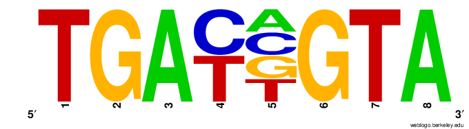
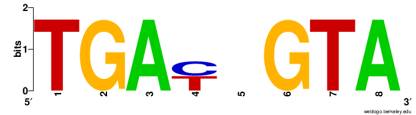
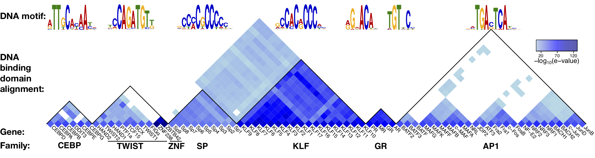

# Last time: Calling _de novo_ motifs and determining their occurences in sequences (motif scanning)

* **MEME**: Motif calling\
* **MAST**: Determine if motif(s) is present in sequence\
* **FIMO**: Determine location of all occurences of motifs in a sequence\


# Today:

* Matrixes that define motifs (frequency and weighted matrixes) \
* Comparison of motifs to databases of known motifs

# Inspect MEME results (quick exercise)

First, let's look at the results from our `meme` analysis.  You can copy it to from the server at this location: \
`/home/FCAM/meds5420/motif`\
Open the .html and .txt files to see the results 

## Motif Matrices Motif
**Position Frequency Matrix (PFM):** represents the frequency of each base occurrence at each position within the motif (Raw data):

```{r  out.width = "90%", echo=F, fig.align = "center", fig.cap="Position frequency matrix"}
#library(knitr)
 
```

**Position Weight Matrix (PWM):**
Score for probablility that a base will be present at a given position. Considers the numbers of sequences and background frequency of bases. PWMs are a more realistic reflection of the binding strength of a protein for a given sequence.

```{r  out.width = "90%", echo=F, fig.align = "center", fig.cap="Position weight matrix"}
#library(knitr)
 
```


Matrixes can be in many formats, see: [http://meme-suite.org/doc/overview.html#motif_conversion_utilities](http://meme-suite.org/doc/overview.html#motif_conversion_utilities).

You can create Sequence Logos from your enriched sequences with weblogo: [http://weblogo.berkeley.edu/logo.cgi](http://weblogo.berkeley.edu/logo.cgi) or a vector image using `ceqlogo`:

```{r engine='bash', eval=F, echo=TRUE}
ceqlogo -i meme.txt -m 2 -f EPS -o atf1.eps
```
## Comparing Your Motif to Databases

Motif databases:
JASPAR:[http://jaspardev.genereg.net/](http://jaspardev.genereg.net/).\
CisBP: [http://cisbp.ccbr.utoronto.ca/TFTools.php](http://cisbp.ccbr.utoronto.ca/TFTools.php)\

Transfac: [http://www.gene-regulation.com/pub/databases.html](http://www.gene-regulation.com/pub/databases.html)  \
HOCOMOCO: [http://hocomoco11.autosome.ru/](http://hocomoco11.autosome.ru/)\


**Notes:**\
JASPAR DB is highly curated from a number of sources.\
CisBP is a largely single experimental effort:
see: [http://www.sciencedirect.com/science/article/pii/S0092867414010368](http://www.sciencedirect.com/science/article/pii/S0092867414010368)\
HOMER:  [http://homer.ucsd.edu/homer/custom.motifs](http://homer.ucsd.edu/homer/custom.motifs)
Transfac in NOT open access.  However, UConn recently purchased University-wide licenses for GeneXplain which accesses the Transfac database: [http://genexplain.com/](http://genexplain.com/) \
HOCOMOCO was made from the motif search tool ChIPmunk (not covered in this course):[http://autosome.ru/ChIPMunk/](http://autosome.ru/ChIPMunk/)


## Motif database access and aquisition

**NOTE:** Database must be in `meme` format.  Several formats can be converted using tools from the MEME tools suite.\
see: [http://meme-suite.org/doc/overview.html#motif_conversion_utilities](http://meme-suite.org/doc/overview.html#motif_conversion_utilities).

For instance, the JASPAR motifs look like this:
```{r engine='bash', eval=T, echo=TRUE}
head ./JASPAR_all_matrix.txt
```

To convert a whole directory of JASPAR motif files:
```{r engine='bash', eval=F, echo=TRUE}
jaspar2meme -pfm DIRECTORY_INPUT > jaspar.meme

```

`-pfm`: specifies input format

```{r engine='bash', eval=T, echo=TRUE}
head -28 ./jaspar.meme | tail -20
```
 
A complete list of JASPAR and other database motifs can be found and downloaded from the `MEME` website:\
[https://meme-suite.org/meme/db/motifs](https://meme-suite.org/meme/db/motifs)\

I typically download the databases directly from meme: [https://meme-suite.org/meme/meme-software/Databases/motifs/motif_databases.12.22.tgz](https://meme-suite.org/meme/meme-software/Databases/motifs/motif_databases.12.22.tgz)

You can find a few database files here: `/home/FCAM/meds5420/TF_db/JASPAR/` \
I found that you need to copy them locally to use the files as input for TOMTOM.

# TOMTOM usage

We can use TOMTOM to compare our discovered motif to databases of known motifs.
See documentation: [http://meme-suite.org/doc/tomtom.html?man_type=web](http://meme-suite.org/doc/tomtom.html?man_type=web)
Output is a .html file and a text file.  The file shows the name of the motifs (database ID), the significance of the match and the relevant consensus sequences.

Basic usage:
```{r engine='bash', eval=F, echo=TRUE}
tomtom -eps -oc tomtom_OUTPUT meme.txt DATABASE.meme
```

* `-eps`: creates an seqLogo of your motif aligned to each known motif that is similar.\
* `-oc`: output folder\
* `meme.txt` is the output text file from your meme analysis.\
* `DATABASE.meme` is the database containing the PWM of known TFs.\

Here's an example usage with more options:
```{r engine='bash', eval=F, echo=TRUE}
tomtom -no-ssc -oc tomtom_OUPUT -verbosity 1 -min-overlap 5 -mi 1 -evalue -thresh 0.05 meme.txt DATABASE.meme
```

* `-m` which motif(s) to use (depends on the number in your meme.txt file)\
* `-verbosity (1-5)` progress reporting\
* `-min-overlap` minimum number of bases overlapping between your motif and the database motifs\
* `-evalue` p-value for the match corrected for multiple testing\
* `-thresh` threshold to apply to the significance testing.\


# Motif similarity / redundancy 

## Question . . . Why do we get so many hits for our motifs from TF databases?

Many transcription factors are part of families of transcription factors that have arisen through genome or local duplication events, or in rare cases through convergent evolution.  TFs in families provide redundancy, but sequence divergence amongst family members allows certain TFs to interact with different partners and / or respond to different signaling queues.  However, the DNA binding domains are often the most conserved part of these proteins, which results in overlapping and similar binding sites for seemingly distinct TFs.


```{r  out.width = "100%", echo=F, fig.align = "center", fig.cap="Paralogous TF DBDs. The heat map shows the degree of protein sequence conservation amongst transcription factor families that bind similar concensus motifs (indicated by the sequence logo at the top). Note that Twist and ZNF appear to be an example of convergent evolution."}
#library(knitr)
 
```


# **In Class Exercise:**
1)  There are converted JASPAR databases in the following location\
`/home/FCAM/meds5420/TF_db/JASPAR/`.  Use either database to compare to your motif using `tomtom`.\

2) View the beginning of the tomtom.tsv output—this is just a tab-separated values text file: `.tsv`.  Notice that the protein ID is in the format like `MA0604.1` Use `grep` on the original JASPAR.meme file to find out the common transcription factor name of some of your top hits. Use `grep` to see if any Atf1 motifs are found\

3) Copy the `.html` file to your local computer and view it in the browser. Any surprises regarding the TFs found?\

4) Try searching for your motif using the web version of TOMTOM.  Do you see any differences in the results?\
\


\pagebreak


# Answers to In Class Exercise:

running TomTom
```{r engine='bash', eval=F, echo=TRUE}
#switch to directory above where meme was performed:
tomtom -no-ssc -oc tomtom_OUPUT -verbosity 1 -min-overlap 5 -mi 1 -evalue -thresh 0.05 ATF1_classic.meme_output/meme.txt JASPAR2022_CORE_vertebrates_non-redundant.meme
```

grep out some top hits:
```{r engine='bash', eval=F, echo=TRUE}
grep MA1131.1 /home/FCAM/meds5420/TF_db/JASPAR/JASPAR2022_CORE_vertebrates_redundant.meme
grep MA0604.1 /home/FCAM/meds5420/TF_db/JASPAR/JASPAR2022_CORE_vertebrates_redundant.meme

#the - means that stdin is passed to grep:
grep -i atf1 JASPAR2022_CORE_vertebrates_redundant.meme | cut -d ' ' -f2 | grep -f - tomtom.tsv 
```
You can also search JASPAR online as well.

```


