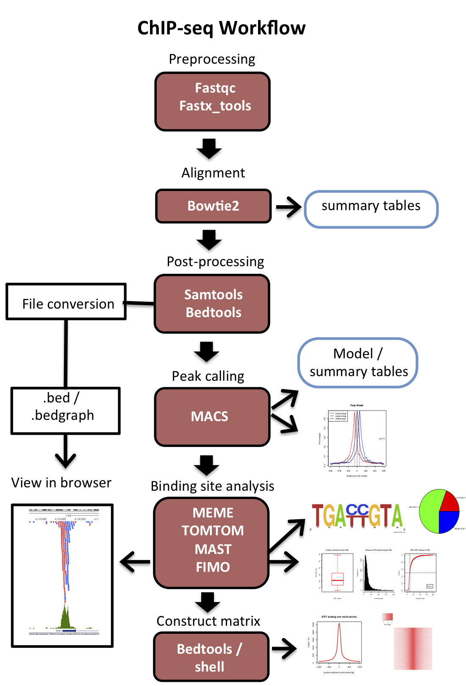
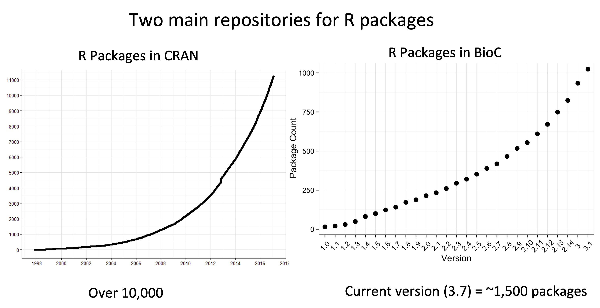
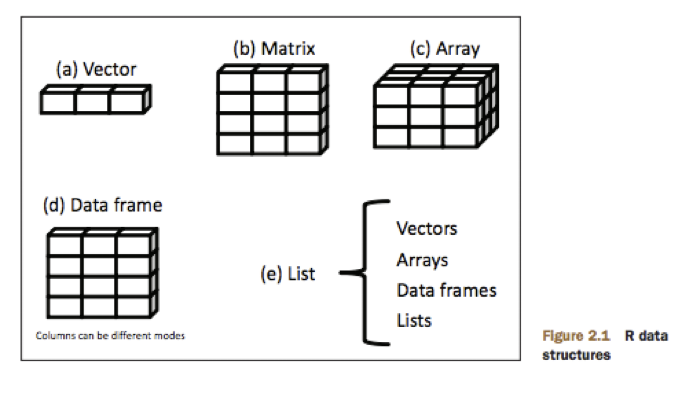

```{r  out.width = "100%", echo=F, fig.align = "center", fig.cap="ChIP-seq schematic"}
#library(knitr)
 
```


\subsection {Up to now: Data Distillation}

```{r  out.width = "100%", echo=F, fig.align = "center", fig.cap="Shrinking data"}
#library(knitr)

knitr::include_graphics("./data_distillation.png") 
```


# Today: Using R to manipulate, parse, and perform statistics on data frames

## What is R?
R is an open source programming language and environment. It is partially based on the S statistical software originally developed by Bell Laboratories. R is useful for:
  
  * Handling data: maniupulation, conversion, and storage
  * Graphing or plotting data
  * Performing statistics 
  * Modeling data

# Downloading and installing R-base and R-packages:

* R comes with most installations of Linux, Mac OS, and Windows but you can do custom installs or update to newer versions on your own.  
* You can go to [http://www.r-project.org/about.html](http://www.r-project.org/about.html) to get all the info you need.

* R versions are kept at the *CRAN* (Comprehensive R Archive Network) website: [http://cran.r-project.org/](http://cran.r-project.org/)
    - To download you first need to choose a CRAN site near you from which to download (called a mirror).

On a MAC, you can download binaries for easy install. There are also R-GUIs available for MACs that can make using it slightly easier.\
With Linux, you can install or update R with command line:
```{r engine='bash', eval=F, echo=TRUE}
sudo apt-get install r-base
OR
sudo brew install r-base
``` 
\
\
\

```{r pressure,  out.width = "100%", echo=F, fig.align = "center", fig.cap="Cran and BioConductor packages over time"}
#library(knitr)
 
```
## `R` resources

* Books listed in syllabus
* Software Carpentry: [https://datacarpentry.org/R-ecology-lesson/02-starting-with-data.html](https://datacarpentry.org/R-ecology-lesson/02-starting-with-data.html)
* R for Data Science: [https://r4ds.had.co.nz/](https://r4ds.had.co.nz/)
 


## R packages

* R on it's own (R-base), has many basic statistical and plotting functions.
* R can also be enhanced by installing any of the many 'modules' or 'packages' that are available at:
    - The CRAN website: [http://cran.r-project.org/src/contrib/](http://cran.r-project.org/src/contrib/)
    - Another repository called bioconductor: [http://www.bioconductor.org/](http://www.bioconductor.org/).
    - Discussion of differences between CRAN and BioC: [https://blog.revolutionanalytics.com/2015/08/a-short-introduction-to-bioconductor.html](https://blog.revolutionanalytics.com/2015/08/a-short-introduction-to-bioconductor.html)]
* `R` Packages are collections of functions or compiled software that are designed to run in the `R` environment.  
* Lots of people all over the world contribute to the many thousands of packages available.


## Intro to R sessions

To start an are session type `R` in the command line:
```{r engine='bash', eval=F, echo=TRUE}
R
``` 
You are now in an R environment.  Notice command prompt: `>` \

R commands have their own syntax, and it is somewhat different than shell commands.  In general the format for `R` commands or functions is as follows:

```command(<INPUTS>, <OPTIONS>)```

To get information on how to use a command, use:

`help(COMMAND)` OR `?COMMAND`


`R` anchors itself in whatever directory you were in when you started the session.  To see where you are, use:

```{r, eval=T, echo=TRUE}
getwd() # no input or options needed
``` 

You can also run shell commands in R:

```{r, eval=T, echo=TRUE}
system("pwd")
```

To change the directory you are working in:
```{r, eval=F, echo=TRUE}
setwd(<DESIRED_PATH>) 
``` 

To install packages from CRAN:
```{r, eval=F, echo=TRUE}
install.packages("PACKAGE_NAME")
```

To install packages from Bioconductor:
Install bioconductor:
```{r, eval=F, echo=TRUE}
source("http://bioconductor.org/biocLite.R") # download source
biocLite() # install bioclite
biocLite("PACKAGE_NAME")
```

These packages are stored in the 'library' directory on your computer.  You can view a list of installed packages with:
```{r, eval=F, echo=TRUE}
library()
```

To load a package for use in the current R workspace session:
```{r, eval=F, echo=TRUE}
biocLite("PACKAGE_NAME")
```

To find out what `R` version you have and what packages are currently loaded:
```{r, eval=F, echo=TRUE}
sessionInfo()  
```

To get help with a function:
```{r, eval=F, echo=TRUE}
help(<FUNCTION>) 
```
To quit R:
```{r, eval=F, echo=TRUE}
quit() # or just q()
```


# Data Types:
* Character
      - letters, strings

* numeric
      - numbers
      
* Factors 
      - Categorical variables for plotting or statistical modeling


You can test whether a variable or data is any of these types as follows:

To quit R:
```{r, eval=F, echo=TRUE}
is.numeric(<VALUE>)
```
Examples:
```{r, eval=T, echo=TRUE}
is.numeric(3)
```
```{r, eval=T, echo=TRUE}
is.numeric(T)
```
```{r, eval=T, echo=TRUE}
is.character(3)
```
Quotes always makes the value a character:
```{r, eval=T, echo=TRUE}
is.numeric("3")
is.character("3")
```
However, you can force a character to become numeric if needed:
```{r, eval=T, echo=TRUE}
# Print 3 as character:
"3"

#Print 3 as a number
as.numeric("3")
```
## Data structures:

* one dimensional:
    - lists
    - vectors
    
* two dimensional:
    - data frames
    - matrixes
    
* multi-dimensional
    - arrays
    - lists


```{r  out.width = "100%", echo=F, fig.align = "center", fig.cap="data structures"}
#library(knitr)
 
```


--------------------------------------------------

## Lists and Vectors

* Are similar in that they are both one dimensional, but.. \
* Lists can be a mixture of data types (strings, numbers) \ 
* Vectors can be of any type but only one type at a time \


**Vectors**\
elements of a vector are combined with the format `c(<element1>, <element2>, etc . . .)`
```{r, eval=F, echo=TRUE}
v <- c(4,5,6) # multiple elements must be combined with c().
v
```
**Note:** `<-` is an assignment operator used with `R`.  `=` can also be used, but `<-` is conventional.  A decent explanation on the difference is provided here:\
[https://renkun.me/2014/01/28/difference-between-assignment-operators-in-r/](https://renkun.me/2014/01/28/difference-between-assignment-operators-in-r/) \


To access elements with in a vector, you can use their position or 'index':
```{r, eval=F, echo=TRUE}
v[2] # position with the vector is designated with square brackets [].
v[1]/v[2] # simple math with vector indexes
```


Remember: you cannot easily combine data types with vectors:
```{r, eval=T, echo=TRUE}
ve <- c(c(4,5,6), c('flapjack', 'waffle', 'frenchtoast'))
ve
```

* The numbers are in quotes, because they are no longer considered numbers. For instance: try doing math with the elements in vector: \
* This is because vectors can only handle one data type at a time. \

```{r, eval=F, echo=TRUE, error=FALSE}
ve[1]/ve[2]
```

**Lists** \

Lists can hold mutliple data types and can be nested:
```{r, eval=T, echo=TRUE}
vl <- list(c(4,5,6), c('flapjack', 'waffle', 'frenchtoast'))
vl
```
*Compare this output to that from the vector (`ve`) above.

Accessing items in list is similar:
```{r, eval=T, echo=TRUE}
vl[[1]][2] # access 2nd item of first item in the list
vl[[1]][1]/ vl[[1]][2] # divide first item of first item in the list by the second
```


## Matrices and DataFrames

Vectors can be combined to create matrixes using `cbind` or `rbind`:

```{r, eval=T, echo=TRUE}
vec1 <- c(10, 9, 8)
vec2 <- c(7, 6, 5)
cbind(vec1,vec2)
```
OR
```{r, eval=T, echo=TRUE}
rbind(vec1,vec2)
```
This makes a matrix.  

```{r, eval=T, echo=TRUE}
mat=cbind(vec1,vec2)
is.matrix(mat)
# like vectors, matrices can only handle one type of data at a time
```

Regardless of how you create the matrix, they can be transposed:
```{r, eval=T, echo=TRUE}
t(mat)
```
Like vectors, matrices can only handle one data type at a time.  To combine data types in a table, you can create dataframes.
\
You can also specify that you want a matrix directly as follows:
For a matrix:
```{r, eval=T, echo=TRUE}
matrix(c(vec1, vec2), ncol=2)
```

**Dataframes** \
Vectors of different types can be combined into dataframes:

```{r, eval=T, echo=TRUE}
list1= c(5,6,5)
list2= c('flapjack', 'waffle', 'frenchtoast') 
data.frame(list2, list1)
```

We can also save this data.frame as a variable in our session.

```{r, eval=F, echo=TRUE}
df<-data.frame(list2, list1)
```

We can also set or change column names.
```{r, eval=T, echo=TRUE}
df<-data.frame(list2, list1)
colnames(df)<-c("name", "price")
df
```

We can also set column names from the start.
```{r, eval=F, echo=TRUE}
list1= c(5,6,5)
list2= c('flapjack', 'waffle', 'frenchtoast') 
data.frame(names=list2, price=list1)
# notice that each column can be assigned a name
```

This table is a data frame.  You can test this with:
```{r, eval=T, echo=TRUE}
# Set df variable equal to our table:
list1= c(5,6,5)
list2= c('flapjack', 'waffle', 'frenchtoast') 
df<-data.frame(names=list2, price=list1)
is.data.frame(df)
# like lists, data frames can handle multiple types of data 
# (string and numbers in this case).
```


Dataframes can be merged if they have a common column:  
```{r, eval=T, echo=TRUE}
# consider two dataframes
dfA<- data.frame(names = c("A", "B"), data1 = c(5,6))
dfB<- data.frame(names = c("A", "B"), data2 = c(10,11))
# merge them together
dfC <- merge(dfA, dfB, by="names")
dfC
```
You can specificy the column by which to match in a number of ways (see below).

# Accessing elements of matrixes and data frames:
Accessing elements of tables is similar to lists and vectors, but with two dimensions:
```{r, eval=T, echo=TRUE}
data.frame(names=list2, price=list1)
df[2,1]  # specifies item in second row, first column.
```

To access an entire column or row at once:
```{r, eval=T, echo=TRUE}
df[,1]  # specifies entire first column.
df[3,]  # specifies 3rd row.
```
To access a range of columns or row:
```{r, eval=T, echo=TRUE}
df[1:2,1]  # specifies first two rows of column 1.
```

## Loading your own data frames: 
To load your own data frames you can use `read.table()`
```{r, eval=F, echo=TRUE}
read.table("<FILENAME>", header=T, sep='\t')
# Header states that there are column names at the beginning of each column to be used
# sep ='\t' specifies that the file is tab-delimited
```

Read in the file `/home/FCAM/meds5420/data/ATF1/closest_peak_TSS/peaks_promoters.bed` from the server and save it as a variable:

```{r, eval=T, echo=FALSE}
install.packages(c("data.table"), repos="http://cran.rstudio.com/")
```

```{r, eval=T, echo=TRUE}
library(data.table)
x.frame = read.table('peaks_promoters.bed', header=FALSE, sep = '\t')
is.data.frame(x.frame)
is.data.table(x.frame)
```

You can also load .csv files:
```{r, eval=F, echo=TRUE}
read.csv("<FILENAME>", header=F, sep=',')
# sep = ',' specifies that the files is comma-separated
```

## Working with data:
For now lets look a datset that's already in your environment, called`Puromycin`:

```{r, eval=T, echo=TRUE}
head(Puromycin)
```
This and other tables come preloaded with various packages and are often meant to be used as examples in tutorials. \
To find all the tables tutorial tables type
```{r, eval=F, echo=TRUE}
data() # shows all tables available
```

Here are some useful functions when working with tables:\

Show all tables currently loaded in environment:
```{r, eval=T, echo=TRUE}
ls() # list current tables in environment
```

Remove a item from environment
```{r, eval=T, echo=TRUE}
rm() # list current tables in environment
```
Remove all tables from envirnoment
```{r, eval=F, echo=TRUE}
rm(ls()) # list current tables in environment
```

Get the end of a table:
```{r, eval=T, echo=TRUE}
tail(Puromycin)
```

Get the number of rows:
```{r, eval=T, echo=TRUE}
nrow(Puromycin)
```
Get the number of rows:
```{r, eval=T, echo=TRUE}
ncol(Puromycin)
```

Get both the number of rows and columns:
```{r, eval=T, echo=TRUE}
dim(Puromycin)
dim(Puromycin)[2] # just number of columns
```
Get column names of table:
```{r, eval=T, echo=TRUE}
names(Puromycin)
```
Get summary information about tables:
```{r, eval=T, echo=TRUE}
summary(Puromycin)
```
Get structural information about tables:
```{r, eval=T, echo=TRUE}
str(Puromycin)
```
Specifcy columns by name:
```{r, eval=T, echo=TRUE}
Puromycin$rate[1:6]
# '$' specifies column name, also indexed for first 6 items in this example
# OR
head(Puromycin$rate) # just another way of doing the above
```
Simple math operations:
```{r, eval=T, echo=TRUE}
mean(Puromycin$rate)
```

Other mathematical operators are:

* sum \
* median \
* mode \
* sd (standard deviation) \
* max \
* min \

Slightly more complex, but powerful functions:\
\
`aggregate` will perform an operation on a set of data, and separate the results based on a set of categories or 'factors' that you provide.  It returns a data frame of the results.\

More on factors can be found here:\ [http://www.stat.berkeley.edu/~s133/factors.html](http://www.stat.berkeley.edu/~s133/factors.html)

```{r, eval=T, echo=TRUE}
aggregate(Puromycin$rate, by=list(Puromycin$state), mean)
```

**tapply** is similar to aggregate, but returns a matrix.
```{r, eval=T, echo=TRUE}
tapply(Puromycin$rate, list(Puromycin$state), mean)
```

## `data.tables`

There is also a package that creates a more advanced data.frame called a `data.table`.  `data.tables` have several advantages that we will see over the course of using R.  Among them is being able to operate on columns using indexing and factors as shown above with simpler expressions and increased speed.  It is generally recommended that new users start with `data.tables` as soon as possible to develop good habits.\

See discussions:
[https://stackoverflow.com/questions/18001120/what-is-the-practical-difference-between-data-frame-and-data-table-in-r](https://stackoverflow.com/questions/18001120/what-is-the-practical-difference-between-data-frame-and-data-table-in-r) \

[https://www.analyticsvidhya.com/blog/2016/05/data-table-data-frame-work-large-data-sets/](https://www.analyticsvidhya.com/blog/2016/05/data-table-data-frame-work-large-data-sets/)


[https://www.r-bloggers.com/data-table-or-data-frame/](https://www.r-bloggers.com/data-table-or-data-frame/)


There's also `tidyverse` which was created by Hadley Wickham:

- [https://cran.r-project.org/web/packages/tidyverse/index.html](https://cran.r-project.org/web/packages/tidyverse/index.html)

- [https://wetlandscapes.com/blog/a-comparison-of-r-dialects/](https://wetlandscapes.com/blog/a-comparison-of-r-dialects/)
\


Example:
```{r, eval=T, echo=TRUE}
library(data.table)

DT<- data.table(Puromycin)
DT[,mean(rate), by= state]

#Format = DATA.TABLE[row, column, by= factor_column]
#Notice that functions can be combined with column designations to operate on large tables.

```

## Converting table formats between 'wide' and 'long'


```{r, eval=T, echo=TRUE}
# consider this table
dfC <- merge(dfA<- data.frame(names = c("A", "B"), data1 = c(5,6)), dfB<- data.frame(names = c("A", "B"), data2 = c(10,11)), by="names")
dfC

```

You can `melt` the `data.frame` into a *long* format.
```{r, eval=T, echo=TRUE}

# merge tables together
dfC <- merge(dfA<- data.frame(names = c("A", "B"), data1 = c(5,6)), dfB<- data.frame(names = c("A", "B"), data2 = c(10,11)), by="names")
dfC

# melt to 'long' format
library(reshape)
df_melt <- melt(dfC, by=names, variable.name="data")

df_melt
```

Or `cast` to *wide* format
```{r, eval=T, echo=TRUE}

# merge tables together
dfC <- merge(dfA<- data.frame(names = c("A", "B"), data1 = c(5,6)), dfB<- data.frame(names = c("A", "B"), data2 = c(10,11)), by="names")
dfC

# melt to 'long' format
library(reshape)
df_melt <- melt(dfC, by=names,  variable.name="data")


# cast to 'wide' format
df_cast <- cast(df_melt, variable = data )
df_cast
```

# Managing data and saving your environment workspace

Saving tables, etc:
```{r, eval=F, echo=TRUE}
save(<R_OBJECT>, file="FILENAME.Rdata")
# saves file as binary file readable by R
```

loading saved tables:
```{r, eval=F, echo=TRUE}
load(file="FILENAME.Rdata")
```

**IMPORTANT:** The saved R object retains its original name regardless of the filename.  Thus, it may be difficult to find the object when loaded into your environment if you forget the original name or if you are opening an object from someone else.  There are several ways around this:

* Surround the load statement in parentheses `(load(file="FILENAME.Rdata"))` and the names of the loaded R object(s) will be printed to the screen.\
* Use the `get` command to assign the object a new name:
```{r, eval=T, echo=TRUE}
list<-c(1,2,3,4)
save(list, file="list.r")
dat<- load("list.r")
myList<- get(dat)

```
* Save the object as an `.RDS` file and then reassign it upon loading:

```{r, eval=F, echo=TRUE}
saveRDS=(R_object, "FILENAME.RDS")
```
```{r, eval=F, echo=TRUE}
myObj <- readRDS("FILENAME.RDS"))
```

**IMPORTANT!!:** Saving workspace environment:  This saves all the tables and variables you have created or loaded into an `R` sessions.  That way you can continue where you left off instead or recreating all your work.
```{r, eval=F, echo=TRUE}
save.image(file="NAME.Rdata")
# saves currently loaded variables, functions, and packages.
```

You can then load the saved workspace as follows:
```{r, eval=F, echo=TRUE}
load(file="NAME.Rdata")
#loads previous workspace and all the associated tables
```

# Writing tables to text file:
```{r, eval=F, echo=TRUE}
write.table(<R_Object>, file="FILENAME.txt", sep='\t', col.names=T, row.names=F, quote=F)
# you would reload this table with "read.table"
```

# Reading text files fast as `data.tables` with `fread`:
```{r, eval=T, echo=TRUE}
y.table = fread('peaks_promoters.bed')
is.data.frame(y.table)
is.data.table(y.table)
```

## writing `data.tables`:
You can write `data.table` fast with `fwrite`
```{r, eval=F, echo=TRUE}
fwrite(<DATA.TABLE>, file="FILENAME.txt", sep='\t', col.names=T, row.names=F, quote=F)
# you would reload this table with "fread(file=<DATA.table>"
```

# `Rscript` to run `R` code

Just like one can run a shell script using the command `bash scriptname.sh`, we can run a file with `R` code by calling it directly from the Terminal.

```{r engine='bash', eval=F, echo=TRUE}
touch filename.R
nano filename.R
# populate the file with R code and a few print statements
```

An example file to test `Rscript` (note the she bang is differnet for R scripts):

```{r, eval=F, echo=TRUE}
#!/usr/bin/env Rscript

print('test')
x <- mean(c(5,6,7,23))
print(x)
```

You can make the `.R` file in a text editor and call it directly from the terminal with `Rscript`:

```{r engine='bash', eval=F, echo=TRUE}
Rscript filename.R
```

The output will print to the screen and this can be coupled with `sbatch` to automate/submit a job and `tee` to generate log files. This is how you will compare using `awk`, `data.frame`, and `data.table` in your optional homework.


# For Next Time:
* Download and install `R` or `RStudio` from:
[http://www.rstudio.com/products/rstudio/download/](http://www.rstudio.com/products/rstudio/download/)


# In Class Exercises:
There are two tables (exp_untreated.txt, exp_treated.txt) in the following location: \

`/home/FCAM/meds5420/in_class/R_intro`

To Do:


**1.** Either copy these files to your local machine (using `sfto`) or work with them on the server in an `R` session. \
**2.** Read the tables into `R` and set them equal to a variable that makes sense (e.g. "untreated", "treated"). \
**3.** Create column names for the data tables (i.e. "genes" for column 1, and "treated" or "untreated" for column 2) \
**4.** Merge the tables into one table with the `merge()` function \
**5.** Calculate a mean, median, and standard deviation for the treated and untreated samples. \
**6.** Create a new column in the dataframe that has the fold change (treated/untreated) for the data. \
**7.** Devise a way to merge the untreated and treated such that all data names and numbers are in the same column and a third `factor` column designates treated/untreated. \
**8.** Use `aggregate()` to calculate the mean, median, and standard deviation for each treatment from this new table. \
**9.** Convert the table to a `data.table` and then calculate the same parameters as above. \
**10.** Try saving and reading back in your tables.


\pagebreak


# Answers to In Class Exercises:


Read the tables into R and set them equal to a variable that makes sense (e.g. "untreated", "treated")
```{r, eval=F, echo=TRUE}
#first look at the data structure to determine how to read it in
system("head exp_treated.txt")

#then read them in
treated <- read.table("exp_treated.txt", header=F, sep=" ")
untreated <- read.table("exp_untreated.txt", header=F, sep=" ")


```
Create column names for the data tables (i.e. "genes" for column 1, and "data" for column 2)
```{r, eval=F, echo=TRUE}

colnames(treated) <- c("genes", "data")
colnames(untreated) <- c("genes", "data")
```
Merge the tables into one table with the `merge()` function
```{r, eval=F, echo=TRUE}
merged <- merge(treated, untreated, by="genes")
```

Calculate a mean, median, and standard deviation for the treated and untreated samples.
```{r, eval=F, echo=TRUE}
mean(treated$data)
median(treated$data)
sd(treated$data)

#etc. . . .
```
Create a new column in the dataframe that has the fold change (treated/untreated) for the data.
```{r, eval=F, echo=TRUE}
merged[,4] <- merged[,2]/merged[,3]

#or

foldChange <- data.frame(merged, fc<-merged[,2]/merged[,3])
```
Devise a way to merge the untreated and treated such that all data names and numbers are in the same column and a third `factor` column designates treated/untreated.
```{r, eval=F, echo=TRUE}
# first add a column with the trement state to both
treated <- data.frame(treated, state="treated"
untreated <- data.frame(untreated, state="untreated"  

#Then use rbind to merge the tables
merged <- rbind(treated, untreated)
```
Use `aggregate()` to calculate the mean, median, and standard deviation from this new table.

```{r, eval=F, echo=TRUE}
aggregate(merged$data, by=list(merged$state), mean)
aggregate(merged$data, by=list(merged$state), median)
aggregate(merged$data, by=list(merged$state), sd)
```
\

Convert the table to a data.table and then calculate the same parameters as above.
```{r, eval=F, echo=TRUE}

library(data.table)

#Convert to data.table
DT <- data.table(merged)

#Calculations
DT[, mean(data), by = state]
DT[, median(data), by = state]
DT[, sd(data), by = state]
``` 

