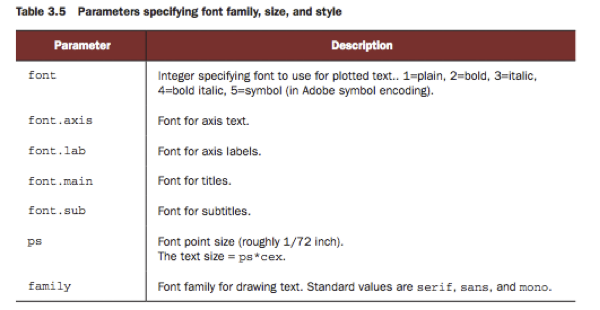
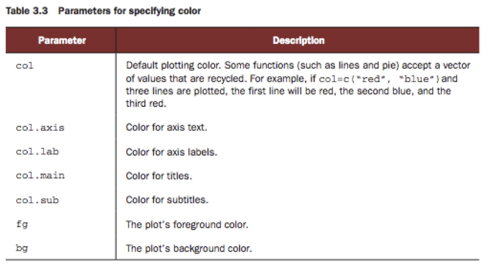
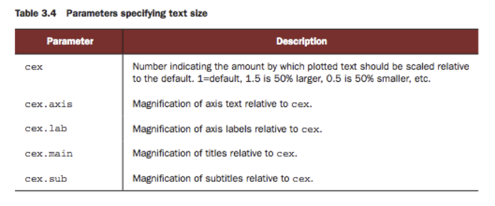
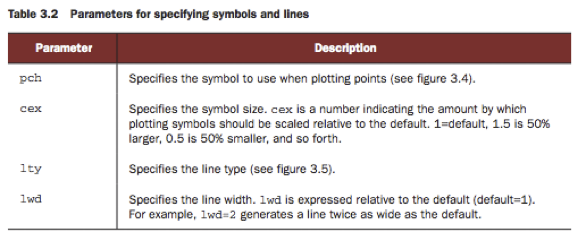
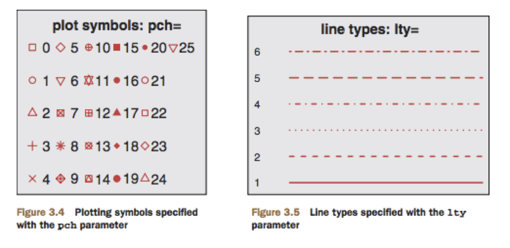

# Relevant R tutorials and resources:

1) Software carpentry: [https://swcarpentry.github.io/r-novice-gapminder/](https://swcarpentry.github.io/r-novice-gapminder/)\
2) Detailed R tutorial: [http://adv-r.had.co.nz/](http://adv-r.had.co.nz/)\
3) Several images in today's tutorial are from the book **R in Action**.   Can be purchased here: [http://www.manning.com/kabacoff/](http://www.manning.com/kabacoff/) or on Amazon.\
4) **Quick R** is also one of many good resources for plotting: [http://www.statmethods.net/](http://www.statmethods.net/)


# Before we begin:

* Download and install the correct version of `R` (and `RStudio` if you'd like) from:
[http://www.rstudio.com/products/rstudio/download/](http://www.rstudio.com/products/rstudio/download/)

*  Also, copy the following files from the server to your computer or home directory on Xanadu for loading into `R`: \
`/home/FCAM/meds5420/data/ATF1/closest_peak_TSS/peaks_promoters.bed` 
`/home/FCAM/meds5420/data/ATF1/reads_in_peaks/ATF1_summits_rep1_counts_2col.bed`
`/home/FCAM/meds5420/data/ATF1/reads_in_peaks/ATF1_summits_rep2_counts_2col.bed`
* Make a directory in your class folder on your machine (or on Xanadu), and move the file there.

# Today: Intro to `R` and Basic of plotting with `R`

## More basic `R`: subsetting tables

Open an `R` environment and set you working directory to folder where the `peaks_promoters.bed` file is.

```{r, eval=T, echo=TRUE}
getwd() # no input or options needed
``` 

```{r, eval=F, echo=TRUE}
setwd("/Users/guertinlab/MEDS5420") 
getwd()
```
The `peaks_promoters.bed` file contains information on which gene TSS is closest to ATF1 peaks that we called with MACS. Recall that we used `bedtools closest` to find the distance between ATF1 summits and TSSs and report them relative to genes with consideration of strand.

Read this table into your R session with `read.table`:

```{r, eval=F, echo=T}

#read in table
closest <- read.table("peaks_promoters.bed")

#check structure
head(closest,3)
```

```{r, eval=T, echo=F}
#read in table
closest <- read.table("peaks_promoters.bed")

#Check structure
head(closest,3)
```

Let's check how many chromosomes are present in this data:
```{r, eval=T, echo=T}
#report unique items in a list or vector
unique(closest[,1])
```
Looks like this is the whole dataset, but what if you only want the part from your chromosome. \ 
Here are two ways to do this:

```{r, eval=T, echo=T}
#subset a table based on a logical match to a column
closest_chr17<- subset(closest, closest[,1]=='chr17')
head(closest_chr17, 3)
```
\textbf{OR}
```{r, eval=T, echo=T}
#subset a table based on a logical match to a column
closest_chr17<- closest[closest[,1]=='chr17',] 
#notice the syntax is based on table indexing
head(closest_chr17, 3)
```


**Notes on relational operators for logical tests:**\
Site: [http://sites.stat.psu.edu/~dhunter/R/html/base/html/Comparison.html](http://sites.stat.psu.edu/~dhunter/R/html/base/html/Comparison.html)\
**Operator**    :      **Interpretation**

 
1)	x `<` y         :               x is less than y 
2) 	x `>` y         :               x is greater than y
3) 	x `<=` y        :               x is less than or equal to y
4)	x `>=` y        :               x is greater than or equal to y
5)	x `==` y        :               x is equal to y
6)	x `!=` y        :               x is not equal to y

Also when conducting logical tests:

* ` & ` = and
* ` | ` = or


# Plotting distributions

## Boxplots
One simple way to plot the distribution of a data set is to use boxplots:
\
```{r, eval=T, echo=T, fig.height=3, fig.width=4.2}
boxplot(closest[,12])
```

## What do boxplots show?

```{r  out.width = "90%", echo=F, fig.align = "center", fig.cap="anatomy of a box plot"}
#library(knitr)
knitr::include_graphics("./box_plot.png") 
```

**median - ** Middle dark line.\
**box -** Interquartile ranges. i.e. extending from 25th percentile to 75th percentile.\
**whisker -** Extremes (cover 90% of the data).\
**outliers -** Points outside of whiskers.\
\
The default parameters from `boxplot` are not great for publication. However, there are options specific to the boxplot function that we can use to make the figure more meaningful and understandable.\

For instance: see `help(boxplots)`)

  * remove outliers (`outline=F`)
  * color border (`border="red"`)
  * border thickness (`lwd=2`)

```{r, eval=T, echo=T, fig.height=5, fig.width=4.2}
boxplot(closest[,12], outline=FALSE, border='red', col='white', lwd=2)
```


**lwd** = line width\
**col** = inside box color\
**border**= border color\
**outline**= display outliers (if TRUE)\


## Commonly used options with graphs:

* graph size \
* margins \
* Axis labels (xlab, ylab) \
* Axis font, size, color \
* graph title (main ="title") \
* legend \
* line, fill colors \
* line width \







```{r, eval=T, echo=T, fig.height=5, fig.width=5.2}
boxplot(closest[,12], outline=F, col='blue', lwd=2, 
        xlab='ATF1 peaks', ylab='distance (bp)', 
        main = "Distance of peaks from gene TSSs")
```


# Histograms
```{r, eval=T, echo=T, fig.height=5, fig.width=4.2}
hist(closest[,12])
```

`hist` also creates an object with several informative attributes, that you can maintain in your workspace by assigning a variable to `hist()`.  

```{r, eval=T, echo=T, fig.height=5, fig.width=5.2}
closest_hist<-hist(closest[,12], plot=F)
```

```{r, eval=T, echo=T, fig.height=5, fig.width=5.2}
#see names of associated data
names(closest_hist)

# print all associated data
closest_hist

# print 'summary' of the data
summary(closest_hist)
```

**Options when plotting histograms**


```{r, eval=T, echo=T, fig.height=3, fig.width=5.2}
#breaks sets the number of divisions for grouping bars
closest_hist<-hist(closest[,12], plot=T,
                   main="Distance of ATF1 peaks from gene TSSs", 
                   xlab="Distance (bp)")
```

## Controlling axis limits and bin size (breaks)

One can also add detail to the plot by increasing the number of  `breaks` in the distribution.
```{r, eval=T, echo=T, fig.height=3, fig.width=5.2}
#breaks sets the number of divisions for grouping bars
closest_hist<-hist(closest[,12], plot=T, xlim= c(-50000, 50000), breaks=500,
                   main="Distance of ATF1 peaks from gene TSSs", 
                   xlab="Distance (bp)")
```

Having the histogram information saved in your workspace allows you to plot this in different ways:

```{r, eval=T, echo=T, fig.height=3, fig.width=5.2}
#plot points of histogram
plot(closest_hist$mids, closest_hist$counts, xlim= c(-50000, 50000),
     main="Distance of ATF1 peaks from gene TSSs", 
     xlab="Distance (bp)", ylab="Frequency")
```

```{r, eval=T, echo=T, fig.height=3, fig.width=5.2}
#plot points of histogram
plot(closest_hist$mids, closest_hist$counts, xlim= c(-50000, 50000),
     type="l", lwd=2, col='red',
     main="Distance of ATF1 peaks from gene TSSs", 
     xlab="Distance (bp)", ylab="Frequency")
```

**Options with lines and symbols:**





**adding plots/lines to graphs:**
```{r, eval=T, echo=T, fig.height=3, fig.width=5.2}
#plot points of histogram
plot(closest_hist, 
     main="Distance of ATF1 peaks from gene TSSs", xlab="Distance (bp)", 
     ylab="Frequency", xlim= c(-50000, 50000))

lines(closest_hist$mids, closest_hist$counts, type="l", lwd=2, col='red')
```

# Cumulative Distibution Plots (CDF)

The cumulative distribution adds to the y-axis as more groups are more groups (x-axis) are encountered. `ecdf()` will create an object that can be used for plotting a distribution.

```{r, eval=T, echo=T, fig.height=3, fig.width=5.2}
#create ECDF object
closest_cdf <- ecdf(closest[,12])

plot(closest_cdf, xlim= c(-50000, 50000))
```

**Add lines to plots:**
Lets add a vertical, dotted line at the median:

```{r, eval=T, echo=T}
#first find the median
quantile(closest[,12])
```
OR
```{r, eval=T, echo=T}
median(closest[,12])
```


```{r, eval=T, echo=T, fig.height=3, fig.width=5.2}
#create ECDF object
plot(closest_cdf, xlim= c(-50000, 50000),
     main = "CDF of ATF1 distance to TSSs", 
      ylab='fraction', xlab="Distance (bp)")
#add vertical line at median
abline(v=median(closest[,12]), lty=2)
abline(h=.5, lty=2)
```

## Adding legends
See help(legend)
```{r, eval=T, echo=T, fig.height=3, fig.width=5.2}

plot(closest_cdf, col='red', xlim= c(-50000, 50000),
     main = "CDF of ATF1 distance to TSSs", ylab='fraction', xlab="Distance (bp)")
abline(v=median(closest[,12]), lty=2)
abline(h=.5, lty=2)

#Specify position, symbol type, col, box type
legend('bottomright', c("ATF1"), inset= 0.1, pch=19, col='red')
# symbol can be made a line with "lty="
```


# Saving plots

Saving plots is easy:\
You can save the current plot window with:
```{r, eval=F, echo=T}
dev.copy(jpeg,filename="plot.jpg")
dev.off()
```

It is better to specify the file first, plot to it, and then close the device:
```{r, eval=F, echo=T}
# can be done with jpeg, pdf, tiff, eps, png, etc. formats
pdf(file="plot.jpg", width=4, height=4)
# Do your plotting
# Add a Legend
dev.off()
```

# Functions

Functions are routines that perform specific tasks. The basic form of a function is as follows:

```{r, eval=F}
function_name <- function(arg_1, arg_2, ...) {
   Function body 
}
```

The following function will add two input values together and multiply the result by 14:

```{r, eval=F}
add.numbers.fourteen <- function(x, y) {
   z = (x + y)*14
   return(z)
}

add.numbers.fourteen(1,2)

res = add.numbers.fourteen(1,2)

print(res)
```

# In class exercise 1 (plotting):
You will:

* practice reading in data sets \
* Practice subsetting datasets \
* practice plotting peak data as histogram  \
* practice dealing with replicates and plotting scatterplots. \

Get the following files using `sftp` from the server if you haven't already:
```{r long_output, eval=F}
get /home/FCAM/meds5420/data/ATF1/closest_peak_TSS/peaks_promoters.bed
get /home/FCAM/meds5420/data/ATF1/reads_in_peaks/ATF1_summits_rep1_counts_2col.bed
get /home/FCAM/meds5420/data/ATF1/reads_in_peaks/ATF1_summits_rep2_counts_2col.bed
```

## Plot peaks across chromosome

* Try plotting the intensity of the peaks from the first replicate counts file (y-axis) across your chromosome (peaks/promoters file) (x-axis). \
    - Use a summit coordinate as the chromosomelocation. \
    - The number of reads per region is in the counts file (see bedtools coverage manual for how we would get this file). \
    - you may have to look back at Lecture 18 to figure out how to merge data frames. The counts data and the chromosome info are within different files.
    - subset the data to obtain peaks only in your chromosome.
    
* Try plotting the data as a line.  \

* Zoom in to smaller windows by limiting the x-axis to 1mb, 100kb, 10kb windows (make sure you choose a region that sill contains at least one peak or you'll see very little). \

## Distribution of peaks intensities.
Using one of the replicates for your chromosome, try plotting the following: \

1) A boxplot of counts within peaks.  Use the following instructions:\

  * Leave out outliers\
  * Color the lines of the box\
  * Make the box lines bold by increase the line width\

2)  A histogram of the chromosome positions with 100 breaks \

  * Plot both the histogram and the line \
  * Add a main title and x-axis label \

3) A CDF plot of absolute distance from peak to closest gene \

  * Add horizonatal lines for the 50 percentile and median. \
  * Add a legend \

## Scatterplots
* Try making a scatterplot to see how well the two replicates agree. Use `plot(x,y)`. \
* Try the same scatterplot with log scaled data: Use `log2(data)`. \

* Add a main title to the graph\

* Label the x- and y- axes with more descriptive titles\

* Experiment with different size, shape, and color of the points to see which reveals the most information about the data.\

# In class exercise 2 (make a function):

Do you recall the quadratic formula? Me either! But we have Google.

Write a function to solve a quadratic equation and have the results return as a list.

solve: `0.5x^2 -2.5x + 2 = 0`

report both solutions for x.


# Answers to in class exercises

```{r, eval=F, echo=TRUE}
x = read.table('ATF1_summits_rep1_counts_2col.bed', sep = '\t')

closest <- read.table("peaks_promoters.bed")

df.x = merge(x, closest, by.x = "V1", by.y = "V4")

head(df.x)

df.x.chr17 = df.x[df.x$V6=="chr17",]

head(df.x.chr17)

plot(df.x.chr17$V2.y, df.x.chr17$V2.x)

#make a publishable pdf
pdf(file="plot.pdf", width=4, height=4)
plot(df.x.chr17$V2.y, df.x.chr17$V2.x, type = "l")
dev.off()

plot(df.x.chr17$V2.y, df.x.chr17$V2.x, xlim = c(0, 1000000))

plot(df.x.chr17$V2.y, df.x.chr17$V2.x, xlim = c(700000, 800000))

plot(df.x.chr17$V2.y, df.x.chr17$V2.x, xlim = c(780000, 790000))


boxplot(df.x.chr17$V2.x, outline=FALSE, border='red', col='white', lwd=2)


hist(df.x.chr17$V2.y,  breaks=100,  main="Position of peaks along chr17", xlab="chr17 position")

hist_positions <- hist(df.x.chr17$V2.y, breaks=100, plot=F)
lines(hist_positions$mids, hist_positions$counts, type="l", lwd=2, col='blue')


closest_cdf <- ecdf(abs(df.x.chr17$V12))
plot(closest_cdf,
     main = "CDF of ATF1 distance to TSSs", 
      ylab='fraction', xlab="Distance (bp)")
      
#add vertical line at median
abline(v=median(abs(df.x.chr17$V12)), lty=2)
abline(h=.5, lty=2)
legend('bottomright', c("ATF1"), inset= 0.1, pch=19, col='black')


#scatter
y = read.table('ATF1_summits_rep2_counts_2col.bed', sep = '\t')
plot(x[,2], y[,2])

plot(x[,2], y[,2], main = "replicate concordance")

plot(x[,2], y[,2], main = "replicate concordance", ylab = "replicate 2 counts", xlab = "replicate 1 counts")

plot(x[,2], y[,2], main = "replicate concordance", ylab = "replicate 2 counts", xlab = "replicate 1 counts", cex = 0.5, pch = 16, col = '#80808080')


# quadratic


quad.formula <- function(a, b, c) {
    x1 = (-b + sqrt((b^2) - (4*a*c)))/(2*a)
    x2 = (-b - sqrt((b^2) - (4*a*c)))/(2*a)
    return(list(x1, x2))
}   

answers = quad.formula(0.5, -2.5, 2)
answers[[1]]
answers[[2]]

```

