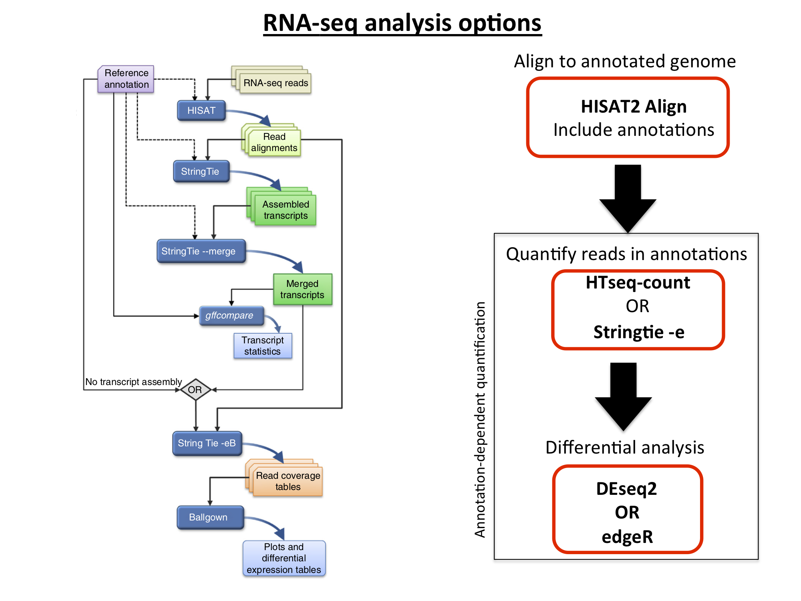
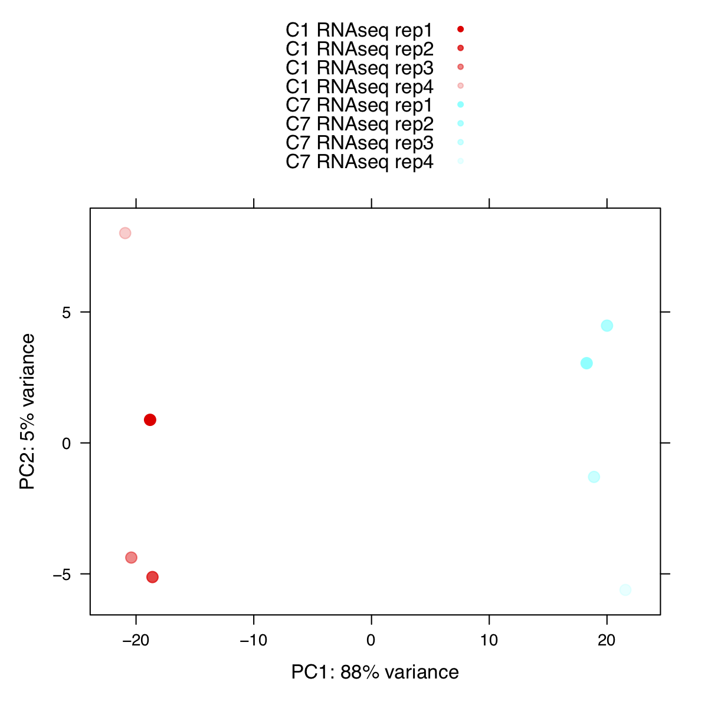
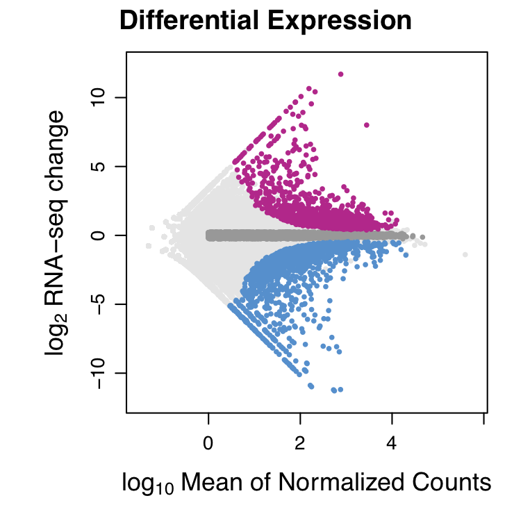
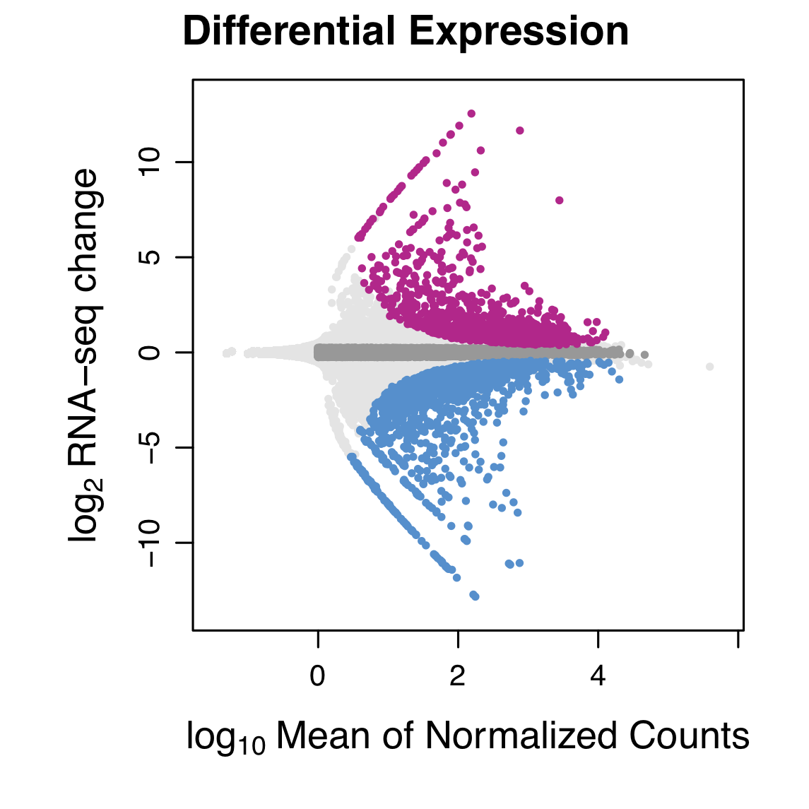
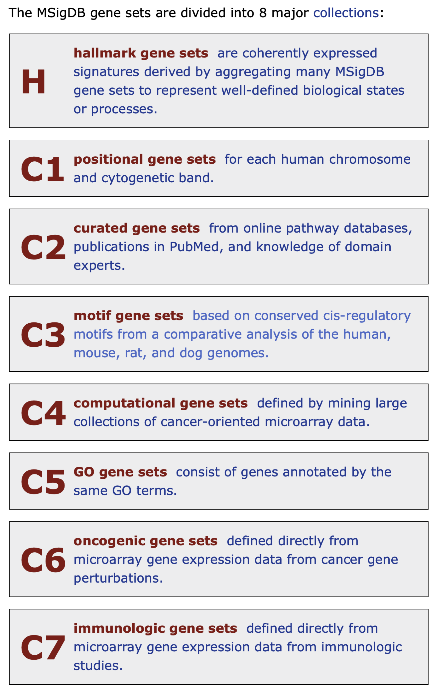
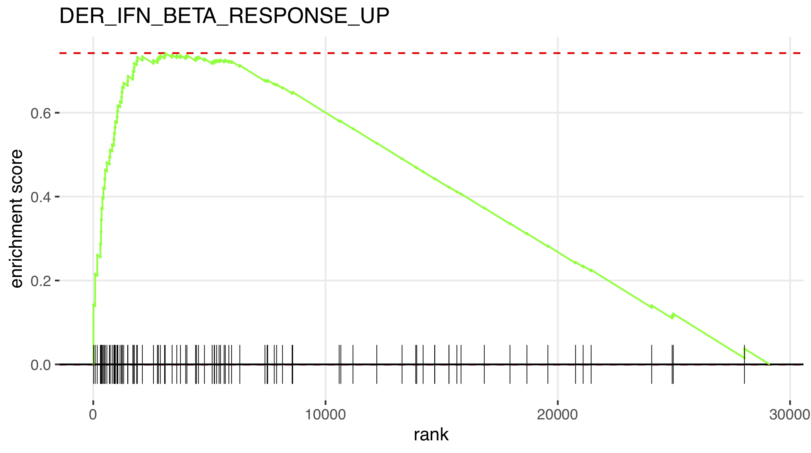
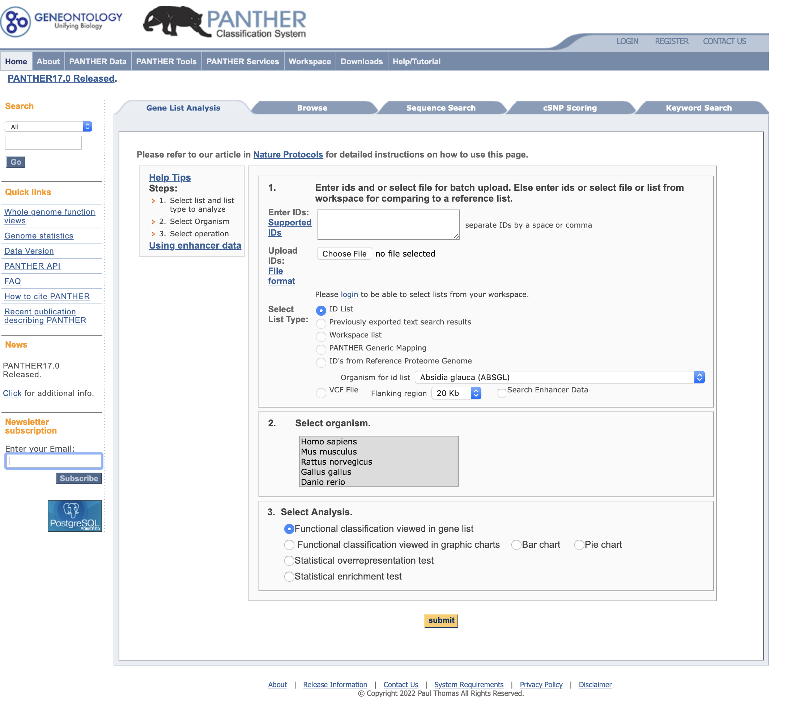
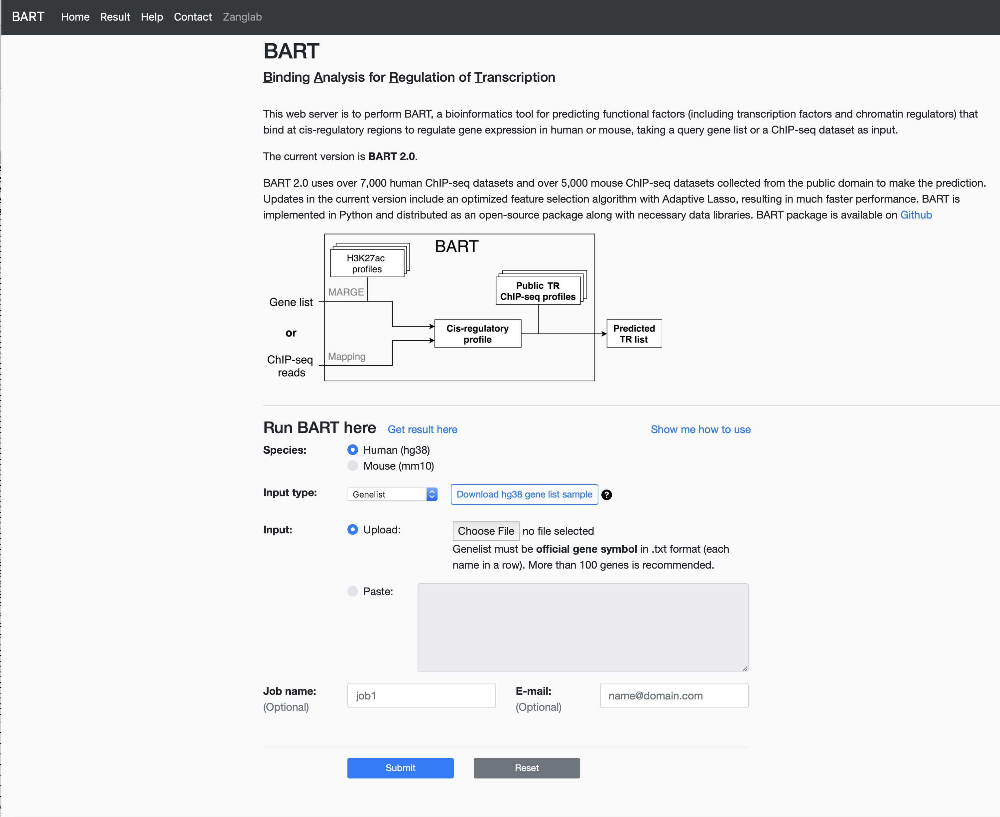

```{r, echo=F, eval=T}
library(knitr)
opts_chunk$set(tidy.opts=list(width.cutoff=60),tidy=TRUE)
```


# Review and RNA-seq differential gene expression analysis workflow:


```{r  out.width = "100%", echo=F, fig.align = "center", fig.cap="RNA-seq workflows"}
#library(knitr)
 
```

# Counting with HTseq

The following code was used to count all the reads within annotated genes for C1 and C7 cells for each of the replicates.

```{r, engine='bash', eval=F, echo=T}
anno=/home/FCAM/meds5420/annotations/gencode.v39.annotation.gtf

for i in /home/FCAM/meds5420/data/RNA_seq/C*R.sam
do
	name=$(echo $i | rev | cut -d "/" -f 1 | rev | cut -d "." -f 1)
	echo $name
	samtools sort -@ 10 -o ${name}_sort.bam $i
	htseq-count -r pos -f bam --stranded=reverse ${name}_sort.bam $anno > $name.gene.counts.txt
	# I want to get rid of the "_R" and the lines at the end with underscores:
	x=$(echo $i | rev | cut -d "/" -f 1 | rev | awk -F '_R.sam' '{print $1}')
	echo $x
	grep -v "__" $name.gene.counts.txt > $x.gene.counts.txt
	rm $name.gene.counts.txt
done
```

These files are here: `/home/FCAM/meds5420/data/RNA_seq/counts/`
You can work on Xanadu and move them to your working directory or `sftp` the files to your local machine.

# a review of running `R` on Xanadu

There are many versions of `R` available on Xanadu, but version `R/4.1.2` has several of the packages we need for class preinstalled. After loading the module, typing `R` will take you from a command line shell that is interpreted by `bash` to a command line interpreted through the `R` language.  

```{r, engine='bash', eval=F, echo=T}
srun --pty --qos=general -p general -c 2 --mem=8G bash

mkdir counts
cd counts
cp /home/FCAM/meds5420/data/RNA_seq/counts/*txt ./

module load R/4.1.2

R
```

# The preamble: load libraries and functions

The beginning of any `R` script should load all the libraries that are required. Next, like shell scripts, you will want to define any variables such as directories or files. Then, you will want to fine all your functions. Finally you will run commands. Learning `R` is a class in itself, but this introduction will allow you to get familiar with syntax and run differential expression and gene set enrichment analyses. 

```{r, engine='R', eval=F, echo=T}
# load library that are already on Xanadu:

library(DESeq2)
library(lattice)
library(dplyr)
library(ggplot2)
library(limma)


# you need to install: gage and fgsea
# google the package name and you can follow the install instructions 
# first you install Bioconductor (if it is not installed), then use Bioconductor to 
# install the required packages:

if (!require("BiocManager", quietly = TRUE))
    install.packages("BiocManager")
BiocManager::install("gage")
BiocManager::install("fgsea")

# you only have to install the packages once on the server or your machine. 
# subsequently, you can just invoke the library:

library(gage)
library(fgsea)


# I have a few functions that I use later:

source('https://raw.githubusercontent.com/mjg54/znf143_pro_seq_analysis/master/docs/ZNF143_functions.R')
```

# Converting the counts table text files into an `R` dataframe

Next we want to go through the counts files and generate a table in `R` with the row names as the gene IDs, column names as the experiments/replicates, and the field being the corresponding counts.

```{r, engine='R', eval=F, echo=T}

# R syntax is a bit different and we include quotes when defining strings 
# define a variable that specifies the directory of your HTSeq counts files

path.dir='/home/FCAM/mguertin/lec_RNA/counts'

# define a variable that specifies the file suffix of your HTSeq counts files

file.suffix='.gene.counts.txt'

# this sets the working directory to the variable defined above (like cd in bash)
setwd(path.dir)

# first we define an empty vector so we can append the experiment names to later name the columns
#keep track of the experiment names in this list so I can go back and label the columns
vec.names = c()

# we only want generate a data frame label the rows for the first file we loop through
count = 0

# here we will loop through our suffix-defined files in the defined directory
for (txt in Sys.glob(file.path(path.dir, paste0("*", file.suffix)))) {    
      count = count + 1
      
#this complicated code simply splits strings to extract the experiment name from the file
      experiment.name = strsplit(strsplit(txt, 
            "/")[[1]][length(strsplit(txt, "/")[[1]])], file.suffix)[[1]][1]
# like echo statements            
      print(experiment.name)
      
#only do this for the first file, since count is greater than 1 with every other file      
      if (count == 1) {
      
#generate a data frame with the gene row names and no columns          
          all.counts = data.frame(row.names = read.table(txt)[,1])
          }
          
#add the experiment name to a growing list of column names      
      vec.names = c(vec.names, experiment.name)     
       
#for each file (including the first file) add a column with the counts information      
      all.counts = cbind(all.counts, data.frame(read.table(txt)[,2]))  
}

colnames(all.counts) = vec.names

head(all.counts)

dim(all.counts)
```

# Repetitive process? Make a function in `R`!

Recall that when we wanted to add track lines to BED, narrowPeak, and bedGraph files we wrote a general script that automated the process. Similarly, in `R` we write functions that take input and return output. In the code chunk the only two variable that we define are the common file suffixes and the directory of where the files are. We can write a function that completes all the intermediate steps if we pass the directory containing the files and the file suffix as arguments.


```{r, eval=F, echo=T}

#remove the objects path.dir and file.suffix
rm(path.dir, file.suffix)

#these objects no longer exist
print(path.dir)
print(file.suffix)


#define a function 
htseq.to.counts.df <- function(path.dir = '/home/FCAM/mguertin/lec_RNA/counts', file.suffix = '.gene.counts.txt') {
    vec.names = c()
    count = 0
    for (txt in Sys.glob(file.path(path.dir, paste0("*", file.suffix)))) {    
        count = count + 1
        experiment.name = strsplit(strsplit(txt, "/")[[1]][length(strsplit(txt, "/")[[1]])], file.suffix)[[1]][1]
        print(paste("processing", experiment.name))
        if (count == 1) {
            all.counts = data.frame(row.names = read.table(txt)[,1])
        }
        vec.names = c(vec.names, experiment.name)      
        all.counts = cbind(all.counts, data.frame(read.table(txt)[,2]))  
    }    
    colnames(all.counts) = vec.names
    return(all.counts)
}

#before running this it is important that you copy the files over to a directory that you can write to.

all.counts.from.func = htseq.to.counts.df(path.dir = '/home/FCAM/mguertin/lec_RNA/counts', file.suffix = '.gene.counts.txt')

# the data is saved in a table as "all.counts.from.func"
# are the results identical?
identical(all.counts.from.func, all.counts)
```

# General use of the `HTSeq` to `R` data frame function

Now that you have loaded all the libraries and defined this function you can run the function to get the counts table for any set of HTseq outputs. All you need to do is put them all in the same folder (a folder in which you have write privileges) and not have anything else with the same suffix (passed to the function as an argument) within the folder. For example, if, hypothetically, you were given a set of counts files for the final that for some reason all ended in `.med5420.final.counts.txt`, you could move them to a folder such as `/home/FCAM/meds5420/usr15/rna_seq_final_counts` and run this function:


```{r, eval=F, echo=T}
final.counts = htseq.to.counts.df(path.dir = '/home/FCAM/meds5420/usr15/rna_seq_final_counts', file.suffix = '.med5420.final.counts.txt')
```

# Prepping data for `DESeq2`

`DESeq2` is one of the best annotated and most highly used packages: [Analyzing RNA-seq data with DESeq2](http://bioconductor.org/packages/devel/bioc/vignettes/DESeq2/inst/doc/DESeq2.html). 

## Note on factor levels (this is verbatim from the DESeq2 Guide)

By default, `R` will choose a reference level for factors based on alphabetical order. If you never tell the `DESeq2` functions which level you want to compare against (e.g. which level represents the control group), the comparisons will be based on the alphabetical order of the levels. You can explicitly set the factor levels. In order to see the change of reference levels reflected in the results names, you need to run `DESeq` after the re-leveling operation. Setting the factor levels can be done as shown below:

```{r, eval=F, echo=T}

#set the no treatment as the reference level (i.e. what happens upon treatment)
sample.conditions = factor(sapply(strsplit(colnames(all.counts.from.func), 
              '_rep'), '[', 1), levels=c("C1_RNAseq","C7_RNAseq"))

# this is complicated nested code. 
# Break it down from the most nested parentheses.

colnames(all.counts.from.func)
strsplit(colnames(all.counts.from.func), '_rep')           
sapply(strsplit(colnames(all.counts.from.func), '_rep'), '[', 1)

# Breaking down code this way is critical for understanding how data is processed

```

## Running `DESeq2`

Refer to the DESeq2 [vignette](http://bioconductor.org/packages/release/bioc/vignettes/DESeq2/inst/doc/DESeq2.pdf) and publication for a detailed explanation of the processes and statistics.\

The workflow below follows the vignette.

```{r, eval=F, echo=T}

# the input to the deseq object is the counts data, factor variables in the design, and the design.
# Here we are just modeling differences between conditions, we want to measure the effect of the condition which is the two differnt clones C1 and C7.

deseq.counts.table = DESeqDataSetFromMatrix(countData = all.counts.from.func,
                colData = as.data.frame(sample.conditions), 
                design = ~ sample.conditions)


deseq.counts.table 

# DESeq function:
# https://www.rdocumentation.org/packages/DESeq2/versions/1.12.3/topics/DESeq

dds = DESeq(deseq.counts.table)
dds

# this read-depth normalizes your samples.
# once you finda gene that is DE, refer to this table to confirm that your 
# comparison level is correct (i.e. everything is relative to untreated)

normalized.counts.rna = counts(dds, normalized=TRUE)

```


## Visualizing experiment clustering

Principal components analysis (PCA) is a statistical method to reduce highly complex data into a limited number of dimensions that we can easily visualize. _A priori_, we expect that the samples separate based on conditions. If the samples do not separate in this reasonable and expected manner, it is your responsibility to figure out the biological or technical feature that is driving the principal components. \

The function `rlog`, stands for regularized log, transforming the original count data to the log2 scale by fitting a model with a term for each sample and a prior distribution on the coefficients which is estimated from the data. This is the same kind of shrinkage (sometimes referred to as regularization, or moderation) of log fold changes used by the DESeq and nbinomWaldTest. 


```{r, eval=F, echo=T}
#regularize log transform
rld = rlog(dds, blind=TRUE)

# plot principle components 
pca.plot = plotPCA(rld, intgroup="sample.conditions", returnData=TRUE)

pca.plot 

plotPCAlattice(pca.plot, file = 'PCA_C1_vs_C7_lattice.pdf')

# it is good to save the R session as you go. 
# I name the image as a time stamp
save.image(file = '220408_R_mjg_1011am.Rdata')

```

```{r  out.width = "100%", echo=F, fig.align = "center", fig.cap="Principle Components Plot"}
#library(knitr)
 
```


## Identifying and plotting activated and repressed genes

Now I can start a new `R` window and load my previous progress, but I still need to import all the libraries I want to use. Visualize the `DESeq2` dataframe with `results()`. I added a step to include a categorical column for different gene classes. The categories are defined by the multiple testing corrected p-value and a log2 fold change. How many genes are considered activated at
the specified FDR (0.001)?

```{r, eval=F, echo=T}

load('220408_R_mjg_1011am.Rdata')

# this code is discontinuous in the DESeq2 vignette:

DE.results = results(dds)

head(DE.results)

DE.results.lattice = 
    categorize.deseq.df(DE.results, 
                        fdr = 0.001, log2fold = 0.0, treat = 'C7')

head(DE.results.lattice)


activated.all = DE.results.lattice[DE.results.lattice$response == 
                                             'C7 Activated',]

head(activated.all)


# here is my plotting function


ma.plot.lattice <- function(ma.df, filename = 'file.name', 
         title.main = "Differential RNA-seq Expression",
         col = c("grey90",  "grey60", "#ce228e" , "#2290cf"))
  {
  pdf(paste("MA_plot_", filename, ".pdf", sep=''), 
      useDingbats = FALSE, width=3.83, height=3.83);
  print(xyplot(ma.df$log2FoldChange ~ log(ma.df$baseMean, base=10),
               groups=ma.df$response,
               col= col,
                main=title.main, scales="free", aspect=1, pch=20, cex=0.5,
               ylab=expression("log"[2]~"RNA-seq change"), 
               xlab=expression("log"[10]~"Mean of Normalized Counts"),
               par.settings=list(par.xlab.text=list(cex=1.1,font=2), 
                                 par.ylab.text=list(cex=1.1,font=2))));
  dev.off()
  }

ma.plot.lattice(DE.results.lattice, filename = 'C1_vs_C7', 
        title.main = "Differential Expression")
        
```


```{r  out.width = "100%", echo=F, fig.align = "center", fig.cap="MA plot"}
#library(knitr)
 
```

Using shinkage log fold changes [shrinkage paper](https://academic.oup.com/bioinformatics/article/35/12/2084/5159452):


```{r, eval=F, echo=T}
BiocManager::install("apeglm")
library(apeglm)

res.lfc.shrink = lfcShrink(dds=dds, coef=2)

res.lfc.shrink.lattice = 
    categorize.deseq.df(res.lfc.shrink, 
                        fdr = 0.001, log2fold = 0.0, treat = 'C7')

ma.plot.lattice(res.lfc.shrink.lattice, filename = 'C1_vs_C7_shrinkage', 
        title.main = "Differential Expression")    
```


```{r  out.width = "100%", echo=F, fig.align = "center", fig.cap="MA plot shinkage"}
#library(knitr)
 
```


## Converting gene IDs to gene names

All the counting in HTSeq and the DESeq2 counts dataframe specify the Ensembl gene ID, but downstream applications use the gene name. The code in `bash` below generates a "key" for ID/name conversion. The `awk` commands should look familiar, but I had to manually determine how to parse the file to exclusively extract the gene name and ID. The `paste` command is new to you. It combines "side-to-side" the two files and a tab is used as the delimiter.  


```{r, engine='bash', eval=F, echo=T}
cp /home/FCAM/meds5420/annotations/gencode.v39.annotation.gtf ./

awk -F 'gene_name ' '{print $2}' gencode.v39.annotation.gtf | awk -F ';' '{print $1}' > gene_name.txt

awk -F 'gene_id ' '{print $2}' gencode.v39.annotation.gtf | awk -F ';' '{print $1}' > gene_id.txt

paste --delimiters='\t' gene_name.txt gene_id.txt > gene_key.txt
```

Within `R`, we use the `merge()` function to combine the DEseq results with the gene names, using the common 'ID' as the erging field (it is the rownames in both dataframes)


```{r, eval=F, echo=T}
gencode.key = read.table('gene_key.txt', sep='\t', header =F)

# get rid of blank first line
gencode.key = gencode.key[gencode.key[,2] != "",]

# get rid of duplicated
gencode.key = gencode.key[!duplicated(gencode.key[,2]),]

#make the rownames the ID so we can merge on the rownames argument
rownames(gencode.key) = gencode.key[,2]

colnames(gencode.key) = c('gene', 'id')

#optional to save intermediate files
save(gencode.key, file = 'gencode.key.Rdata')

#why do I check the dimensions?
dim(all.counts)
dim(gencode.key)

merged.counts.pre.shrink = merge(as.data.frame(res.lfc.shrink.lattice), gencode.key, by="row.names", all.x=F)

#get rid of columns we don't need
merged.counts.shrink = merged.counts.pre.shrink[, c(2:(ncol(merged.counts.pre.shrink) - 2))]

rownames(merged.counts.shrink ) = make.names(merged.counts.pre.shrink$gene, unique=TRUE)

save(merged.counts.shrink, file = "merged.counts.shrink.Rdata")

```


# Gene Set Enrichment Analysis 

We can use gene set enrichment analysis of a ranked gene set to determine what genes are enriched in our ranked set. Recall that no genes are significantly activated or repressed, so we cannot use an overlap statistical analysis (e.g. Fisher's Exact). While categorically thresholding activated and repressed genes is useful, the threshold are biologically arbitrary and the quantitative nature of fold change is lost. GSEA employs rank information without the need for thresholding. Search around the Broad's GSEA site to learn more about the process. The following is a list of defined gene sets:\
[Msigdb](https://data.broadinstitute.org/gsea-msigdb/msigdb/release/)\


We will use `fgsea` in `R` for GSEA: [fgsea](https://bioconductor.org/packages/release/bioc/html/fgsea.html) \


Note:\
The different collections to which you can compare are found [here](https://www.gsea-msigdb.org/gsea/msigdb/index.jsp).

## Order a gene list 

Difference in expression between C1 and C7. \

The first step is to order a gene list. One can justify ordering by p-value or fold change. We will order by logarithmic fold change (LFC) in the method described [here](https://academic.oup.com/bioinformatics/article/35/12/2084/5159452) \


```{r, eval=F, echo=T}

gene.list.shrink = merged.counts.shrink$log2FoldChange
names(gene.list.shrink) = row.names(merged.counts.shrink)
gene.list.shrink = sort(gene.list.shrink, decreasing = TRUE)
gene.list.shrink = gene.list.shrink[!is.na(gene.list.shrink)]

#remove duplicated genes
gene.list.shrink = gene.list.shrink[!duplicated(names(gene.list.shrink))]

```

## Get the curated gene list

Gene lists associated with molecular signatures are available at [MSigDB](https://www.gsea-msigdb.org/gsea/msigdb/).


```{r  out.width = "100%", echo=F, fig.align = "center", fig.cap="MSigDB gene sets"}
#library(knitr)
 
```

You can retrieve these using `bash`:


```{r, engine='bash', eval=F, echo=T}
wget https://data.broadinstitute.org/gsea-msigdb/msigdb/release/7.0/msigdb.v7.0.symbols.gmt
```

## FGSEA

The first step is to load your Gene Ontology file, in the GMT format. The GMT file format is a tab delimited file that describes gene sets; each row represents a gene set. The function `gmtPathways` return a list of pathways from the Gene Ontology files. The function `fgsea` performs standard enrichment analysis by looking from the most highly rank to lowly ranked genes and recording every time a gene within a particular pathway is identified, then comparing that to a background random walk (i.e. if the genes were to randomly appear in the dataset). `fgsea` performs multiple testing correction, normalized enrichment score, and has other features that you can read about in the manual or the original GSEA paper. 


```{r, eval=F, echo=T}

GO_file = "msigdb.v7.0.symbols.gmt" 

myGO = gmtPathways(GO_file) 


fgRes.shrink = as.data.frame(fgsea(pathways = myGO, 
                           stats = gene.list.shrink,
                           minSize=10,
                           maxSize=600))
                           
# just look at the genes with low adjusted p-values
fgRes.shrink[fgRes.shrink$padj < 0.1,][order(fgRes.shrink$NES[fgRes.shrink$padj < 0.1], decreasing =TRUE),]

# plot those with NES and adjusted pvalues at whatever thresholds you choose
name.analysis = 'C1_vs_C7_shrink'

pdf(paste("GSEA_first_", name.analysis, ".pdf", sep=''), 
      useDingbats = FALSE, width=6.83, height=3.83);
    print(
        plotEnrichment(myGO[[fgRes.shrink[fgRes.shrink$padj < 0.1,][order(fgRes.shrink$NES[fgRes.shrink$padj < 0.1], decreasing =TRUE),][[1]][1]]],
                       gene.list.shrink) + labs(title=fgRes.shrink[fgRes.shrink$padj < 0.1,][order(fgRes.shrink$NES[fgRes.shrink$padj < 0.1], decreasing =TRUE),][[1]][1])
    )
dev.off()

```

```{r  out.width = "100%", echo=F, fig.align = "center", fig.cap="fGSEA plot"}
#library(knitr)
 
```

```{r, eval=F, echo=T}

load(merged.counts.shrink.Rdata)

activated.shrink = merged.counts.shrink[merged.counts.shrink$response == 'C7 Activated',]
repressed.shrink = merged.counts.shrink[merged.counts.shrink$response == 'C7 Repressed',]
                                                                             
write.table(rownames(activated.shrink), file = "activated_shrink.txt", quote=FALSE, sep='\t', col.names=FALSE, row.names=FALSE)    

```

## Panther

From the website: \

The [PANTHER](http://www.pantherdb.org) (Protein ANalysis THrough Evolutionary Relationships) Classification System was designed to classify proteins (and their genes) in order to facilitate high-throughput analysis. Proteins have been classified according to: \
- Family and subfamily: families are groups of evolutionarily related proteins; subfamilies are related proteins that also have the same function \
- Molecular function: the function of the protein by itself or with directly interacting proteins at a biochemical level, e.g. a protein kinase \
- Biological process: the function of the protein in the context of a larger network of proteins that interact to accomplish a process at the level of the cell or organism, e.g. mitosis. \
- Pathway: similar to biological process, but a pathway also explicitly specifies the relationships between the interacting molecules.

Panther allows you to simply upload a gene list. Unlike GSEA, you usually upload only genes that are differentially expressed and you can discriminate between those activated or repressed. Statistical significance for DE are the not the same as biological significance, so it is best practice to upload a range of DE threshold lists and ensure that your results (i.e. the most enriched classes) are robust to the arbitrary significance thresholds you choose.


```{r  out.width = "100%", echo=F, fig.align = "center", fig.cap="PANTHER"}
#library(knitr)
 
```


## BART

[BART](http://bartweb.org) (Binding Analysis for Regulation of Transcription) is a bioinformatics tool that infers candidates transcription factors (TFs) that bind and regulate the input set of genes. BART is limited to identifying TFs for which ChIP-seq data is available. For example: if I treat my breast cancer cell line with estrogen and perform RNA-seq, then I expect to find that the differentially expressed genes are likely regulated by the estrogen receptor. 

```{r  out.width = "100%", echo=F, fig.align = "center", fig.cap="BART"}
#library(knitr)
 
```


