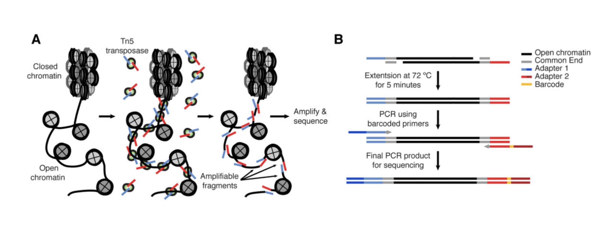
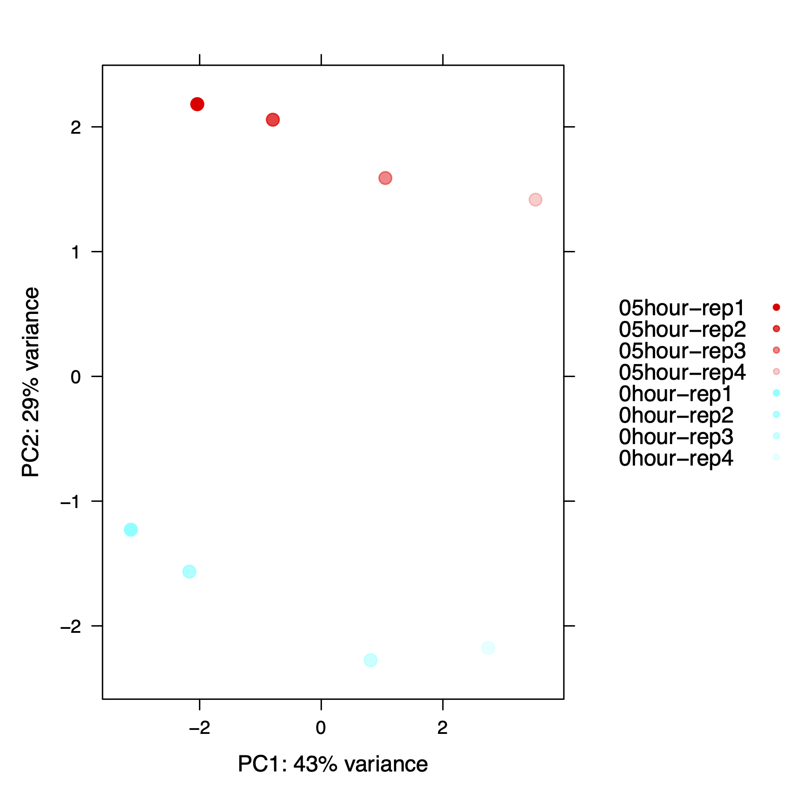
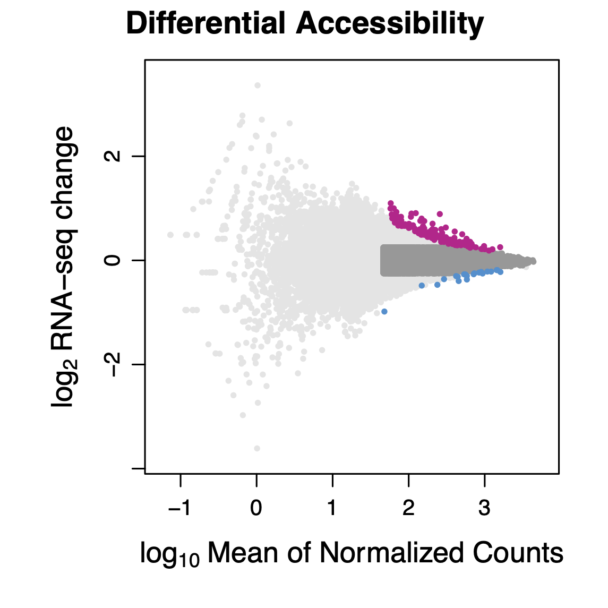
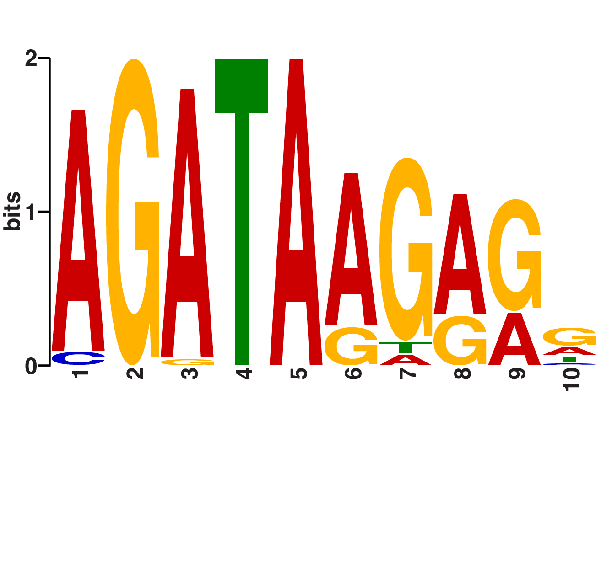

# ATAC-seq experiments

ATAC-seq is an assay that measures chromatin accessibility. In short,
cells are treated with detergents to disrupt the cell and nuclear
membranes, then treated with Tn5 transposase, which targets DNA that
is accessible. Targeting includes cleaving the DNA and ligating DNA to
the cut ends. DNA can be highly compacted and inaccessible,
nucleosome free and very accessible, or in between. The Tn5 transpoase
dimers are preloaded with Illumina adapters, so when two adapters are
inserted into DNA close enough to one another and in the correct
orientation the molecules can be PCR amplified and subjected to
high-throughput sequencing. The ATAC-seq methods
[https://doi.org/10.1002%2F0471142727.mb2129s109](https://doi.org/10.1002%2F0471142727.mb2129s109) paper presents the
figure below.

```{r  out.width = "100%", echo=F, fig.align = "center", fig.cap="ATAC-seq molecular biology"}
library(knitr)
 
```


# Why perform ATAC-seq experiments?

Chromatin accessibility genomics data is analyzed much like ChIP-seq
data, but it does not measure transcription factor binding or histone
modification abundance directly. Chromatin accessibility correlates
with gene expression levels, but if you want to use chromatin
accessibility to tell you anything about gene expression you are
better off just measuring RNA levels directly. Chromatin accessibility
patterns can provide information about nucleosome positioning, but if
you want to know about nucleosome positioning you should perform
MNase-seq. So when would we want to perform ATAC-seq? Regions of
accessible chromatin are generally bound by sequence-specific
transcription factors and we can use prior knowledge about the
sequences that factors recognize and the openness of chromatin to
infer transcription factor binding, as opposed to doing 1000+ ChIP-seq
experiments per cell type per condition. I believe the most powerful
application of ATAC-seq is to perform ATAC-seq in two conditions to
determine the candidate transcription factors that change activity
between the two conditions. If the time points are closely spaced,
then one can hypothesize that the factor (or a member of the factor
family) is directly affected by the condition. For instance, we can
treat cells with a drug for a short period of time (20 minutes) and
perform ATAC-seq. If the drug affects the function of a transcription
factor, then the motif that the TF recognizes will be specifically
enriched in the differntial ATAC peaks. A classic example is to treat
breast cancer cells with estrogen for 10 minutes and perform a before
and after ATAC. The Estrogen Receptor binding motif is specifically
enriched in ATAC peaks that increase accessibility. 

# ATAC-seq experimental design

If you design an ATAC-seq experiment to infer transcription factor
binding, then you should should perform paired-end sequencing because
each end of a sequenced molecule is the precise position that is
accessible to the transposase. Well, the molecular biology is a bit
more complicated and we need to shift the forward-strand aligned reads
downstream by 4 bases and shift the reverse-strand aligned reads
upstream by 4 bases to specify the  center of where Tn5
recognizes. We outline the molecular biology in
Figure S1 here:
[seqOutATACBias](https://www.biorxiv.org/content/10.1101/2022.12.08.519600v1). We
also deviate from many ATAC-seq workflows because we perform size
selection. We are most interested in defining open regions of
chromatin and not nucleosome mapping (larger fragments can be used for
this purpose). An overview of our ATAC experimental worflow can be
found here: [ATAC experimental workflow](https://genome.cshlp.org/content/33/3/314.full#sec-16).

# ATAC-seq analysis

## Cut off the adapter with `cutadapt`

We previously used the depricated `fastx_toolkit` because it is easy
and the functions are specialized without too many options and the
verbose option is helpful. In our daily workflow in hte lab we use
`cutadapt`. The options we use below are `-j` for the number of cores
to use, `-m` specifies the minimal lenght of a read to keep after
adapter sequence removal, and `-O` is the number of bases to trim off the
end of the read if it overlaps with the adapter sequence. If the
genome is 25% of each base, then you would expect one quarter of the
reads that have no adapter to have the trailing base
trimmed. Likewise, approximately 1/16 of the remaining
reads without the adapter will have the final two bases
trimmed. Technically these values are not exact, because the reads with
matches to longer trailing k-mers (in this case 19-mers) would be
removed first, then 18-mer matches removed, etcetera... The `-a` and `-A`
options are the adapter sequences of the PE1 and PE2 reads.  The
output file is `-o` (PE1) and `-p` PE2. The last two positional
areguments are the input `fastq` files. Of course we save the output
to a log file


```{r engine='bash', eval=F, echo=TRUE}

#newer versions don't seem to work
module load cutadapt
cutadapt -a CTGTCTCTTATACACATCT -A CTGTCTCTTATACACATCT -j 8 -m 10 -O 1 -o ${name}_PE1_no_adapt.fastq -p ${name}_PE2_no_adapt.fastq ${name}_PE1.fastq ${name}_PE2.fastq 2>&1 | tee ${name}_cutadapt.log
```

## Align the the mitochondrial chromosome with `bowtie2`
We perform alignments just as we have previously in the class, but
with many modifications. Mitochondrial DNA is preferentially
targeted by transposase because it is more accessible, so we first
align to `chrM`. However, we only need to align the PE1 read to `chrM`
to save time, then we sort the file, and use `samtools` and the `-f`
option with the flag `0x4` to output the reads that do NOT align to
the mitochondrial genome.

```{r engine='bash', eval=F, echo=TRUE}
module load bowtie2
module load samtools

#Align to chrM first and remove aligned reads
#if you need to build it:
cp /home/FCAM/meds5420/genomes/chroms/chrM.fa ./
bowtie2-build chrM.fa chrM

bowtie2 -p 8 -x chrM -U ${name}_PE1_no_adapt.fastq | samtools sort -n - | samtools fastq -f 0x4 - > ${name}_PE1.chrM.fastq 2>&1 | tee ${name}_chrM_alignment.log
```

## Pair unaligned `chrM` reads with `fastq-pair`

We only aligned PE1 to the mitochondrial genome, then selected all the
reads that did not align. If the PE1 read did not align to `chrM`,
then it reasons that the PE2 mate also does not align to `chrM`. We use
`fastq_pair`
[https://github.com/linsalrob/fastq-pair](https://github.com/linsalrob/fastq-pair)
to select all the PE2 mates of PE1 reads that did not
align to `chrM`.  The `-t` option is the table size and an optimal
value is apparently the number of reads in the file, but I find that
1000000 works well in all cases. The last two positional
arguments are the input files. The desired output files are named identical to
the input file names with `.paired.fq` appended to the end. I always
recomend running `ls` before and after a process to determine which
new files are generated. Also, don't forget to `head`, `tail`, and `wc
-l` any output files to make sure everything makes sense. 

```{r engine='bash', eval=F, echo=TRUE}
module load fastq-pair/1.0

fastq_pair -t 1000000 ${name}_PE1.chrM.fastq ${name}_PE2_no_adapt.fastq 2>&1 | tee ${name}_fastq_pair.log
```

## Align to the human genome

Now we are aligning to the `hg38.fa` genome just as we have previously
for ChIP-seq, the difference is that the libraries are paired end. Note the `-1` and
`-2` options for the respective paired-end `fastq` files. There is no
need to save the output `sam` file, so the output is piped to
`samtools` to convert to `bam`, then sorted by name (`-n`) so paired
end reads are adjacent in the file, then piped to `samtools fixmate`
which adds information about the fragment length by comparing the PE1
and PE2 coordinates, then the files are sorted by coordinate, then
piped to `samtools markdup` to remove duplicate reads. Duplicate reads
have the same PE1 and PE2 ends. This is very unlikely to happen by
chance unless you sequence to very high read depth, so these reads are
considered PCR amplicon duplicates. The `fixmate` step is necessary to
pipe to `markdup`. 


```{r engine='bash', eval=F, echo=TRUE}
#Align to the hg38 genome and remove duplicates

genome_index=/home/FCAM/meds5420/genomes/hg38_bt2/hg38
bowtie2 -p 8 --maxins 800 -x $genome_index -1 ${name}_PE1.chrM.fastq.paired.fq -2 ${name}_PE2_no_adapt.fastq.paired.fq | samtools view -bS - | samtools sort -n - | samtools fixmate -m - - | samtools sort - | samtools markdup -s -r - ${name}.hg38.bam 2>&1 | tee ${name}_bowtie2_hg38.log

```


## Convert aligned data to a `bed` file

We could convert the data to a bed file using `bedtools`, but the
software `seqOutBias` has some desirable options. FIrst `seqOutBias`
was designed to account for enzymatic sequence bias in chromatin
accessibility assays, but we will not use this feature, hence the
`--no-scale` flag. `seqOutBias` does allow for custom shifting of the
plus and minus aligned reads, in this case `--custom-shift=4,-4` to
specify the center of the transposase interaction site. The first time
`seqOutBias` is run with a new genome and `read-size` combination, it
takes a while to determine the regions in the genome that are uniquely
mappable at the specified read length. Subsequent invocations identify
the necessary mappability files and it runs much quicker. Generally,
it is best practice to exclude reads from regions that are not
uniquely mappable, because the true origin of the read cannot be
determined. The last line removes chromosomes that are incomplete
contigs and the Epstein-Barr Virus genome. 


```{r engine='bash', eval=F, echo=TRUE}
module load genometools/1.5.10
module load rust/1.64.0
module load ucsc_genome/2012.05.22

# this seqOutBias linux binary was downloaded from the github page
seqOutBias=/home/FCAM/meds5420/software/seqOutBias_v1.4.0.bin.linux.x86_64/seqOutBias

# mappability tallymer files were pregenerated
# these can only be used for 62 base reads and hg38, but if you 
# move them to your current directory to save time 
cp /home/FCAM/meds5420/data/atac/tallymer/hg38* ./

#Convert BAM to bed for counting (previously created the tallymer with `seqOutBias seqtable`)
seqOutBias /home/FCAM/meds5420/genomes/hg38.fa ${name}.hg38.bam --no-scale --custom-shift=4,-4 --read-size=62 2>&1 | tee ${name}_seqOutBias.log
```

## Making a scaled `bedGraph` for the browser

Now we are read depth normalizing each replicate and making a 201 base
window centered on the transposase insertion site to smooth the data
for visualization. The data is first smoothed with
`slopBed` s that overlapping windows smooth the data. Then we combine
overlapping interval signal with `genomeCoverageBed`. We calculate the read depth by summing up
the 5th column of the original `bed` file  . Then we divide this number by 10 million because the
normalized values will be 1 for a single read if there are 10 million
reads in a library. Usually libraries have between 10 and 100 million
aligned reads, so with this normalization the y-axis does not span extreme values. We round
this to three places after the decimal.  Then we convert to a `bigWig` (essentially a binary
`bedGraph` file) in case we want to make a track hub down the
line. The `bedGraph` files are often too large to upload directly to
UCSC. It is easier to merge `bigWig` files and sum the intensities for
each genomic region as well.

```{r engine='bash', eval=F, echo=TRUE}
#Convert BAM to BED
sizes=/home/FCAM/meds5420/genomes/hg38.chrom.sizes

slopBed -i ${name}.hg38_not_scaled.bed -g ${sizes} -l 100 -r 100 | sort -k1,1 -k2,2n > ${name}_window.bed
genomeCoverageBed -bg -i ${name}_window.bed -g $sizes > ${name}.bedGraph

depth=`awk -F'\t' '{sum+=$5;}END{print sum;}' ${name}.hg38_not_scaled.bed`
scaled=$(bc <<< "scale=3 ; 10000000 / $depth")
echo $scaled

awk -v scaled="$scaled" '{OFS="\t";} {print $1, $2, $3, $4*scaled}' ${name}.bedGraph > ${name}_normalized.bedGraph

wigToBigWig -clip ${name}_normalized.bedGraph $sizes ${name}.bigWig
```

# Running this workflow in parallel with `sbatch`

Recall that earlier in the semster we were writing a loop to perform the processes
on each file (or file set for PE data) in series. However, when yo
uhave many files you can submit mnay jobs in parallel by making a
template `sbatch` script, then reproducing the script for each file
set and submittign all the `sbatch` scripts in parallel.  

## Making a template `sbatch` script

The following code chunk contains all the processing steps for each
file. The variable `name=XXXXXXX` can be changed to the
experiment/replicate name. This assumes that your files are named
`EXPERIMENT_CONDITIONSrep1_PE1.fastq.gz`. We can submit each of these
`sbatch` scripts to Xanadu in parallel to speed things up. Recall that
earlier in the semster we were writing a loop to perform the processes
on each file (or file set for PE data) in series. 

```{r engine='bash', eval=F, echo=TRUE}
#! /bin/sh

#SBATCH --job-name=atac_workflow1_XXXXXXX.sh     # name for job
#SBATCH -N 1                  
#SBATCH -n 1                 
#SBATCH -c 32                  
#SBATCH -p general           
#SBATCH --qos=general       
#SBATCH --mem=32G               
#SBATCH --mail-type=ALL 
#SBATCH --mail-user=guertin@uchc.edu
#SBATCH -o atac_workflow_XXXXXXX.sh_%j.out
#SBATCH -e atac_workflow_XXXXXXX.sh_%j.err

hostname

name=XXXXXXX
ncore=30
genome_index=/home/FCAM/meds5420/genomes/hg38_bt2/hg38
seqOutBias=/home/FCAM/meds5420/software/seqOutBias_v1.4.0.bin.linux.x86_64/seqOutBias
sizes=/home/FCAM/meds5420/genomes/hg38.chrom.sizes
genome=/home/FCAM/meds5420/genomes/hg38.fa

module load cutadapt
module load bowtie2
module load samtools/1.16.1
module load fastq-pair/1.0
module load genometools/1.5.10
module load rust/1.64.0
module load ucsc_genome/2012.05.22
module load bedtools

gunzip ${name}_PE1.fastq.gz
gunzip ${name}_PE2.fastq.gz

cutadapt -a CTGTCTCTTATACACATCT -A CTGTCTCTTATACACATCT -j $ncore -m 10 -O 1 -o ${name}_PE1_no_adapt.fastq -p ${name}_PE2_no_adapt.fastq ${name}_PE1.fastq ${name}_PE2.fastq 2>&1 | tee ${name}_cutadapt.log

bowtie2 -p $ncore -x chrM -U ${name}_PE1_no_adapt.fastq | samtools sort -@ $ncore -o ${name}.bam

samtools fastq -@ $ncore -f 0x4 ${name}.bam > ${name}_PE1.chrM.fastq

fastq_pair -t 1000000 ${name}_PE1.chrM.fastq ${name}_PE2_no_adapt.fastq 2>&1 | tee ${name}_fastq_pair.log

bowtie2 -p $ncore --maxins 800 -x $genome_index -1 ${name}_PE1.chrM.fastq.paired.fq -2 ${name}_PE2_no_adapt.fastq.paired.fq | samtools sort -@ $ncore -n -o ${name}.bw.bam

samtools fixmate -m ${name}.bw.bam - | samtools sort -@ $ncore - | samtools markdup -s -r - ${name}.hg38.bam

seqOutBias ${genome} ${name}.hg38.bam --no-scale --custom-shift=4,-4 --read-size=62 2>&1 | tee ${name}_seqOutBias.log

slopBed -i ${name}.hg38_not_scaled.bed -g ${sizes} -l 100 -r 100 | sort -k1,1 -k2,2n > ${name}_window.bed

genomeCoverageBed -bg -i ${name}_window.bed -g $sizes > ${name}.bedGraph

depth=`awk -F'\t' '{sum+=$5;}END{print sum;}' ${name}.hg38_not_scaled.bed`
scaled=$(bc <<< "scale=3 ; 10000000 / $depth")

awk -v scaled="$scaled" '{OFS="\t";} {print $1, $2, $3, $4*scaled}' ${name}.bedGraph > ${name}_normalized.bedGraph

wigToBigWig -clip ${name}_normalized.bedGraph $sizes ${name}.bigWig

gzip ${name}_PE1.fastq 
gzip ${name}_PE2.fastq

rm ${name}.bw.bam
rm ${name}_PE*.fastq.*.fq

mkdir ${name}_files

```

## Finalizing and submitting each `sbatch` script 

You can run the following loop interactively. The first step is to
move all the relevant files to your local directory. The variable
`$file` is the template script from the previous subsection. The only
new utility that we introduce here is `sed`, which performs a find of
`XXXXXXX` and replaces it with the `EXPERIMENT_CONDITIONS` name in the
file (everything that precedes `_PE1.fastq.gz`.  Each `sbatch` script
will run as resources become available on the cluster. 

```{r engine='bash', eval=F, echo=TRUE}
module load bowtie2

cp /home/FCAM/meds5420/genomes/chroms/chrM.fa ./
bowtie2-build chrM.fa chrM
cp /home/FCAM/meds5420/data/atac/tallymer/hg38* ./

file=atac_workflow1.sh

for i in *PE1.fastq.gz
do
    nm=$(echo $i | awk -F"/" '{print $NF}' | awk -F"_PE1.fastq.gz" '{print $1}')
    fq=$(echo $i | rev | cut -f 1 -d '/' | rev)
    echo $nm
    echo $fq
    sed -e "s/XXXXXXX/${nm}/g" "$file" > atac_workflow1_${nm}.sh
    sbatch atac_workflow1_${nm}.sh
    sleep 1
done

```


# Combining replicates for the genome browser

Usually we combine replicates into a single track for visualization
and we compare the tracks between conditions. It is important that we
read-depth normalize before we combine the signal from each
replicate. Otherwise, we would be weighting replicates differently;
for example, if a library is sequenced to twice the read depth and we
combine first then read depth normalize, then the more high coverage
data is weighted twice as much in the final visualization. These `bedGraph` files are probably too big to upload to UCSC, but you can upload portions of the file or convert to `bigWig` files and generate a track hub. The final loop cleans up the directory by putting all the individual replicate files within their respective folders.


```{r engine='bash', eval=F, echo=TRUE}
#!/bin/bash

for i in *rep1*PE1.fastq.gz
do
    nm=$(echo $i | awk -F"/" '{print $NF}' | awk -F"_PE1.fastq.gz" '{print $1}')
    name=$(echo $nm | awk -F"rep1" '{print $1}')
    echo $name
    reps=$(ls ${name}rep*bigWig | grep -v hg38 | wc -w | bc)
    files=$(ls ${name}rep*bigWig | grep -v hg38)
    bigWigMerge $files tmp.bg
    scaleall=$(bc <<< "scale=4 ; 1.0 / $reps")
    echo scale:
    echo $scaleall
    awk -v scaleall="$scaleall" '{OFS="\t";} {print $1, $2, $3, $4*scaleall}' tmp.bg > ${name}_normalized.bedGraph
    rm tmp.bg
    awk -v var="$name" 'BEGIN {  print "browser position chr11:5,289,521-5,291,937"; print "track type=bedGraph name=\"" var "\" description=\"" var "_bedGraph\" visibility=full autoScale=on alwaysZero=on color=0,0,0"}  { print $0}' ${name}_normalized.bedGraph > ${name}_header_normalized.bedGraph
    gzip ${name}_header_normalized.bedGraph
done


for i in *PE1.fastq.gz
do
    name=$(echo $i | awk -F"/" '{print $NF}' | awk -F"_PE1.fastq.gz" '{print $1}')
	mv ${name}* ./${name}_files
done


```

# Call peaks with `macs3`

We next call peaks with `macs3` using all the `*.hg38.bam` files. We
already removed replicate duplicates, so any true duplicates arose
independently. We could call peaks in individual replicates and take
the union or intersect or there are many other ways to call
peaks. Since we don't have an input or control file (why not?) and
most biologically relevant peaks will be found by most peak callers, I
am content with just a single peak calling using all the data. We
should find the important peaks where we have the power to detect changes in
accessibility. 

```{r engine='bash', eval=F, echo=TRUE}
module load macs3

cp */*.hg38.bam ./
mkdir temp_macs
macs3 callpeak --call-summits -t *.hg38.bam -n TRPS1_degron_ATAC -g hs -q 0.01 --keep-dup all -f BAM --nomodel --shift -100 --extsize 200 --tempdir temp_macs
rm *.hg38.bam
```


## Removing peaks on contigs and within blacklisted regions

You can Google "blacklisted genomic regions" or the alike to find a
set of region in the genome in `bed` format that have an over-representation of
reads regardless of the experiment. Recall this is even more necessary
because we do not have a control data set. We can also remove peaks on non-canonical chromosomes with
`grep -v`. 

```{r engine='bash', eval=F, echo=TRUE}
module load bedtools
wget https://github.com/Boyle-Lab/Blacklist/raw/master/lists/hg38-blacklist.v2.bed.gz
gunzip hg38-blacklist.v2.bed.gz
blacklist=hg38-blacklist.v2.bed
sizes=/home/FCAM/meds5420/genomes/hg38.chrom.sizes
name=TRPS1_degron_ATAC

grep -v "random" ${name}_summits.bed | grep -v "chrUn" | grep -v "chrEBV" | grep -v "chrM" | grep -v "alt" | intersectBed -v -a stdin -b $blacklist > ${name}_tmp.txt

mv ${name}_tmp.txt ${name}_summits.bed

slopBed -b 200 -i ${name}_summits.bed -g $sizes > ${name}_summit_window.bed
```

# Differential reads counts with `mapBed`

We previously use `htseq` to count RNA-seq reads within gene
annotations. `mapBed` from `bedtools` performs the same function with
two `bed` file inputs. We will counts reads in the 400 base window
summit file and merge these into a file with experiment name columns
and genomic interval named rows.


```{r engine='bash', eval=F, echo=TRUE}
module load bedtools
name=TRPS1_degron_ATAC

cp */*_not_scaled.bed ./

sort -k1,1 -k2,2n ${name}_summit_window.bed > ${name}_summit_window_sorted.bed

peaks=${name}_summit_window_sorted.bed

for i in *_not_scaled.bed
do
	nm=$(echo $i | awk -F"/" '{print $NF}' | awk -F"_not_scaled.bed" '{print $1}')
	sort -k1,1 -k2,2n $i > ${nm}_sorted.bed
	mapBed -null '0' -a $peaks -b ${nm}_sorted.bed > ${nm}_peak_counts.txt 
	sleep 1
done

for i in *_peak_counts.txt
do
  name=$(echo $i | awk -F"/" '{print $NF}' | awk -F"_peak_counts.txt" '{print $1}')
  awk '{print $NF}' ${name}_peak_counts.txt > ${name}_peak_counts_only.txt
  echo $name | cat - ${name}_peak_counts_only.txt > ${name}_peak_counts.txt
  rm ${name}_peak_counts_only.txt
done

echo -e "chr\tstart\tend\tname\tqvalue" | cat - $peaks | paste -d'\t' - *peak_counts.txt > Combined_ATAC_peak_counts_with_ChIP.txt

rm *_not_scaled.bed

module load R/4.1.2

R

```

# Differential accessibility 

Recall that this version of `R` on Xanadu has many of our libraries
preinstalled. 

```{r engine='bash', eval=F, echo=TRUE}
module load R/4.1.2

R
```

## Running `DESeq2` with ATAC data

The workflow is identical to what we did with RNA-seq. We excluded the
shrinkage step because we are not ranking genomic intervals by fold
change. Recall this was necessary for downstream gene set enrichment
analysis, which doesn't make sense for ATAC-seq regions. Refer to
Lecture 24 for the details of `DESeq2` analysis.


```{r, engine='R', eval=F, echo=T}
# libraries
library(DESeq2)
library(lattice)
library(dplyr)
library(ggplot2)
library(limma)

# functions on github
source('https://raw.githubusercontent.com/mjg54/znf143_pro_seq_analysis/master/docs/ZNF143_functions.R')

# new functions

ma.plot.lattice <- function(ma.df, filename = 'file.name', 
         title.main = "Differential ATAC-seq Accessibility",
         col = c("grey90",  "grey60", "#ce228e" , "#2290cf"))
  {
  pdf(paste("MA_plot_", filename, ".pdf", sep=''), 
      useDingbats = FALSE, width=3.83, height=3.83);
  print(xyplot(ma.df$log2FoldChange ~ log(ma.df$baseMean, base=10),
               groups=ma.df$response,
               col= col,
                main=title.main, scales="free", aspect=1, pch=20, cex=0.5,
               ylab=expression("log"[2]~"ATAC-seq change"), 
               xlab=expression("log"[10]~"Mean of Normalized Counts"),
               par.settings=list(par.xlab.text=list(cex=1.1,font=2), 
                                 par.ylab.text=list(cex=1.1,font=2))));
  dev.off()
  }

plotPCAlattice <- function(df, file = 'PCA_lattice.pdf') {  
  perVar = round(100 * attr(df, "percentVar"))
  df = data.frame(cbind(df, sapply(strsplit(as.character(df$name), '-rep'), '[', 1)))
  colnames(df) = c(colnames(df)[1:(ncol(df)-1)], 'unique_condition')
  print(df)
  #get colors and take away the hex transparency
  color.x = substring(rainbow(length(unique(df$unique_condition))), 1,7) 
  
  df$color = NA
  df$alpha.x = NA
  df$alpha.y = NA
  df$colpal = NA
  
  for (i in 1:length(unique(df$unique_condition))) {
    
    df[df$unique_condition == unique(df$unique_condition)[[i]],]$color = color.x[i]   
    #gives replicates for unique condition
    reps_col<- df[df$unique_condition == unique(df$unique_condition)[[i]],]
    #gives number of replicates in unique condition
    replicates.x = nrow(reps_col)
    alx <- rev(seq(0.2, 1, length.out = replicates.x))
    
    #count transparency(alx), convert alx to hex(aly), combain color and transparency(cp)
    for(rep in 1:replicates.x) {
    
      na <- reps_col[rep, ]$name
      df[df$name == na, ]$alpha.x = alx[rep]
      aly = as.hexmode(round(alx * 255))
      df[df$name == na, ]$alpha.y = aly[rep]
      cp = paste0(color.x[i], aly)
      df[df$name == na, ]$colpal = cp[rep]
      #print(df)
    }
  }
  colpal = df$colpal
  df$name = gsub('_', ' ', df$name)
  pdf(file, width=6, height=6, useDingbats=FALSE)
  print(xyplot(PC2 ~ PC1, groups = name, data=df,
               xlab = paste('PC1: ', perVar[1], '% variance', sep = ''),
               ylab = paste('PC2: ', perVar[2], '% variance', sep = ''),
               par.settings = list(superpose.symbol = list(pch = c(20), col=colpal)),
               pch = 20, cex = 1.7,
               auto.key = TRUE,
               col = colpal))
  dev.off()
}

# data processing and plotting

x = read.table('Combined_ATAC_peak_counts_with_ChIP.txt', sep = "\t", check.names=FALSE, header=TRUE)
rownames(x) = paste0(x[,1], ":", x[,2], "-", x[,3])
peak_name = x[,4]
peak_qvalue = x[,5]
x = x[,-c(1:5)]
colnames(x) = sapply(strsplit(colnames(x), "Clone28-"), "[", 2)
colnames(x) = sapply(strsplit(colnames(x), "\\."), "[", 1)

sample.conditions = factor(sapply(strsplit(colnames(x), '-rep'), '[', 1), levels=c("0hour","05hour"))
rep = factor(sapply(strsplit(colnames(x), 'rep'), '[', 2))


#deseq.counts.table = DESeqDataSetFromMatrix(countData = x,
#                colData = cbind.data.frame(sample.conditions, rep), 
#                design = ~ rep + sample.conditions)


deseq.counts.table = DESeqDataSetFromMatrix(countData = x,
                colData = as.data.frame(sample.conditions), 
                design = ~ sample.conditions)


deseq.counts.table 

dds = DESeq(deseq.counts.table)
dds

normalized.counts.rna = counts(dds, normalized=TRUE)

		
rld = rlog(dds, blind=TRUE)

# plot principle components 

pca.plot = plotPCA(rld, intgroup="sample.conditions", returnData=TRUE)

pca.plot 

plotPCAlattice(pca.plot, file = 'Degron_lattice.pdf')
		

DE.results = results(dds)

head(DE.results)

DE.results.lattice = 
    categorize.deseq.df(DE.results, 
                        fdr = 0.1, log2fold = 0.0, treat = 'TRPS1_degron_30min')

head(DE.results.lattice)


activated.all = DE.results.lattice[DE.results.lattice$response == 
                                             'TRPS1_degron_30min Activated',]

dim(activated.all)


ma.plot.lattice(DE.results.lattice, filename = '30min_TRPS1_degradation', 
        title.main = "Differential Accessibility")		
		
#we are not ranking by fold change, so no need for shrinkage

#lets export a smaller genomic interval for each region for subsequent motif analysis

chr = sapply(strsplit(rownames(activated.all), ":"), "[", 1)
rnge = sapply(strsplit(rownames(activated.all), ":"), "[", 2)
start =	as.numeric(sapply(strsplit(rnge, "-"), "[", 1)) + 100
end = as.numeric(sapply(strsplit(rnge, "-"), "[", 2)) - 100

write.table(cbind(chr, start, end), file = "ATAC_increase_TRPS1_degron.bed", quote = FALSE,
col.names =FALSE, row.names=FALSE, sep = "\t")


unchanged.all = DE.results.lattice[DE.results.lattice$response == 
                                             'TRPS1_degron_30min Unchanged',]
											 
chr.un = sapply(strsplit(rownames(unchanged.all), ":"), "[", 1)
rnge.un = sapply(strsplit(rownames(unchanged.all), ":"), "[", 2)
start.un =	as.numeric(sapply(strsplit(rnge.un, "-"), "[", 1)) + 100
end.un = as.numeric(sapply(strsplit(rnge.un, "-"), "[", 2)) - 100

write.table(cbind(chr.un, start.un, end.un), file = "ATAC_unchanged_TRPS1_degron.bed", quote = FALSE,
col.names =FALSE, row.names=FALSE, sep = "\t")

```


```{r  out.width = "100%", echo=F, fig.align = "center", fig.cap="PCA Analysis"}
library(knitr)
 
```


```{r  out.width = "100%", echo=F, fig.align = "center", fig.cap="MA plot"}
library(knitr)
 
```

# De novo motif analysis of differentially accessible peaks

Lastly, we perform _de novo_ motif analysis as we have previously with
`meme`. We can also determine the fraction of regions with immediate
increases in accessibility have the underlying motif. However, this
value is meaningless without a comparison. We could compare to
`TRPS1_degron_30min Unchanged` region set.

```{r engine='bash', eval=F, echo=TRUE}
module load bedtools
module load meme/5.4.1
genome=/home/FCAM/meds5420/genomes/hg38.fa

fastaFromBed -fi $genome -bed ATAC_increase_TRPS1_degron.bed -fo ATAC_increase_TRPS1_degron.fasta
fastaFromBed -fi $genome -bed ATAC_unchanged_TRPS1_degron.bed -fo ATAC_unchanged_TRPS1_degron.fasta

meme -oc TRPS1.meme_output -objfun classic -evt 0.01 -searchsize 0 -minw 5 -maxw 10 -revcomp -dna -markov_order 2 -maxsize 100000000 ATAC_increase_TRPS1_degron.fasta

mast TRPS1.meme_output/meme.txt -mt 0.001 -hit_list ATAC_increase_TRPS1_degron.fasta > mast_hits_increase.txt
mast TRPS1.meme_output/meme.txt -mt 0.001 -hit_list ATAC_unchanged_TRPS1_degron.fasta > mast_hits_unchanged.txt

cut -f 1 -d " " mast_hits_increase.txt | sort | uniq | grep -v "#" > unique_mast_hits_increase.txt 
wc -l unique_mast_hits_increase.txt
wc -l ATAC_increase_TRPS1_degron.bed

cut -f 1 -d " " mast_hits_unchanged.txt | sort | uniq | grep -v "#" | wc -l
wc -l  ATAC_unchanged_TRPS1_degron.bed
```

<!-- 
awk '{OFS=""};{print $1, ":", $2, "-", $3}' ATAC_increase_TRPS1_degron.bed > chr_start_end_increase.txt

grep -v -f unique_mast_hits_increase.txt chr_start_end_increase.txt > peaks_wout_motif.txt

cut -f 1 -d ":" peaks_wout_motif.txt > chr.txt
cut -f 2 -d ":" peaks_wout_motif.txt | cut -f 1 -d "-" > start.txt
cut -f 2 -d ":" peaks_wout_motif.txt | cut -f 2 -d "-" > end.txt
paste -d'\t' chr.txt start.txt end.txt > peaks_wout_motif.bed

fastaFromBed -fi $genome -bed peaks_wout_motif.bed -fo peaks_wout_motif.fasta

meme -oc TRPS1_2.meme_output -objfun classic -evt 0.01 -searchsize 0 -minw 5 -maxw 10 -revcomp -dna -maxsize 100000000 peaks_wout_motif.fasta

for i in TRPS1_2.meme_output/*
do
	name=$(echo $i | awk -F"/" '{print $NF}')
	mv $i TRPS1_2_${name}
done
cut -f 1 -d ":" peaks_wout_motif.txt > chr.txt
cut -f 2 -d ":" peaks_wout_motif.txt | cut -f 1 -d "-" > start.txt
cut -f 2 -d ":" peaks_wout_motif.txt | cut -f 2 -d "-" > end.txt
-->


```{r  out.width = "60%", echo=F, fig.align = "center", fig.cap="TRPS1 motif"}
library(knitr)
 
```
